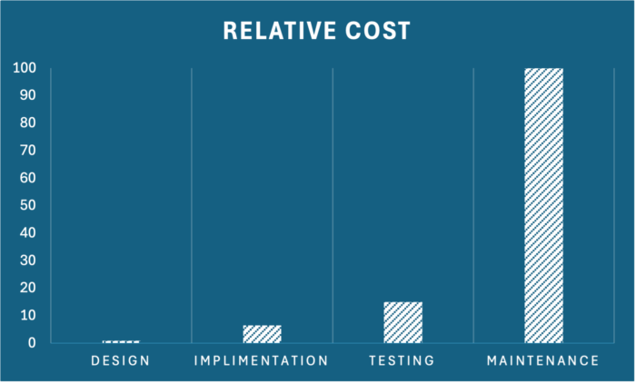
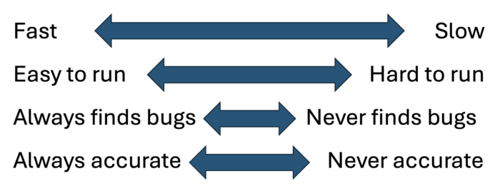
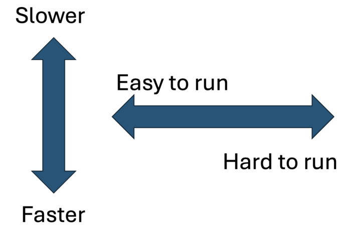
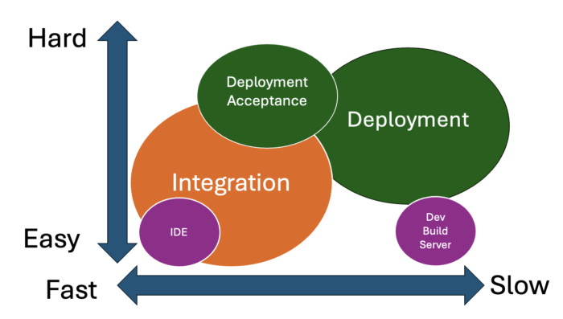

### 10x Insights on a different view of quality assurance {#h3-0-10x-insights-on-a-different-view-of-quality-assurance}

I've given a few talks about 10x developers, or rather 10x professionals and been involved in process (re)engineering for many teams and projects.

However much you learn about people and their roles - there's always something new to discover.

In fact, it is amazing how often your worldview is blinkered, how often there's a different way to do or think about some aspect of your life or your career.

Shortly, I and some friends are launching a podcast.

The idea is to find and share more of the 10x thinking that often makes a difference between excellence and mediocrity, between stellar success and 'meh'.

I thought I'd share a personal example...

### Bugs cost {#h3-1-bugs-cost}

I expect most of you have seen charts like this one.

The 'cost' of finding a bug is described at each process stage. The thinking goes that if it costs $1 to find the bug at design time, it takes $100 to deal with it in production.

Don't worry about the names of the stages; depending on the development process, they will have different names, but the theory holds. This chart, or rather charts like this, are typical across the internet. The relative cost predictions change, but the sentiment is the same - delaying finding a bug costs you money.

The temptation is to use this as ammunition to push testing to the left and make developers run more tests. For the whole organisation to 'shift left' as far as quality assurance is concerned. Without data or executing in a naive way, it will undoubtedly fail.

But it can be done.

In my early career, I didn't question this status quo. I followed along and spent many hours wrestling with complex test suites and harnesses, making risk vs reward decisions about a million bug reports and stressing over how to keep my developers in the zone and not distracted by these issues.

Then, I met Simon.

Simon taught me more about testing in one day than I'd ever learned before. He made me think about the principles and objectives of testing. He gave me the 10x insights that I've kept with me for many years since. Here's one piece of that advice.

### When's the best time to find bugs? {#h3-2-when-s-the-best-time-to-find-bugs}

Obviously, as soon as possible. Taken to the extreme, that would be when we ctrl-s and press save on a design doc or source file. It would be great(!) if all possible tests could be exercised instantly and results fed back immediately.

Assuming you agree with that, we can agree that since that isn't currently practical, our efforts in testing are, in effect, a pragmatic exercise of risk vs reward. It becomes a discussion about what not to test yet. What can we delay? That's the theory, anyhow.

### How should we really test? {#h3-3-how-should-we-really-test}

Any software production process has testing as one or more steps. From unit tests that developers run to full-grown integration testing carried out at the end of a release. There are probably other stages of testing; each step in the process, from conception to packaging to deployment, probably has some quality assurance effort.

Organising our testing strategy by stages makes sense, but it can quickly become sub-optimal if we take a compartmental view rather than a holistic view.

Our risk/reward model says, "run integration tests at the integration stage" and "let developers run unit tests" This model complies with our developer productivity pressures as we strive to lessen the burden on the developer by taking away "unnecessary chores".

We're saying that developer time is expensive, and we're willing to risk bugs being found later due to the perception of improved delivery.

We've implicitly labelled tests by who runs them, not by any material aspect of the test. If it's called a unit-test it's created/run by developers. If it's called an integration test, it's created/run by QA teams. Even if the unit test is complex or the integration test is simple.

### Changing the status quo {#h3-4-changing-the-status-quo}

Simon taught me that this approach, compartmentalizing teams and test units, is always sub-optimal. The project we were working on at the time was significant, with hundreds of developers and millions of lines of code, so even slight improvements in testing and bug fixing were worth considering. Simon showed, though, how a new approach would work at any scale - whether a one-person project or beyond.

Getting started requires some prep work and thinking through the objections you might encounter.

### Three challenges to overcome {#h3-5-three-challenges-to-overcome}

1. **As discussed earlier, giving the developer extra work is considered non-optimal.** Any plan to do this has to be well-considered and thoughtful. As we'll see, it's entirely possible, but we'll need a few things to succeed.
2. **There's the question of testing 'too' much.** A position many will take when this sort of discussion is aired: For example, whether a tree makes a sound in the forest when it falls or finding bugs that end-users are unlikely to discover is a worthwhile investment. Is all technical debt terrible? Running an extra 1000 hours of tests every build doesn't sound like a good investment if it only produces one bug report.
3. **The cost of shift left.** It's easy to say run the test earlier, but the tests that run later are usually part of some complex integration test harness or such like. The cost of developer time to learn even how to run these tests is often excessive. Hence, you frequently see conversations around producing a simplified example test case for developers. A test that quite usually sits in a special test bucket of developers' favourite 'known to find bugs' test suite. As an aside - this is often a bad idea in the long run because this 'special' test bucket becomes sacrosanct. A must-run-regardless test suite even though, over time, the value of the individual test lessens.

### We have almost all the pieces {#h3-6-we-have-almost-all-the-pieces}

For this cultural transformation to work, because the most significant challenge will be changing mindsets, we need data. Some you may already have, others you'll need to start collecting. None of this is rocket science.

### Testing is multiI-dimensional {#h3-7-testing-is-multii-dimensional}

Our one-dimensional approach to organising tests and testing gets in the way. Thinking about when to run tests in simple chronological order: unit-test time, integration time, deployment time, etc, is inflexible, and overtime leads to a loss of quality and increased costs.

Loss of quality because when quality problems occur, we tend to create new tests in the later, more complex testing stages rather than increasing the developers' burden. That increases costs by raising the testing bill or the inevitable extra maintenance required to fix bugs that slipped through.

The answer is to take a step back and think about that original idealised objective. We can't run every test every time code is saved, but we can organise our testing with that as a guiding principle.

There are four essential dimensions. How quickly a test runs and how much domain knowledge is needed. Plus, how often a test finds a bug vs how 'flaky' a test is. There are other connections and other dimensions you might also consider, but these are the primary ones.

With those dimensions, we can organise our tests into a few groups.

### Tortoise and the Hare vs the Feather and the Boulder {#h3-8-tortoise-and-the-hare-vs-the-feather-and-the-boulder}

Axis One, is about how fast a test takes to complete. It's that simple. From pressing the button to getting a programmatic answer (ideally excluding any framework tax)

Axis Two, is about the combination of domain knowledge required to run the test and any environmental considerations. Running the test in an IDE at a click without installing a database and an app server, API gateway, etc, is one end of the axis; needing to understand how to install Kubernetes, etc. and then knowing how to trigger an Istio failure is the other.

Axis Three, how good the test case is at finding bugs is essential. If you're not recording this sort of metric, then optimising test runs will be challenging. We've agreed that we're in a risk/reward situation, so one risk you can take is to reduce the number of times you run tests that hardly fail while continuously running the ones that behave as your canaries.

Axis Four, is about noise. How often do you get false positives or false negatives from a test? Any test that isn't rock solid in execution needs scrutiny because otherwise, it's costing you time and effort that you don't need to spend.

### Bringing it together {#h3-9-bringing-it-together}

Axis Three and Four: Usefulness and Accuracy can be considered filters over test execution. If a test has never found a bug but is quick to run, you might keep it, while one that takes an hour to run on AWS could easily be a candidate to remove - or at the very least rewrite. You can apply this filtering to your existing test organisations, and it will undoubtedly help. For many, this is already an everyday activity.

What moves us into more 10x territory is to consider the other axes.

These two dimensions allow us to think about how we organise testing differently. Forget the typical linear process and organisation groupings and look at tests through this lens.

### Risk / Reward rebalanced {#h3-10-risk-reward-rebalanced}

Tests that are fast and easy to run are perfect candidates to give to developers. With no or low domain knowledge required to execute, they should be easily incorporated into unit tests for running in the IDE or on the build server.

Tests at the other end, which are slow to run and require significant setup and domain knowledge, belong more to the QA teams.

Tests that have other combinations can be part of other organisations or may suggest using different strategies. Slow-running but easy-to-run tests might still be given to developers, but they get to run on the build server, which is not part of a developer's personal unit test activity. Slow tests might be run less often.

### Changing Behavior {#h3-11-changing-behavior}

Once you have this thought process about measuring and organising tests, it becomes easier to encourage more flexible behaviour.

It helps to focus on consistently creating test cases that are as simple, fast, and easy to run asfeasible. It also creates an understanding that tests don't 'belong' to any particular group. Tests need to be portable, so that even if you must build complex test harnesses, try to keep the actual tests in a form that a developer can run without.

Developers will undoubtedly support having broader unit tests happening during the build process if they are easy to run when things go wrong and don't take excessive elapsed time. Likewise, having a cross-organisational focus on quality that uses these axes as guides will grease the wheels of the whole process.

### More thoughts {#h3-12-more-thoughts}

Once you've started down this road, you'll find that a broader understanding of the objectives and value of testing will naturally occur.

The first thing you'll realise is that although the product code is what you ship, the test cases define the product. Your test suite is both a safety net and a jelly mould. The better your testing, the better it describes the expected behaviour of the product, the faster you can develop and the more radical you can be when changing the code. Knowing that the QA process has a developer's back and that every effort goes into continually balancing the risk/reward equation is liberating.

I mentioned other things to measure. Soon, you'll want to connect test results with previous code changes. Start to plan test execution based on the source files changed. Then perhaps you'll look at lines of code changed or cyclic complexity. Some might even run different tests depending on the actual developer making the change or the day of the week!

Eventually, you'll realise that this data lets you build specific test execution plans. Is a significant new feature in the plan? Then use this data to select the appropriate test cases for a focused unit-test effort for the dev team. Have some new developers onboard? - Build a list of 10 developer tests associated with 'first timer' open issues and get them fixed.

### Summary {#h3-13-summary}

The takeaways of moving to a data-driven and test portability approach are more than a quality improvement. This change brings teams together and makes the whole team more productive. Instead of adding a burden to the developer, it reduces the workload because of the focus on running the appropriate tests at the appropriate time. It also makes everyone understand the actual relationship between the test suite and the product.

Measuring the 'process' of software development brings a scientific mindset to the risk/reward equation we started with. Now, decisions about development costs and investment can be more accurately determined. It aids quality assurance improvements by helping shine a light on areas of weak testing or areas of over-testing. Now, you can construct test plans that are the best mix of coverage and execution time and optimise the return from each test suite at each stage of the process.

Thanks to Simon and other 10x professionals I continue to learn new ways of thinking.

Change is always a challenge - but this switch is one of the best ways to modernise how you 'do' development. It requires a little faith initially, but the data-driven approach and acceptance of portable tests will pay dividends over time.

*** ** * ** ***

If you want to learn more about other ways to think differently about software, sign up to the [10XInsights Newsletter](https://www.linkedin.com/build-relation/newsletter-follow?entityUrn=7242495495711899650) on LinkedIn.
