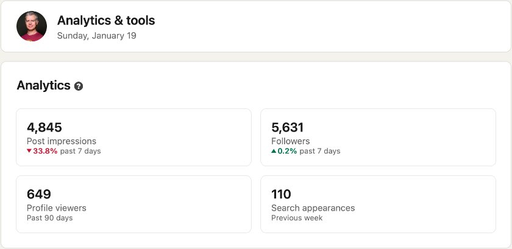
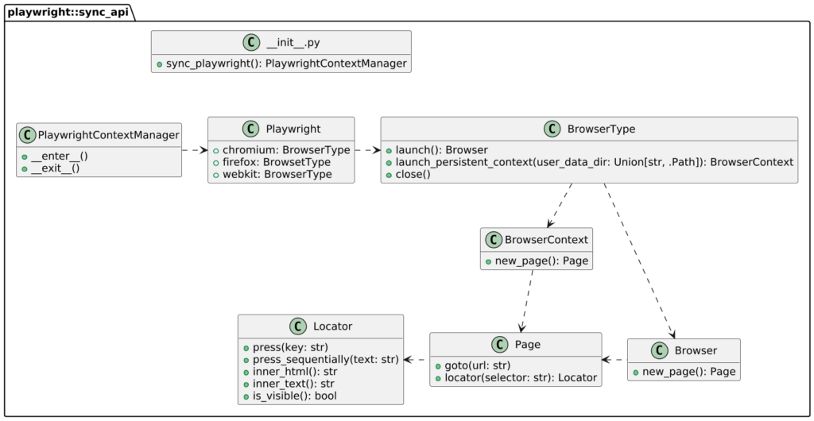

**In my previous company, I developed a batch job that tracked metrics across social media, such as Twitter, LinkedIn, Mastodon, Bluesky, Reddit, etc. Then I realized I could duplicate it for my own "persona". The problem is that some media don't provide an HTTP API for the metrics I want.**

Here are [the metrics](https://www.linkedin.com/dashboard/) I want on LinkedIn:

I searched for a long time but found no API access for the metrics above. I scraped the metrics manually every morning for a long time and finally decided to automate this tedious task. Here's what I learned.

The context {#h2-0-the-context}
-------------------------------

The job is in Python, so I want to stay in the same tech stack. After a quick research, I found [Playwright](https://playwright.dev/), a browser automation tool with a couple of language APIs, including Python. Playwright's primary use case is end-to-end testing, but it can also manage the browser outside a testing context.

I'm using Poetry to manage dependencies. Installing Playwright is as easy as:

<pre class="EnlighterJSRAW" data-enlighter-language="bash">poetry add playwright</pre>

At this point, Playwright is ready to use. It offers two distinct APIs, one *synchronous* and one *asynchronous*. Because of my use-case, the first flavour is more than enough.

Getting my feet wet {#h2-1-getting-my-feet-wet}
-----------------------------------------------

I like to approach development incrementally.

Here's an excerpt of the API:

It translates into the following code:

<pre class="EnlighterJSRAW" data-enlighter-language="python">from playwright.sync_api import Browser, Locator, Page, sync_playwright

with (sync_playwright() as pw):                                                        #1
    browser: Browser = pw.chromium.launch()                                            #2
    page: Page = browser.new_page()                                                    #3
    page.goto('https://www.linkedin.com/login')                                        #4
    page.locator('#username').press_sequentially(getenv('LINKEDIN_USERNAME'))          #5
    page.locator('#password').press_sequentially(getenv('LINKEDIN_PASSWORD'))          #5
    page.locator('button[type=submit]').press('Enter')                                 #6
    page.goto('https://www.linkedin.com/dashboard/')                                   #4
    metrics_container: Locator = page.locator('.pcd-analytic-view-items-container')
    metrics: List[Locator] = metrics_container.locator('p.text-body-large-bold').all() #7
    impressions = atoi(metrics[0].inner_text())                                        #8
    # Get other metrics
    browser.close()                                                                    #9</pre>

1. Get a `playwright` object
2. Launch a browser instance. Multiple browser types are available; I chose Chromium on a whim. Note that you should have installed the specific browser previously, *i.e.* , `playwright install --with-deps chromium`.By default, the browser opens *headless* ; it doesn't show up. I'd advise running it visibly at the beginning for easier debugging: `headless = True`.
3. Open a new browser window
4. Navigate to a new location
5. Locate specified input fields and fill them in with my credentials
6. Locate the specified button and press it
7. Locate **all** specified elements
8. Get the inner text of the first element
9. Close the browser to clean up

Storing cookies {#h2-2-storing-cookies}
---------------------------------------

The above worked as expected. The only downside is that I received an email from LinkedIn every time I ran the script:
> Hi Nicolas,
>
> You've successfully activated Remember me on a new device **HeadlessChrome, in , ,**. Learn more on how Remember me works on a device.

I also met [Fabien Vauchelles](https://github.com/fabienvauchelles) at the [JavaCro](https://2024.javacro.hr/) conference. He specializes in web scraping and told me that most people in this field leverage browser profiles. Indeed, if you log in to LinkedIn, you'll get an authentication token stored as cookies, and you won't need to authenticate it again before it expires. Fortunately, Playwright offers such a feature with its `launch_persistent_context` method.

We can replace the above `launch` with the following:

<pre class="EnlighterJSRAW" data-enlighter-language="python">with sync_playwright() as pw:
    playwright_profile_dir = f'{Path.home()}/.social-metrics/playwright-profile'
    context: BrowserContext = pw.chromium.launch_persistent_context(playwright_profile_dir) #1
    try:                                                                               #2
        page: Page = context.new_page()                                                #3
        page.goto('https://www.linkedin.com/dashboard/')                               #4
        if 'session_redirect' in page.url:                                             #4
            page.locator('#username').press_sequentially(getenv('LINKEDIN_USERNAME'))
            page.locator('#password').press_sequentially(getenv('LINKEDIN_PASSWORD'))
            page.locator('button[type=submit]').press('Enter')
            page.goto('https://www.linkedin.com/dashboard/')
        metrics_container: Locator = page.locator('.pcd-analytic-view-items-container')
        # Same as in the previous snippet
    except Exception as e:                                                             #2
        logger.error(f'Could not fetch metrics: {e}')
    finally:                                                                           #5
        context.close()</pre>

1. Playwright will store the profile in the specified folder and reuse it across runs
2. Improve exception handling
3. The `BrowserContext` can also open pages
4. We try to navigate to the dashboard. LinkedIn will redirect us to the login page if we are not authenticated; we can then authenticate
5. Close the context whatever the outcome

At this point, we need only to authenticate with both credentials the first time. On subsequent runs, it depends.

Adapting to reality {#h2-3-adapting-to-reality}
-----------------------------------------------

I was surprised to see that the code above didn't work reliably. It worked on the first run and sometimes on subsequent ones. Because I'm storing the browser profile across runs, when I need to authenticate, LinkedIn only asks for the password, not the login! Because the code tries to enter the login, it fails in this case. The fix is pretty straightforward:

<pre class="EnlighterJSRAW" data-enlighter-language="python">username_field = page.locator('#username')
if username_field.is_visible():
    username_field.press_sequentially(getenv('LINKEDIN_USERNAME'))
page.locator('#password').press_sequentially(getenv('LINKEDIN_PASSWORD'))</pre>

Conclusion {#h2-4-conclusion}
-----------------------------

Though I'm no expert in Python, I managed to achieve what I wanted with Playwright.

I preferred to use the sync API because it makes the code slightly easier to reason about, and I don't have any performance requirements. I only used the basic features offered by Playwright.

Playwright allows recording videos in the context of tests, which is very useful when a test fails during the execution of a CI pipeline.

**To go further:**

* [Playwright](https://playwright.dev/)
* [Video recording](https://playwright.dev/python/docs/videos)

*** ** * ** ***

*Originally published on [A Java Geek](https://blog.frankel.ch/first-steps-playwright/) on January 19^th^, 2024*
