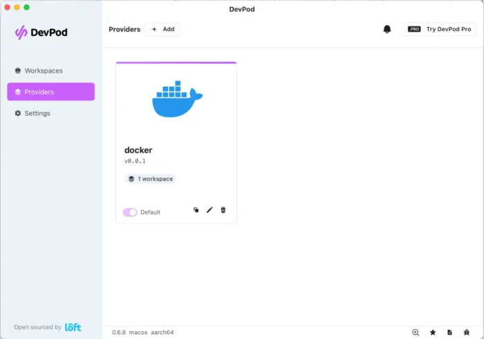
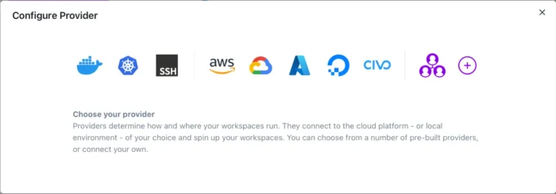
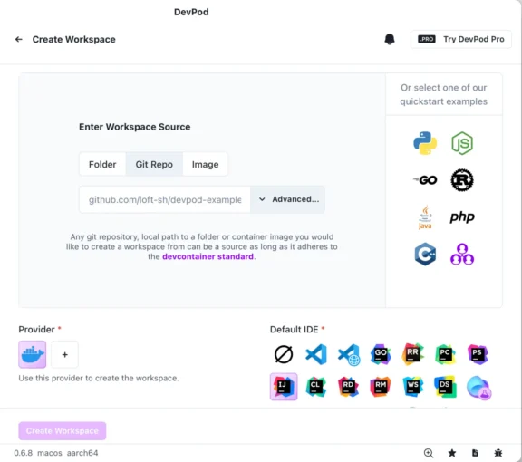
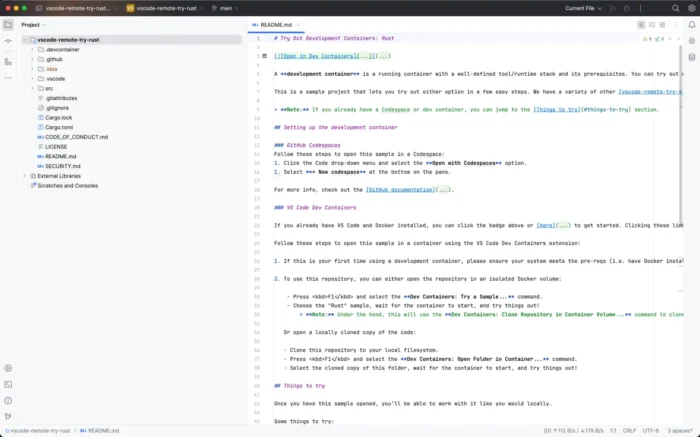

**I come relatively late to the subject of Remote Development Environments (also known as Cloud Development Environments).**

The main reason is that I haven't worked in a development team for over six years. However, I'm now working for Loft Labs, and we have a product: [DevPod](https://devpod.sh/). I wanted to understand our value proposition as was on my way to [FOSDEM](https://fosdem.org/) operating the [DevPod booth](https://fosdem.org/2025/news/2024-11-16-stands-announced/).

The problem {#h2-0-the-problem}
-------------------------------

As a former developer, I vividly remember the pain of setting up each developer's development environment. At the beginning of my career, the architect had to configure my development machine painfully, so it was similar to his setup. Later on, I did the same for my team members repeatedly. The scope of possible discrepancies impacting development is virtually endless: Operating System, of course, version **and** flavour of the SDKs, *e.g.*, Java's Eclipse Temurin vs SapMachine, git hooks, etc. It was sweat, toil, and blood on every project.

Over the years, I saw some interesting approaches to reproducing development environments. In the beginning, they stemmed from VMs, then from containers. I think Vagrant was the first tool that caught my attention: I attended a talk in 2012 where the speaker mentioned he used it to set up machines before his training sessions.

App architectures have evolved significantly over the years, becoming more complex and sophisticated. Years ago, chances were that the only infrastructure dependency was a SQL database. In the JVM ecosystem, we were lucky to have JDBC, an API that would work across all SQL databases. All you needed to do was write standard SQL, and you could configure the database instance at runtime. With embedded databases such as [Apache Derby](https://db.apache.org/derby/) and [H2](https://www.h2database.com/), you didn't need a dedicated Oracle instance for each developer.

Times have changed. It's not uncommon for apps to need a SQL database, a NoSQL database, a Kafka cluster, and a few additional application services. Organizations that develop such apps are already using some container-related technology, *e.g.*, Docker or Kubernetes, to manage this complexity.

It doesn't solve the initial issue, though: how do you align the IDE, its plugins, the SDK(s), the git hooks, and everything else? You probably guessed it from the title-Remote Development Environments.

Development Containers {#h2-1-development-containers}
-----------------------------------------------------

In the introduction, I mentioned that RDEs are called Cloud Development Environments. The main idea behind RDEs is to store all you can in a Cloud and share it with all developers. In addition, you want them to work across the most widespread Cloud providers and the most commonly used IDEs. When such a need appears, it's time for industry actors to gather around a standard. Microsoft initiated the Development Container standard for their VS Code Remove development plugin for this exact purpose.
> A development container (or dev container for short) allows you to use a container as a full-featured development environment. It can be used to run an application, to separate tools, libraries, or runtimes needed for working with a codebase, and to aid in continuous integration and testing. Dev containers can be run locally or remotely, in a private or public cloud, in a variety of supporting tools and editors.
>
> The Development Container Specification seeks to find ways to enrich existing formats with common development specific settings, tools, and configuration while still providing a simplified, un-orchestrated single container option -- so that they can be used as coding environments or for continuous integration and testing. Beyond the specification's core metadata, the spec also enables developers to quickly share and reuse container setup steps through Features and Templates.
>
> -- [What are Development Containers?](https://containers.dev/)

The configuration file is `devcontainer.json`. You can find the schema reference [here](https://containers.dev/implementors/json_reference/). VS Code, Visual Studio, and IntelliJ products can leverage a `devcontainer.json` file. On the provider side, GitHub Codespaces, CodeSandbox, and DevPod suport it.

Introducing DevPod {#h2-2-introducing-devpod}
---------------------------------------------

[DevPod](https://devpod.sh/) is a solution that leverages `devcontainer.json`. It implements three main properties:

* Open Source: No vendor lock-in. 100% free and open source built by developers for developers.
* Client Only: No server side setup needed. Download the desktop app or the CLI to get started.
* Unopinionated: Repeatable dev environment for any infra, any IDE, and any programming language.

DevPod is designed to be user-friendly and straightforward, making it a breeze to use. I decided to write this post because I was impressed with the product and to get my thoughts in order.

The first step is to install DevPod itself. I'm on Mac; there's a Homebrew recipe.

```bash
brew install devpod
```


Once installed, you can launch it from the CLI or the GUI. I favour GUIs, in the beginning, to help understand the available options.



<br />

DevPod offers providers: locations where to run the containers. The default is Docker. You can add additional providers, including Cloud Providers and Kubernetes clusters.



<br />

For this post, I'll keep Docker---I'm using OrbStack. Now, onto the meat. Let's go to the workspaces menu item. If you already have created workspaces, they should appear here. Since it's our first visit, we shall create one. Click on the btn:\[Create workspace\] button. Let's try one of the quickstart examples, *i.e.*, Rust. My IDE of choice is IntelliJ IDEA, but you can choose yours. Once you've selected an image, an IDE, and a provider, click Create Workspace.



<br />

At this point, DevPod will download the image and open the project running in OrbStack in IntelliJ.



<br />

From now on, we can happily start working on our Rust project, confident that every team member uses the same Rust version.

Note that the first time you use this setup, DevPod will download the JetBrains client as well. It's a one-time download delay, though.


<br />

The same holds for Git pre-commit hooks, for example. If you prefer to develop within another IDE, select it at launch time, and you're good. When done with your day's work, stop the container. If you're running in the Cloud, it saves money. On the next day, resume the container and continue your work.

Conclusion {#h2-3-conclusion}
-----------------------------

DevPod is a nice tool around your toolbelt that allows your development team(s) to share the same machine configuration without hassle.

In this introductory blog post, I showed a small fraction of what you can do. I encourage you to leverage its power if faced with heterogeneous development environments.

**To go further:**

* [Development Containers](https://containers.dev/)
* [DevPod - Open Source Dev-Environments-As-Code](https://devpod.sh/)
* [Gitpod vs. Codespaces vs. Coder vs. DevPod: 2024 Comparison](https://www.loft.sh/blog/comparing-coder-vs-codespaces-vs-gitpod-vs-devpod)

<br />

*[RDE]: Remote Development Environment
