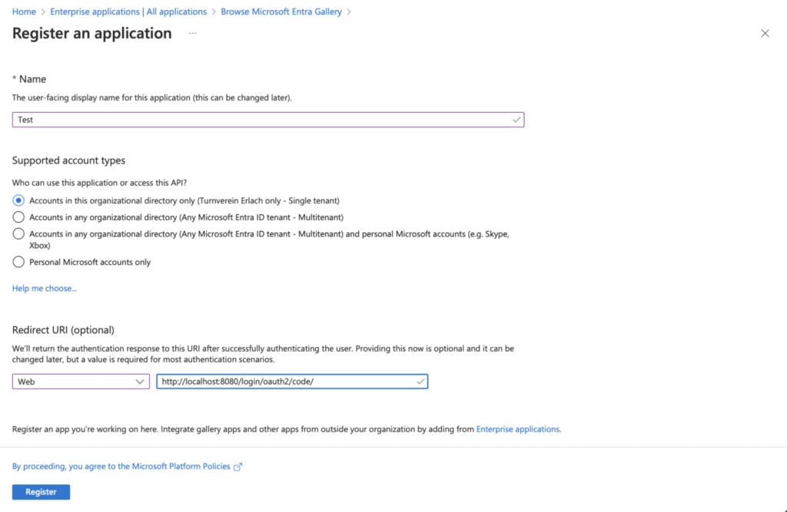
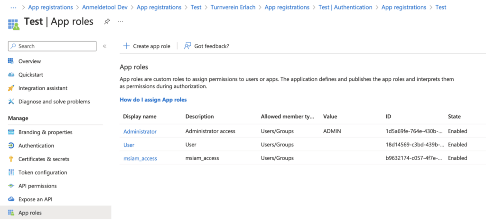
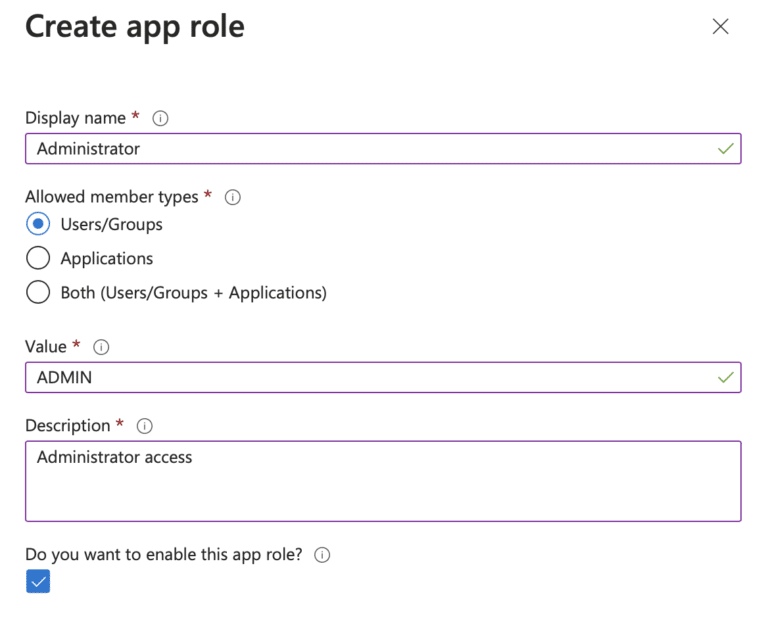
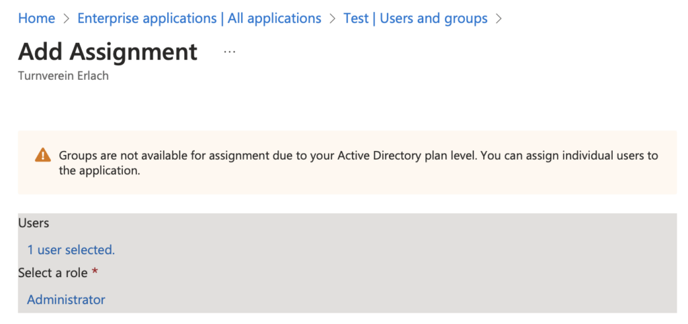
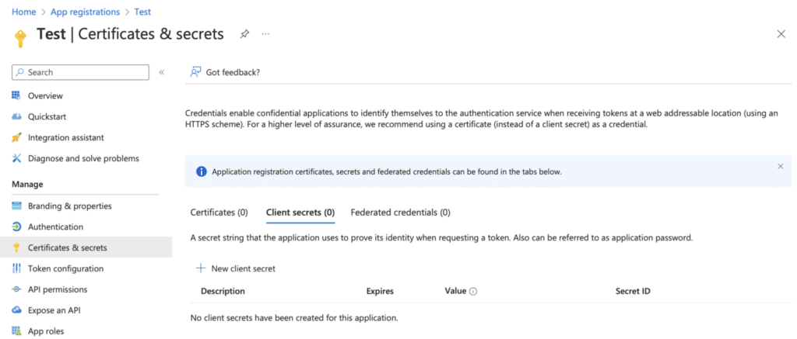
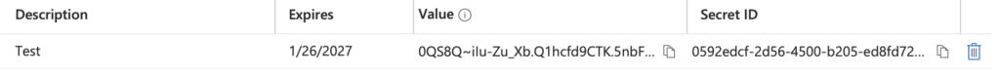
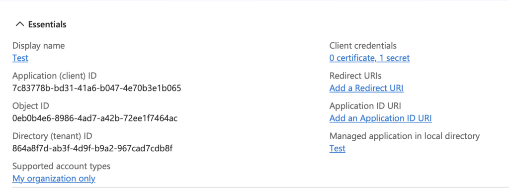

Many companies use Microsoft 365, so letting users log in with their Microsoft account is a good choice. This blog post shows how to secure your Vaadin applications using Microsoft Entra for authentication and authorization and explains how Karibu Testing must be configured.

## Step 1: Create an Application in Entra

The first step is to create an application, configure roles, assign users, and set the redirect URI.

To create an application, log in to http://entra.microsoft.com and select "Applications" -\> "Enterprise applications." There, you can create a new application. Select "Register an application to integrate with Microsoft Entra ID (App you're developing)."

Set a name and add a Redirect URI like in the screenshot. Choose Web and set `http://localhost:8080/login/oauth2/code/` as the URI. As you can see, this URI is application-environment-specific, and you will need to create an app registration per stage (dev, test, production, etc.).


### Create App Role

We want to use role-based security in our application. To create an app role, go to "App registrations" and select the application. Click on "App roles":


And create the app role. In this case, we will create an Administrator account. The value will be what you will get in the JWT token. I prefer to have the role names in uppercase.


### Assign Users

Once you've created your application role, return to "Enterprise applications" and click "Users and groups." You can assign existing users or groups to the application roles:


### Create Client Secret

To be able to connect to Entra from the application, we must create a client secret that allows our application to connect to Entra:


Make sure to copy the value of the client secret; we'll need that in the application configuration.


We also need to copy the ClientId and the TenantId. The ClientId (Application (client) ID) can be found on the App registration overview page (below), and the TenantId is located on the Entra overview page.


## Step 2: Configure OAuth2 with Entra in our Application

As we have a Vaadin application, we will use the [OAuth 2.0 authorization code grant flow](https://learn.microsoft.com/en-us/azure/active-directory/develop/v2-oauth2-auth-code-flow).

### Add Dependencies

First, add the Microsoft starter dependencies and the OAuth2 client starter. Don't be confused about the dependency's name. Entra is the new name for Azure Active Directory (Azure AD).

```xml
<dependency>
   <groupId>com.azure.spring</groupId>
   <artifactId>spring-cloud-azure-starter-active-directory</artifactId>
</dependency>
<dependency>
   <groupId>org.springframework.boot</groupId>
   <artifactId>spring-boot-starter-oauth2-client</artifactId>
</dependency>
```

### Configure the Application

There are four properties to set. For simplicity, the snippet below shows them as Java properties. But you must be careful with secret values.  
**Please don't put them into application.properties or commit them to your Git repository because they are secret values you don't want to share with the public.**   

It's better to set the properties on the platform where your application is running, for example, as environment variables.

```
spring.cloud.azure.active-directory.enabled=true
spring.cloud.azure.active-directory.profile.tenant-id=<teanantId>
spring.cloud.azure.active-directory.credential.client-id=<clientId>
spring.cloud.azure.active-directory.credential.client-secret=<clientSecret>
```

### Enable Entra Security

To integrate Entra with Spring Security, we need to adjust the security configuration. We extend from VaadinWebSecurity because we have a Vaadin application.   

Add `AadWebApplicationHttpSecurityConfigurer.aadWebApplication()` to enable Entra security as the first line in the `configure method`.  

Also, ensure you don't set a LoginView because the login will happen with the Microsoft login.

```java
@EnableWebSecurity
@Configuration
public class SecurityConfiguration extends VaadinWebSecurity {
    @Override
    protected void configure(HttpSecurity http) throws Exception {
        http.with(AadWebApplicationHttpSecurityConfigurer.aadWebApplication(), c -> {
        });
        http.authorizeHttpRequests(authorize -> authorize
            .requestMatchers(new AntPathRequestMatcher("/images/*.png"),
                             new AntPathRequestMatcher("/line-awesome/**/*.svg"), 
                             EndpointRequest.to(HealthEndpoint.class))
            .permitAll());
        super.configure(http);
    }
}
```

### Configure Role Prefix

The security configuration will prefix the roles with APPROLE_. To use the role name that we set in Microsoft Entra, we must configure the default prefix because ROLE_ is the prefix by default.

```java
@Configuration
public class RolePrefixConfiguration {
    @Bean
    public GrantedAuthorityDefaults grantedAuthorityDefaults() {
        return new GrantedAuthorityDefaults("APPROLE_");
    }
}
```

### Roles in Action

The setup is completed, and we can use role-based security in the Vaadin application.   

It's convenient to define the roles as constants, like in the example, in case the role name changes, so you only have to change it in one place.

```java
@RolesAllowed({ Roles.USER, Roles.ADMIN })
@Route("event-registrations")
public class EventRegistrationView extends Div implements HasUrlParameter<Long>, HasDynamicTitle {
```

## Step 3: Setup Karibu Testing

To use [Browserless Testing of Vaadin Applications with Karibu Testing](https://martinelli.ch/browserless-testing-of-vaadin-applications-with-karibu-testing/), we must fake the Entra setup's security context.

The most important part is the `createOAuth2AuthenticationToken` Method.   

An `OAuth2AuthenticationToken` is created and then set to the `SecurityContext` and the Karibu FakeRequest. The `OidcIdToken` is created with minimal attributes that our application uses.

It's also important to override the `getUserPrincipal` method because no login is happening. Using OAuth2 means that the application assumes that a JWT is part of the request instead.

```java
@SpringBootTest
public abstract class KaribuTest {
    private static Routes routes;
    @Autowired
    protected ApplicationContext ctx;
    // Default user and role
    private String username = "[email protected]";
    private String name = "John Doe";
    private String role = Roles.ADMIN;
    private OAuth2AuthenticationToken oAuth2AuthenticationToken;
    @BeforeAll
    public static void discoverRoutes() {
        Locale.setDefault(Locale.GERMAN);
        routes = new Routes().autoDiscoverViews("ch.martinelli.oss.registration.ui.views");
    }
    @BeforeEach
    public void setup() {
        MockVaadin.INSTANCE.setMockRequestFactory(session -> new FakeRequest(session) {
            @Override
            public Principal getUserPrincipal() {
                createAuthentication();
                return SecurityContextHolder.getContext().getAuthentication();
            }
        });
        final Function0<UI> uiFactory = UI::new;
        MockVaadin.setup(uiFactory, new MockSpringServlet(routes, ctx, uiFactory));
    }
    @AfterEach
    public void tearDown() {
        logout();
        MockVaadin.tearDown();
    }
    protected void login(String username, String role) {
        this.username = username;
        this.role = role;
        oAuth2AuthenticationToken = null;
        createOAuth2AuthenticationToken();
    }
    private void createAuthentication() {
        createOAuth2AuthenticationToken();
        SecurityContextHolder.getContext().setAuthentication(oAuth2AuthenticationToken);
        FakeRequest request = (FakeRequest) VaadinServletRequest.getCurrent().getRequest();
        request.setUserPrincipalInt(oAuth2AuthenticationToken);
        request.setUserInRole((principal, roleName) -> oAuth2AuthenticationToken.getPrincipal()
            .getAuthorities()
            .stream()
            .anyMatch(a -> a.getAuthority().equals(roleName)));
    }
    private void createOAuth2AuthenticationToken() {
        if (oAuth2AuthenticationToken == null) {
            OidcIdToken oidcIdToken = new OidcIdToken("tokenValue", null, null,
                    Map.of("sub", "-", "preferred_username", username, "name", name));
            DefaultOidcUser defaultOidcUser = new DefaultOidcUser(List.of(new SimpleGrantedAuthority(role)),
                    oidcIdToken);
            oAuth2AuthenticationToken = new OAuth2AuthenticationToken(defaultOidcUser, defaultOidcUser.getAuthorities(),
                    "oidc");
        }
    }
    protected void logout() {
        try {
            SecurityContextHolder.getContext().setAuthentication(null);
            if (VaadinServletRequest.getCurrent() != null) {
                FakeRequest request = (FakeRequest) VaadinServletRequest.getCurrent().getRequest();
                request.setUserPrincipalInt(null);
                request.setUserInRole((principal, roleName) -> false);
            }
        }
        catch (IllegalStateException e) {
            // Ignored
        }
    }
}
```

## Summary

Thanks to the spring-cloud-azure-starter-active-directory, the setup is straightforward. The Karibu Testing setup was more difficult, but thanks to Martin Mysny's help, I was able to make it work.

To learn more, check out the official documentation: [Spring Boot Starter for Microsoft Entra developer's guide](https://learn.microsoft.com/en-us/azure/developer/java/spring-framework/spring-boot-starter-for-entra-developer-guide?tabs=SpringCloudAzure5x).

*This blog post was first published on <https://martinelli.ch/securing-vaadin-applications-with-microsoft-entra/>*
