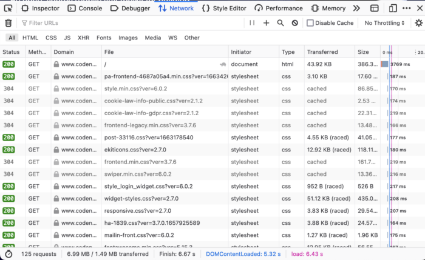
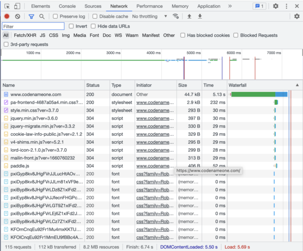
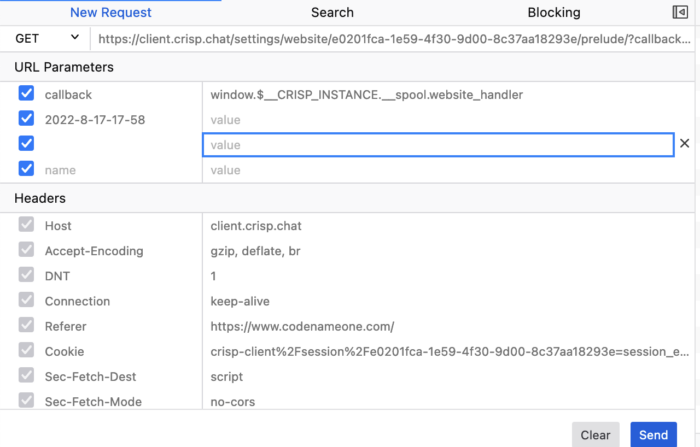
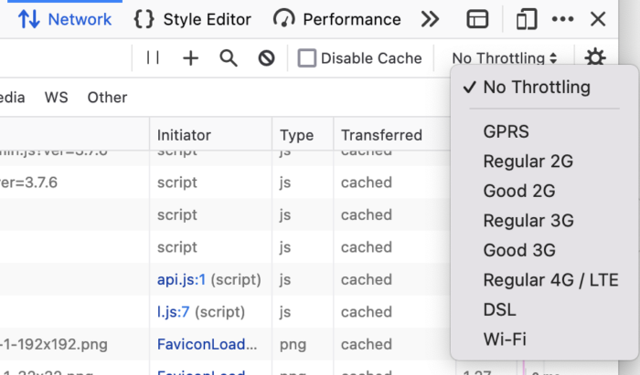
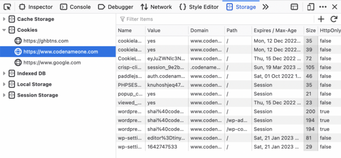
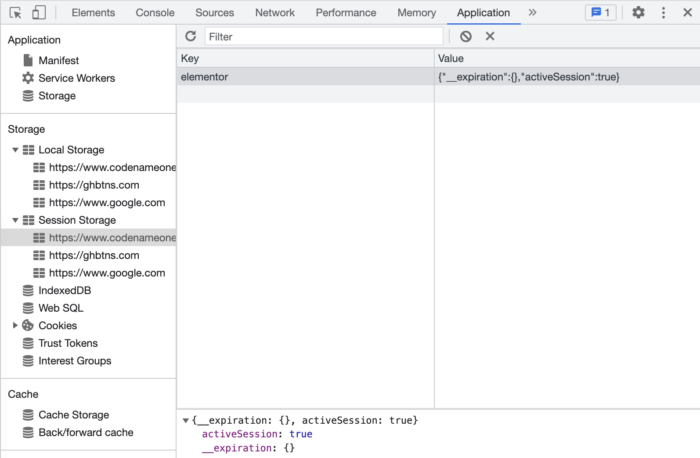

* [**Network Debugging Powerhouse**](#network-debugging-powerhouse)
* [**Re-Issuing and Modifying Requests**](#reissuing-and-modifying-requests)
  * [cURL and Postman](#curl-and-postman)
* [**Throttling and Debugging Race Conditions**](#throttling-and-debugging-race-conditions)
  * [Why Throttling Matters:](#why-throttling-matters)
  * [How to Use](#how-to-use)
* [**Managing State with Storage Tools**](#managing-state-with-storage-tools)
  * [Challenges of State Management](#challenges-of-state-management)
* [**Analyzing Request and Response Headers**](#analyzing-request-and-response-headers)
* [**Debugging in Incognito Mode: Limitations and Best Practices**](#debugging-in-incognito-mode-limitations-and-best-practices)
* [**Connecting the Front-End to the Database**](#connecting-the-frontend-to-the-database)
* [Final Word](#final-word)

Debugging network communication issues is a critical skill for any front-end developer. While tools like [Wireshark](https://debugagent.com/wireshark-tcpdump-a-debugging-power-couple) provide low-level insight into network traffic, modern browsers like Chrome and Firefox offer developer tools with powerful features tailored for web development. In this post we will discuss using browser-based tools to debug network communication issues effectively. This is a far better approach than using Wireshark for the vast majority of simple cases.



 

As a side note, if you like the content of this and the other posts in this series check out my [Debugging book](https://www.amazon.com/dp/1484290410/) that covers **t** his subject. If you have friends that are learning to code I'd appreciate a reference to my [Java Basics book.](https://www.amazon.com/Java-Basics-Practical-Introduction-Full-Stack-ebook/dp/B0CCPGZ8W1/) If you want to get back to Java after a while check out my [Java 8 to 21 book](https://www.amazon.com/Java-21-Explore-cutting-edge-features/dp/9355513925/)**.**

**Network Debugging Powerhouse**
--------------------------------

Modern browsers come equipped with developer tools that rival standalone IDE debuggers in capability and convenience. Both Chrome and Firefox have robust network monitoring features that allow developers to observe/analyze requests and responses without leaving the browser.

On the basic level, which you're probably familiar with, these tools include:

* **Network monitors:** View all HTTP and HTTPS requests, including their headers, payloads, and responses.
* **Throttling controls:** Simulate slower connections to test performance and debug race conditions.
* **Request replay functionality:** Modify and resend requests directly from the browser.

While this post focuses on debugging techniques, it's worth noting that these tools are invaluable for performance optimization as well, though that topic warrants its own discussion.

**Re-Issuing and Modifying Requests**
-------------------------------------

One of the most powerful debugging features is the ability to re-issue requests. Instead of switching to external tools like cURL or Postman, browsers allow us to modify and resend requests directly.

This lets us quickly test variations of a failing API call to pinpoint issues without leaving the debugging environment. It's especially useful when we have hard to reproduce issues or deep UI hierarchies.

**In Firefox we can** right-click any network entry in the Firefox Developer Tools and select "Resend." This opens an editable window where we can change request parameters, such as headers, payloads, or query strings, and resend the request.

Chrome provides similar functionality, though its interface for modifying and resending requests is slightly less direct than Firefox's.

### cURL and Postman

Both browsers let you copy a request as a cURL command via the context menu. This is useful for reproducing issues in the terminal or sharing with back-end developers. I use this frequently as part of creating a reproducible issue.

If you prefer Postman, you can copy request headers and payloads from the browser and paste them into Postman to replicate requests.

**Throttling and Debugging Race Conditions**
--------------------------------------------

Network throttling is a highly underrated feature that can be a game-changer for debugging specific classes of bugs. Both Chrome and Firefox allow developers to simulate various network speeds, from 2G connections to fast 4G.

### Why Throttling Matters:

Some bugs only surface when requests arrive out of their expected order. Slowing down the network can help replicate and analyze these situations. Typical examples would be race conditions and related issues.

This is also very useful for simulating real-world conditions. Many users may not have fast or reliable internet connections. Throttling helps you understand how your application behaves in these scenarios.

I use this frequently when testing loading indicators which disappear too quickly when running locally. Instead of adding sleep code into the JavaScript or server code I can simulate slow-loading assets to verify that loading spinners or placeholders appear correctly.

### How to Use

In Chrome we Open Developer Tools → Network tab.

We then use the "No throttling" dropdown to select pre-configured speeds or create a custom profile.

In Firefox we have similar functionality is available under the Network Monitor.

**Managing State with Storage Tools**
-------------------------------------

Local storage, session storage, and indexedDB often hold data critical to reproducing bugs, especially those tied to specific user states or devices.

### Challenges of State Management

Even in incognito mode, state can persist if multiple private windows are open simultaneously. Persistence across sessions is a big challenge in these situations.

Understanding the exact state of a user's local storage can provide insight into seemingly random bugs. Debugging user-specific issues is problematic without control over storage.

In Firefox the dedicated **Storage** tab in Developer Tools makes it easy to inspect, edit, and delete data from local storage, session storage, cookies, and indexedDB.

In Chrome the **Application** tab consolidates all storage options, including the ability to clear specific caches or edit entries manually.

This functionality has many powerful uses for debugging:

1. **Inject Debug Information:** Tools like these let us manually add or modify storage data to simulate edge cases or specific user conditions.
2. **Share Local State:** Users can export their local storage, cookies, or indexedDB entries, allowing developers to reproduce issues locally.
3. **Clear Cache Strategically:** Clear only the relevant entries instead of a blanket cache clear, preserving useful state for debugging.

**Analyzing Request and Response Headers**
------------------------------------------

Request and response headers often hold the key to understanding network issues. We can use the network monitor to inspect:

* **Authorization headers:** Check for missing or malformed tokens.
* **CORS headers:** Verify that the server allows requests from your domain. These are some of the most painful type of http bugs. Reviewing these headers can be a lifesaver. If requests fail with CORS errors, inspect the `Access-Control-Allow-Origin` header in the response.
* **Cache-Control headers:** Ensure proper caching behavior for your resources.

These tools are especially useful when debugging missing headers: Look for required headers like `Content-Type` or `Authorization`. Debugging Authentication: Use the "Copy as cURL" feature to test API calls with modified headers directly in the terminal.

**Debugging in Incognito Mode: Limitations and Best Practices**
---------------------------------------------------------------

Incognito mode can help isolate issues by providing a clean slate, however it has some limitations. Multiple incognito windows share the same state, which can lead to unintentional persistence of local data.

I suggest using **storage management tools** to manually clear or modify local data instead of relying solely on incognito mode. Keep only one incognito window open during testing to avoid unintended state sharing.

**Connecting the Front-End to the Database**
--------------------------------------------

The front-end is often a transition point between user interaction and back-end data processing. While this post focuses on debugging the network layer, it's important to remember that:

* Network issues often manifest due to back-end problems (e.g., a database error resulting in a 500 Internal Server Error).
* Front-end developers should collaborate closely with back-end engineers to trace issues across the stack.

We can use **custom response headers** to include diagnostic information from the back end, such as query execution time or error codes. We can leverage **server logs** in conjunction with front-end debugging to get a complete picture of the issue.

Final Word
----------

Browser developer tools are indispensable for debugging network communication issues, offering features like request replay, throttling, and storage management that simplify the debugging process. By mastering these tools, front-end developers can efficiently identify and resolve issues, ensuring a smoother user experience.

With the techniques and tips outlined in this post, you'll be better equipped to tackle network debugging challenges head-on. As you grow more familiar with these tools, you'll find them invaluable not only for debugging but also for improving your development workflow.
