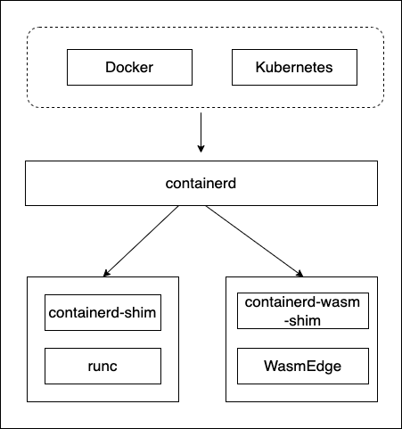
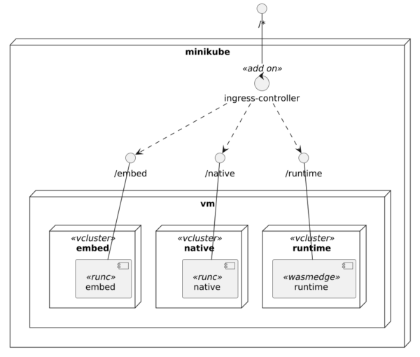

Like a couple of innovative technologies, different people have different viewpoints on where WebAssembly fits the technology landscape.
> WebAssembly (also called Wasm) is certainly the subject of much hype right now. But what is it? Is it the JavaScript Killer? Is it a new programming language for the web? Is it (as we like to say) the next wave of cloud compute? We've heard it called many things: a better eBPF, the alternative to RISC V, a competitor to Java (or Flash), a performance booster for browsers, a replacement for Docker.
>
> -- [How to think about WebAssembly](https://www.fermyon.com/blog/how-to-think-about-wasm)

In this post, I'll stay away from these debates and focus solely on how to use WebAssembly on Kubernetes.

My approach and the use case {#h2-0-my-approach-and-the-use-case}
-----------------------------------------------------------------

Unlike regular programming languages, you don't write WebAssembly directly: you write code that generates WebAssembly. At the moment, Go and Rust are the main source languages. I know Kotlin and Python are working toward this objective. There might be other languages I'm not aware of.

I've settled on Rust for this post because of my familiarity with the language. In particular, I'll keep the same code across three different architectures:

* Regular Rust-to-native code as the baseline
* Rust-to-WebAssembly using a WasmEdge embedded runtime
* Rust-to-WebAssembly using an external runtime

Don't worry; I'll explain the difference between the two last approaches later.

The use case should be more advanced than Hello World to highlight the capabilities of WebAssembly. I've implemented an HTTP server mimicking a single endpoint of the excellent [https://httpbin.org/\[httpbin](https://httpbin.org/%5Bhttpbin)\^\] API testing utility. The code itself is not essential as the post is not about Rust, but in case you're interested, you can find it on [GitHub](https://github.com/ajavageek/wasm-kubernetes/blob/master/src/main.rs). I add a field to the response to explicitly return the underlying approach, respectively `native`, `embed`, or `runtime`.

Baseline: regular Rust-to-native {#h2-1-baseline-regular-rust-to-native}
------------------------------------------------------------------------

For the regular native compilation, I'm using a multistage Docker file:

<pre class="EnlighterJSRAW" data-enlighter-language="yaml">FROM rust:1.84-slim AS build                                             #1

RUN &lt;&lt;EOB                                                                #2
  apt-get update
  apt-get install -y musl-tools musl-dev
  rustup target add aarch64-unknown-linux-musl                           #3
EOB

WORKDIR /native

COPY native/Cargo.toml Cargo.toml

WORKDIR /

COPY src src

WORKDIR /native

RUN RUSTFLAGS="-C target-feature=+crt-static" cargo build --target aarch64-unknown-linux-musl --release #4

FROM gcr.io/distroless/static                                            #5

COPY --from=build /native/target/aarch64-unknown-linux-musl/release/httpbin httpbin #6

ENTRYPOINT ["./httpbin"]</pre>

1. Start from the latest Rust image
2. Heredocs for the win
3. Install the necessary toolchain to cross-compile
4. Statically compile
5. I could potentially use `FROM scratch`, but after reading [this](https://labs.iximiuz.com/tutorials/pitfalls-of-from-scratch-images), I prefer to use distroless
6. Copy the executable from the previous compilation phase

The final `wasm-kubernetes:native` image weighs 8.71M, with its base image `distroless/static` taking 6.03M of them.

Adapting to WebAssembly {#h2-2-adapting-to-webassembly}
-------------------------------------------------------

The main idea behind WebAssembly is that it's secure because it can't access the host system. However, we must open a socket to listen to incoming requests to run an HTTP server. WebAssembly can't do that. We need a runtime that provides this feature and other system-dependent capabilities. It's the goal of .
> The WebAssembly System Interface (WASI) is a group of standards-track API specifications for software compiled to the W3C WebAssembly (Wasm) standard. WASI is designed to provide a secure standard interface for applications that can be compiled to Wasm from any language, and that may run anywhere---from browsers to clouds to embedded devices.
>
> -- [Introduction to WASI](https://wasi.dev/)

The specification [v0.2](https://wasi.dev/interfaces#wasi-02) defines the following system interfaces:

* Clocks
* Random
* Filesystem
* Sockets
* CLI
* HTTP

A couple of runtimes already implement the specification:

* [Wasmtime](https://wasmtime.dev/), developed by the Bytecode Alliance
* [Wasmer](https://wasmer.io/)
* [Wazero](https://wazero.io/), Go-based
* [WasmEdge](https://wasmedge.org/), designed for cloud, edge computing, and AI applications
* [Spin](https://www.fermyon.com/spin) for serverless workloads

I had to choose without being an expert in any of these. I finally decided on WasmEdge because of its focus on the Cloud.

We must intercept code that calls with system APIs and redirect them to the runtime. Instead of runtime interception, the Rust ecosystem provides a patch mechanism: we replace code that calls system APIs with code that calls WASI APIs. We must know which dependency calls which system API and hope a patch exists for our dependency version.

<pre class="EnlighterJSRAW" data-enlighter-language="ini">[patch.crates-io]
tokio = { git = "https://github.com/second-state/wasi_tokio.git", branch = "v1.36.x" }  #1-2
socket2 = { git = "https://github.com/second-state/socket2.git", branch = "v0.5.x" }    #1

[dependencies]
tokio = { version = "1.36", features = ["rt", "macros", "net", "time", "io-util"] }     #2
axum = "0.8"
serde = { version = "1.0.217", features = ["derive"] }</pre>

1. Patch the `tokio` and `socket2` crates with WASI-related calls
2. The latest `tokio` crate is 1.43, but the latest (and only) patch v1.36. We can't use the latest version because there's no patch.

We must change the Dockerfile to compiler WebAssembly code instead of native:

<pre class="EnlighterJSRAW" data-enlighter-language="yaml">FROM --platform=$BUILDPLATFORM rust:1.84-slim AS build

RUN &lt;&lt;EOT bash
    set -ex
    apt-get update
    apt-get install -y git clang
    rustup target add wasm32-wasip1                                      #1
EOT

WORKDIR /wasm

COPY wasm/Cargo.toml Cargo.toml

WORKDIR /

COPY src src

WORKDIR /wasm

RUN RUSTFLAGS="--cfg wasmedge --cfg tokio_unstable" cargo build --target wasm32-wasip1 --release #2-3</pre>

1. Install the WASM target
2. Compile to WASM
3. We must activate the `wasmedge` flag, as well as the `tokio_unstable` one, to successfully compile to WebAssembly

At this stage, we have two options for the second stage:

* Use the WasmEdge runtime as a base image: 

<pre class="EnlighterJSRAW" data-enlighter-language="dockerfile">FROM --platform=$BUILDPLATFORM wasmedge/slim-runtime:0.13.5

COPY --from=build /wasm/target/wasm32-wasip1/release/httpbin.wasm /httpbin.wasm

CMD ["wasmedge", "--dir", ".:/", "/httpbin.wasm"]</pre>

  From a usage perspective, it's pretty similar to the native approach.
* Copy the WebAssembly file and make it a runtime responsibility: 

<pre class="EnlighterJSRAW" data-enlighter-language="dockerfile">FROM scratch

COPY --from=build /wasm/target/wasm32-wasip1/release/httpbin.wasm /httpbin.wasm

ENTRYPOINT ["/httpbin.wasm"]</pre>

  It's where things get interesting.

The `native` approach is slightly better than the `embed` one, but the `runtime` is the leanest since it contains only a single Webassembly file.

Running the Wasm image on Docker {#h2-3-running-the-wasm-image-on-docker}
-------------------------------------------------------------------------

Not all Docker runtimes are equal, and to run Wasm workloads, we need to delve a bit into the Docker name. While Docker, the company, created Docker as the product, the current reality is that containers have evolved beyond Docker and now answer to specifications.
> The **Open Container Initiative** is an open governance structure for the express purpose of creating open industry standards around container formats and runtimes.
>
> Established in June 2015 by Docker and other leaders in the container industry, the OCI currently contains three specifications: the Runtime Specification (runtime-spec), the Image Specification (image-spec) and the Distribution Specification (distribution-spec). The Runtime Specification outlines how to run a "filesystem bundle" that is unpacked on disk. At a high-level an OCI implementation would download an OCI Image then unpack that image into an OCI Runtime filesystem bundle. At this point the OCI Runtime Bundle would be run by an OCI Runtime.
>
> -- [Open Container Initiative](https://opencontainers.org/)

From then on, I'll use the proper terminology for OCI images and containers. Not all OCI runtimes are equal, and far from all of them can run Wasm workloads: OrbStack, my current OCI runtime, can't, but [Docker Desktop can](https://docs.docker.com/desktop/features/wasm/), as an *experimental* feature. As per the documentation, we must:

* Use `containerd` for pulling and storing images
* Enable Wasm

Finally, we can run the above OCI image containing the Wasm file by selecting a Wasm runtime, Wasmedge, in my case. Let's do it:

<pre class="EnlighterJSRAW" data-enlighter-language="bash">docker run --rm -p3000:3000 --runtime=io.containerd.wasmedge.v1 ghcr.io/ajavageek/wasm-kubernetes:runtime</pre>

`io.containerd.wasmedge.v1` is the current version of the Wasmedge runtime. You must be authenticated with GitHub if you want to try it out.

<pre class="EnlighterJSRAW" data-enlighter-language="bash">curl localhost:3000/get\?foo=bar | jq</pre>

The result is the same as for the native version:

<pre class="EnlighterJSRAW" data-enlighter-language="json">{
  "flavor": "runtime",
  "args": {
    "foo": "bar"
  },
  "headers": {
    "accept": "*/*",
    "host": "localhost:3000",
    "user-agent": "curl/8.7.1"
  },
  "url": "/get?foo=bar"
}</pre>

Wasi on Docker Desktop allows you to spin up an HTTP server that behaves like a regular native image! Even better, the image size is as tiny as the WebAssembly file it contains:

|                                   |   Tag   | Size (Mb) |
|-----------------------------------|---------|-----------|
| ghcr.io/ajavageek/wasm-kubernetes | runtime | 1.15      |
| ghcr.io/ajavageek/wasm-kubernetes | embed   | 12.4      |
| ghcr.io/ajavageek/wasm-kubernetes | native  | 8.7       |

Running the Wasm image on Kubernetes {#h2-4-running-the-wasm-image-on-kubernetes}
---------------------------------------------------------------------------------

Now comes the fun part: your favorite Cloud provider(s) isn't using Docker Desktop. Despite this, we can still run WebAssembly workloads on Kubernetes. For this, we need to understand a bit about the not-too-low levels of what happens when you run a container, regardless of whether it's from an OCI runtime or Kubernetes.

The latter executes a process; in our case, it's `containerd`. Yet, `containerd` is only an orchestrator of other container processes. It detects the "flavor" of the container and calls the relevant executable. For example, for "regular" containers, it calls `runc` via a *shim* . The good thing is that we can install other shims dedicated to other container types, such as Wasm. The following illustration, taken from the [Wasmedge website](https://wasmedge.org/docs/develop/deploy/intro/), summarizes the flow:

Despite some of the [mainstream](https://learn.microsoft.com/en-us/azure/aks/use-wasi-node-pools) [Cloud providers](https://www.spinkube.dev/docs/install/azure-kubernetes-service/) offering Wasm integration, none of them provide such a low-level one. I'll continue on my laptop, but Docker Desktop doesn't offer a direct integration either: it's time to be creative. For example, [minikube](https://minikube.sigs.k8s.io/) is a full-fledged Kubernetes distribution that creates an intermediate Linux virtual machine within a Docker environment. We can SSH into the VM and configure it to our heart's content. Let's start by installing `minikube`.

<pre class="EnlighterJSRAW" data-enlighter-language="bash">brew install minikube</pre>

Now, we start `minikube` with the `containerd` driver and specify a profile to enable differently configured VMs. We unimaginatively call this profile `wasm`.

<pre class="EnlighterJSRAW" data-enlighter-language="bash">minikube start --driver=docker --container-runtime=containerd -p=wasm</pre>

Depending on whether you have already installed `minikube` and whether it has already downloaded its images, starting can take a few seconds to dozens of minutes. Be patient. The output should be something akin to:

<pre class="EnlighterJSRAW" data-enlighter-language="bash">😄  [wasm] minikube v1.35.0 on Darwin 15.1.1 (arm64)
✨  Using the docker driver based on user configuration
📌  Using Docker Desktop driver with root privileges
👍  Starting "wasm" primary control-plane node in "wasm" cluster
🚜  Pulling base image v0.0.46 ...
❗  minikube was unable to download gcr.io/k8s-minikube/kicbase:v0.0.46, but successfully downloaded docker.io/kicbase/stable:v0.0.46@sha256:fd2d445ddcc33ebc5c6b68a17e6219ea207ce63c005095ea1525296da2d1a279 as a fallback image
🔥  Creating docker container (CPUs=2, Memory=12200MB) ...
📦  Preparing Kubernetes v1.32.0 on containerd 1.7.24 ...
    ▪ Generating certificates and keys ...
    ▪ Booting up control plane ...
    ▪ Configuring RBAC rules ...
🔗  Configuring CNI (Container Networking Interface) ...
🔎  Verifying Kubernetes components...
    ▪ Using image gcr.io/k8s-minikube/storage-provisioner:v5
🌟  Enabled addons: storage-provisioner, default-storageclass
🏄  Done! kubectl is now configured to use "wasm" cluster and "default" namespace by default</pre>

At this point, our goal is to install on the underlying VM:

* Wasmedge to run Wasm workloads
* A shim to bridge between `containerd` and `wasmedge`

<pre class="EnlighterJSRAW" data-enlighter-language="bash">minikube ssh -p wasm</pre>

We can install Wasmedge, but I found nowhere to download the shim. In the [next step](https://wasmedge.org/docs/develop/deploy/cri-runtime/containerd), we will build both. We first need to install Rust:

<pre class="EnlighterJSRAW" data-enlighter-language="bash">curl --proto '=https' --tlsv1.2 -sSf https://sh.rustup.rs | sh</pre>

The script likely complains that it can't execute the downloaded binary:

<pre class="EnlighterJSRAW" data-enlighter-language="generic">Cannot execute /tmp/tmp.NXPz8utAQx/rustup-init (likely because of mounting /tmp as noexec).
Please copy the file to a location where you can execute binaries and run ./rustup-init.</pre>

Follow the instructions:

<pre class="EnlighterJSRAW" data-enlighter-language="bash">cp /tmp/tmp.NXPz8utAQx/rustup-init .
./rustup-init</pre>

Proceed with the default installation by pressing the `ENTER` button. When it's finished, source your current shell.

<pre class="EnlighterJSRAW" data-enlighter-language="bash">. "$HOME/.cargo/env"</pre>

The system is ready to build Wasmedge and the shim.

<pre class="EnlighterJSRAW" data-enlighter-language="bash">sudo apt-get update
sudo apt-get install -y git

git clone https://github.com/containerd/runwasi.git

cd runwasi
./scripts/setup-linux.sh

make build-wasmedge
INSTALL="sudo install" LN="sudo ln -sf" make install-wasmedge</pre>

The last step requires configuring the `containerd` process with the shim. Insert the following snippet in the `[plugins."io.containerd.grpc.v1.cri".containerd.runtimes]` section of the `/etc/containerd/config.toml` file:

<pre class="EnlighterJSRAW" data-enlighter-language="ini">[plugins."io.containerd.grpc.v1.cri".containerd.runtimes.wasmedgev1]
  runtime_type = "io.containerd.wasmedge.v1"</pre>

Restart `containerd` to load the new config.

<pre class="EnlighterJSRAW" data-enlighter-language="bash">sudo systemctl restart containerd</pre>

Our system is finally ready to accept Webassembly workloads. Users can deploy a Wasmedge `pod` with the following manifest:

<pre class="EnlighterJSRAW" data-enlighter-language="yaml">apiVersion: node.k8s.io/v1
kind: RuntimeClass
metadata:
  name: wasmedge                                                         #1
handler: wasmedgev1                                                      #2
---
apiVersion: v1
kind: Pod
metadata:
  name: runtime
  labels:
    arch: runtime
spec:
  containers:
    - name: runtime
      image: ghcr.io/ajavageek/wasm-kubernetes:runtime
  runtimeClassName: wasmedge                                             #3</pre>

1. Wasmedge workloads should use this name
2. Handler to use. It should be the last segment of the section added in the TOML file, *i.e.* , `containerd.runtimes.wasmedgev2`
3. Point to the runtime class name we defined just above

I used a single `Pod` instead of a full-fledged `Deployment` to keep things simple.

Notice the many levels of indirection:

1. The `pod` refers to the `wasmedge` runtime class name
2. The `wasmedge` runtime class points to the `wasmedgev1` handler
3. The `wasmedgev1` handler in the TOML file specifies the `io.containerd.wasmedge.v1` runtime type

Final steps {#h2-5-final-steps}
-------------------------------

To compare the approaches and test our work, we can use the `minikube` `ingress` addon and [vCluster](https://www.vcluster.com/). The former offers a single access point for all three workloads, `native`, `embed`, and `runtime`, while vCluster isolates workloads from each other in their virtual cluster.

Let's start by installing the addon:

<pre class="EnlighterJSRAW" data-enlighter-language="bash">minikube -p wasm addons enable ingress</pre>

It deploys an Nginx Ingress Controller in the `ingress-nginx` namespace:

<pre class="EnlighterJSRAW" data-enlighter-language="generic">💡  ingress is an addon maintained by Kubernetes. For any concerns contact minikube on GitHub.
You can view the list of minikube maintainers at: https://github.com/kubernetes/minikube/blob/master/OWNERS
💡  After the addon is enabled, please run "minikube tunnel" and your ingress resources would be available at "127.0.0.1"
    ▪ Using image registry.k8s.io/ingress-nginx/kube-webhook-certgen:v1.4.4
    ▪ Using image registry.k8s.io/ingress-nginx/kube-webhook-certgen:v1.4.4
    ▪ Using image registry.k8s.io/ingress-nginx/controller:v1.11.3
🔎  Verifying ingress addon...
🌟  The 'ingress' addon is enabled</pre>

We must create a dedicated virtual cluster to deploy the `Pod` later.

<pre class="EnlighterJSRAW" data-enlighter-language="bash">helm upgrade --install runtime vcluster/vcluster --namespace runtime --create-namespace  --values vcluster.yaml</pre>

We will define the `Ingress`, the `Service`, and their related `Pod` in each virtual cluster. We need vCluster to synchronize the `Ingress` with the Ingress Controller. Here's the configuration to achieve this:

<pre class="EnlighterJSRAW" data-enlighter-language="yaml">sync:
  toHost:
    ingresses:
      enabled: true</pre>

The output should be similar to:

<pre class="EnlighterJSRAW" data-enlighter-language="generic">Release "runtime" does not exist. Installing it now.
NAME: runtime
LAST DEPLOYED: Thu Jan 30 11:53:14 2025
NAMESPACE: runtime
STATUS: deployed
REVISION: 1
TEST SUITE: None</pre>

We can amend the above manifest with the `Service` and `Ingress` to expose the `Pod`:

<pre class="EnlighterJSRAW" data-enlighter-language="yaml">apiVersion: v1
kind: Service
metadata:
  name: runtime
spec:
  type: ClusterIP                                                        #1
  ports:
    - port: 3000                                                         #1
  selector:
    arch: runtime
---
apiVersion: networking.k8s.io/v1
kind: Ingress
metadata:
  name: runtime
  annotations:
    nginx.ingress.kubernetes.io/use-regex: "true"                        #2
    nginx.ingress.kubernetes.io/rewrite-target: /$2                      #2
spec:
  ingressClassName: nginx
  rules:
    - host: localhost
      http:
        paths:
          - path: /runtime(/|$)(.*)                                      #4
            pathType: ImplementationSpecific                             #4
            backend:
              service:
                name: runtime
                port:
                  number: 3000</pre>

1. Expose the `Pod` inside the cluster
2. Nginx-specific annotations to handle path regular expression and rewrite it
3. Regex path

Nginx will forward all requests starting with `/runtime` to the `runtime` service, removing the prefix. To apply the manifest, we first connect to the previously created virtual cluster:

<pre class="EnlighterJSRAW" data-enlighter-language="bash">vcluster connect runtime</pre>

<pre class="EnlighterJSRAW" data-enlighter-language="generic">11:53:21 info Waiting for vcluster to come up...
11:53:39 done vCluster is up and running
11:53:39 info Starting background proxy container...
11:53:39 done Switched active kube context to vcluster_embed_embed_vcluster_runtime_runtime_wasm
- Use `vcluster disconnect` to return to your previous kube context
- Use `kubectl get namespaces` to access the vcluster</pre>

Now apply the manifest:

<pre class="EnlighterJSRAW" data-enlighter-language="bash">kubectl apply -f runtime.yaml</pre>

We do the same with the `embed` and the `native` pods, barring the `runtimeClassName` as they are "regular" images.

The final deployment diagram is the following:

 

The final touch is to tunnel to expose services:

<pre class="EnlighterJSRAW" data-enlighter-language="bash">minikube -p wasm tunnel</pre>

<pre class="EnlighterJSRAW" data-enlighter-language="generic">✅  Tunnel successfully started

📌  NOTE: Please do not close this terminal as this process must stay alive for the tunnel to be accessible ...

❗  The service/ingress runtime-x-default-x-runtime requires privileged ports to be exposed: [80 443]
🔑  sudo permission will be asked for it.
🏃  Starting tunnel for service runtime-x-default-x-runtime.
Password:</pre>

Let's request the lightweight container that uses the Wasmedge runtime:

<pre class="EnlighterJSRAW" data-enlighter-language="bash">curl localhost/runtime/get\?foo=bar | jq</pre>

We get the expected output:

<pre class="EnlighterJSRAW" data-enlighter-language="json">{
  "flavor": "runtime",
  "args": {
    "foo": "bar"
  },
  "headers": {
    "user-agent": "curl/8.7.1",
    "x-forwarded-host": "localhost",
    "x-request-id": "dcbdfde4715fbfc163c7c9098cbdf077",
    "x-scheme": "http",
    "x-forwarded-for": "10.244.0.1",
    "x-forwarded-scheme": "http",
    "accept": "*/*",
    "x-real-ip": "10.244.0.1",
    "x-forwarded-proto": "http",
    "host": "localhost",
    "x-forwarded-port": "80"
  },
  "url": "/get?foo=bar"
}</pre>

We should get similar results with the other approaches, with different `flavor` values.

Conclusion {#h2-6-conclusion}
-----------------------------

In this post, I showed how to use Webassembly on Kubernetes with the Wasmedge runtime. I created three flavors for comparison purposes: `native`, `embed`, and `runtime`. The first two are "regular" Docker images, while the latter contains only a single Wasm file, which makes it very lightweight and secure. However, we need a dedicated runtime to run it.

Regular managed Kubernetes services don't allow configuring an additional shim, such as the Wasmedge shim. Even on my laptop, I had to be creative to make it happen. I had to use Minikube and put much effort into configuring its intermediate virtual machine to run Wasm workloads on Kubernetes. Yet, I managed to run all three images inside their virtual cluster, exposed outside the cluster by an Nginx Ingress Controller.

Now, it's up to you to decide whether the extra effort is worth the 10x reduction of image size and the improved security. I hope the future will improve the support so that the pros outweigh the cons.

The complete source code for this post can be found on [GitHub](https://github.com/ajavageek/wasm-kubernetes).

**Go further**:

* [Introduction to WasmEdge](https://wasmedge.org/docs/develop/deploy/intro/)
* [WebAssembly and containerd: How it works](https://web.archive.org/web/20240808201241/https://nigelpoulton.com/webassembly-and-containerd-how-it-works/)
* [containerd-wasm-shims](https://github.com/deislabs/containerd-wasm-shims)
* [Deploy with containerd's runwasi](https://wasmedge.org/docs/develop/deploy/cri-runtime/containerd/)

*[WASI]: WebAssembly System Interface
