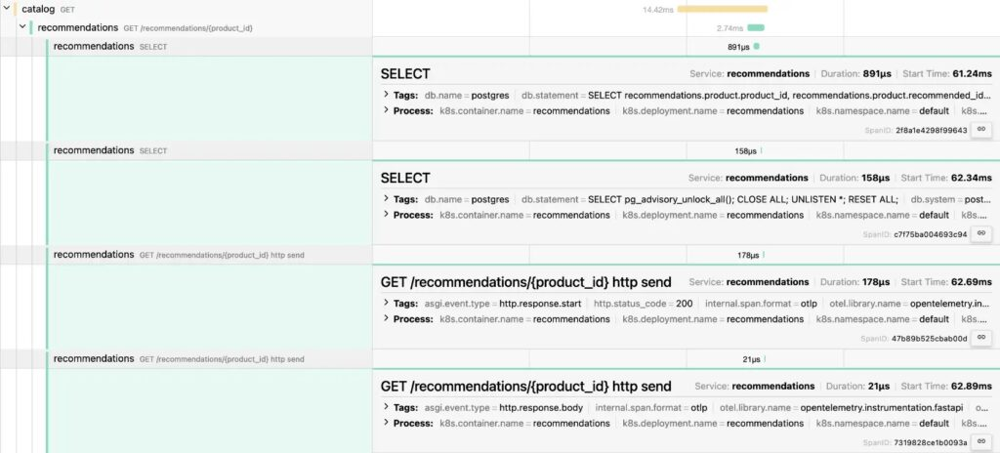
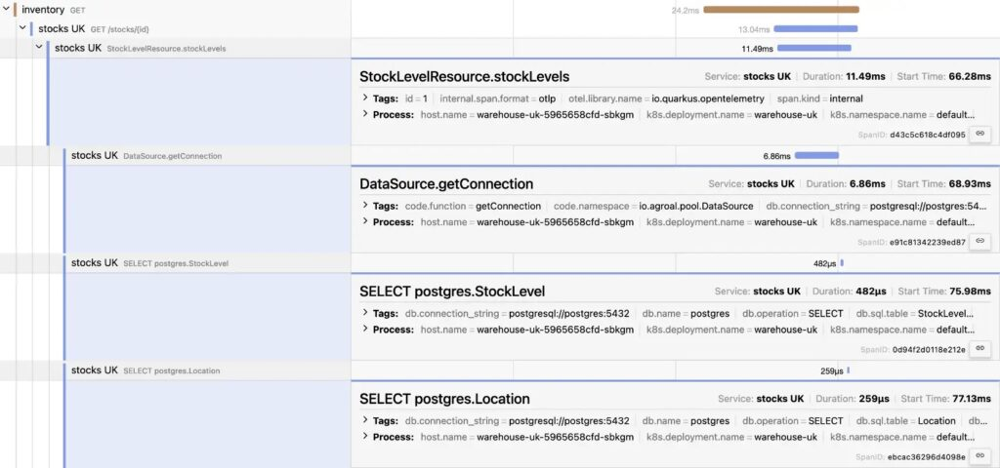

I have presented my [OpenTelemetry demo](https://github.com/nfrankel/opentelemetry-tracing) many times, and I still do. Each time, the audience is different. To make no two presentations the same, I always ask attendees what stack they are more interested in. I also [regularly add](https://blog.frankel.ch/improve-otel-demo/) [new features](https://blog.frankel.ch/even-more-opentelemetry/) for the same reason.

I was a victim of the IT crisis last summer, and my company fired me, so I no longer work on Apache APISIX. They say that the Chinese ideogram for crisis contains the ideogram for opportunity. I used this opportunity to join [LoftLabs](https://www.loft.sh/). LoftLabs offers a cluster virtualization solution called [vCluster](https://www.vcluster.com/).

Hence, this batch of changes to the demo has a lot of Kubernetes-related features.

## From Docker Compose to Helm

Docker Compose is great for demos: `docker compose up`, and you're good to go, but I know no organization that uses it in production. Deploying workloads to Kubernetes is much more involved than that. I've used Kubernetes for demos in the past; typing `kubectl apply -f` is dull fast. In addition to GitOps, which isn't feasible for demos, the two main competitors are [Helm](https://helm.sh/) and [Kustomize](https://kustomize.io/). I chose the former for its ability to add dependencies.

## Helm subcharts for the win!

I started to migrate by creating my own Helm templates for infrastructure. While it worked, it was hugely inefficient. In the end, I used the following Helm Charts as sub-charts in my infra chart:

* [Valkey](https://github.com/bitnami/charts/tree/main/bitnami/valkey)
* [Traefik](https://github.com/traefik/traefik-helm-chart)
* [OpenTelemetry Collector](https://github.com/open-telemetry/opentelemetry-helm-charts)
* [OpenTelemetry Operator](https://github.com/open-telemetry/opentelemetry-helm-charts)
* [Jaeger](https://github.com/jaegertracing/helm-charts)
* [PostgreSQL](https://github.com/bitnami/charts/tree/main/bitnami/postgresql)

At the start, I kept a custom Jaeger manifest because the official Jaeger Helm Chart doesn't provide a way to expose the UI outside the cluster. Then, I realized that I was using Traefik and that I could use it. It's precisely the architecture I used on Docker Compose with Apache APISIX.

I did keep a custom-made manifest for Mosquitto, but that's because the official one doesn't add benefit IMHO: you need a config file.

## Kubernetes topology

Besides OpenTelemetry, I want to highlight the capabilities of vCluster. For this reason, I separate the different Docker Compose services into two groups: an *infrastructure* group (Traefik, Jaeger, Valkey, Mosquitto, and an OpenTelemetry Collector) and an *app* group (PostgreSQL, Mosquitto, the OTEL Operator, an OTEL collector, and all apps). I deploy infrastructure-related pods on the host cluster and the app pods in a dedicated virtual cluster's `default` namespace.

```bash
helm upgrade --install vcluster vcluster/vcluster --namespace otel --values helm/vcluster.yaml #1
helm upgrade --install otel-infra infra --values helm/infra/values.yaml --namespace otel       #2
vcluster connect vcluster                                                                      #3
helm upgrade --install otel-apps apps --values helm/apps/values.yaml                           #4
```

1. Create the virtual cluster in the `otel` namespace
2. Deploy infrastructure pods in the `otel` namespace on the host cluster
3. Connect to the virtual cluster. I'm now in a completely isolated Kubernetes cluster. Only we know it's a virtual one.
4. Schedule infrastructure pods in the `default` namespace of the `vcluster` virtual cluster

## Traefik as an Ingress Controller

When I stopped working on APISIX, I decided to see how API Gateways worked and migrated to [KrakenD](https://www.krakend.io/) on Docker Compose. For basic usage, it's simple enough.

I wanted to try another one on Kubernetes. I chose [Traefik](https://traefik.io/) because my searches mentioned it was the easiest to use in Kubernetes. As I mentioned, Traefik provides a Helm Chart, which makes it easy to install. Additionally, it integrates with OpenTelemetry.

```yaml
traefik:
  fullnameOverride: traefik
  deployment:
    replicas: 1
  gateway:
    enabled: false
  rbac:
    enabled: true
  ports:
    web:
      nodePort: 30080
  tracing:
    otlp:
      enabled: true                    #1
      grpc:
        enabled: true                  #2
        endpoint: collector:4317       #3
        insecure: true                 #4
```

1. Enable OpenTelemetry
2. Prefer gRPC over HTTP
3. Set the collector endpoint
4. Security is not the point of the demo

## Exposing services and the Ingress class

The idea of scheduling infrastructure pods on the host cluster and apps pods in the virtual cluster is excellent from an architectural point of view, but how do the latter access the former? You probably use `Service` to access pods inside the same cluster. Services provide a stable IP over pods that come and go. Across regular clusters, you'll need an Ingress Controller or a Gateway API implementation. vCluster offers a straightforward alternative.

In the demo, I must:

1. Access services on the host cluster from pods scheduled on the virtual cluster
2. Configure Ingresses on the virtual cluster with an Ingress class whose Ingress Controller is deployed on the host cluster

As seen above, we can configure both when we create the virtual cluster.

```
networking:
  replicateServices:
    fromHost:
      - from: otel/valkey-primary      #1
        to: default/cache
      - from: otel/jaeger              #1
        to: default/tracing
      - from: otel/traefik             #1
        to: default/ingress
      - from: otel/mosquitto           #1
        to: default/messages
sync:
  toHost:
    ingresses:
      enabled: true                    #2
```

1. Synchronize a `Service` **from** the host cluster **to** the virtual cluster. The pattern is `.`
2. Ingresses deployed on the virtual cluster are collected on the Ingress Controller configured on the host cluster

## A touch of the OpenTelemetry collector

I chose not to use an OpenTelemetry Collector in the Docker Compose setup because it didn't add anything. With the new two-cluster architecture, it was beneficial to introduce one per cluster.

At first, I configured each Collector to add a custom tag regarding the cluster type, `host` or `virtual`. Then, I discovered that the Collector Helm Chart provided a Kubernetes preset.

```
opentelemetry-collector:
  image:
    repository: "otel/opentelemetry-collector-k8s"
  fullnameOverride: collector
  enabled: true
  mode: deployment
  presets:
    kubernetesAttributes:
      enabled: true
```

It automatically adds Kubernetes-related data. Here's the result in one of the app pods:

|          Key          |                 Value                  |
|-----------------------|----------------------------------------|
| `k8s.deployment.name` | `warehouse-uk`                         |
| `k8s.namespace.name`  | `default`                              |
| `k8s.node.name`       | `orbstack`                             |
| `k8s.pod.ip`          | `192.168.194.44`                       |
| `k8s.pod.name`        | `warehouse-uk-5965658cfd-sbkgm`        |
| `k8s.pod.start_time`  | `2024-11-29T16:36:30Z`                 |
| `k8s.pod.uid`         | `b6ba838e-621c-46b1-ac32-c9225c80e142` |

## Initializing PostgreSQL with data

The "official" [PostgreSQL Docker image](https://hub.docker.com/_/postgres) allows initializing the database via SQL scripts. You only need to mount the scripts folder to the container's `/docker-entrypoint-initdb.d` folder. When the container starts, it will run these scripts in alphabetical order. On Kubernetes, I started to write all the scripts' content in a static `ConfigMap`, but I didn't find this approach maintainable.

Given I'm using a Helm Chart, I thought I could find a better way, and I did. I put all the scripts in a dedicated `files/sql` folder in the Helm Chart. Then, I wrote the following template to concatenate them in a `ConfigMap`:

```yaml
apiVersion: v1
kind: ConfigMap
metadata:
  name: postgres-init-scripts
  namespace: {{ .Release.Namespace }}
data:
{{- $files := .Files.Glob "files/sql/*.sql" }}    #1
{{- range $path, $content := $files }}            #2
  {{ base $path }}: >                             #3
{{ $content | toString | indent 4 }}              #4
{{- end }}
```

1. List all files under the `files/sql/` folder
2. Iterate through all files
3. Write the file name
4. Write the file's content

At this point, we can use the `ConfigMap` in the global Helm file under the PostgreSQL section:

```yaml
postgresql:
  primary:
    persistence:
      enabled: false
    initdb:
      scriptsConfigMap: postgres-init-scripts
```

## Kubernetes instrumentation of pods

I recently learned that Kubernetes could instrument pods running certain technologies with [OpenTelemetry](https://opentelemetry.io/docs/kubernetes/operator/automatic/). I wanted to try it out, so I added a new OpenTelemetry-free Python-based image to the overall architecture. It's a two-step process:

1. Install the [OpenTelemetry Operator](https://opentelemetry.io/docs/kubernetes/operator/)
2. Apply an `Instrumentor`:

   ```yaml
   apiVersion: opentelemetry.io/v1alpha1
   kind: Instrumentation
   metadata:
     name: demo-instrumentation
   spec:
     exporter:
       endpoint: http://collector:4318               #1
     propagators:                                    #2
       - tracecontext
       - baggage
     sampler:
       type: always_on                               #3
   ```

   1. Configure the OpenTelemetry collector endpoint
   2. Set the propagators
   3. I want all the traces for my demo; in production environments, you'd probably want to sample them

At this point, when we schedule pods, Kubernetes will pass them through a new mutating webhook. If the pod has annotations that the instrumentation recognizes, the latter will add a sidecar that instruments the main pod with OpenTelemetry. For the Python app I mentioned above, it looks like the following:

```yaml
apiVersion: apps/v1
kind: Deployment
metadata:
  name: recommendations
  labels:
    app: recommendations
spec:
  replicas: 1
  selector:
    matchLabels:
      app: recommendations
  template:
    metadata:
      annotations:
        instrumentation.opentelemetry.io/inject-python: "true"     #1
      labels:
        app: recommendations
    spec:
      containers:
        - name: recommendations
          image: recommendations:1.0
```

1. The mutating webhook instruments the pod with the Python-specific image

Here's a screenshot of the resulting traces:



What's impressive is that it's all based on Kubernetes. Neither the app developer nor the container build had to do anything related to OpenTelemetry.

## A new Quarkus component

This last section is unrelated to Kubernetes. I'm already using Spring in two components for the demo, one instrumented with the OpenTelemetry Java agent and the other with Micrometer Tracing and compiled with GraalVM native. I wanted to demo the OpenTelemetry integration capabilities of Quarkus.

You only need two dependencies for auto-instrumentation:

```xml
<dependency>
    <groupId>io.quarkus</groupId>
    <artifactId>quarkus-opentelemetry</artifactId>
</dependency>
<dependency>
    <groupId>io.opentelemetry.instrumentation</groupId>
    <artifactId>opentelemetry-jdbc</artifactId>
</dependency>
```

You can customize the traces with annotations:

```java
@Path("/stocks")
@Produces(MediaType.APPLICATION_JSON)
public class StockLevelResource {

    private final StockLevelRepository repository;

    @Inject
    public StockLevelResource(StockLevelRepository repository) {
        this.repository = repository;
    }

    @GET
    @Path("/{id}")
    @WithSpan                                                      //1
    public List<StockLevel> stockLevels(@PathParam("id") @SpanAttribute("id") Long id) { //2
        return repository.findByProductId(id);
    }
}
```

1. Add a new span whose value is the method's name
2. Add a new `id` attribute whose value is the `id`'s value at runtime



## Summary

I added a couple of new features to my existing OpenTelemetry demo:

* Migrating from Docker Compose to Kubernetes
* Installing via Helm Charts
* Using vCluster to isolate the app pods from the infrastructure pods
* Using Traefik as an Ingress Controller
* Installing an OpenTelemetry collector instance in each cluster
* Instrumenting an OpenTelemetry-free app with the Kubernetes Instrumentation
* Adding a new Quarkus application

I'm always happy to add new components that feature a new stack. At the moment, I'm thinking .Net is missing from the landscape. [Suggestions and PRs](https://github.com/nfrankel/opentelemetry-tracing) are welcome!

**To go further:**

* [Helm](https://helm.sh/)
* [OpenTelemetry Collector Chart](https://opentelemetry.io/docs/kubernetes/helm/collector/)
* [OpenTelemetry Operator Chart](https://opentelemetry.io/docs/kubernetes/helm/operator/)
* [Injecting Auto-instrumentation on Kubernetes](https://opentelemetry.io/docs/kubernetes/operator/automatic/)
* [vCluster](https://www.vcluster.com/)
* [What are virtual clusters?](https://www.vcluster.com/docs/vcluster/introduction/what-are-virtual-clusters)
* [Traefik](https://doc.traefik.io/traefik/)
* [Traefik \& Kubernetes](https://doc.traefik.io/traefik/providers/kubernetes-ingress/)
* ["Quarkus: Using OpenTelemetry"](https://quarkus.io/guides/opentelemetry)

*Originally published at [A Java Geek](https://blog.frankel.ch/even-more-opentelemetry-kubernetes/) on April 6th, 2025*
