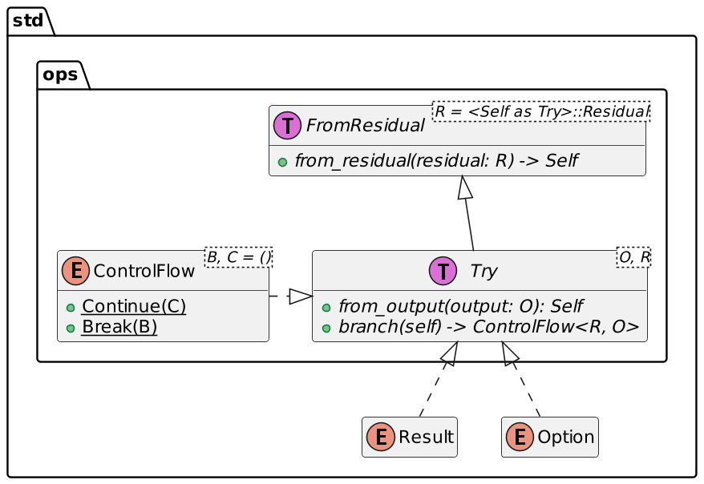

I wrote previously about [libs for error management in Rust](https://blog.frankel.ch/error-management-rust-libs/). This week, I want to write about the `try` block, an experimental feature.

The limit of the `?` operator
-----------------------------

Please check the above article for a complete refresher on error management in general and the `?` operator in particular. In short, `?` allows to hook into a function call that returns a `Result`:

* If the `Result` contains a value, it continues normally
* If it contains an error, it short-circuits and returns the `Result` to the calling function.

```rust
fn add(str1: &str, str2: &str) -> Result<i8, ParseIntError> {
  Ok(str1.parse::<i8>()? + str2.parse::<i8>()?)
}

fn main() {
    print!("{:?}", add("1", "2"));
    print!("{:?}", add("1", "a"));
}
```


The output is the following:

```
Ok(3)
Err(ParseIntError { kind: InvalidDigit })
```


Note that the defining function's signature *must* return a `Result` or an `Option`. The following block doesn't compile:

```rust
fn add(str1: &str, str2: &str) -> i8 {
  str1.parse::<i8>()? + str2.parse::<i8>()?
}
```


```
the `?` operator can only be used in a function that returns `Result` or `Option`
```


The verbose alternative
-----------------------

We must manually unwrap to return a non-wrapper type, *e.g.* , `i8` instead of `Option`.

```rust
fn add(str1: &str, str2: &str) -> i8 {
  let int1 = str1.parse::<i8>();                  //1
  let int2 = str2.parse::<i8>();                  //1
  if int1.is_err() || int2.is_err() { -1 }        //2-3
  else { int1.unwrap() + int2.unwrap() }          //4
}
```


1. Define `Result` variables
2. Manually checks if any of the variables contains an error, *i.e.*, the parsing failed
3. Return a default value since we cannot get a `Result`. In this case, it's not a great idea, but it's for explanation's sake
4. Unwrap with confidence

The `try` block to the rescue
-----------------------------

The sample above works but is quite lengthy. The `try` block is an *experimental* approach to make it more elegant. It allows "compacting" all the checks for errors in a single block:

```rust
#![feature(try_blocks)]                           //1

fn add(str1: &str, str2: &str) -> i8 {
  let result = try {
    let int1 = str1.parse::<i8>();
    let int2 = str2.parse::<i8>();
    int1.unwrap()? + int2.unwrap()?               //2
  };
  if result.is_err() { -1 }                       //3
  else { result.unwrap() }                        //4
}
```


1. Enable the experimental feature
2. Use the `?` operator though the defining function doesn't return `Result`
3. Check for errors only once
4. Unwrap confidently

Alas, the code doesn't compile:

```
the `?` operator can only be applied to values that implement `Try`
```


`i8` doesn't implement `Try`. Neither `i8` nor `Try` belong to our crate; a custom implementation would require the use of the wrapper-type pattern. Fortunately, a couple of types already implement `Try`: `Result`, `Option`, `Poll`, and `ControlFlow`.

```rust
fn add(str1: &str, str2: &str) -> i8 {
  let result: Result<i8, ParseIntError> = try {   //1
    str1.parse::<i8>()? + str2.parse::<i8>()?     //2
  };
  if result.is_err() { -1 }
  else { result.unwrap() }
}
```


1. The compiler cannot infer the type
2. Using `?` on `Result` inside the `try` block is now allowed



Conclusion
----------

I learned about the `try` block in Java over twenty years ago. Java needs it because exceptions are at the root of its error-handling system; Rust doesn't because it uses Functional Programming for its error handling - mainly `Result`.

The `?` operator builds upon the `Result` type to allow short-circuiting in functions that return `Result` themselves. If the function doesn't, you need a lot of boilerplate code. The experimental `try` block relieves some of it.

**To go further:**

* [Error management in Rust, and libs that support it](https://blog.frankel.ch/error-management-rust-libs/)
* ["The Rust Unstable Book: try_blocks"](https://doc.rust-lang.org/beta/unstable-book/language-features/try-blocks.html)
* [The Rust RFC Book](https://rust-lang.github.io/rfcs/3058-try-trait-v2.html)
* [Extending Rust's Effect System](https://blog.yoshuawuyts.com/extending-rusts-effect-system/)


*Originally published at [A Java Geek](https://blog.frankel.ch/try-block-rust/) on April 21^st^, 2024*
