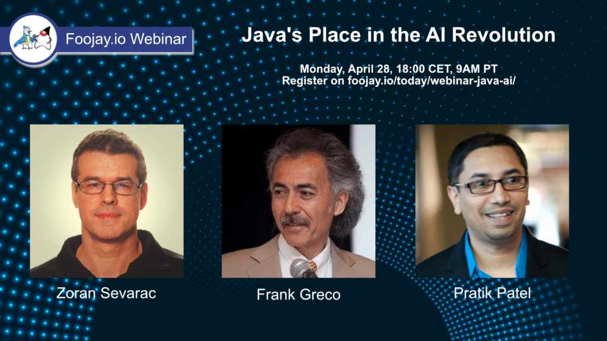

**This first online Foojay Webinar will highlight Java's place in the AI Revolution, focusing on Exploring AI/ML Using Pure Java Tools.**

AI and Machine Learning (ML) are becoming essential in modern software development. For Java developers, there's no need to switch technology stacks. It's now possible to build, train, and deploy ML models using tools available directly within the Java ecosystem.

This webinar focuses on practical predictive AI/ML approaches in pure Java. We'll walk through key Java libraries, show how to structure and train models, and discuss how Java's core strengths, ie, JVM performance, type safety, and enterprise integration, can be used to build scalable AI solutions.

If you're a Java developer or architect interested in learning more about AI/ML with structured data, this session will show you how to do it efficiently using native Java tools.

### Practical

* Online streaming via YouTube
* Date: Monday, April 28th 2025
* Time:
  * 18:00 CET
  * 9AM Pacific Time

Please register here: <https://forms.gle/p9wxXhcMDfBwCXsUA>

### Guests

Frank Greco, Senior AI/ML Consultant, Technology Strategist, Java Champion, Developer Ecosystem (Crossroads)

Zoran Sevarac, CEO of @Deep Netts, Full Professor at University of Belgrade, Java Champion, AI Consultant \| Deep Learning Development Platform

### Moderator

Pratik Patel, VP Developer Advocacy at Azul, Java Champion

