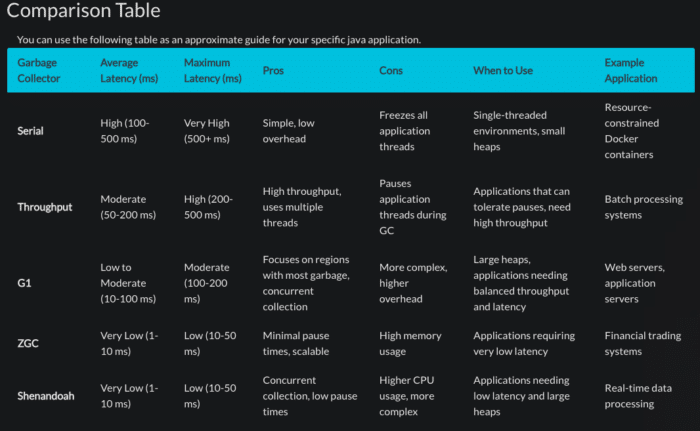

**You might associate Arm primarily with smartphones and the Java-based Android runtime. However, OpenJDK has supported AArch64 on Linux since 2014--- before Arm-based cloud instances were widely available.** **Fast forward a decade and major cloud providers have their own Arm-based instances like AWS Graviton, Microsoft Azure Cobalt, and others, prompting many organizations to migrate Java workloads from x86 to multi-architecture environments.**

A multi-architecture deployment shift allows an organization to be adaptable and choose the architecture with the ideal price to performance ratio. Large independent software vendors, such as Uber, are [already making this transition](https://www.uber.com/en-GB/blog/adopting-arm-at-scale-bootstrapping-infrastructure/).

Thanks to Java's "write once, run anywhere" promise, your applications generally run on Arm without changes. So, blog over? Not quite. Migrating Java from x86 to AArch64 is like a pilot switching from flying one aircraft model to another. The cockpit controls (Java) remain familiar, allowing smooth basic operation, but instruments and settings might respond differently.

To achieve optimal flight performance, the pilot needs to adjust or recalibrate certain controls, ensuring everything goes smoothly. Without tuning, you'll still fly, but you won't fully benefit from the improved handling and efficiency of the upgraded aircraft.

## Why GC Tuning Matters on Arm

One of the most important controls in your metaphorical performance cockpit is Garbage Collection (GC). The Arm Neoverse architecture—the backbone of many Arm-based cloud instances—is known for its scalable core counts and can leverage those cores to deliver strong GC performance, though it often requires some fine-tuning to reach peak efficiency.

Let's explore the key settings you should adjust to unlock its full potential.

### OpenJDK Version

Always use a modern OpenJDK (Java 11 or newer). Newer JDKs include Arm-specific optimizations for the latest Arm platforms, such as AWS Graviton 4.

Further, the latest OpenJDK uses has access to more advanced garbage collectors, notably Garbage-First (G1) GC, which significantly improves pause times and throughput compared to older Java versions.

### Choosing the Right Garbage Collector

Each GC has its own set of trade-offs but understanding the differences is not obvious.

The table below can be used as a rough guide if you are considering building a Java application from scratch to run on Arm.

For most server workloads, a safe starting point is the `G1 GC`. It balances throughput and latency well, collecting the heap incrementally to avoid long pauses. For latency-critical applications with large heaps, consider `ZGC` or `Shenandoah` (Java 17+), offering ultra-low pause times.

### Heap Size and GC Pause Time

Heap size has a major impact on GC performance. If it's too small, collections happen too frequently; if it's too large, pause times can become excessive. How much of each your application can tolerate depends entirely on your specific use case.

Thankfully, the Java community anticipated this trade-off and provided tuning options like -`XX:MaxGCPauseMillis`, allowing the JVM to handle the optimization—much like a pilot setting a cruise altitude and letting the autopilot take over.

### Adaptive Heap Sizing

Choosing an optimum heap size is notoriously difficult, especially for applications workloads that fluctuate and require predicable performance, for example an e-commerce application.

A JVM parameter worth considering is an adaptive heap sizing strategy, `-XX:+UseAdaptiveSizePolicy` which varies the generation and heap sizes dynamically during execution. This parameter can be useful if the performance in a staging environment doesn't translate to real-world workloads in production.

### Closing the feedback loop

Your Java application's garbage collection behavior may not always match your expectations, so a trial-and-error approach is often the most practical way to hit your performance targets.

To guide your tuning, make use of diagnostic tools: enable GC logging with `-Xlog:gc` or use Java Flight Recorder (JFR) to monitor GC activity and make informed adjustments.

## Developer Education for the Java Community

Of course, theory only goes so far—real-world experience is where the learning truly happens. That's why I've put together a simple tutorial to help developers experiment with various GC tuning options using a basic Java example. You can [follow along here for a hands-on walkthrough](https://learn.arm.com/learning-paths/servers-and-cloud-computing/java-gc-tuning/).

Just like a pilot's cockpit, the Java runtime offers a wide array of controls, and the garbage collector is only one of them. We're always interested in learning which areas of performance tuning developers find most challenging. If you have ideas for future Java tutorials, feel free to share them with us [here](https://github.com/ArmDeveloperEcosystem/arm-learning-paths/discussions/categories/ideas-for-new-learning-paths).

### Need Assistance from Experts?

All these dials and knobs to tune can be a steep learning curve if you manage a large Java code base and have never had to fine-tune performance for a specific Architecture.

Recognising this, in April 2025 Arm launched a program to connect you to an Arm cloud migration expert who can assist in workload assessment and performance tuning.

Follow [this link](https://www.arm.com/markets/computing-infrastructure/arm-cloud-migration) for more information.

Your journey to efficient, cost-effective Java performance on Arm starts here.
