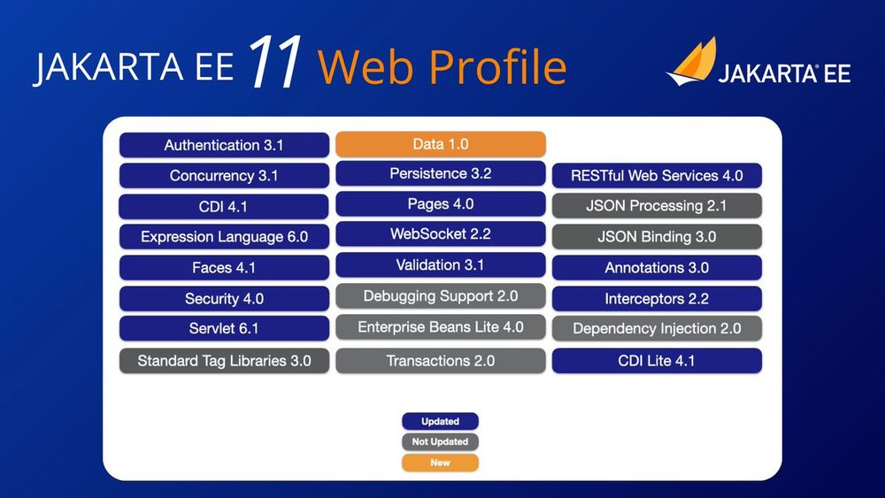
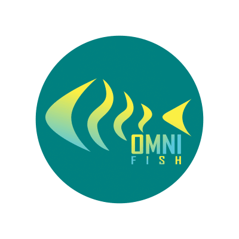

The **Jakarta EE 11 Web Profile** has [officially been released](https://www.agilejava.eu/2025/04/06/hashtag-jakarta-ee-275/) on March 30, 2025 --- bringing a cleaner, more modern baseline to the Jakarta EE platform, with strong alignment to recent Java versions, improved modularity, and the removal of legacy specifications.

Although it comes later than planned, due to unexpected challenges in refactoring the Jakarta EE TCK (compatibility kit), this release marks a key shift toward a more cloud-native, developer-focused platform --- and we're proud to say that **Eclipse GlassFish** was the **first implementation to pass the Jakarta EE 11 Web Profile TCK** and enable the specification's final approval.

### Key Technical Changes in Jakarta EE 11 Web Profile

Jakarta EE 11 Web Profile delivers an updated and streamlined set of specifications designed for lightweight, server-side Java applications. Major technical highlights include:

* **Modern Java compatibility**: Baseline raised to support newer Java LTS versions, including records (Java 17 supported, Java 21 recommended)
* **CDI as a central integration model**: Even deeper CDI integration across multiple specs
* **Jakarta Data 1.0**: A new spec in Jakarta EE; sets the stage for data access innovation
* Several specifications updated:
  * [Persistence 3.2](https://jakarta.ee/specifications/persistence/3.2/) -- Java SE Records as embeddable classes, more functions in queries, Instant and Year support for date/time fields, and many more
  * [Concurrency 3.1](https://jakarta.ee/specifications/concurrency/3.1/) -- Support for Java Virtual Threads and Flow API
  * [Jakarta Security 4.0](https://jakarta.ee/specifications/security/4.0/) -- Choosing from multiple authentication mechanisms, In-memory identity store (for testing)
  * [Expression Language 6.0](https://jakarta.ee/specifications/expression-language/6.0/) -- Support Java Records and Optional, new `length` property for arrays
  * And many others, with bigger or smaller changes (see the table below)
* **Deprecation cleanup**: Removal of some EJB features, JAXB support, and Jakarta Faces Managed Beans

 [Full specification list for Jakarta EE 11 Web Profile](https://jakarta.ee/specifications/webprofile/11/jakarta-webprofile-spec-11.0#web-profile-definition)

### GlassFish: The first compatible implementation for Jakarta EE 11 Web Profile

**GlassFish** , maintained in the [Eclipse EE4J top-level project](https://github.com/eclipse-ee4j/glassfish), was the ratifying **compatible implementation (CI)** used to verify the **Jakarta EE 11 Web Profile TCK** and ensure compliance.

As the **first runtime to pass the full TCK**, GlassFish played a critical role in finalizing the Jakarta EE 11 Web Profile specification:

*  **Full TCK compliance** for [Jakarta EE 11 Web Profile](https://jakarta.ee/specifications/webprofile/11/)
*  Used to **ratify and validate** the Jakarta EE 11 Web Profile specifications on both [Java 17](https://repo1.maven.org/maven2/org/glassfish/main/distributions/web/8.0.0-JDK17-M10/web-8.0.0-JDK17-M10.zip) and [Java 21](https://repo1.maven.org/maven2/org/glassfish/main/distributions/web/8.0.0-M10/web-8.0.0-M10.zip)
*  Delivered support for updated APIs across multiple layers of the runtime, even [beyond the scenarios](https://github.com/eclipse-ee4j/glassfish/issues?q=is%3Aissue%20state%3Aclosed%20label%3A8.0) covered by the TCK

### OmniFish Engineering Contributions

The **OmniFish engineering team** was deeply involved in this release cycle --- not only in maintaining and evolving GlassFish, but also in the **Jakarta EE specification process** itself. Our contributions include:

* Contributions across several specifications, including updates in **Jakarta Concurrency** , **Jakarta Faces** , **Jakarta Security**
* Help with refactoring and modularization of the **Jakarta EE TCK**, making it easier to maintain and adopt
* Assist with fixing the refactored TCK tests and passing them against GlassFish
* GlassFish enhancements to ensure compliance, runtime stability, and test coverage

OmniFish remains committed to improving GlassFish and Jakarta EE and to delivering high-quality, open-source runtimes and tools for Jakarta EE developers.

### What's Coming: GlassFish 8

The team at OmniFish is now working on the **final release of GlassFish 8**, which will build on the Jakarta EE 11 foundation, will support the whole Jakarta EE 11 Platform when it's ready, and will introduce several other enhancements and new features:

* **Jakarta Data Implementation**   
  A brand-new implementation of [Jakarta Data](https://jakarta.ee/specifications/data/1.0/) that works with Jakarta Persistence (JPA) entities, supporting repository-style data access and method-based queries.
* **Jakarta NoSQL Integration**   
  Support for [Jakarta NoSQL](https://jakarta.ee/specifications/nosql/1.0/), enabling integration with document, key-value, column, and graph databases. With this, GlassFish 8 will also support Jakarta Data repositories over Jakarta NoSQL entities
* **MicroProfile Health Support**   
  Adds MicroProfile Health endpoints for readiness and liveness probes --- a must for production deployments in Kubernetes or other cloud-native environments. This feature is already prepared and in the [roadmap for GlassFish 7.1](https://github.com/eclipse-ee4j/glassfish/discussions/25225), so GlassFish 8.0 will mainly inherit it from GlassFish 7 and update it for Jakarta EE 11.
* Support for MicroProfile APIs in **Embedded GlassFish**   
  Adds support for all MicroProfile APIs supported by GlassFish server (running on Java 17+) to Embedded GlassFish. This might also already happen in GlassFish 7.1, which will drop support for Java 11 and allow integration of MicroProfile components, which require Java 17.

You can follow the Eclipse GlassFish project via the channels listed at our [GlassFish Community page](https://omnifish.ee/glassfish-community/), join discussions in the [GlassFish project discussion forum](https://github.com/eclipse-ee4j/glassfish/discussions) or in the [Jakarta EE channels](https://jakarta.ee/connect/) (e.g. Slack or the Community mailing list).

More information:

* [Announcement about Jakarta EE 11 Web Profile](https://www.agilejava.eu/2025/04/06/hashtag-jakarta-ee-275/) (by Ivar Grimstad)
* [Boost Performance and Developer Productivity with Jakarta EE 11](https://omnifish.ee/boost-performance-and-developer-productivity-world-congress-slides/) (slides by Arjan Tijms)
* [Celebrating Jakarta EE 11 Release - JakartaOne 2024](https://www.youtube.com/watch?v=afINxedHt0o) (video at Jakarta EE channel)
* [The New Era of Jakarta EE 11 Exploring the Highlights!](https://www.youtube.com/watch?v=TGBuZCHX2Hw) (video by Emily Jiang)
* [GlassFish is rolling forward. What's New?](https://omnifish.ee/glassfish-is-rolling-forward-whats-new/) (at OmniFish blog)

> This article was originally published on the [OmniFish blog](https://omnifish.ee/2022/06/29/the-future-of-ejb/). For more information about Jakarta EE, Eclipse GlassFish and related topics, subscribe to the OmniFish blog here: [https://omnifish.ee/blog/](https://omnifish.ee/jakarta-ee-11-web-profile-released-enabled-by-eclipse-glassfish/).

<figure class="alignleft size-full is-resized">
 
</figure>

## [OmniFish - Jakarta EE experts](https://omnifish.ee)

* Enterprise Support For Eclipse GlassFish
* Jakarta EE Support: Payara Community, Piranha, Quarkus
* Jakarta EE Consulting, Training \& Development

For more information about OmniFish, ask them via their [contact page](https://omnifish.ee/contact-us/), [X/Twitter](https://twitter.com/OmniFishEE) or [LinkedIn](https://www.linkedin.com/company/omnifish).
