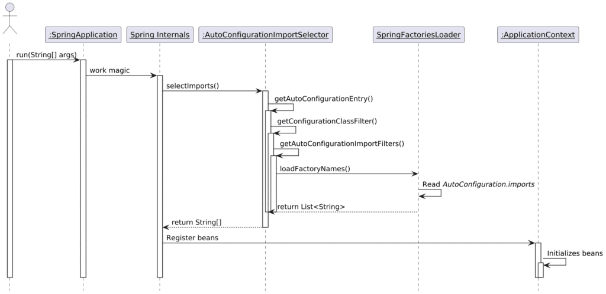
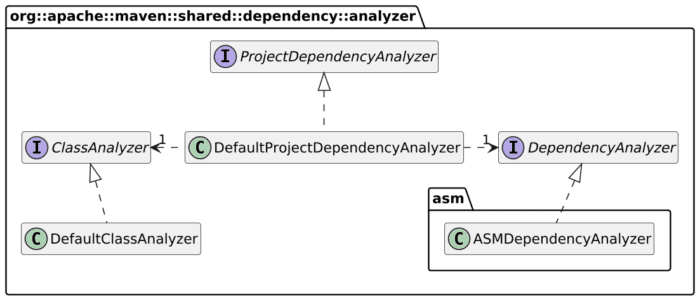

Recently, my good friend Richard Fichtner advised using the `mvn dependency:analyze` command to get rid of declared but unused dependencies:
> There is another use case for
>
> `mvn dependency:analyze`
>
> It can show you the dependencies you use in your code but have not declared in your pom.xml. This works because you have a transitive dependency on your classpath. Either don't use the dependency or declare it.
>
> [](https://bsky.app/profile/did:plc:cc2k5egfzqpf3nbjrs5xox4r/post/3lcxfnsc2h62m?ref_src=embed)
>
> --- [Richard Fichtner 💻☕ @richard.fichtner.dev](https://bsky.app/profile/did:plc:cc2k5egfzqpf3nbjrs5xox4r?ref_src=embed)  
> [December 10, 2024 at 2:00 PM](https://bsky.app/profile/did:plc:cc2k5egfzqpf3nbjrs5xox4r/post/3lcxfnsc2h62m?ref_src=embed)

While it was a great idea years ago, it's dangerous advice today. In this post, I'd like to explain what the plugin does and why you shouldn't use it but in the most straightforward projects.

## The `mvn dependency:analyze` command

Maven uses a plugin architecture; in the above command, the plugin is [maven-dependency-plugin](https://github.com/apache/maven-dependency-plugin). A plugin hosts several related *goals* . Here, it's `analyze`.
> Analyzes the dependencies of this project and determines which are: used and declared; used and undeclared; unused and declared. This goal is intended to be used standalone, thus it always executes the `test-compile` phase - use the` dependency:analyze-only` goal instead when participating in the build lifecycle.
>
> By default, `maven-dependency-analyzer` is used to perform the analysis, with limitations due to the fact that it works at bytecode level, but any analyzer can be plugged in through `analyzer` parameter.
>
> -- [dependency:analyze](https://maven.apache.org/plugins/maven-dependency-plugin/analyze-mojo.html)

`maven-dependency-analyzer` is a shared Maven component. Its description is quite descriptive:
> Analyzes the dependencies of a project for undeclared or unused artifacts.
>
> *Warning*: Because analysis is done on the bytecode rather than the source, some cases are not detected including constants, annotations with source-only retention, and links in Javadoc. This can lead to incorrect results when these are the only uses of a dependency.
>
> The main component is `ProjectDependencyAnalyzer`, which uses `ClassAnalyzer` and `DependencyAnalyzer`.
>
> -- [maven-dependency-analyzer](https://maven.apache.org/shared/maven-dependency-analyzer/)

The warning clearly shows that it works at the *bytecode* level. In particular, it explicitly mentions that it doesn't consider source-level annotations.

## Spring Boot starters

I described how to [design your own](https://blog.frankel.ch/designing-your-own-spring-boot-starter/1/) [Spring Boot starter](https://blog.frankel.ch/designing-your-own-spring-boot-starter/2/) a long time ago, and it didn't change a lot since then. If you're new to Spring Boot starters, here's a summary.

SpringBoot relies on AutoConfiguration classes. AutoConfiguration classes are regular configuration classes, *i.e.*, they contribute to the application classes. You can set specific activation criteria, such as the presence of a Spring property, but these are not specific to auto-configuration.

Here's a very simplified flow:



The JAR that automatically comes with Spring Boot is `org.springframework.boot:spring-boot-autoconfigure`. You can check the content of its `META-INF/spring/org.springframework.boot.autoconfigure.AutoConfiguration.imports`:

```
...
org.springframework.boot.autoconfigure.web.client.RestClientAutoConfiguration
org.springframework.boot.autoconfigure.web.client.RestTemplateAutoConfiguration
org.springframework.boot.autoconfigure.web.embedded.EmbeddedWebServerFactoryCustomizerAutoConfiguration
org.springframework.boot.autoconfigure.web.reactive.HttpHandlerAutoConfiguration
org.springframework.boot.autoconfigure.web.reactive.ReactiveMultipartAutoConfiguration
org.springframework.boot.autoconfigure.web.reactive.ReactiveWebServerFactoryAutoConfiguration
org.springframework.boot.autoconfigure.web.reactive.WebFluxAutoConfiguration
org.springframework.boot.autoconfigure.web.reactive.WebSessionIdResolverAutoConfiguration
org.springframework.boot.autoconfigure.web.reactive.error.ErrorWebFluxAutoConfiguration
org.springframework.boot.autoconfigure.web.reactive.function.client.ClientHttpConnectorAutoConfiguration
org.springframework.boot.autoconfigure.web.reactive.function.client.WebClientAutoConfiguration
org.springframework.boot.autoconfigure.web.servlet.DispatcherServletAutoConfiguration
org.springframework.boot.autoconfigure.web.servlet.ServletWebServerFactoryAutoConfiguration
org.springframework.boot.autoconfigure.web.servlet.error.ErrorMvcAutoConfiguration
org.springframework.boot.autoconfigure.web.servlet.HttpEncodingAutoConfiguration
org.springframework.boot.autoconfigure.web.servlet.MultipartAutoConfiguration
org.springframework.boot.autoconfigure.web.servlet.WebMvcAutoConfiguration
org.springframework.boot.autoconfigure.websocket.reactive.WebSocketReactiveAutoConfiguration
org.springframework.boot.autoconfigure.websocket.servlet.WebSocketServletAutoConfiguration
org.springframework.boot.autoconfigure.websocket.servlet.WebSocketMessagingAutoConfiguration
org.springframework.boot.autoconfigure.webservices.WebServicesAutoConfiguration
org.springframework.boot.autoconfigure.webservices.client.WebServiceTemplateAutoConfiguration
```

As an example, here's the `RestClientAutoConfiguration`:

```java
@AutoConfiguration(after = { HttpClientAutoConfiguration.class, HttpMessageConvertersAutoConfiguration.class }) //1
@ConditionalOnClass(RestTemplate.class)                //2
@Conditional(NotReactiveWebApplicationCondition.class) //3
public class RestTemplateAutoConfiguration {

    // Class body
}
```

1. Set the order of auto-configuration classes
2. Activate if the `RestTemplate` class is on the classpath
3. Activate if we aren't in a reactive web app context

Note that the class loader loads the `RestTemplateAutoConfiguration` class just fine, *regardless of whether the `RestTemplate` class is on the classpath or not* ! Spring leverages this mechanism to its fullest, as seen above. In effect, the resolution of classes configured in annotations is deferred until they are *explicitly* accessed.

## Bringing the `maven-dependency-analyzer` into the modern age

Committers designed the analyzer in 2007: [here's](https://github.com/apache/maven-dependency-analyzer/tree/b448d95daba17db67bc071eab9a1dd2457b77cab) how it looked like then. Spring Boot started later, in 2010. For this reason, the analyzer didn't take deferred class loading in annotations. Note that this is still not the case; the project doesn't get a lot of love.

When using the plugin on a Spring Boot project, you'll get a lot of false positives. I tried it with a simple Spring Boot project, using WebFlux and R2DBC on PostgreSQL.

Here's a slight excerpt of the output when I run `mvn analyze:dependencies`:

```
[WARNING] Unused declared dependencies found:
[WARNING]   org.springframework.boot:spring-boot-starter-data-r2dbc:jar:3.4.0:compile
[WARNING]   org.testcontainers:postgresql:jar:1.20.4:test
[WARNING]   org.testcontainers:r2dbc:jar:1.20.4:test
```

If I remove any of these dependencies, tests don't run.

What would be necessary to make the analyzer work with Spring Boot projects?  

Let's analyze the analyzer.



The plugin allows configuring another analyzer:
>
> 
>
> Specify the project dependency analyzer to use (plexus component role-hint). By default, maven-dependency-analyzer is used. To use this, you must declare a dependency for this plugin that contains the code for the analyzer. The analyzer must have a declared Plexus role name, and you specify the role name here.
>
> * **Type** : `java.lang.String`
> * **Since** : `2.2`
> * **Required** : `No`
> * **User Property** : `analyzer`
> * **Default** : `default`
>
> -- [dependency:analyze](https://maven.apache.org/plugins/maven-dependency-plugin/analyze-mojo.html#analyzer)

We can create an overall analyzer that reuses the above but adds one specific to Spring Boot.

## Conclusion

The current state of the Maven analyzer doesn't offer any benefit to modern Spring Boot projects. The existing code is open to configuration and even extension. However, we would need to embed a lot of Spring Boot logic. For Quarkus and Micronaut projects, we would require dedicated code as well.

I don't know if it's worth the time and effort. If you think it is, I hope this blog post can serve as an early-stage analysis.

**To go further:**

* [dependency:analyze](https://maven.apache.org/plugins/maven-dependency-plugin/analyze-mojo.html)
* [Maven Dependency Analyzer](https://maven.apache.org/shared/maven-dependency-analyzer/)
* [Designing your own Spring Boot starter -- part 1](https://blog.frankel.ch/designing-your-own-spring-boot-starter/1/)
* [Designing your own Spring Boot starter -- part 2](https://blog.frankel.ch/designing-your-own-spring-boot-starter/2/)

*Originally published at [A Java Geek](https://blog.frankel.ch/maven-dependency-analyze/) on March 9^th^, 2025*
