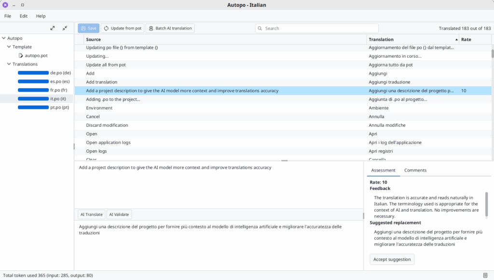

As a developer today, you've almost certainly encountered the need of localizing your application or website. While setting up your project for internationalization is usually straightforward, managing translations over time can become a complex, time consuming and costly task, especially for open source projects.

Fortunately, machine translation have come a long way. It's not perfect, but with the right context, modern AI can deliver surprisingly accurate results.

In this article , I'll walk you through the journey that led me to create [Autopo](https://autopo.ooo "Autopo"), a free and [open source](https://github.com/soberlemur/autopo/) JavaFX desktop tool for managing `.po` files and with AI-powered features to translate and validate `.po` entries.

## Discovering localization

I started [PDFsam](https://pdfsam.org "PDFsam") back in 2006, when SourceForge was still cool and my company was just moving from CVS to SVN. I was a junior developer, fresh out of university, eager to build something of my own. PDFsam seemed like the perfect project to experiment with technologies I couldn't use at work.

At the time, terms like i18n (internationalization) and l10n (localization) were completely unknown to me and the idea of translating my newly born application wasn't on my radar.

At some point PDFsam gained a bit of traction abroad and it became clear that it needed to be translated into other languages.

### Gettext

> *a set of tools that provides a framework to help other GNU packages produce multi-lingual messages*.

[Gettext](https://www.gnu.org/software/gettext/ "Gettext") and its utilities seemed like the obvious choice. It uses `.pot` template files and `.po` translation files. It's not native to Java but you can easily convert `.po` files into `.properties` files and load them through Java's `ResourceBundle` mechanism. It is a widely adopted solution across multiple programming languages. There's even a Maven plugin that can automate `.po` to `.properties` conversion during the build process.

For the actual translation work there's, among the others, a convenient desktop application called [POEdit](https://poedit.net/ "POEdit"), which allows users to open `.po` files and translate entries easily.

## Building a localization workflow

Over time, I standardized my approach to applications localization. In my projects I always create a dedicated module, usually named `project-i18n`, where I store all `.po` files. Maven is configured to automatically generate `.properties` files from these `.po` files during the build process.

```xml
<plugin>
    <groupId>com.googlecode.gettext-commons</groupId>
    <artifactId>gettext-maven-plugin</artifactId>
    <version>1.2.4</version>
    <configuration>
        <keysFile>autopo.pot</keysFile>
        <poDirectory>po</poDirectory>
        <targetBundle>ooo.autopo.i18n.Messages</targetBundle>
        <outputFormat>properties</outputFormat>
    </configuration>
    <executions>
        <execution>
            <id>gettext-dist</id>
            <phase>generate-resources</phase>
            <goals>
                <goal>dist</goal>
            </goals>
        </execution>
    </executions>
</plugin>
```

I also add a [singleton class](https://github.com/soberlemur/autopo/blob/master/autopo-i18n/src/main/java/ooo/autopo/i18n/I18nContext.java) that provides methods to set the application's locale and to retrieve localized strings.

I use English text as the keys in the `.po` files (and, in turn, in the resource bundles) instead of technical identifiers like `this.key`. The methods in `I18nContext` that return localized strings fall back to the key if the localized version is not found. This approach ensures that if a translation is missing, the application gracefully falls back to displaying the English text, improving the user experience even in partially translated interfaces.

To keep the translation templates up to date, I use a simple script that uses gettext to extract all translatable strings from the Java source code and update the `.pot` template file whenever new strings are added or existing ones are changed:

```bash
#!/bin/sh
xgettext -ktr -L Java -o po/autopo.pot --copyright-holder='Your copyright info' <a href="/cdn-cgi/l/email-protection" class="__cf_email__" data-cfemail="fad7d797899d939ed7988f9d89d79b9e9e889f8989c7979fba9f829b978a969fd4999597">[email protected]</a> --no-location $(find ../ -name "*.java" -not -path "*/.idea/*" -not -name "*Test.java") –from-code=UTF-8
```

## Introducing Zanata

With this setup in place, I needed an interface to simplify the translation process:

* to make it easy for translators to work on `.po` files,
* to synchronize `.po` files with the `.pot` template,
* and to get a clear overview of the translation status across all languages.

At that time, I discovered [Zanata](https://zanata.org/), an open source translation server developed by Red Hat. It fit my needs perfectly: I could hire translators and point them to Zanata's web interface, while keeping track of progress in real time. For a while, the setup worked well, but there were challenges that became more and more problematic over time.

## Pain points with Zanata

Several issues emerged during my experience with Zanata:

1. **Context Matters:** Conveying the meaning and context of strings to translators was often difficult, especially when dealing with domain specific content like PDF terminology.
2. **Cost:** Hiring professional translators was expensive, particularly for an open source project.
3. **Quality Control:** For languages I didn't speak, I had little to no control over the quality of the translations.
4. **Small Updates:** While adding a new language justified hiring a translator, making minor changes, like adding two or three new sentences, was cumbersome and inefficient.
5. **Abandonment:** Most critically, Zanata itself was no longer actively maintained. I recall reading about the events that lead to Zanata become abandonware, and although the server still functioned, it was clear that the clock was ticking.

### Pain points gradually became real blockers

Point 4 led me to rely on Google Translate almost every time a few strings were added. This was a repetitive and time consuming task, especially when maintaining translations across five, ten or even twenty languages.

Point 5 eventually escalated: Zanata's server became unavailable for several months, with no one left to contact to at least restart the service.

In the end it was clear that I needed a new workflow.

## The Side Project

At first, I looked for a replacement for Zanata, a web based service offering similar functionality, ideally simple and not too expensive. I found a few options: some were free for opensource projects, others free if self hosted, most were available through paid subscription plans.

Paying a monthly fee just to store a few `.po` files in the cloud and occasionally update a couple of strings didn't feel right to me. I explored self hosting solutions, but I quickly became frustrated with endless documentation to read, Kubernetes workloads to spin and Redis caches to configure, all to end up with interfaces where simplicity suffered death by a thousand UI elements.

That's when I had my epiphany: **side project**.

My `.po` files were already safe and versioned in my Git repositories. All I really needed was a simple interface, something like POEdit with just the features I needed. It would be written in JavaFX, because that's what I like and know, and it would include some AI features to automate some manual task. Not the "AI-powered juice maker" kind of gimmick, but something genuinely useful. And translation, as it turns out, is one of the fields where AI has gotten *really* good.

How long could it take? Two weeks, three tops.

**Spoiler alert: it didn't.**

## From side project to pet project

Once the side project seed started to take root and sprout, a few other factors pushed me further down this path. The first was [a post on BluSky](https://bsky.app/profile/dlemmermann.bsky.social/post/3lijlscz42c2t) by Dirk Lemmermann, where he praised **AtlantaFX** for styling JavaFX applications. I thought, "Nice, I want to try that," and what better opportunity than a side project to experiment with it?

The second was **Langchain4j**, which I think I first heard about at JCON 2024 in Cologne. I was eager to find an excuse to dive into it and see if I could integrate it into my projects.

The third was a discovery on GitHub: [jgettext](https://github.com/zanata/jgettext), a simple library used by Zanata to handle `.po` and `.pot` files. I'd been using Zanata for years with no complaints so I already knew jgettext was good enough for me.

Finally, during a conversation with my wife, we came up with the name **Autopo** .... and you know how it goes, once you name it, it's yours. The side project had become a pet project, and I was already getting attached to it.

### Requirements

Since I was building **Autopo** from scratch, I wanted to tailor it to fit my needs. Here are the key features I absolutely wanted to include:

1. **Simplicity**: It needed to be simple, without features that were added "because you never know".
2. **Translation** **s** **tatus** **o** **verview**: I wanted a clear view of the translation status for the entire project, so I could easily see what was done and what was not.
3. **Translation** **a** **dditions**: The tool should allow me to add new translations.
4. **One-Click** **u** **pdates** : I should be able to update all the translation files from the selected `.pot` template file with a single click.
5. **Manual \& AI Translation**: It needed to support both manual translation and AI-powered translation.
6. **Context for AI Translation**: The ability to provide a project description to give the AI model as much context as possible. This turned out to be very important for improving the accuracy of the AI-generated translations and assessment.
7. **Consistency Checks**: Just like POEdit, I wanted to include consistency checks (e.g., punctuation, case consistency, etc.).
8. **Multiple AI Providers**: The ability to configure and use multiple AI translation providers.
9. **Batch Translation \& Evaluation**: I wanted to be able to translate and assess translations for multiple entries, or even the entire file, with just few clicks.

## Building the Pet

**Autopo** is a JavaFX application that took around ten weeks to finalize. It was fun to build it, I learned a few new things and it turned out to be more useful than I initially expected.

### From jgettext to Potentilla

The first step was to ensure that **jgettext** could handle everything I needed for working with `.po` and `.pot` files. Like Zanata itself, jgettext had also been abandoned, so I decided to fork it.  

I cleaned up the code, updated dependencies and test libraries, added a few unit tests and utility methods I needed and made it modular adding a `module-info.java`. The result is [**Potentilla**](https://github.com/soberlemur/potentilla), a library I published to Maven Central.

### AtlantaFX

[**AtlantaFX**](https://github.com/mkpaz/atlantafx) turned out to be a very pleasant discovery. It offers a collection of modern themes that can be applied as *user agent stylesheets* (a sheet providing default styling for all UI elements of the application).  

AtlantaFX also includes a set of custom controls and a nice showcase application where you can preview the available themes and components in action.

### The AI Role

AI integration was a key requirement from the start, and the idea of validating translations using a different AI provider or model felt like a smart way to assess quality.  
[Langchain4j](https://github.com/langchain4j/langchain4j) turned out to be both comprehensive and easy to work with. My use case is probably among the simplest, no chat streaming, no RAG, no tool chaining, but the documentation was concise and clear, and integrating it into Autopo was straightforward.

With just a few lines of code and the help of [Langchain4j's AI Services](https://docs.langchain4j.dev/tutorials/ai-services/), I was able to support multiple AI providers and receive structured outputs as POJOs when needed ([structured outputs guide](https://docs.langchain4j.dev/tutorials/structured-outputs)).

Including a project description as part of the prompt proved crucial during validation, helping the model catch subtle but important issues. In fact, the AI-powered validation was effective at spotting issues even in my existing translations done by humans.

This is how you define an AI service interface using Langchain4j:

```java
public interface TranslationServiceAI {

    @SystemMessage("You are a native {{sourceLanguage}}/{{targetLanguage}} speaker and a professional translator. Your task is to provide translations from {{sourceLanguage}} to {{targetLanguage}}. You will take special care to not add any quotes, punctuation, linefeed or extra symbols and maintain the same case and formatting as the original. Your answer will be automatically processed therefore you need to return the translated text only and nothing more, no comments, no additional quotes, trailing or leading spaces, or full stop just the translation.")
    @UserMessage("Your are translating {{description}}. Translate this: \"{{untranslated}}\"")
    Result<String> translate(@V("sourceLanguage") String sourceLanguage, @V("targetLanguage") String targetLanguage,
            @V("description") String description, @V("untranslated") String untranslated);

    @SystemMessage("You are a professional linguist and translation quality evaluator. Your task is to assess the accuracy, fluency, and naturalness of a translation from {{sourceLanguage}} to {{targetLanguage}}. This is the context of the translation: \"{{description}}\".\nConsider factors such as correctness of meaning, grammar, style, idiomatic expressions, cultural appropriateness, punctuation, and case sensitivity. Pay special attention to terminology and tone relevant to the specified context\n" + "\n" + "Provide a score from 1 to 10, with 10 being a perfect translation. If and only if the score is less than 10, also provide:\n" + "\n" + " 1: Feedback on the translation quality and recommendations for improvement.\n" + "\n" + " 2: A suggested replacement translation that better fits the context.")
    @UserMessage("This is the original text: \"{{untranslated}}\"\n" + "\n" + "This is the translation to evaluate: \"{{translated}}\"")
    Result<TranslationAssessment> assess(@V("sourceLanguage") String sourceLanguage, @V("targetLanguage") String targetLanguage,
            @V("description") String description, @V("untranslated") String untranslated, @V("translated") String translated);

}
```

And this is the implementation using AiServices to perform the call to the AI provider:

```java
@Override
public Result<String> translate(PoFile poFile, PoEntry entry, AIModelDescriptor aiModelDescriptor, String projectDescription) {
    Logger.info("Translating using AI model {}", aiModelDescriptor.name());
    TranslationServiceAI aiService = AiServices.create(TranslationServiceAI.class, aiModelDescriptor.translationModel());

    return aiService.translate(Locale.ENGLISH.getDisplayLanguage(Locale.ENGLISH),
                               poFile.locale().get().getDisplayLanguage(Locale.ENGLISH),
                               projectDescription,
                               entry.untranslatedValue().getValue());

}

@Override
public Result<TranslationAssessment> assess(PoFile poFile, PoEntry entry, AIModelDescriptor aiModelDescriptor, String projectDescription) {
    Logger.info("Assessing translation using AI model {}", aiModelDescriptor.name());
    TranslationServiceAI aiService = AiServices.create(TranslationServiceAI.class, aiModelDescriptor.validationModel());

    return aiService.assess(Locale.ENGLISH.getDisplayLanguage(Locale.ENGLISH),
                            poFile.locale().get().getDisplayLanguage(Locale.ENGLISH),
                            projectDescription,
                            entry.untranslatedValue().getValue(),
                            entry.translatedValue().getValue());

}
```

## Autopo in Action

After all the talk, it's finally time to show Autopo at work. The interface displays the list of `.po` files in the opened project along with their translation progress. While it looks simple, it covers all the requirements I initially set and even adds a few extras.


You can search and edit entries, translate them manually or use AI for both single and batch translations. The same applies to validation: you can run it on a single entry or an entire file. You can update `.po` files from the `.pot` template, either individually or for the entire project.

Over the past few weeks, I've used Autopo to:

* Translate Autopo itself into four or five languages
* Add new locales to the PDFsam website
* Add new locales to PDFsam Visual
* Finalize and refine some PDFsam Basic translations
* Run all the translations through the AI-powered validation step

That last step was a bit of a surprise. The validation process caught several issues and inaccuracies in human made translations.

## **Takeaways**

* **JavaFX is** ****alive and kicking**** **:** things move so make sure to follow the mailing list for updates, bug fixes and new features.
* **AtlantaFX is** **great**: with just a few lines of code, your app can have a professional look, and you won't have to worry about CSS headaches. Kudos to the maintainers!
* **Langchain4j is** **very** **easy to use**: it's still in beta and few things may change between releases, but it's definitely usable and developer friendly.
* **AI translations are not perfect but very good** : providing project context is very important to get accurate translations and to get an accurate feedback during the AI translation assessment.
* **Human oversight** **is still** **essential**.
* **AI can be a bit too chatty**: It sometimes seems to answer for the sake of answering, even when a short response would work. This results in overly long answers and, at times, repetitive corrections. You may find it going back and forth with the same suggestions.
