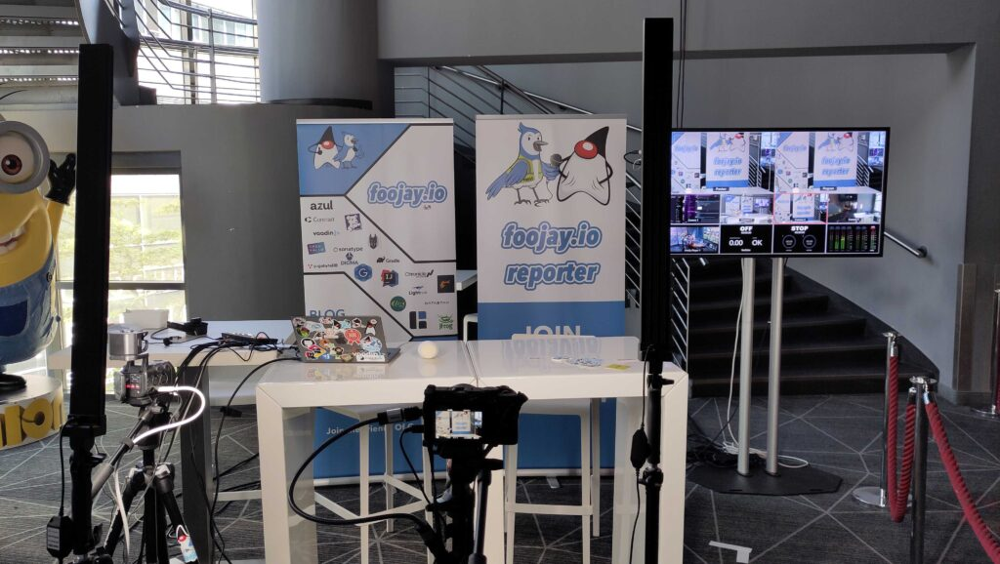
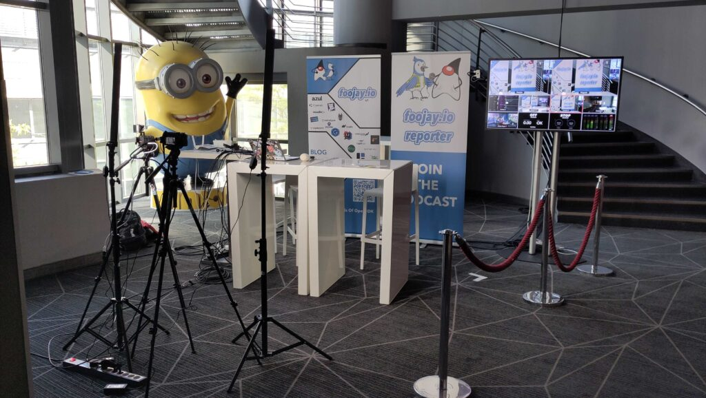
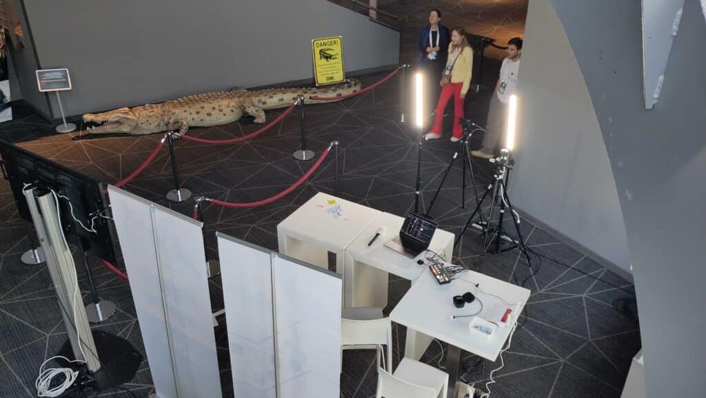

Today and tomorrow, we will be at the JCON Conference in Köln, Germany. We have set up an interview booth to talk to speakers and visitors about all things Java.

Please follow us on [LinkedIn](https://www.linkedin.com/company/foojayio/) and/or [YouTube](https://www.youtube.com/@foojayio) for the live interviews.

Just like last year, these interviews will be grouped into podcast episodes, so stay tuned for more Java knowledge sharing!

<figure class="wp-block-gallery has-nested-images columns-default is-cropped wp-block-gallery-1 is-layout-flex wp-block-gallery-is-layout-flex">
 <figure class="wp-block-image size-large">
  
 </figure>
 <figure class="wp-block-image size-large">
  
 </figure>
 <figure class="wp-block-image size-large">
  
 </figure>
</figure>


