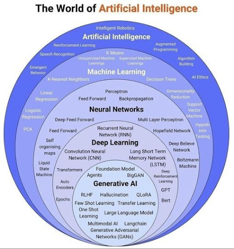
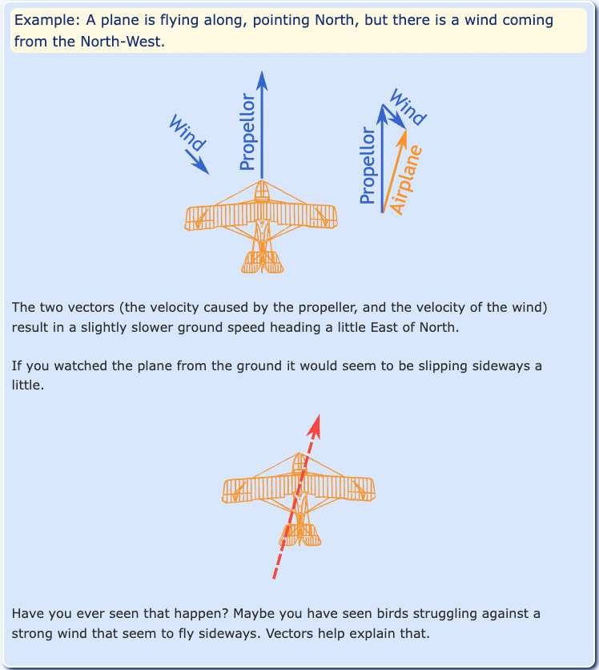
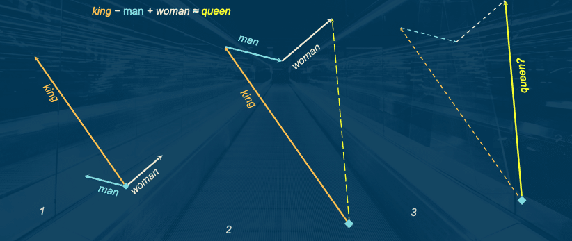
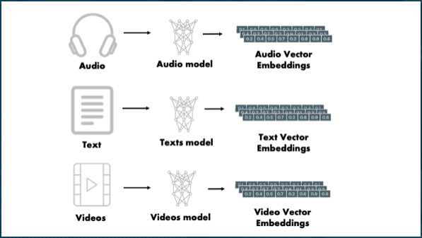
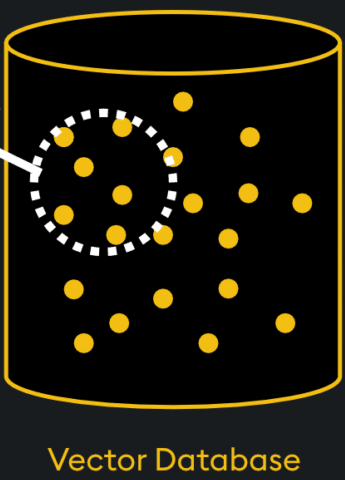
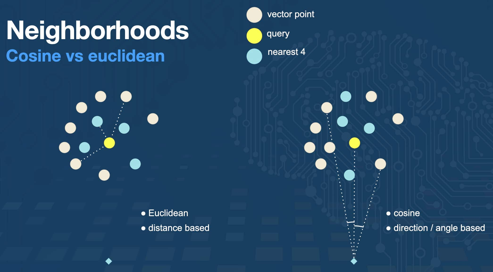

Retrieval Augmented Generation (RAG) may sound complex, but it accurately represents the process of the system. RAG is a method that enhances the capabilities of Large Language Models (LLMs) by integrating them with external knowledge sources.

Each term represents a piece of the puzzle:

* Retrieval - data retrieved from some external source outside the LLM (most often a database, but can include files, webpages, etc)
* Augmented - "augmenting" (or adding to) an LLM's training data. This could include recent or private information that it did not have access to during its training period. Most often, this is done by adding the data to the prompt (or input) to the LLM.
* Generation - this is where LLMs are exceptional. They generate a response (text, image, video, etc) that is similar to the data being provided in the input. This is generated from probabilities, so cannot guarantee 100% consistency.

Instead of relying solely on the model's internal training data, RAG retrieves relevant information from databases or document collections to ground its responses in factual and up-to-date content. This approach not only improves the accuracy and reliability of the generated outputs but also allows the system to adapt to specific contexts or domains, making it a powerful tool for many personal and professional applications.

In this post, we will define each component and how it works together in a RAG system.

## Why RAG?

Retrieval augmented generation (RAG) solves a few different problems in the technical space.

1. It provides a way to dynamically add data/information to (augment) an LLM's knowledge, improving relevance and accuracy in answers.
2. It provides searchable access for all types of data storage - database types, text, images, audio, video, webpages, etc.
3. It allows technical experts to guide or limit the AI with defined tools, high-quality data, rules, business logic, and more. This increases accuracy and reduces risk of the system.

## Large Language Models (LLMs)

Part of the Generative AI field, Large Language Models (LLMs) are advanced AI systems designed to generate content by predicting the probabilities of sequences within their input data. They excel at understanding context and producing coherent outputs, making them versatile tools for a wide range of applications.

However, they also have limitations. LLMs generate responses on probabilities, leaving room for inconsistency or uncertainty, especially when there are multiple potential answers and no high probability for any of the options.

These models can process various types of input/output (modalities), but their performance is constrained by the size of their context windows - the amount of information they can consider at once - and the quality of the prompts provided.

**Note:** Each Large Language Model (LLM) is trained slightly differently to prioritize certain probabilities over others to optimize for certain goals. This is why every LLM may produce different outputs for the same input and why you should evaluate different models and research which ones might be pre-optimized for your needs.

There are a variety of reasons that Large Language Models tend to hallucinate (or produce inaccurate, non-sensical answers). A few of those include the following:

* Searching for answers related to recent or private data that the LLM has not been trained on or has access to.
* The prompt (input) traverses gaps or limits in the LLMs "knowledge" pathways, getting stuck or not enough next thoughts to generate.
* The LLM does not have enough context (background information) to guide its answer towards a specific path (too much uncertainty in the input's meaning).

How do we improve these weaknesses by providing context to the LLM?

## Vector embeddings

A [vector is a mathematical concept](https://www.mathsisfun.com/algebra/vectors.html) representing a line that has a size (magnitude) and direction. This numeric representation allows us to make calculations and comparisons to explain forces in physics. In the real world, we use vectors for a couple of relatable use cases.

**1. Airplane flight paths in 3-dimensional space.** If you think about a flight path, there may be landmark features along it such as buildings, rivers, and airspaces (military, city, or airport restriction areas). Planes also need to take external factors into account, such as wind and storms. Not only do they need a representation of where they are in the air, they need to be able to calculate changes to that flight path due to obstacles or real-time airspace restrictions. They do this by creating a numeric representation (vector) of that path and calculating with other vectors for winds, weather areas, and more.

**2. Trajectories of rockets in multi-dimensional space.** Similar to the airplane example, but outer space deals in multi-dimensional space and more lethal "features" (obstacles) along a path like black holes, asteroid belts, and planets. Scientists would need to calculate vector routes to avoid passing through planets and avoid gravitational pulls from celestial bodies.

We represent the paths by creating numeric representations based upon key, defined features that characterize the path (vector). Then, we can use those paths to make calculations and precise adjustments based on external factors.

### Vectors applied to words

In 2013, [Google applied this mathmatical concept to words](https://code.google.com/archive/p/word2vec/) (word2vec), creating numeric representations of words based on how they functioned within the language and defining characteristics. Word embeddings map words into a continuous vector space where semantically similar words are closer together. For instance, the words "king" and "queen" might have embeddings that are close in this space, reflecting their related meanings around power, leadership, luxurious living, and wealth.

This ability allowed humans to represent words for comparing similarity of words or understanding new words from proximity to known words. Broader searches and synonym lists based on "semantic" meaning could be factored into the calculations, which are foundational for many natural language processing tasks.

### Vectors applied to data

We took this one step further in the last few years to apply this to any type of data (text, image, video, audio, etc). Vector embeddings are numerical representations of data that capture semantic meaning in a way that makes it easier to compare and analyze.

When combined with generative AI (GenAI), embeddings enable semantic searches, which go beyond simple keyword matching. Unlike lexical searches that rely on exact word matches, semantic searches use embeddings to understand the meaning behind the query and retrieve results that are contextually relevant. This makes them particularly powerful for applications like document retrieval, where understanding the intent and context of a query is crucial for delivering accurate and meaningful results.

There is a common saying that you can't [compare apples and oranges](https://en.wikipedia.org/wiki/Apples_and_oranges) (because they have two different sets of characteristics). However, with a numeric representation, we actually can now compare them because we have a common format to represent all sorts of objects and data.

Also, a recent article I read compared vectors to a "fingerprint" of the data. Just as a fingerprint is unique to each individual, the vector representation of a piece of data is unique to that specific data point. This uniqueness allows for precise identification and retrieval of information, even in large datasets.

**Note:** Since each LLM is trained slightly differently, the vector embeddings may be different for each model. This means that the same piece of data may have slightly different vector representations with different models (though both will be close together in the vector space). This is important to consider when using multiple LLMs or comparing results across models.

Here enter the need and purpose of [vector databases](https://frankzliu.com/blog/a-gentle-introduction-to-vector-databases), which are optimized to store and search these vector representations. But how do vector databases efficiently search vast amounts of these numbers (think every word in every language or millions of text documents)?

### Similarity search

Similarity search involves finding data records that are most similar to a given query. This is often achieved using techniques like k-Nearest Neighbors (k-NN) or approximate methods like k-ANN for efficiency, where `k` represents the number of most similar results you want returned (i.e. 7, 42, 100).

This might seem overly complex, but let's look at an example to understand the power of these types of searches. Let's think about a library.

In a library today, searching for a new book to read would require picking from the nested category structure of organizing books (e.g. fiction/non-fiction -\> genre -\> author -\> title). If I wanted to read a fantasy novel, my current strategy would be to walk to the fiction area, find the fantasy section, and start pulling books off the shelf to see what sparked my interest. Another alternative would be to do a computer search for keywords and hope that the book is tagged with the topics I'm interested in.

Vectors would allow us to [search for books based on semantics](https://towardsdatascience.com/explaining-vector-databases-in-3-levels-of-difficulty-fc392e48ab78/), finding similarities for specific features that are baked into the vector embedding and returning results in the nearby vector space as our search query.

To measure similarity, cosine similarity and euclidean distance are two of the most common metrics used, though there are others as well. Cosine similarity measures the distance between the angle of the vectors. Remember, vectors are lines with a length and direction, so cosine measures the distance between the two lines in degrees. Euclidean distance is the shortest distance from point-to-point ("as the crow flies" between vector points).

In our library example, we could search for specific features like "dragons and magic" or "based in St. Louis, USA". These criteria are much narrower and much more likely to find a smaller result set that is more relevant to what the user is searching for.

**Note:** Vector embeddings differ for each model, and each vector store also optimizes vector similarity search differently. So even the same data and embeddings stored in different vector stores may produce different results from a similarity search.

## Wrapping up!

In this blog post, we explored a few introductory concepts around Retrieval Augmented Generation (RAG), why it exists and the problems it solves. We also covered some starting GenAI concepts on Large Language Models (LLMs), vectors and embeddings, and vector similarity search. These pieces build the foundations of more complex AI systems and how RAG enhances the capabilities of LLMs by integrating them with external knowledge sources.

In another post, we will explore the different layers of RAG, including vector RAG, graph RAG, and agents.

Whether you're a developer, data scientist, or simply someone interested in the future of AI, understanding AI technologies and how they operate will empower you to make better decisions on how to use them.

Happy coding... [and continue to part 2](https://foojay.io/today/intro-to-rag-foundations-of-retrieval-augmented-generation-part-2/)!

## Resources

* Tutorial: [Vectors - Math is Fun](https://www.mathsisfun.com/algebra/vectors.html)
* Project: [word2vec - Google](https://code.google.com/archive/p/word2vec/)
* Blog post: [Explaining Vector Databases in 3 Levels of Difficulty - Towards Data Science](https://towardsdatascience.com/explaining-vector-databases-in-3-levels-of-difficulty-fc392e48ab78)
