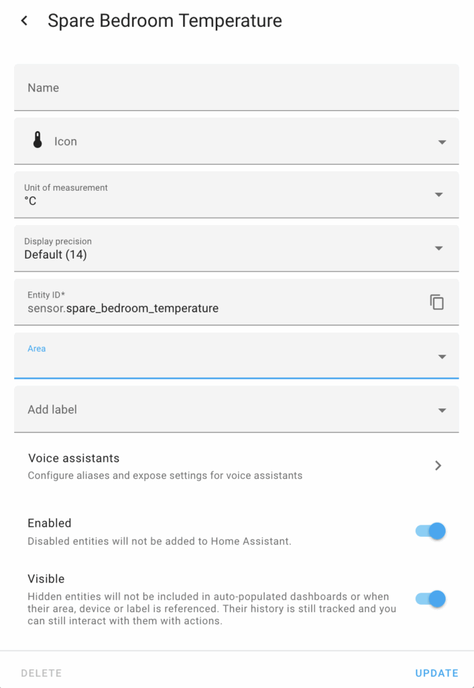
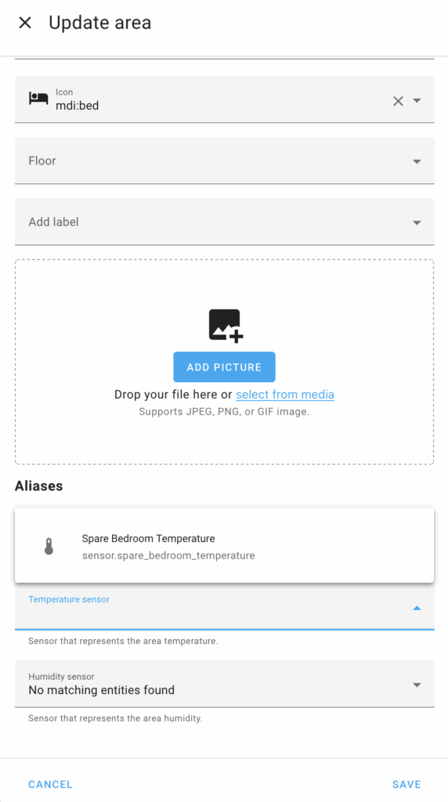
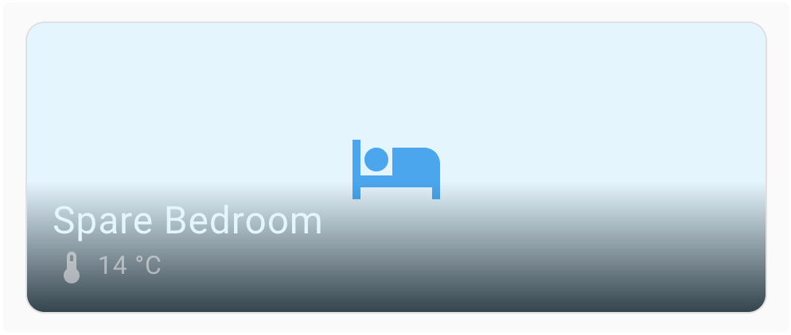

I recently acquired [Netatmo smart radiator valves](https://www.netatmo.com/en-eu/additional-smart-radiator-valve) to manage my rooms' temperature remotely. I'm not skilled at manual tasks, but I could easily replace the old thermo-static valves. I then registered the smart ones in the Netatmo app. Finally, I integrated them in my Home Assistant via the dedicated [Netatmo integration](https://www.home-assistant.io/integrations/netatmo/). Everything was very straightforward.

I noticed that each valve not only allows remote control but also offers a state with several attributes. I wanted to extract the room's temperature indicator from it. It was not as easy as I thought it was, so I want to describe how I managed to achieve it.

* [Why Home Assistant?](https://blog.frankel.ch/home-assistant/1/)
* [The Home Assistant model](https://blog.frankel.ch/home-assistant/2/)
* [Replace Philips Hue automation with Home Assistant's](https://blog.frankel.ch/home-assistant/3/)
* [An example of HACS: Adaptive Lighting](https://blog.frankel.ch/home-assistant/4/)
* [The Home Assistant companion app](https://blog.frankel.ch/home-assistant/5/)
* [Cloudflare Tunnel for Home Assistant](https://blog.frankel.ch/home-assistant/6/)

By default, the Netatmo valve displays a multi-valued state. To check, go to the Developer Tools \> States menu. You can use a filter to find the device.

|                   Entity                    | State |                                                                                                                                                                                                    Attributes                                                                                                                                                                                                    |
|---------------------------------------------|-------|------------------------------------------------------------------------------------------------------------------------------------------------------------------------------------------------------------------------------------------------------------------------------------------------------------------------------------------------------------------------------------------------------------------|
| climate.spare_bedroom + Valve Spare Bedroom | auto  | hvac_modes: auto, heat + min_temp: 7 + max_temp: 30 + target_temp_step: 0.5 + preset_modes: away, boost, frost_guard, schedule + current_temperature: 14 + temperature: 7 + hvac_action: idle + preset_mode: frost_guard + selected_schedule: Unknown 67ab635c2dd1afb1e601a8c2 + heating_power_request: 0 + attribution: Data provided by Netatmo + friendly_name: Valve Spare Bedroom + supported_features: 401 |

The problem is that the above attributes are not readily usable. We must first extract them individually. For this, we need to create a *sensor* ; head to File Editor and select `configuration.yaml`. Then, append the following snippet:

```yaml
template:
  - sensor:
    - unique_id: sensor.spare_bedroom_temperature
      name: "Spare Bedroom Temperature"
      state: "{{ state_attr('climate.spare_bedroom', 'current_temperature') }}" #1
      unit_of_measurement: "°C"
      device_class: temperature                                                 #2
```


1. Match the pair entity-attribute above
2. Must be `temperature` to be used as a temperature sensor afterward

Click on Save.

We don't need to restart Home Assistant, but we must reload the configuration. Click on Developer Tools. Then, click on Check configuration. The new sensor should appear in Settings \> Entities.



We can now set the Area via the UI to one of the existing areas, in this case, the Spare Bedroom.

Finally, we can update the Spare Bedroom area in Settings \> Area \> Spare Bedroom. Set the temperature sensor to the only available item, the sensor we set in the previous steps.



At this point, whenever we add the Area card to a dashboard, Home Assistant displays our newly-created temperature sensor on top of it.



You can use this approach for every State. Check them, and I'm sure you'll get new ideas. For example, every automation has a `last_triggered` timestamp attribute.

**To go further:**

* [Netatmo site](https://www.netatmo.com/en-eu/)
* [Netatmo integration](https://www.home-assistant.io/integrations/netatmo/)
* [Sensor entity](https://developers.home-assistant.io/docs/core/entity/sensor/)


*Originally published at [A Java Geek](https://blog.frankel.ch/home-assistant/7/) on May 18^th^, 2025*
