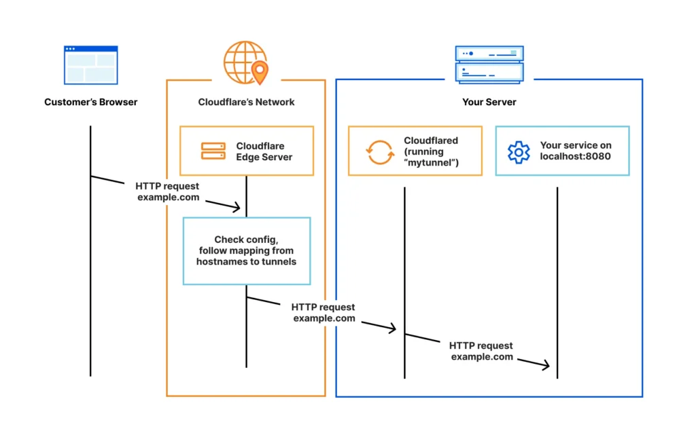
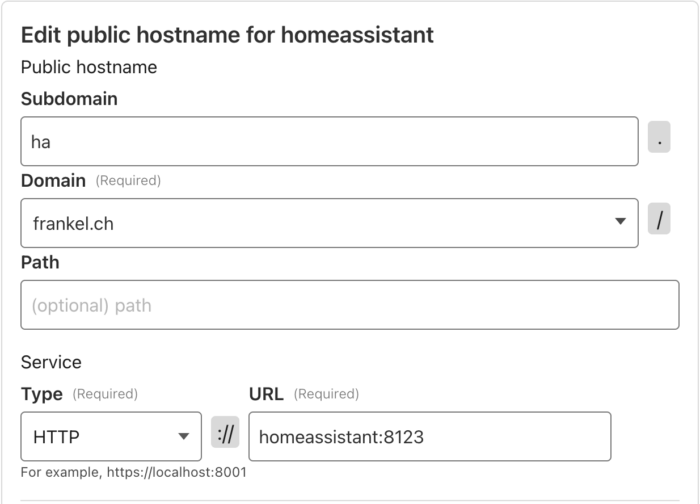

I continue to take care of my Home Assistant. This week, I replaced my original setup with [Cloudflare Tunnel](https://developers.cloudflare.com/cloudflare-one/connections/connect-networks/).

This is the 6^th^ post in the My journey with Home Assistant focus series. Other posts include:

1. [Why Home Assistant?](https://blog.frankel.ch/home-assistant/1/)
2. [The Home Assistant model](https://blog.frankel.ch/home-assistant/2/)
3. [Replace Philips Hue automation with Home Assistant's](https://blog.frankel.ch/home-assistant/3/)
4. [An example of HACS: Adaptive Lighting](https://blog.frankel.ch/home-assistant/4/)
5. [The Home Assistant companion app](https://blog.frankel.ch/home-assistant/5/)

The initial setup {#h2-0-the-initial-setup}
-------------------------------------------

My usage of Home Assistant required external access from the beginning.

I achieved it in two steps:

* I created a subdomain of `frankel.ch`, which pointed to my router's external IP.
* On my router, I opened a dedicated port. In turn, the router forwarded requests to my .

The next action was to secure connections via an SSL certificate. I initially aimed for mTLS, but I couldn't achieve it because the iPhone HA application doesn't support it. However, encrypted communication to my server was a hard requirement.

The good news is that the times when SSL certificates were a luxury feature are gone. [Let's Encrypt](https://letsencrypt.org) makes them available to everybody for free.
> Let's Encrypt issues certificates through an automated API based on the ACME protocol.
>
> In order to interact with the Let's Encrypt API and get a certificate, a piece of software called an "ACME client" is required. No part of the process for getting a certificate happens on this website, which is merely informational.
>
> -- [Getting Started](https://letsencrypt.org/getting-started/)

HA provides a rich add-on ecosystem: [one of them](https://github.com/home-assistant/addons/tree/master/letsencrypt) integrates Let's Encrypt. The add-on works flawlessly, but is specific in its approach: HA add-ons generally work continuously. With this one, you generate a certificate by starting the add-on.

Let's Encrypt takes an opinionated view on how long certificates are valid. The validity period is 90 days, and no exceptions are allowed. Additionally, the Let's Encrypt official site recommends rotating your certificate every 60 days.

It's **very** inconvenient when an installed certificate expires--don't ask me how I know. Until this year, Let's Encrypt sent reminder emails sometime before the expiry date; they don't do it anymore. To avoid it from happening again, I created an HA automation to start the add-on for me. Fun fact, by implementing CloudFlare Tunnel, I noticed that I had misconfigured the automation!

While this setup works in general, two things were nagging at me:

* I already use the HTTPS port of my router for another domain. My router is unable to manage two subdomains on the same port. Hence, I had to open another port. It's harder to remember a port than a domain.
* The automation is an additional moving piece, that can fail, as mentioned above. I'd rather keep automation focused on the Home part instead of the underlying infrastructure.

Cloudflare Tunnel for Home Assistant {#h2-1-cloudflare-tunnel-for-home-assistant}
---------------------------------------------------------------------------------

I stumbled upon the [Cloudflare Tunnel](https://developers.cloudflare.com/cloudflare-one/connections/connect-networks/) integration while browsing [/r/homeassistant](https://www.reddit.com/r/homeassistant/) one morning and realized it would solve my problems. A couple of compelling reasons came to my mind:

* I already am a happy Cloudflare user
* With Cloudflare Tunnel, you don't need to open a port on your router
* The HA add-on is dead simple to use
* I never tried Cloudflare Tunnel, and that's a shiny new toy I wanted to play with!

> Cloudflare Tunnel provides you with a secure way to connect your resources to Cloudflare without a publicly routable IP address. With Tunnel, you do not send traffic to an external IP --- instead, a lightweight daemon in your infrastructure (`cloudflared`) creates outbound-only connections to Cloudflare's global network. Cloudflare Tunnel can connect HTTP web servers, [SSH servers](https://developers.cloudflare.com/cloudflare-one/connections/connect-networks/use-cases/ssh/), [remote desktops](https://developers.cloudflare.com/cloudflare-one/connections/connect-networks/use-cases/rdp/), and other protocols safely to Cloudflare. This way, your origins can serve traffic through Cloudflare without being vulnerable to attacks that bypass Cloudflare.
>
> Refer to our reference architecture for details on how to implement Cloudflare Tunnel into your [existing infrastructure](https://developers.cloudflare.com/reference-architecture/architectures/sase/).
>
> Cloudflared establishes outbound connections (tunnels) between your resources and Cloudflare's global network. Tunnels are persistent objects that route traffic to DNS records. Within the same tunnel, you can run as many 'cloudflared' processes (connectors) as needed. These processes will establish connections to Cloudflare and send traffic to the nearest Cloudflare data center.
>
> 
>
> -- [Cloudflare Tunnel](https://developers.cloudflare.com/cloudflare-one/connections/connect-networks/)

The community add-on to manage Cloudflare Tunnel integration in HA is [Cloudflared](https://github.com/brenner-tobias/addon-cloudflared). After adding it to your HA, you can configure it in two ways:

* The dead simple way: you set the sub-domain, and let the assistant take care of the rest. It creates a URL that brings you to Cloudflare, you authenticate, and the assistant works its magic, including downloading and running the agent.
* The advanced way: you create the tunnel on Cloudflare, get the token, and configure the add-on manually.

I chose the former, and it works as expected. However, I made a huge mistake: I set the same subdomain as the current one, and the add-on overwrote the existing configuration with no warning. Lesson learned--be careful to set a new subdomain!

The next step is to configure proxying in HA if you didn't do it before. **By default, HA discards requests that come from proxies.** To let `cloudflared` (the process, not Cloudflare itself) proxy request, we need to explicitly allow it, and specify which IPs we allow.

<pre class="EnlighterJSRAW" data-enlighter-language="yaml">http:
  server_port: 443                                          #1
  ssl_certificate: /ssl/fullchain.pem                       #1
  ssl_key: /ssl/privkey.pem                                 #1
  use_x_forwarded_for: true
  trusted_proxies:
    - 172.30.33.0/24                                        #2</pre>

1. Legacy configuration for the Let's Encrypt add-on
2. Allow requests from the local `cloudflared` process

At this point, the setup works. Sending requests to the new domain will reach HA via Cloudflare Tunnel. I could have stopped there, but astute readers will have noticed that I only finished half the job: the Let's Encrypt add-on is still there. It doesn't make any sense to use SSL inside the tunnel.

Removing Let's Encrypt add-on {#h2-2-removing-let-s-encrypt-add-on}
-------------------------------------------------------------------

The idea is to remove the Let's Encrypt add-on as well as to clean up the SSL configuration. To put it simply, it's not possible to remove the latter as it is.

I suggest you disable the remote access first, then remove the SSL configuration, and only then install the Cloudflare one. I didn't, because I wanted to be able to roll back if necessary. If interested in my woes, feel free to read on.

++Enable SSH first!++ : If you start messing with HTTP access, there's a huge chance you'll be locked out of the UI. If you lose access, your only option will be a factory reset. Before any critical configuration change, make sure you have an alternative. It can be the UI via a local network, but SSH is a surer bet. HA provides a [SSH add-on](https://github.com/home-assistant/addons/tree/master/ssh). Install it before anything else.

The Cloudflared add-on uses the existing environment to create its configuration when it starts, *i.e.*, SSL and port. It sets up the same parameters on the remote Cloudflare Tunnel. You can't change either of them. On the Cloudflare side, it says it's managed locally. On the HA side, there's no way to access the configuration parameters, at least those that govern the tunnel.

I went to the Cloudflare console and migrated to a remote config. Beware that there's no way back: once managed remotely, you can't migrate back to a local configuration. Go to the *Public Hostname* tab, and on the line of the `homeassistant` tunnel, click on *Edit*. Here's the configuration:

 

The `homeassistant` domain is internal to HA: it's a set value. Because `cloudflared` works on HA, you must keep it as it is. Also, the default HA port is 8123.

To use the new configuration, go to the *Overview* tab of your tunnel. In the *Install and run a connector* section, locate the command lines, and copy the value of the token after `install`. Paste it in the Cloudflare Tunnel Token field of the Cloudflared HA add-on. The documentation mentions that when it has a value, the add-on ignores all other configuration parameters.

You can now remove the server_port and SSL-related parameters from the configuration above. Then, restart HA.

At this point, you should be able to access HA via the subdomain through the tunnel. It is time to remove the Let's Encrypt add-on, the legacy SSH configuration, and the renewal script.

Conclusion {#h2-3-conclusion}
-----------------------------

In this post, we installed Cloudflare Tunnel to allow secure access to your HA UI.  

If you install it on a brand-new HA instance, the process is straightforward.  

If you replace an existing setup, such as SSL from Let's Encrypt, it becomes slightly more complicated, but not impossible.  

In both cases, we benefit not only from Cloudflare SSL certificates but also from its certificate renewal automation.

**To go further:**

* [Cloudflare Tunnel](https://developers.cloudflare.com/cloudflare-one/connections/connect-networks/)
* [Cloudflared](https://github.com/brenner-tobias/addon-cloudflared)

*** ** * ** ***

*Originally published at [A Java Geek](https://blog.frankel.ch/home-assistant/6/) on May 11^th^, 2025*

*[HA]: Home Assistant
