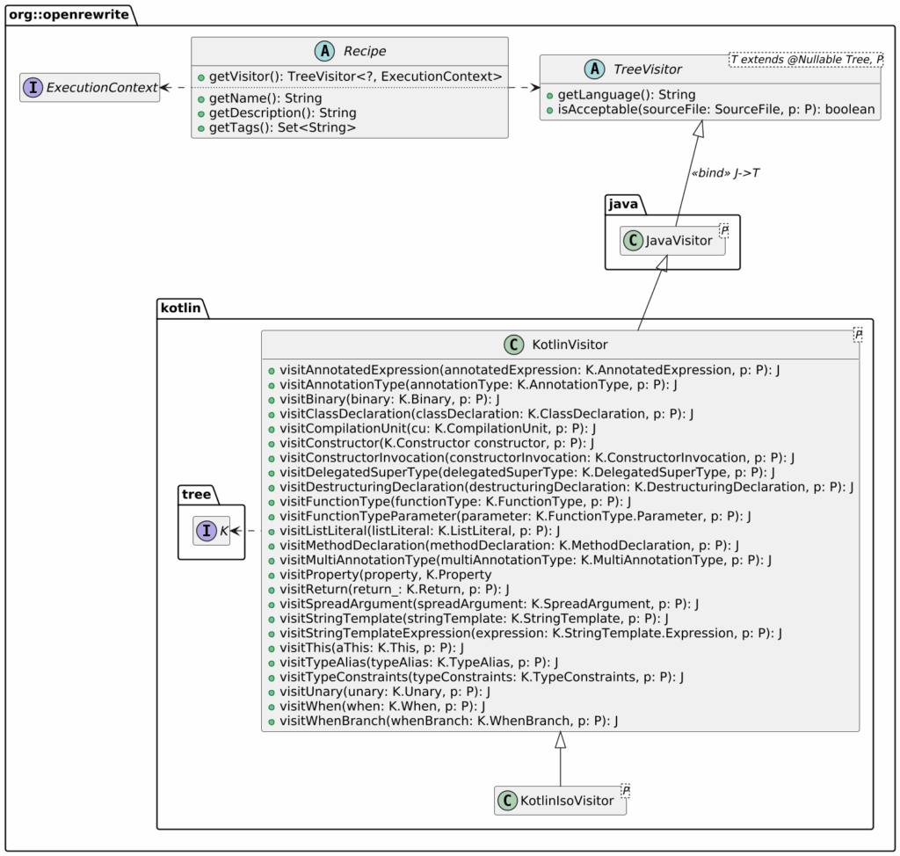
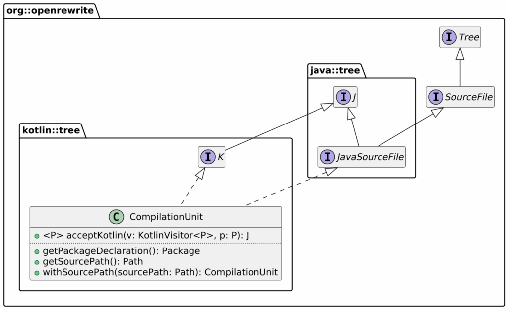
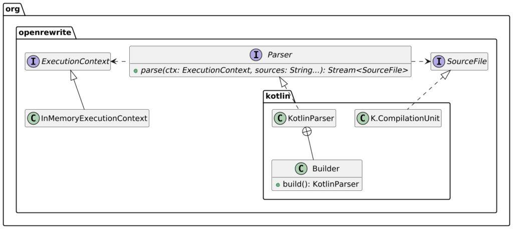

I've been eying OpenRewrite for some time, but I haven't had time to play with it yet. In case you never heard about OpenRewrite, OpenRewrite takes care of refactoring your codebase to newer language, framework, and paradigm versions.
> OpenRewrite is an open-source automated refactoring ecosystem for source code, enabling developers to effectively eliminate technical debt within their repositories.
>
> It consists of an auto-refactoring engine that runs prepackaged, open-source refactoring recipes for common framework migrations, security fixes, and stylistic consistency tasks -- reducing your coding effort from hours or days to minutes. Build tool plugins like the OpenRewrite Gradle plugin and the OpenRewrite Maven plugin help you run these recipes on one repository at a time.
>
> While the original focus was on the Java language, the OpenRewrite community is continuously expanding language and framework coverage. Thousands of great individuals and teams are working together to make software seamless to update and continuously secure.
>
> -- [Introduction to OpenRewrite](https://docs.openrewrite.org/)

OpenRewrite features two components: recipes and the engine that runs them.
> A recipe represents a group of search and refactoring operations that can be applied to a Lossless Semantic Tree. A recipe can represent a single, stand-alone operation or it can be linked together with other recipes to accomplish a larger goal such as a framework migration.
>
> -- [Recipes](https://docs.openrewrite.org/concepts-and-explanations/recipes)

Using OpenRewrite is pretty straightforward. It already provides a large corpus of existing recipes, some of which are free. What I find amazingly powerful is the ability to author new recipes. I decided to learn about it and write my own.

## My use case

My use case is the Kotlin package structure. In Java, a class in the `ch.frankel.blog` package must respect a rigid folder structure: from the root, `ch`, `frankel`, and then `blog`. In Kotlin, you can put the same class in the same package at the root. The official Kotlin documentation has recommendations on the source structure:
> In pure Kotlin projects, the recommended directory structure follows the package structure with the common root package omitted. For example, if all the code in the project is in the `org.example.kotlin` package and its subpackages, files with the `org.example.kotlin` package should be placed directly under the source root, and files in `org.example.kotlin.network.socket` should be in the network/socket subdirectory of the source root.
>
> -- [Directory structure](https://kotlinlang.org/docs/coding-conventions.html#source-code-organization)

The recipe will move the source files closer to the root packages per the above recommendation. We could achieve the same with sysadmin tools such as `mv`, `sed`, or IDEs. While it could be possible to implement my idea with these tools, OpenRewrite has several benefits:

* *Testable*: the API's design is testable, so you can ensure that you won't mess up with your codebase
* *Scalable*: it works on huge codebases
* *Composable*: it allows providing more than one recipe and running them in one single pass

Before diving into the code, we must learn a bit about the API.

## Recipe basics

OpenRewrite implements the Visitor pattern. Here's the abridged class diagram for Kotlin source code, which I'll use later.



Here's an excerpt of the `K` class to complement the previous diagram:



## Putting it all together

Now that we have a clearer view of the API, it's time to think about the code.

I require the user to manually configure the root package in this prototype version. I'd like to compute the root package from the code base in a future version. For example, with source files with respective package declarations `ch.frankel.blog`, `ch.frankel.blog.foo`, and `ch.frankel.blog.bar`, the root package is computed as `ch.frankel.blog`. Additionally, I'll assume that source files are under `src/main/resources`.

The process should, for each file:

* Get the parameterized package name
* If the package name is the root package, return the computing unit immediately
* If not, compute the computing unit's new location
* Set the new file location on the computing unit
* Return the updated computing unit

Here's the implementation of the above:

```kotlin
class FlattenStructure(private val rootPackage: String) : Recipe() {                   //1

    override fun getDisplayName(): String = "Flatten Kotlin package directory structure" //2
    override fun getDescription(): String =                                            //2
        "Move Kotlin files to match idiomatic layout by omitting the root package according to the official recommendation."

    override fun getVisitor(): TreeVisitor<*, ExecutionContext> {
        return object : KotlinIsoVisitor<ExecutionContext>() {
            override fun visitCompilationUnit(cu: K.CompilationUnit, ctx: ExecutionContext): K.CompilationUnit {
                val packageName = cu.packageDeclaration?.packageName ?: return cu      //3
                if (!packageName.startsWith(rootPackage)) return cu                    //4
                val relativePath = packageName.removePrefix(rootPackage)
                    .removePrefix(".")
                    .replace('.', '/')                                                 //5
                val filename = cu.sourcePath.fileName.toString()
                val newPath: Path = Paths.get("src/main/kotlin")
                    .resolve(relativePath)
                    .resolve(filename)                                                 //6
                return cu.withSourcePath(newPath)                                      //7
            }
        }
    }
}
```

1. Parameterize the recipe with the root package
2. Attributes for documentation purposes
3. If we can't compute the package name, return
4. If the compilation unit is already in the root package, return
5. Compute the relative path from the root package and the unit's package name
6. Compute the new path
7. Return the compilation unit with the new path

## Testing the recipe

OpenRewrite's API lends itself to testing. It offers parsers in the different languages it supports and an in-memory execution context. Here's an excerpt of what I used to test the above recipe:



I chose to use JUnit parameterized test, but that's not relevant:

```kotlin
class FlattenStructureTest {

    @ParameterizedTest
    @MethodSource("testData")
    fun `should flatten accordingly`(
        sourceCode: String,
        originalPath: String,
        configuredRootPackage: String,
        expectedPath: String
    ) {
        // Given
        val parser = KotlinParser.builder().build()                                     //1
        val cu = parser.parse(                                                          //2
            InMemoryExecutionContext(),                                                 //3
            sourceCode
        ).findFirst()                                                                   //4
            .orElseThrow { IllegalStateException("Failed to parse Kotlin file") }       //4
        val originalPath = Paths.get(originalPath)
        val modifiedCu = (cu as K.CompilationUnit).withSourcePath(originalPath)         //5

        // When
        val recipe = FlattenStructure(configuredRootPackage)
        val result = recipe.visitor.visit(modifiedCu, InMemoryExecutionContext())       //6

        // Then
        val expectedPath = Paths.get(expectedPath)
        assertEquals(expectedPath, (result as SourceFile).sourcePath)                   //7
    }

    // Provide the file content, the path, the root, and the expected path
}
```

1. Parsers offer a builder pattern API
2. Do the parsing
3. Since we don't use the context to pass messages across recipes, we can create an in-memory instance for each test
4. `parse` returns a stream of `SourceFile`. Even though we know it contains a single one, we need to handle the stream and the possible exception.
5. Because of the lack of generics, we need to cast the returned `SourceFile` to `K.CompilationUnit`
6. Visit the source code manually--as opposed to the engine doing it for us
7. Expect that the file has been moved (virtually)

We can now use the recipe:

```yaml
---
type: specs.openrewrite.org/v1beta/recipe
name: ch.frankel.MyMigration
recipeList:
  - ch.frankel.openrewrite.kotlin.FlattenStructure:
      rootPackage: com.acme
```

## Potential future works

I deliberately left out a recipe requirement: a recipe **MUST** be JSON-serializable. Neither Gradle nor Maven use this feature, but other tools in the ecosystem do.

Also, the recipe requires to set the root package manually. We can list all available source files and their respective package and compute the root in many cases. It requires a slightly more specialized recipe. I deliberately left it out for another potential post.

## Conclusion

In this post, I show how easy authoring an OpenRewrite simple and tested recipe is. I may perhaps compute the root package in a future post.

OpenRewrite is easily extensible; it confirms my prior belief that it's the go-to tool for migrating your codebase.

The complete source code for this post can be found on GitHub.

**To go further:**

* [Introduction to OpenRewrite](https://docs.openrewrite.org/)
* [Writing a Java refactoring recipe](https://docs.openrewrite.org/authoring-recipes/writing-a-java-refactoring-recipe)

*Originally published on [A Java Geek](https://blog.frankel.ch/openrewrite-recipes/1/) on June 8^th^, 2025*
