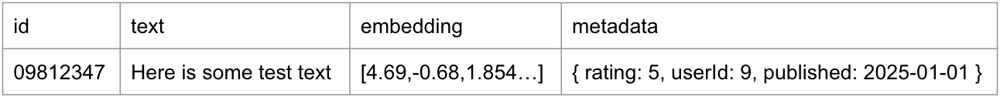
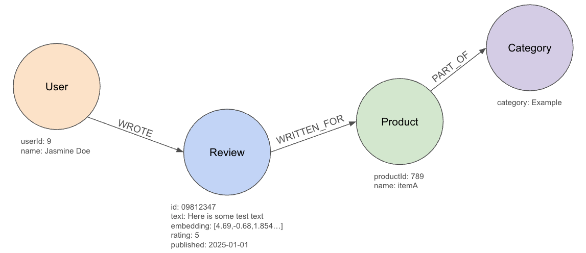
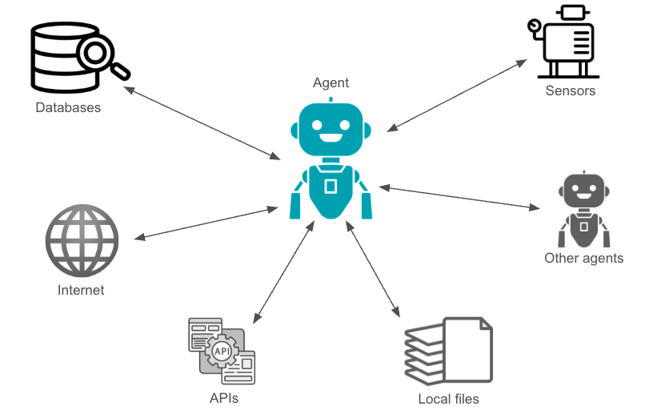
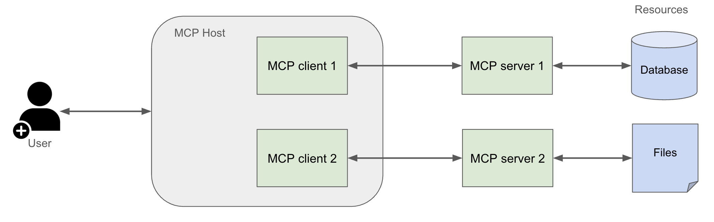

In [the last post](https://foojay.io/today/intro-to-rag-foundations-of-retrieval-augmented-generation-part-1/), we discussed the basics of Retrieval Augmented Generation (RAG) and how it enhances the capabilities of Large Language Models (LLMs) by integrating them with external knowledge sources. We also introduced the concept of vector embeddings and their role in semantic search.

In this post, we'll dive deeper into the different layers of RAG, including vector RAG, graph RAG, and agents. We'll explore how these layers can be combined to create more powerful and effective AI systems.

GenAI systems as layers {#_genai_systems_as_layers}
---------------------------------------------------

I've recently started thinking of GenAI in a series of layers - the LLM, semantic search, retrieval queries (RAG sources), agents, etc. Each of these layers can add different kinds of value to the solution, producing custom, potentially high-quality results and reducing the risk of hallucinations.

The comparison I like is to layered foods. Additional layers can bring more flavors, textures, and overall improve a food, but at some point, too many layers overwhelm the palate or make it hard to eat.

Additional layers also add complexity, so analysis needs to be done to evaluate whether the added complexities for each component are worth the hassle for the use case. If the costs are worth the benefits, take them on with confidence. If not, perhaps there is a simpler approach to improve results without the added complexity of AI.

Let's look at some of the layers in the current GenAI landscape.

Vector RAG {#_vector_rag}
-------------------------

[Vector-only RAG](https://developers.cloudflare.com/vectorize/reference/what-is-a-vector-database/#retrieval-augmented-generation) (also called "Naive RAG") means that you create vectors (embeddings) for the data you want to provide to the LLM and search that data using vector similarity search. This approach is very powerful, as it retrieves semantically relevant information from a large dataset, allowing the LLM to generate more accurate and contextually appropriate responses.

Here is an example of what data in a vector database might look like:

Database solutions (vector databases) arose to optimize for the storage, search, and retrieval of vector embeddings. Many databases (including graph, relational, document, etc) also incorporated vector embedding support for semantic searches onto their specialized models, though native vector databases might have more performance optimizations for certain workloads.

Vector databases are designed and optimized for storing and searching vector embeddings, not for storing a lot of metadata or related entities. Plus, similar might not always be the same as relevant.

This is where a graph layer can provide additional context and relationships between the data points, improving the relevance of the retrieved information. This is especially important when dealing with complex analysis or when the data has intricate relationships that should be considered.

Graph RAG {#_graph_rag}
-----------------------

[GraphRAG](https://neo4j.com/blog/genai/what-is-graphrag/) introduces a layer that utilizes relationships between data points, enhancing the retrieval process by considering the connections and context in the data. GraphRAG combines the strengths of vector similarity search with the connected data of graph databases, allowing for more nuanced and related context retrieval.

Just as with vector RAG, graph RAG runs a similarity search to find the most relevant data points. Next, a retrieval query pulls relationships around those points, allowing for a more comprehensive understanding of the context and meaning behind the data.

Because graph databases are designed to store and query complex relationships, they are particularly useful in scenarios where the relationships between data points are critical for understanding the context or meaning of the information. If you think about asking an LLM generic or broad questions, giving the LLM access to a knowledge graph can help narrow its probabilities using context within particular industry information or lesser-known research topics.

GraphRAG has been shown to improve the accuracy and relevance of generated outputs, especially in complex domains. But even a knowledge graph might not be able to include all relevant information.

This is where agents come into play, which act as intermediaries to carry out tasks and retrieve information from various sources. Agents can be designed to break down complex processes into a series of steps and complete them to gather the most relevant information for a given query.

AI Agents {#_ai_agents}
-----------------------

[AI Agents](https://www.anthropic.com/engineering/building-effective-agents) can range from simple to complex and can be arranged in configurations of one or multiple agents, depending on their design and functionality. Agentic systems can interact with various data sources, APIs, and even other AI systems to gather information, automate tasks, and generate outputs. Agents contribute to improved automation, but also work towards autonomous systems that can make decisions and operate independently.

Agents are a powerful tool for enhancing GenAI systems, but they also add complexity. Developers need to understand defining and coordinating multiple tools for agents to access, agentic memory, and guardrails to ensure that the agents are working together effectively and safely. This is especially important in scenarios where the agents are interacting with sensitive data or making decisions that could have significant consequences.

Design of agentic systems can vary widely, from simple rule-based systems to complex multi-agent systems that can learn and adapt over time. The choice of design will depend on the specific use case and the level of complexity required.

Model Context Protocol (MCP) {#_model_context_protocol_mcp}
-----------------------------------------------------------

The [Model Context Protocol (MCP)](https://neo4j.com/blog/developer/model-context-protocol/) has been a hot topic in the GenAI community. MCP is a **protocol** for managing resources for LLM **models** to use as **context**. It is kind of like a template for connecting external data sources, tools, infrastructure, and data APIs to an LLM, providing a standardized way to access and utilize external knowledge sources more effectively.

Since its release last fall (by Anthropic), companies and developers have been creating their own integrations by creating MCP servers for tools and services. There are three main components to the MCP protocol: the MCP host, the MCP client, and the MCP server. The host is the AI application that interfaces with a user (such as a chat or IDE). The client (think of this like an agent) holds connections to various server tools, managing all the necessary resources and ready to act upon request. The server is the backend for exposing the tools, data, and resources that might need to be accessed.

If you think of MCP like a restaurant, the MCP host is the restaurant host, the MCP client is the waiter, and the MCP server is the kitchen. The host (MCP host) accepts customers, intaking requests and organizing seating. The waiter (client) takes orders from the customer and communicates them to the kitchen (server), which prepares the food (data or resources) and passes it back to the waiter to deliver to the customer. The waiter acts as an agent between the customer and kitchen, ready to respond and relay information/food between the two parties.

Though MCP shows much promise, there are some risks that currently exist within the fledgling MCP ecosystem, including security gaps, observability, verified MCP implementations, and enterprise considerations. As with any new technology, it is important to carefully evaluate MCP and to take appropriate precautions to ensure that the system is protected and used responsibly.

The MCP protocol is still evolving, so it is likely that we will see rigorous improvements and emerging best practices, making it easier for developers to build and deploy AI applications that leverage the power of LLMs and external knowledge sources.

There are several 3rd party resources for getting started with MCP provided in the [Neo4j blog post on the topic](https://neo4j.com/blog/developer/model-context-protocol/), if you want to know more.

What should you choose? {#_what_should_you_choose}
--------------------------------------------------

So how do you choose which layer(s) to use? It depends on the use case and the complexity of the data. There are many variations and nuances to consider, and the best decision will likely require testing several different combinations of LLM models, vector stores (databases), and agentic architectures to find the optimal solution for your specific needs.

Does vector similarity search provide a high enough accuracy and relevance for your use case? If so, then you may not need to add the complexity of a graph database or agentic system. If results are missing context or high accuracy is critical, then a graph database approach may be the best option. Are there simply too many scattered and inconsistent data sources to make a unified data store practical or will requests contain tasks/data that need to be sent to other systems? Then an agentic system may be worth the added complexity. And if you find yourself needing to write custom integrations for multiple tools, APIs, and data sources, then the Model Context Protocol (MCP) may be a valuable addition.

Wrapping up! {#_wrapping_up}
----------------------------

In this blog post, we explored the different layers of RAG, including vector RAG, graph RAG, and agents. We discussed how these layers can be combined to create more powerful and effective AI systems, and the trade-offs involved in adding complexity to your GenAI solutions. It is important to understand the specific use case and the data involved in order to determine which layers to use. The choice of layers will depend on the complexity of the data, the level of accuracy required, and the specific goals of the AI system.

By understanding these concepts, you can make informed decisions about how to leverage RAG in your own projects and applications. As the field of Generative AI continues to evolve, staying up-to-date with these foundational concepts will be crucial for harnessing the full potential of AI technologies.

Whether you're a developer, data scientist, or simply someone interested in the future of AI, understanding RAG and its components will empower you to create more effective and reliable AI systems.

Happy coding!

Resources {#_resources}
-----------------------

* Previous blog post: [Intro to RAG: Foundations of Retrieval Augmented Generation, part 1](https://neo4j.com/blog/genai/intro-to-rag/)
* Blog post: [What is GraphRAG? - Neo4j](https://neo4j.com/blog/genai/what-is-graphrag/)
* Blog post: [Building Effective Agents - Anthropic](https://www.anthropic.com/engineering/building-effective-agents)
* Blog post: [Everything a Developer Needs to Know about the Model Context Protocol (MCP) - Neo4j](https://neo4j.com/blog/developer/model-context-protocol/)
