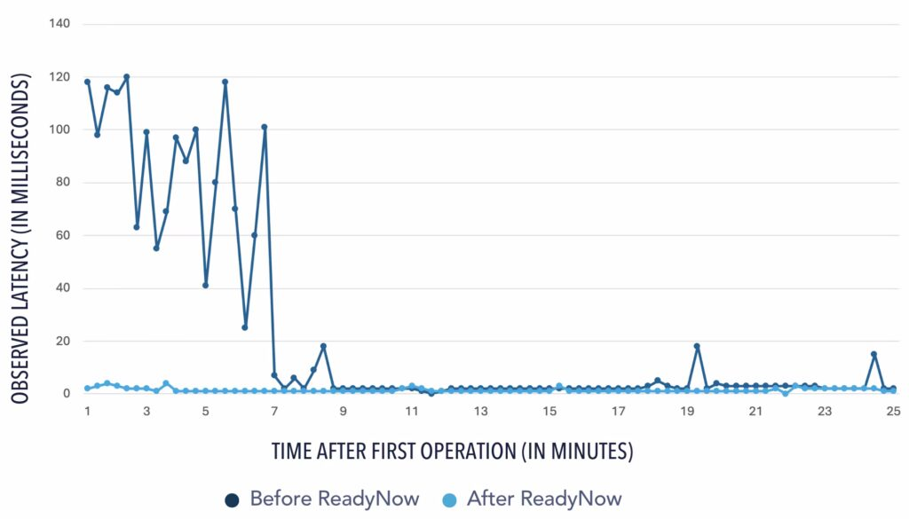
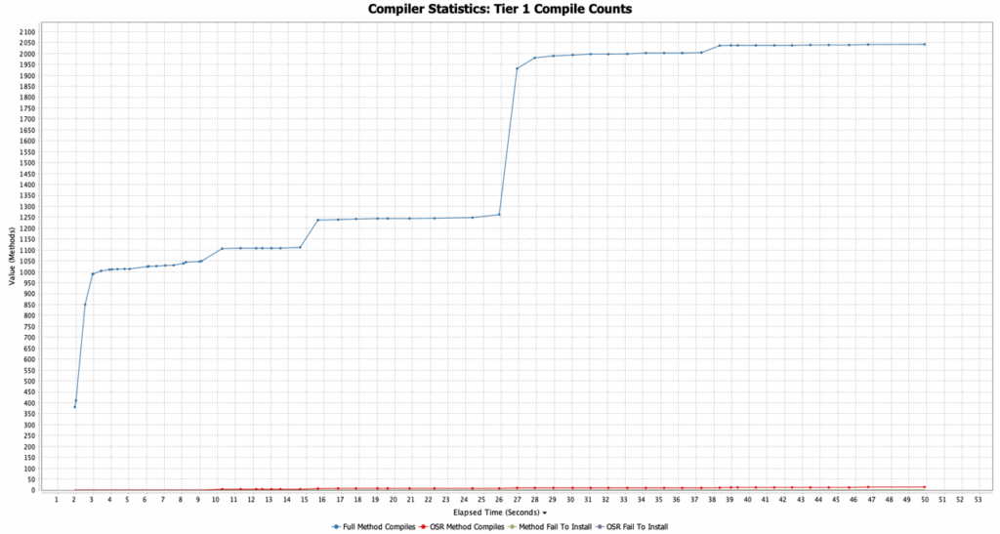
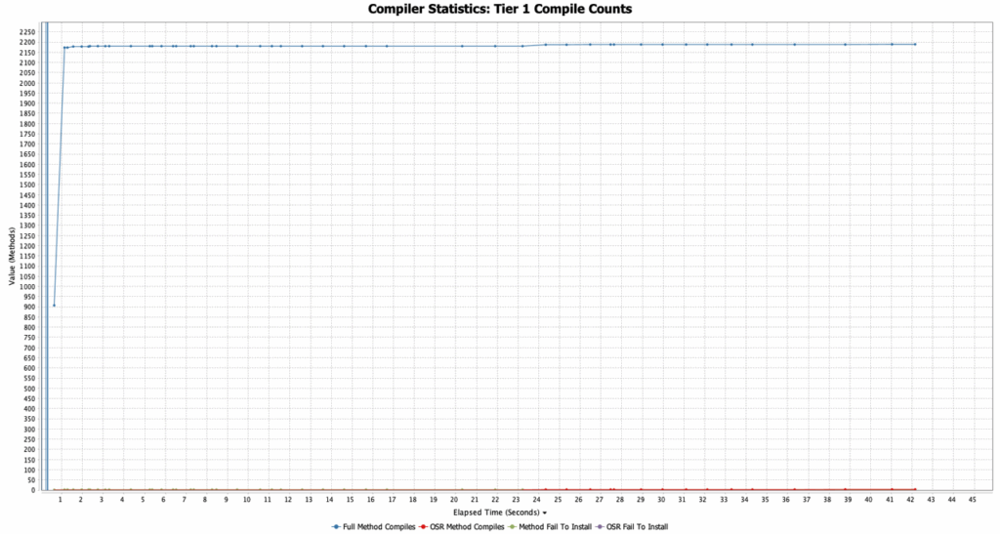
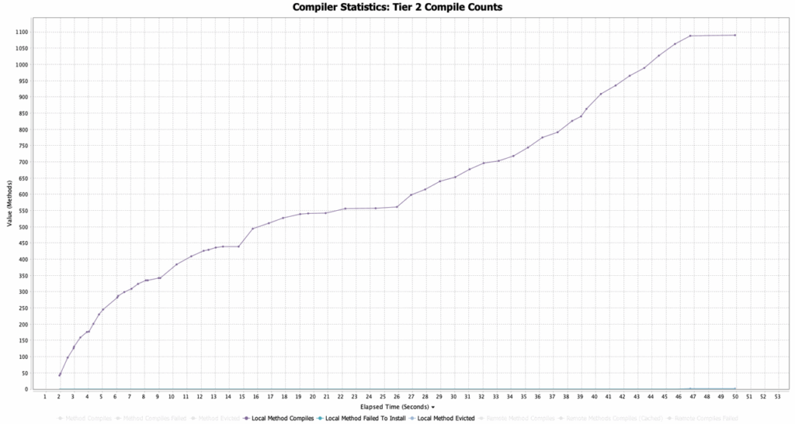
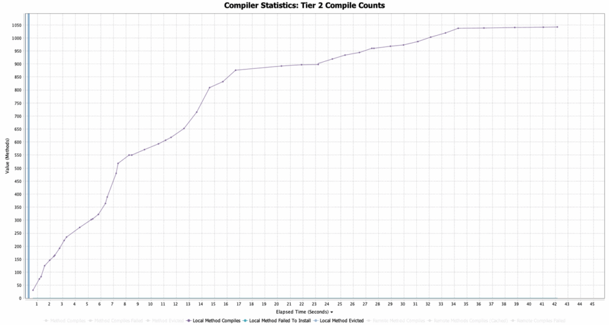
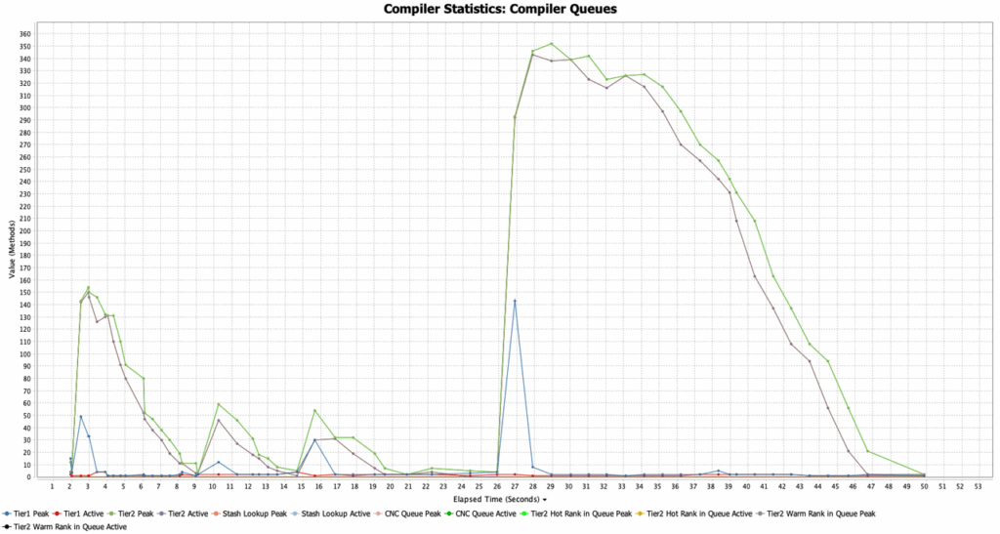
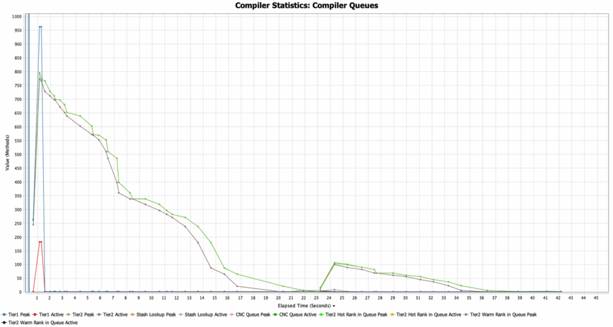

***This is the second article in a series on faster Java application warmup. The first blog post, [Faster Java Warmup: CRaC versus ReadyNow](https://foojay.io/today/faster-java-warmup-crac-versus-readynow/), explained how CRaC and ReadyNow use different methods to achieve faster Java warmup. This post takes a deeper look into how ReadyNow improves Java warmup time and reduces latency.***

ReadyNow in Azul Zing Builds of OpenJDK (Zing) helps Java applications reach their optimal performance much faster after the startup of the JVM. Using a text file containing the history of compiler decisions from a previous run, it can reduce the application's total Java warmup time.

In this post, we'll take a deeper look into this process and explain how ReadyNow can improve the speed of the application from the start and reduce latency \[Figure 1\].


## How ReadyNow achieves faster compilations

Typically, for a method to get compiled from Java bytecode into native code, it needs to be executed multiple times. The threshold is different for the Tier 1 and Tier 2 compilers, the runtime being used, and the optional configurations, but typically it's above 5,000 or 10,000 times. All those executions take time, and the actual production load is required.

With ReadyNow, the JVM knows from a previous run that these methods were compiled and which decisions the compiler has made to achieve the optimal native code. Therefore, it will start the compilation proactively and not wait for all the thresholds to be passed. Thus, the compilation begins sooner, saves time, and reaches the warmed-up state faster.

|                                                                                                                                                                                                               Read More                                                                                                                                                                                                                |
|----------------------------------------------------------------------------------------------------------------------------------------------------------------------------------------------------------------------------------------------------------------------------------------------------------------------------------------------------------------------------------------------------------------------------------------|
| [About ReadyNow](https://docs.azul.com/prime/Use-ReadyNow?_gl=1*nyre8r*_gcl_au*Nzc5NjM1MDg1LjE3NDIxNTUzMjQ.*_ga*ODEwNjUwMTkuMTczMzEzMzUzMQ..*_ga_42DEGWGYD5*MTc0MzU0NDgxMS4xMDA2LjEuMTc0MzU0NDg0My4yOC4wLjEzNjQ4MjcyNTM.) [ReadyNow Start Up Faster and Stay Fast](https://www.azul.com/products/components/readynow/) [High-Performance Java Platform Benchmark Report](https://www.azul.com/high-performance-java-benchmark-report/) |

## Normal startup

The first step in using ReadyNow is running your application as you would normally do, with the Zing JVM and the extra argument

    -XX:ProfileLogOut=<file>

This instructs Zing to store (**output**) each compiler decision in the profile log file.

This example also uses the argument to generate garbage collector logs to compare the differences further in this article. You can use your own application, of course, but make sure you have some way to trigger the expected load the application will need to handle in production. In this case, I'm using the [DaCapo Benchmark Suite](https://www.dacapobench.org/), which can be instructed to self-generate a specific load, enabling us to compare different runs with a similar load easily.

***This is just an example use. In an ideal case, you would use your production application with the actual load it needs to handle. You would also need to let it run longer to ensure that you end up with a profile log with all the required information based on the application's real-world use from startup to the best performing point.***

```
$ /usr/lib/jvm/zing-jdk21/bin/java \
   -XX:ProfileLogOut=readynow.log \
   -Xlog:gc:gc.log \
   -jar dacapo-23.11-chopin.jar h2
```

## What's in the file

The generated profile log-out file contains log lines useful for you as a developer or DevOps by checking the content in the file itself or with [GC Log Analyzer](https://docs.azul.com/gc-log-analyzer/). For instance, you can check this file for the Java version, arguments, and other runtime information. There are also records in the file for loaded classes and compiled methods related to how the application behaves during warmup, so ReadyNow can proactively help the JVM finish the warmup sooner when this file is used as the input profile log.

```
# ZVM version:
# 21.0.5.0.101-zing_25.01.0.0-b5-release-linux-X86_64
# VM Arguments:
# jvm_args: -XX:ProfileLogOut=readynow.log -Xlog:gc:gc.log 
# java_command: dacapo-23.11-chopin.jar h2
# class_path: dacapo-23.11-chopin.jar
# java_home: /usr/lib/jvm/zing-jdk21.0.5.0.101-25.01.0.0-5-amd64
...
# ProfileLogOut after macro expansion: 'readynow.log'
...
# GCHH : OS name       : Linux 
# GCHH : OS release    : 6.8.0-53-generic #55-Ubuntu SMP PREEMPT_DYNAMIC Fri Jan 17 15:37:52 UTC 2025 
# GCHH : hardware      : x86_64 
# GCHH : CGroups information: 
# GCHH :   Container Type                   : cgroupv2 
# GCHH :   Active processor count           : 16 
...
1740141511794777793 | FirstCall 8512 5 0
Class 877 1260777173 org.dacapo.harness.TestHarness 9 { } 272310769 Class 901 file:/dacapo-23.11-chopin.jar
1740141511795023287 | ClassLoad 877
ImplementorLoad 877 1 877
```

In some cases, Azul support engineers also use this file to assist customers in debugging specific performance, compilation, and warmup issues. Application performance graphs (response time, throughput) can be combined with these profile logs to compare the results with and without ReadyNow. Based on the metrics that are important for the customer, it can help decide if the same system performance can be achieved with fewer nodes in a cluster, for example.

## Startup with file

In the second step, we start the same application, but we use the profile generated in the first step and use it this time with the `-XX:ProfileLogIn=<file>` argument (**input**). This instructs Zing to start compiling the Java class files into native code immediately based on the decisions made by the compiler in the first run.

```
$ /usr/lib/jvm/zing-jdk21/bin/java \
   -XX:ProfileLogIn=readynow.log \
   -Xlog:gc:gc-with-profile.log \
   -jar dacapo-23.11-chopin.jar h2
```

## Comparing the different runs

The gc.log files generated by Zing contain much more information, especially about the compiler's behavior, than similar files generated by an OpenJDK build. Therefore, we can conclude how the compiler worked during the run. Such detailed information is not available with other OpenJDK runtimes.

Let's compare gc.log files generated during the two runs with [GC Log Analyzer](https://docs.azul.com/gc-log-analyzer/).

### Tier 1 compile counts

In the first run, we can see the number of compiles gradually grows over time and reaches the maximum after about 40 seconds. Thanks to the information in the profile log file, in the second run, the compiler already has all the required information to move these Tier 1 compilations to the very start of the application and finish all these compilations in one second.

<figure class="wp-block-gallery has-nested-images columns-default is-cropped wp-block-gallery-1 is-layout-flex wp-block-gallery-is-layout-flex">
 <figure class="wp-block-image size-large">
  
 </figure>
 <figure class="wp-block-image size-large">
  
 </figure>
</figure>

### Tier 2 Compile Counts

The charts for the Tier 2 compilation reveal that we reduced a significant part of the compilations from 40 seconds to 17 seconds. Although this is already a significant improvement, it also helps us to define that the generated profile log file is still not perfectly trained for this use case. In one of the next parts of this blog series, we'll explore the topic of generational profile logs further.

<figure class="wp-block-gallery has-nested-images columns-default is-cropped wp-block-gallery-2 is-layout-flex wp-block-gallery-is-layout-flex">
 <figure class="wp-block-image size-large">
  
 </figure>
 <figure class="wp-block-image size-large">
  
 </figure>
</figure>

### Compiler queue run

The chart with the code waiting in a queue to be compiled also shows a big difference. In the first run, we can see a huge spike starting at around second 26, when the actual Dacapo-test starts, which causes a lot of load on the application. Thanks to the profile log, this queue is moved to the start of the application. As described before, ReadyNow uses the decisions of the previous run to immediately compile most of the native code and have it available when needed. As a result, we only see a small peak at 26 seconds.

<figure class="wp-block-gallery has-nested-images columns-default is-cropped wp-block-gallery-3 is-layout-flex wp-block-gallery-is-layout-flex">
 <figure class="wp-block-image size-large">
  
 </figure>
 <figure class="wp-block-image size-large">
  
 </figure>
</figure>

## Conclusion

Using a profile log generated during a "training run" of the application, we can move the compilation from Java bytecode to the best-performing native code at the very start of the application. This leads to very fast warmup of new instances of an application, which helps you dynamically scale your system and perform at maximum speed quickly after startup.

**Next:** [How to Train ReadyNow to Achieve Optimal Performance](https://foojay.io/today/how-to-train-readynow-to-achieve-optimal-java-performance/)
