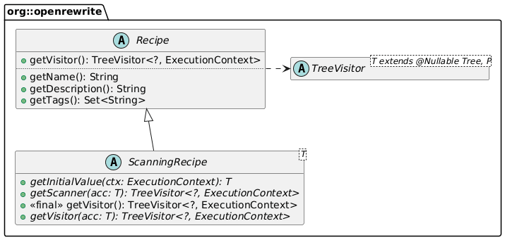

I started discovering OpenRewrite last week by writing a Kotlin recipe that moves Kotlin files according to the official directory structure recommendation. I mentioned some future works, and here they are. In this post, I want to describe how to compute the root package instead of letting the user set it.

## Reminder

I developed last week a recipe to follow the Kotlin recommendation regarding directory structure:
> In pure Kotlin projects, the recommended directory structure follows the package structure with the common root package omitted. For example, if all the code in the project is in the `org.example.kotlin` package and its subpackages, files with the `org.example.kotlin` package should be placed directly under the source root, and files in `org.example.kotlin.network.socket` should be in the network/socket subdirectory of the source root.
>
> -- [Directory structure](https://kotlinlang.org/docs/coding-conventions.html#source-code-organization)

In a Java project, if you have packages `ch.frankel.foo`, `ch.frankel.bar`, and `ch.frankel.baz`, you'll get the following structure:

```
src
 |__ main
    |__ java
       |__ ch
          |__ frankel
             |__ foo
             |__ bar
             |__ baz
```

In Kotlin projects, many developers follow the same structure as above, but it can be flattened as:

```
src
 |__ main
    |__ kotlin
       |__ foo
       |__ bar
       |__ baz
```

## The work

My recipe's original version mandated that you configure the root package yourself, *e.g.* , `ch.frankel` for the above example. However, it should be possible to compute it automatically, from looking at the source files. It adds an extra step to the process: before moving the file to the root, the recipe should look at each source file, get the package, compute the longest prefix with the existing root, make it the root, and go to the next source file. The regular `Recipe` doesn't work in this case. We need to switch to a `ScanningRecipe`:
> If a recipe needs to generate new source files or needs to see all source files before making changes, it must be a `ScanningRecipe`. A `ScanningRecipe` extends the normal `Recipe` and adds two key objects: an `accumulator` and a `scanner`. The `accumulator` object is a custom data structure defined by the recipe itself to store any information the recipe needs to function. The `scanner` object is a visitor which populates the `accumulator` with data.
>
> -- [Scanning recipes](https://docs.openrewrite.org/concepts-and-explanations/recipes#scanning-recipes)

Scanning recipes offer two steps: the first to gather data, the second to do the work.



We must design our algorithm within the constraints of OpenRewrite, and they are the following: in the first phase, for each source file, OpenRewrite will call the `getScanner()` method that returns a visitor of our choice. In turn, OpenRewrite calls the visitor's methods, which can access the accumulator.

My first naive approach was to use a collection as the accumulator, but it's not necessary. The algorithm is much simpler if we set a mutable placeholder that holds the package root and update it if necessary during each visit. The initial value should be `null`.

* If the value is `null`, which happens on the first visitor, set the package root to the source file's package.
* If the value is an empty string, skip–see below.
* In any other case, compute the new package root by finding the longest prefix between the existing package root and the source file's package.

It might result in an empty string, indicating that packages have no common root, *e.g.* , `ch.frankel.foo` and `org.frankel.foo`.

Here's the updated code:

```kotlin
class FlattenStructure(private val rootPackage: String?) : ScanningRecipe<AtomicReference<String?>>() { //1-2

  constructor() : this(null)                                                   //3

  override fun getDisplayName(): String = "Flatten Kotlin package directory structure"
  override fun getDescription(): String =
    "Move Kotlin files to match idiomatic layout by omitting the root package according to the official recommendation."

  override fun getInitialValue(ctx: ExecutionContext) = AtomicReference<String?>(null) //4

  override fun getScanner(acc: AtomicReference<String?>): TreeVisitor<*, ExecutionContext> {
    if (rootPackage != null) return TreeVisitor.noop<Tree, ExecutionContext>() //5
    return object : KotlinIsoVisitor<ExecutionContext>() {
      override fun visitCompilationUnit(cu: K.CompilationUnit, ctx: ExecutionContext): K.CompilationUnit {
        val packageName = cu.packageDeclaration?.packageName ?: return cu
        val computedPackage = acc.get()
        when (computedPackage) {
          null -> acc.set(packageName)                                         //6
          "" -> {}                                                             //7
          else -> {
            val commonPrefix = packageName.commonPrefixWith(computedPackage).removeSuffix(".") //8
            acc.set(commonPrefix)
          }
        }
        return cu
      }
    }
  }

  override fun getVisitor(acc: AtomicReference<String?>): TreeVisitor<*, ExecutionContext> {
    return object : KotlinIsoVisitor<ExecutionContext>() {
      override fun visitCompilationUnit(cu: K.CompilationUnit, ctx: ExecutionContext): K.CompilationUnit {
        val packageName = cu.packageDeclaration?.packageName ?: return cu
        val packageToSet: String? = rootPackage ?: acc.get()                   //9
        if (packageToSet == null || packageToSet.isEmpty()) return cu
        val relativePath = packageName.removePrefix(packageToSet).removePrefix(".")
          .replace('.', '/')
        val filename = cu.sourcePath.fileName.toString()
        val newPath: Path = Paths.get("src/main/kotlin")
          .resolve(relativePath)
          .resolve(filename)
        return cu.withSourcePath(newPath)
      }
    }
  }
}
```

1. Inherit from `ScanningRecipe` instead of directly from `Recipe`
2. Set the accumulator type to be an `AtomicReference`
3. Make the configuration easier when you don't override the package root
4. The initial root is uninitialized
5. Skip the computation if the root package is manually set
6. If it's the first file visited, the accumulator holds `null`, and we can set the (temporary) root as the current package
7. One of the previous computations returned no common root–do nothing
8. Find the longest common prefix between the held package root and the current package
9. The only difference with the original code:  
   we check if the root package has been set manually otherwise, we use the one computed in the first pass

## Optimizing the recipe

You may have noticed that when there is no common root, *e.g.* , `ch.frankel.foo` and `org.frankel.foo`, we scan all files anyway. In a small codebase, it's not a big issue, but when scanning millions of source files, that's a huge waste of CPU cycles and time. If you run the recipe in the Cloud, it directly translates to money. We should stop scanning as soon as we detect the computed package root is an empty string to optimize the recipe.

Here's the updated code:

```
override fun getScanner(acc: AtomicReference<String?>): TreeVisitor<*, ExecutionContext> {
  if (rootPackage != null) return TreeVisitor.noop<Tree, ExecutionContext>()   //1
  val currentPackage = acc.get()
  if (currentPackage == "") return TreeVisitor.noop<Tree, ExecutionContext>()  //2
  return object : KotlinIsoVisitor<ExecutionContext>() {
    override fun visitCompilationUnit(cu: K.CompilationUnit, ctx: ExecutionContext): K.CompilationUnit {
      val packageName = cu.packageDeclaration?.packageName ?: return cu
      // Different call than the one above!
      val currentPackage = acc.get()
      // First scanned file
      if (currentPackage == null) acc.set(packageName)                         //3
      else {
        // Find the longest common prefix between the stored package and the current one
        val commonPrefix = packageName.commonPrefixWith(currentPackage).removeSuffix(".")
        acc.set(commonPrefix)
      }
      return cu
    }
  }
}
```

1. If the root package has been set, skip visiting
2. If one of the previous computations sets an empty string, there isn't any common root package: skip visiting
3. Simplify the visitor by removing the clause when the accumulator is an empty string since it can't happen anymore

Note that OpenRewrite still scans each file, but at least doesn't visit it thanks to the no-op visitor.

## Counting visits

I made a couple of attempts before finding the right approach to the above. To ensure that I got it right, I wanted to display the number of visits by the scanner. We can use the accumulator to increment the visit count. Here are the changes I made:

* Migrated from an `AtomicReference` to an `AtomicReference<Pair>`
* The `getInitialValue()` function returns `AtomicReference<Pair>(0 to null)`
* During each visit:
  * Get the visits count from the accumulator
  * Increment it
  * Print it
  * Store it back in the accumulator
* Update the tests accordingly

With packages `ch.frankel.blog.foo`, `org.frankel.blog.bar`, and `org.frankel.blog.baz`, the log shows:

```
[INFO] [stdout] FlattenStructure: 1 file visited
[INFO] [stdout] FlattenStructure: 2 files visited
```

By changing `ch.frankel.blog.foo` to `org.frankel.blog.foo`, the log changes to:

```
[INFO] [stdout] FlattenStructure: 1 files visited
[INFO] [stdout] FlattenStructure: 2 files visited
[INFO] [stdout] FlattenStructure: 3 files visited
```

Because I made these changes just to validate my understanding of how OpenRewrite works, I put them in the `visits_count` branch on GitHub. To see the differences, execute `git diff master visits_count`.

## Conclusion

In this post, I added the automatic computation of the root package. I had to change my design and understand how scanning recipes work. Then, I skipped further visits when there wasn't any common root package to optimize performance.

The recipe is still not serializable, though it's a recommendation. I also noticed that my tests didn't leverage OpenRewrite's testing API. There's still a lot of work to do!

The complete source code for this post can be found on [GitHub](https://github.com/ajavageek/flatten-kotlin-recipe).

**To go further:**

* [Scanning Recipes](https://docs.openrewrite.org/concepts-and-explanations/recipes#scanning-recipes)
* [Code sample of an existing scanning recipe](https://github.com/openrewrite/rewrite-testing-frameworks/blob/main/src/main/java/org/openrewrite/java/testing/mockito/AnyToNullable.java)
* [Existing scanning recipes](https://docs.openrewrite.org/reference/scanning-recipes)

*Originally published at [A Java Geek](https://blog.frankel.ch/openrewrite-recipes/2/) on June 15^th^, 2025*
