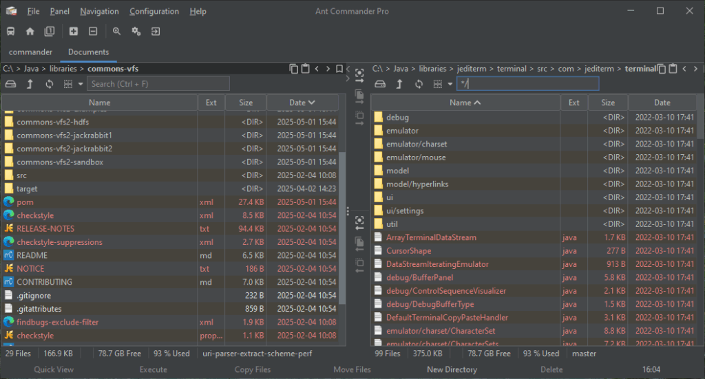

A few weeks ago, I had the honor to present at the [Arnhem JUG](https://www.meetup.com/nl-NL/arnhemjug/) in the Netherlands about "Java, What's old?" In this series, I'm focusing on what's old in the JDK, not that known, and can be useful. A few hidden gems in the JDK.

Everything in this series is in Java 8 and earlier. So after reading this article, you will be able to use it in your projects.

## Optional

Well, `Optional` is a well known class of Java, it's used for objects that can have a value or not with handy methods such as `ifPresent`, `orElse` or `stream()`.  

Here are some examples

```java
Optional<String> job = Optional.empty();
Optional<Integer> age = Optional.empty();
Integer age = null; // null when unknown
```

Now if you see a colleague adding an `Optional<Integer>` or an `Integer` object, you can now make the remark that there is an [**`OptionalInt`**](https://docs.oracle.com/javase/8/docs/api/java/util/OptionalInt.html) class in Java.  

This class works with an int variable. It has methods such as `ifPresent(IntConsumer)`, `orElse(int)`, `orElseGet(IntSupplier)` and `IntStream stream()`.

The following classes are also available in Java:

* [**`OptionalLong`**](https://docs.oracle.com/javase/8/docs/api/java/util/OptionalLong.html)
* [**`OptionalDouble`**](https://docs.oracle.com/javase/8/docs/api/java/util/OptionalDouble.html)

## Statistics

Java has statistics classes included in the JDK. I discovered it when doing the One Billion Row Challenge ([1BRC](https://foojay.io/today/12-lessons-learned-from-doing-the-one-billion-row-challenge/)).

**[`IntSummaryStatistics`](https://docs.oracle.com/javase/8/docs/api/java/util/IntSummaryStatistics.html)**

You can add values using `accept(int)` or merge with another statistics using `combine(IntSummaryStatistics)`

This class will remember the min, max, sum, count and average.

If you're working with floating points, Java has a **[`DoubleSummaryStatistics`](https://docs.oracle.com/javase/8/docs/api/java/util/DoubleSummaryStatistics.html)** class.

## LinkedHashMap

**[`LinkedHashMap`](https://docs.oracle.com/javase/8/docs/api/java/util/LinkedHashMap.html)** is a well known class in Java. It has the advantage to keep the insert order of the items added when using the iterator, such as `ArrayList` for a list.

What is less known is that `LinkedHashMap` has a constructor where you can specify not to keep the insert order but the **access order**, from the least recently accessed key to the most recently accessed.

`LinkedHashMap` has a `removeEldestEntry` method that can be used for example to implement a simple FIFO (First In First Out) or LRU (Least Recently Used) cache.

Here is an example

```java
public class LRUCache<K, V> extends LinkedHashMap<K, V> {
    private final capacity;

    public LRUCache(int capacity) {
        super((int) Math.ceil(capacity / 0.75), 0.75, true);
        this.capacity = capacity;
    }

    @Override
    protected boolean removeEldestEntry(Map.Entry<K, V> eldest) {
        return size() > capacity;
    }
}
```

If you are using this cache from multiple threads, don't forget to make it a synchronized map using `Collections.synchronizedMap(new LRUCache(20));`

## WeakHashMap

A **[WeakHashMap](https://docs.oracle.com/javase/8/docs/api/java/util/WeakHashMap.html)** is another kind of `Map`. It has the particularity to have weak references to the keys. This means that objects in the keys may be garbage collected if there is no hard references to the same object somewhere else in the code.

Note that the value is not stored as a weak reference, so if the key object is also referenced from the value, the map entry won't be garbage collected unless the entry is programmatically removed.

This map is not suitable for iteration or code like `if (map.contains(key)) value = map.get(key);` as entries may disappear at any time.

Here is an example where I used a `WeakHashMap`.

I have developed a file manager [Ant Commander Pro](https://www.antcommander.com). When files are listed in a `JTable`, I show the last modified time. So in the cell renderer, I convert the file timestamp (epoch) to a human readable text using a `DateTimeFormatter`.

Since `JTable` doesn't cache the cell component, it repaints the cell when needed, which is every few ms when scrolling up or down.

To lower the CPU load, I added a `Map<Long, String> cacheTime = new WeakHashMap<>(100);` and then use `String formattedTime = cacheTime.computeIfAbsent(...);`  
 Ant Commander Pro with scroll bars next to the file dates

## BitSet

When working with booleans (false/true), java can't store them in an optimized way as 1 bit per boolean. Here is what is sometimes used:

* `boolean` are 8 bits (1 byte)
* `boolean[]` is more than 1 bit per boolean and fixed size
* `List<Boolean>` is flexible in size but is using even more bytes due to the pointer to the Boolean objects

So Java has the **[BitSet](https://docs.oracle.com/javase/8/docs/api/java/util/BitSet.html)** class that is optimized to use about 1 bit per boolean/bit.

`BitSet` is flexible in term of size and has many methods often used in bits manipulation.

In part II of "Java, what's old?", we'll have look at utility objects.
