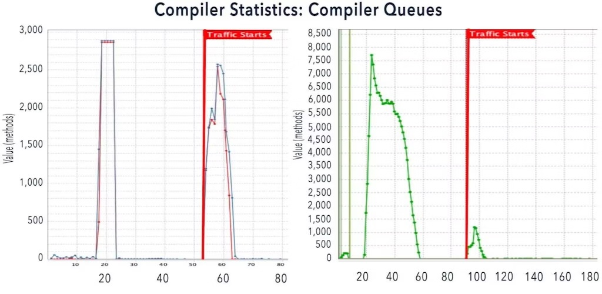
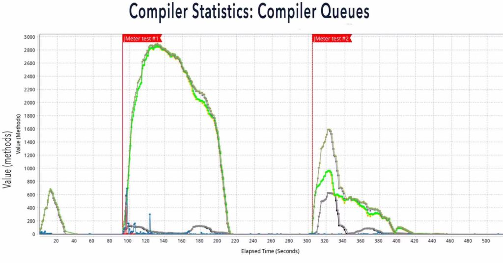
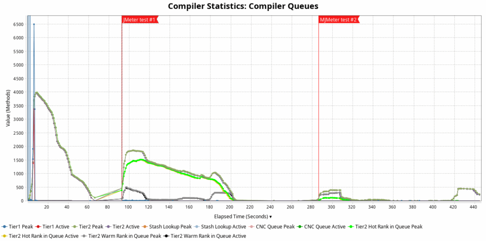
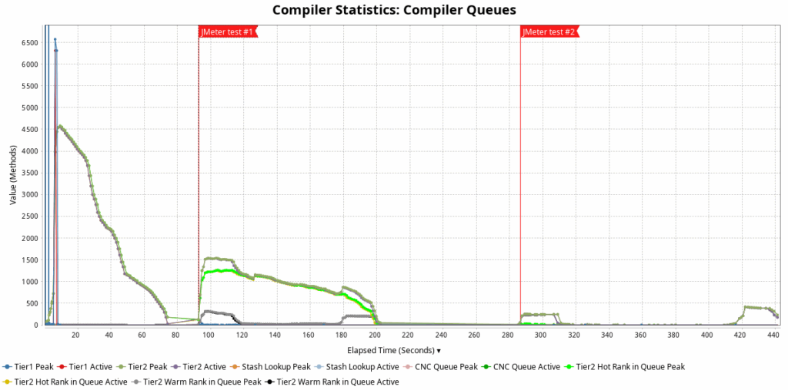
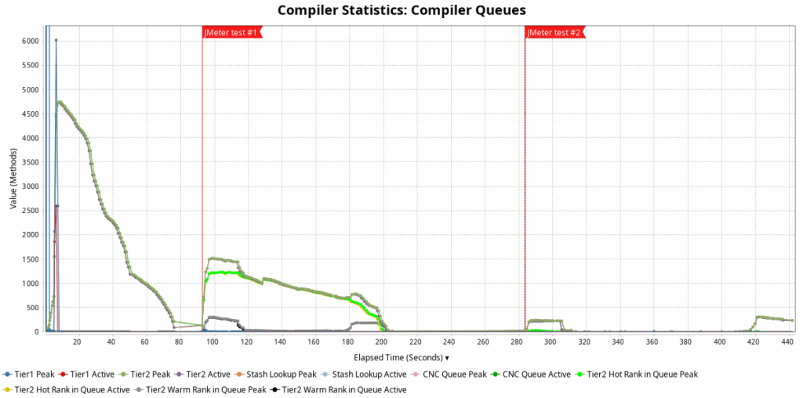

*This is the fifth and final blog post in a series on faster Java application warmup with ReadyNow. If you haven't been following the series, go back to the first blog post, [Faster Java Warmup: CRaC versus ReadyNow](https://foojay.io/today/faster-java-warmup-crac-versus-readynow/), and catch up. This post examines how to resolve a situation when traffic loads and gets redirected to an application before ReadyNow has completed compiling and optimizing bytecode.*

ReadyNow enables applications to handle load optimally by compiling bytecode to native code shortly after startup. It also optimizes the compiled code by removing unused pathways, inlining, etc. But this compiling and optimizing can't be fully executed in specific situations before traffic gets redirected to the application.

This post explores one such scenario and provides a detailed solution for development teams facing this challenge.

## Compilation only happens on traffic loads

In some cases, ReadyNow does not achieve the expected warmup improvements, and many compilations are only executed when the application's first load hits. The most common cause is that the traffic triggers the code to execute for the first time, and some classes only get loaded and initialized at that moment.

The first chart below shows a perfect example of a first set of compilations shortly after startup, plus a spike in the compiler queues at the start of the traffic \[Figure 1\]. There was time left before that event, during which the compiler had time to pre-compile the code and have it ready when needed, but couldn't execute this process fully.

The second chart shows an example where most of the compilations are handled after startup, and only a minimal number need to happen when traffic loads \[Figure 2\].

## ReadyNow waits for class loading

To compile and optimize the bytecode to native code, ReadyNow needs classes to be initialized. This happens on the "first access to a class" and performs things like calling the static initializers (`static {}` block in class) and initializing any static variables. Classes are only loaded by the class loader in the JVM when they are needed.

Because of this, some code cannot be compiled upfront but only when the system's production load first needs it. This prevents ReadyNow from achieving its primary goal of compiling the code before it's needed.

## How to fix this?

### Identifying the problem

The solution is simple: create a warmup script that calls the static code before traffic commences. This loads the necessary classes so that ReadyNow can optimize the code immediately. Finding out which method needs to be called can be challenging, but logs and analysis tools can help.

A fully optimized system can be achieved before traffic starts through an iterative process with 2 to 3 iterations, following these steps:

1. Acquire a Zing Garbage Collector log, see the [documentation](https://docs.azul.com/prime/Unified-GC-Logging.html#enabling-unified-gc-logging).
2. Acquire a ReadyNow output file from a run, preferably from a production system with the real-life load. This can be done with:
   * On the system itself with `-XX:ProfileLogOut=<path>`.
   * When using the ReadyNow Orchestrator service of Optimizer Hub:
     * `-XX:ProfileLogDumpOutputToFile=<name>`, see the [documentation of the ReadyNow Orchestrator JVM Options](https://docs.azul.com/optimizer-hub/connecting/using-readynow-orchestrator#readynow-orchestrator-jvm-options).
     * Via the /vmInstances API, if the JVM has already written a log for the service.
3. Identify the exact time when the load gets routed to the application (at X seconds).
4. Open the Garbage Collector log in GCLA (ADD LINK) and use "Add File" to load the ReadyNow Profile on top of it.
5. Select a ReadyNow chart (e.g., First Call Events -\> All Events) and examine the RAW data.
6. Search for either "CLASS_INIT" or "FIRST_CALL" and filter only those log entries.
7. Continue filtering log entries (e.g. by Organization Name, then Application Name. For example: "Acme" then "Payroll"). Alternatively, you can filter out lambdas, reflection, framework, and other non-application methods.
8. If necessary, go back to step 5 and iterate.
9. Once you have a small enough list, review the methods starting at X seconds (in #2 above) and find 1 or 2 methods to add to the startup script.

### Calling the identified code

Once you have identified the methods that get called once the traffic starts, you can create a script or automation to trigger the compilation of all the required code. Depending on your use case, this could be a script in Java, Bash, Python,... with simulated requests, an integration test, or any other solution that triggers your application to call those methods.

### Readiness check

At this point, we know which methods must be called and have a solution to execute this to trigger the code compilation. The next step is knowing when the compilation has finished, so we can send traffic to the application. To maximize the application's use, we want to minimize the time between the last compilation and the start of the traffic.

In Zing 24.06.0.0, several methods have been added to the MXBean extensions, which can request several metrics from a running JVM that can help you to identify when an application is ready to handle traffic:

* getTotalOutstandingCompiles()
* getTotalPerformedTier1Compiles()
* getTotalPerformedTier2Compiles()

These methods return the total number of enqueued and in-progress compilations, and can return the total number of tier 1 and tier 2 compilations at the time of request. Again, depending on your use case, you can define the threshold values to decide if the application is ready.

Check the [Zing MXBeans documentation](https://docs.azul.com/prime/MXBeans) for more info.

## Example with Spring Petclinic

Let's use the well-known [Spring Petclinic demo](https://github.com/spring-projects/spring-petclinic) application to illustrate the problem and solution. With the JMeter test included in this project, we can simulate a load on the application and use the Garbage Collector log files to check the compilation queues.

In this example, the application is started, after a fixed time, the JMeter test is started, and once the test is finished and another waiting time, the test is executed a second time.

### Run without a ReadyNow profile

In this first run, we don't provide a ReadyNow profile. This means the Zing runtime has no compilation info available, and can't perform any compilation upfront. As you can see in the chart, there is a little spike in compiler queues at the start of the application as the "basic" classes get loaded. When the first JMeter test starts, simulating the start of the traffic load on the application, a significant spike occurs in the number of compiler queues. When the second test gets executed, the spike is a lot smaller.

This shows that, when we use the JMeter test as a "dummy" load, we can already prepare the application to handle traffic \[Figure 3\].

### Run with a ReadyNow profile

When executing the test above, I instructed the application to generate a ReadyNow profile with `-XX:ProfileLogOut=readynow.log` and used it as input for a second test. As expected, we get the desired effect of a larger spike of compiler queues immediately after the application's startup, making most of the code available in its native format thanks to ReadyNow. With the first JMeter test, we can trigger the compilation of the remaining methods as an improved warmup step and prepare the application for the real traffic. As you can see, the number of compiler queues was further reduced at the second test run, indicating the application was fully prepared to handle real traffic \[Figure 4\].

## Generational ReadyNow profiles

As explained in an earlier blog post, "How to Train ReadyNow to Achieve Optimal Java Performance", ReadyNow can take profiles as input and output a new generation with more and improved info for the next run. In the test for this blog, I did precisely that.

The chart you see above is the result of the third-generation profile. Below are the results with the first, second, and third profiles. As you can see, the initial compiler queues spike immediately after startup, increasing as ReadyNow has more information about the code to be compiled. More importantly, the spike gets even smaller when the traffic starts with the second run of the JMeter test.

<figure class="wp-block-gallery has-nested-images columns-default is-cropped wp-block-gallery-1 is-layout-flex wp-block-gallery-is-layout-flex">
 <figure class="wp-block-image size-large">
  
 </figure>
 <figure class="wp-block-image size-large">
  
 </figure>
 <figure class="wp-block-image size-large">
  
 </figure>
</figure>

## Result

Because those "missing" classes now get loaded and initialized after startup and with the warmup script, ReadyNow can execute its expected tasks from the start or before the real traffic starts, and all required native code can be compiled upfront. This will move the compilation to the very beginning of the application, but it can still take some time to finish. The exact duration can be defined through testing, combined with the Readiness Probe to allow the [Falcon Compiler in Zing](https://docs.azul.com/prime/Falcon-Compiler) or [Cloud Native Compiler in Optimizer Hub](https://docs.azul.com/optimizer-hub/about/cloud-native-compiler) to get through most optimizations.

From experience with many customer production systems, achieving 100% of Tier 2 optimizations at startup is not usually necessary. The most essential compilations will be completed first, and doing the trailing optimizations after traffic starts is acceptable for most customers.

## Conclusion

Uninitialized classes can sometimes hinder ReadyNow's effectiveness in improving Java application warm-up times. By understanding this limitation and identifying and proactively calling the static code, you can use ReadyNow's full capabilities to optimize your application performance from startup.

By following these best practices and correctly configuring both ReadyNow and application startup procedures, organizations can achieve the optimal balance between startup time and runtime performance, ensuring their Java applications are truly "ready now" when production traffic arrives.

To read the whole ReadyNow series, start at the beginning and read through these blog posts:

* [Faster Java Warmup: CRaC versus ReadyNow](https://foojay.io/today/faster-java-warmup-crac-versus-readynow/)
* [How ReadyNow Improves Java Warmup Time](https://foojay.io/today/how-readynow-improves-java-warmup-time/)
* [How to Train ReadyNow to Achieve Optimal Java Performance](https://foojay.io/today/how-to-train-readynow-to-achieve-optimal-java-performance/)
* [Improve Your Java Applications' Startup and Compilation Speed with Optimizer Hub](https://foojay.io/today/improve-your-java-applications-startup-and-compilation-speed-with-optimizer-hub/)
* When ReadyNow Can Only Compile on Traffic Loads
