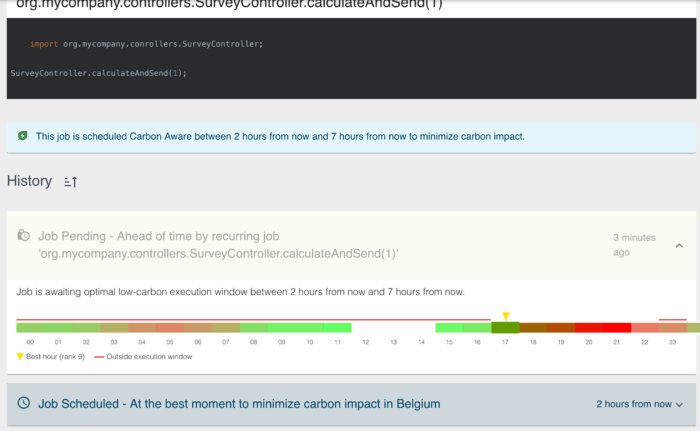

As we produce, mutate, configure, and consume more and more data in various shapes and forms, think: video on demand, AI ingestion and generation of content, Internet of Things always-on connectivity, and more.

The energy consumption of our digital lives have gone up dramatically as well. We rarely notice this, and although multiple organisations put out [alarming reports](https://www.iea-4e.org/wp-content/uploads/2025/05/Data-Centre-Energy-Use-Critical-Review-of-Models-and-Results.pdf) on energy use of data centres, policy makers seem reluctant to act fast.

We should not wait until something happens top-down. What if we as developers can also do something bottom-up, for example by reducing the carbon footprint of your application without having to cut back on the functionality?

With JobRunr v8's Carbon Aware Job Processing feature, you can fire off smart jobs that will be processed when the least amount of CO2 is being generated. Let's explore new features of JobRunr v8 and how to schedule jobs in a smart way to reduce instead of further increase your carbon footprint.

## What is JobRunr?

JobRunr is an modern background job scheduling library that runs on the Java Virtual Machine. With JobRunr, firing off jobs becomes trivial:

```java
BackgroundJob.enqueue(() -> service.process()) 
// that's it! 

BackgroundJob.schedule(now().plusHours(1), () -> service.process()); 
// will process in an hour
```

The following Foojay articles explore the basics of JobRunr:

* [Getting Started with JobRunr: Powerful Background Job Processing Library](https://foojay.io/today/getting-started-with-jobrunr-a-powerful-task-scheduler-in-ja/)
* [Task Schedulers in Java: Modern Alternatives to Quartz Scheduler](https://foojay.io/today/task-schedulers-in-java-modern-alternatives-to-quartz-scheduler/)

This article focuses on the latest release of JobRunr: v8, that is packed with a slew of new features: from Kotlin data serialisation, Kubernetes autoscaling integration possibilities with KEDA, several database optimisations to Carbon Aware Job Processing. Let us take a closer look using a real-life example.

## Carbon Aware Job Processing

As mentioned in the introduction, almost all modern web-based applications that are deployed in some kind of cloud environment make heavy use of asynchronous data processing as part of their core business. Many of these calculations or "serverless funcs" are not time bound. That is, they do not have to be processed immediately. JobRunr makes use of this to schedule these jobs in such a way that their energy consumption impact is minimised by relying on energy forecast information of energy data providers such as the [ENTSO-E](https://www.entsoe.eu/) services for the European Union (EU).

To be more concrete, ENTSO-E puts out forecasts of the coming day for energy prices. JobRunr simply schedules the job when the price is at their lowest between a user-configured time interval.

That is usually a little sooner or a little later than the preferred instant. For instance, suppose a survey needs to be sent out carrying some data calculations to a few thousand users. The calculation of the data and the sending of the survey is not immediately needed: we are fine with folks receiving the survey a couple of hours later.

Without making use of Carbon Aware Job Processing , a simple recurring job could be scheduled triggering the above:

```java
BackgroundJob.scheduleRecurrently("0 18 * * *", 
   () -> surveyController.calculateAndSend());
```

We do not know when this job ends (it could be a small survey or a big one), but we do know when `calculateAndSend()` starts: at 18h. But is that really needed at exactly 18h? Maybe it could trigger a few hours earlier or later, when less CO2 is being generated (e.g. when solar panels start generating more energy as the sun comes up).

With Carbon Aware Job Processing, we can add a margin to this precise moment. Sending out the survey an hour earlier and four hours later is still perfectly fine, as long as the job is started after our shop closes at 17h, we're all good. Adding a margin is just a matter of altering the cron string to add the slack in [ISO 8601 duration standard format](https://en.wikipedia.org/wiki/ISO_8601):

```java
BackgroundJob.scheduleRecurrently("0 18 * * * [PT1H/PT4H]", 
   () -> surveyController.calculateAndSend());
```

We can specify the flexibility of the schedule as an interval between square brackets, but we obviously have to stay within the 24h duration.

Note that this functionality is not part of the cron standard but a JobRunr-specific flavour on top of it. In case that is not readable to you, no worries: you can also make use of the `CarbonAware` and `CarbonAwarePeriod` APIs to express the schedule in code instead of in a string:

```
// option 2 
BackgroundJob.scheduleRecurrently(CarbonAware.dailyBetween(17, 22), 
   () -> surveyController.calculateAndSend()); 

// option 3 
BackgroundJob.scheduleRecurrently(CarbonAware.cron("0 18 * * *", Duration.of(1, HOURS), Duration.of(4, HOURS)), 
   () -> surveyController.calculateAndSend());
```

In case that survey generation was a one-time thing instead of a recurring thing, simply replace `scheduleRecurrently()` with `schedule()` and pass in a `CarbonAwarePeriod`:

```java
// do stuff at most three hours later
BackgroundJob.schedule(CarbonAwarePeriod.before(Instant.now().plus(3, HOURS)), 
   () -> myController.doStuff());

// do stuff between one hour from now and five hours from now
BackgroundJob.schedule(CarbonAwarePeriod.between(Instant.now().plus(1, HOURS), Instant.now().plus(5, HOURS)), 
   () -> myController.doStuff());

// ...
```

More examples and the exact API usage can be found in [the JobRunr documentation](https://www.jobrunr.io/en/documentation/background-methods/carbon-aware-jobs/).

### Carbon Aware Configuration

Before you can make use of Carbon Aware jobs, you will have to enable the new feature, as JobRunr needs to know where your data centre is located that will run JobRunr's `BackgroundJobServer` actually processing the job. Depending on your location, and thus local energy provider and natural resources available to generate energy, the output of the Carbon Intensity forecast might be different. Scheduling that survey job at 18h in Belgium might work out fine in the summer, but in Norway it could be that the optimal time for the lowest CO2 emissions is two hours earlier. Without explicitly providing that area, JobRunr will make an estimated guess based on the IP, but VPNs might mess up the settings.

Configuring that area code in the [ISO 3166-2 standard format](https://en.wikipedia.org/wiki/ISO_3166-2) (e.g. "BE" or "IT-NO") is very straightforward:

```java
JobRunr
    .configure()
    // ...
    .useBackgroundJobServer(usingStandardBackgroundJobServerConfiguration()
            .andCarbonAwareJobProcessingConfiguration(
                usingStandardCarbonAwareJobProcessingConfiguration()
                    .andAreaCode("NL")
                    // ....
            ))
    // ...
```

Is your application bootstrapped with Spring Boot, Quarkus, or Micronaut? Great, JobRunr supports these as well! In that case, just add two new entries in your trusty `application.properties`:

```
jobrunr.background-job-server.carbon-aware-job-processing.enabled=true
jobrunr.background-job-server.carbon-aware-job-processing.area-code=BE
```

See the [Carbon Aware Configuration documentation](https://www.jobrunr.io/en/documentation/configuration/carbon-aware/) for all possible configuration properties and their default values.

Now that the Carbon Aware Job Processing feature is enabled, jobs configured with a Carbon Aware margin might be run sooner or later, but no later than the deadline provided (the edge of the interval). No worries though: your critical (recurring) jobs that absolutely have to be triggered at a certain pre-set time will still be scheduled as expected.

Because ENTSO-E as the EU data provider is currently the only supported one that works with our internal Carbon Intensity API, Carbon Aware Job Processing is only supported in the EU. We are working very hard to extend this to other regions as well. JobRunr Pro customers can already implement their own Carbon Intensity API based on your own set of data energy rules.

Some more examples when adding slack to a background job might be a good way to reduce the carbon footprint of your software:

* Monthly PDF generation and saving of these files to cold storage;
* Asynchronous bulk communication channels with eventual consistency (e.g. sending out invoice reminder emails that need to be out in a day);
* LLM data set training and ingestion;
* ...

### What If There Is No Forecast?

Sometimes the figurative forecast is not all rainbows and sunshine. Sometimes, things break, async stuff clashes with each other, and unexpected things happen: for instance when the Carbon Intensity API is down and no forecast can be downloaded for a particular period or area. Or how about the deadline that passed before JobRunr was able to calculate when to schedule the job. In those rare cases, the job will still be processed the same way as if Carbon Aware Job Processing was disabled. JobRunr guarantees that all jobs will be enqueued \& processed.

In case something like that happens, the specific reason will be recorded and can be consulted in the dashboard when opening the job details. As explained in the [Getting Started with JobRunr: Powerful Background Job Processing Library](https://foojay.io/today/getting-started-with-jobrunr-a-powerful-task-scheduler-in-ja/) article, JobRunr has a UI dashboard where you can follow up on all your scheduled, running, and failed/succeeded jobs. The same is true for Carbon Aware jobs, as you can see in the following screenshot, were we inspect the job that fired off `surveyController.calculateAndSend()` from our example:

  

In the screenshot above, our example job is initially planned to run between 17h and 22h. The screenshot was taken at around 15h. The Carbon Intensity data returned by the API is visualised by the colours, with the best hour to schedule this job being at the beginning of the interval: 15h. Forecast data not relevant is marked with the red line, as this is data outside of the configured execution window of `[17, 22]`.

Additionally, you can see for which area the energy data was pulled from (in this case Belgium). It is very sunny and summertime right now, but in a few hours everyone will return home and start consuming more energy: as you can see from 19h and on, energy consumption will have a much bigger carbon impact.

## Conclusion

By leveraging JobRunr on the JVM, scheduling background jobs becomes a piece of cake.

With the new v8 release and the addition of Carbon Aware Job Processing, you can now also actively contribute towards making the world a better place by lowering carbon emissions for your non-critical jobs.

It is time to rethink how we operate in the cloud and consume energy by adding a bit of flexibility to our schedules using the simple to understand `CarbonAware` and `CarbonAwarePeriod` APIs.

In the meantime, critical jobs will run like they always did, and JobRunr will still schedule your Carbon Aware job at the preferred time or immediately in case of problems.
