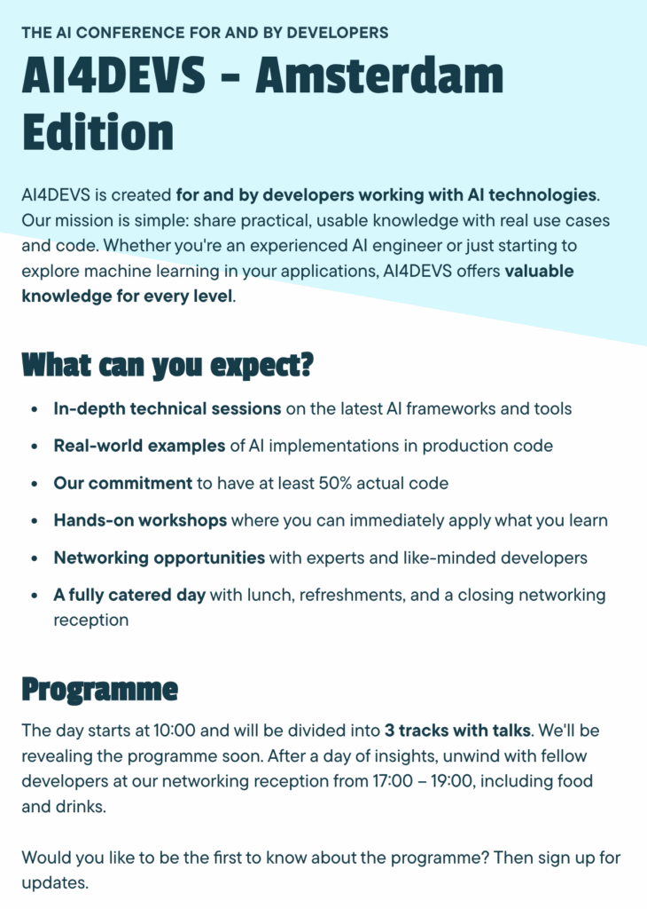

AI4DEVS, **September 19, 2025** in Amsterdam, is created **for and by developers working with AI technologies** . Our mission is simple: share practical, usable knowledge with real use cases and code. Whether you're an experienced AI engineer or just starting to explore machine learning in your applications, AI4DEVS offers **valuable knowledge for every level** . All the details are here: <https://amsterdam.ai4devs.io/>
 

All the details are here: <https://amsterdam.ai4devs.io/>
