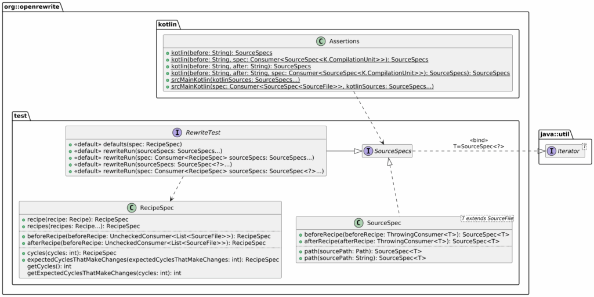

For the last two weeks, I've kicked the tires of OpenRewrite.

At first, I created a [recipe to move Kotlin source files](https://blog.frankel.ch/openrewrite-recipes/1/) as per the official recommendations with a set package name.

I then improved the [recipe to compute the root automatically](https://blog.frankel.ch/openrewrite-recipes/2/). In both versions, I thoroughly tested the recipe.

However, my testing approach was wrong. In this post, I want to describe my mistakes, and how I fixed them.

The naive approach
------------------

I originally approached the testing of the recipe in a very naive way, to say the least. As explained in the [first post](https://blog.frankel.ch/openrewrite-recipes/1/#testing-the-recipe), I used OpenRewrite's low-level APIs. Here's what I wrote:

```kotlin
// Given
val parser = KotlinParser.builder().build()                                      //1
val cu = parser.parse(
    InMemoryExecutionContext(),                                                  //2
    sourceCode
).findFirst()                                                                    //3
 .orElseThrow { IllegalStateException("Failed to parse Kotlin file") }           //3
val originalPath = Paths.get(originalPath)
val modifiedCu = (cu as K.CompilationUnit).withSourcePath(originalPath)          //4

// When
val recipe = FlattenStructure(configuredRootPackage)
val result = recipe.visitor.visit(modifiedCu, InMemoryExecutionContext())        //5

// Then
val expectedPath = Paths.get(expectedPath)
assertEquals(expectedPath, (result as SourceFile).sourcePath)                    //6
```


1. Build the Kotlin parser
2. Set an execution context; I had to choose and the in-memory one was the easiest.
3. Boilerplate to get the single compilation unit from the stream
4. Cast to a `K.CompilationUnit` because we know better
5. Explicitly call the visitor to visit
6. Assert the recipe moved the file

The above works, but requires a deep understanding of how OpenRewrite works. I didn't have that understanding, but it was good enough. It came back to bite me when I improved the recipe to compute the root.

As explained in the last post, I switched from a regular recipe to a scanning recipe. I had to provide at least two source files to test the new capability. I came up with the following:

```kotlin
// When
val recipe = FlattenStructure()
val context = InMemoryExecutionContext()
val acc = AtomicReference//String?(null)
recipe.getScanner(acc).visit(modifiedCu1, context)                               //1
recipe.getScanner(acc).visit(modifiedCu2, context)                               //1
val result1 = recipe.getVisitor(acc).visit(modifiedCu1, context)                 //2
val result2 = recipe.getVisitor(acc).visit(modifiedCu2, context)                 //2
```


1. Get the scanner and visit source files to compute the root
2. Get the visitor and visit source files to move the file

It worked, but I admit it was a lucky guess. More involved recipes would require a deeper knowledge of how OpenRewrite works, with more potential bugs. Fortunately, OpenRewrite provides the means to keep the testing code at the right level of abstraction.

The nominal approach
--------------------

The nominal approach involves a couple of out-of-the-box classes; it requires a new dependency. I didn't do it before, so now is a good time: let's introduce a to align all of OpenRewrite's dependencies:

```xml
<dependencyManagement>
    <dependencies>
        <dependency>
            <groupId>org.openrewrite.recipe</groupId>
            <artifactId>rewrite-recipe-bom</artifactId>
            <version>3.9.0</version>
            <type>pom</type>
            <scope>import</scope>
        </dependency>
    </dependencies>
</dependencyManagement>
```


It's now possible to add the dependency without a version, as Maven resolves it from the above BOM.

```xml
<dependency>
    <groupId>org.openrewrite</groupId>
    <artifactId>rewrite-test</artifactId>
    <scope>test</scope>
</dependency>
```


This brings a couple of new classes to the project:



The documentation states your test class should inherit from `RewriteTest`, which provides `rewriteRun`. The latter runs the recipe, without any need to know about its inner workings, *e.g.* , the above in-memory execution context. It's the abstraction level that we want. `Assertions` offers static methods to assert. OpenRewrite also advises using Assertion4J, which I fully endorse. Yet, I didn't do it to keep the comparison simpler.

We can rewrite the previous snippet to:

```kotlin
rewriteRun(                                                                     //1
    kotlin(sourceCode1) { spec ->                                               //2-3-4
        spec.path("src/main/kotlin/ch/frankel/blog/foo/Foo.kt")                 //5
        spec.afterRecipe {                                                      //6
            assertEquals(                                                       //7
                Paths.get("src/main/kotlin/foo/Foo.kt"),
                it.sourcePath
            )
        }
    },
    kotlin(sourceCode2) { spec ->                                               //2-3-4
        spec.path("src/main/kotlin/org/frankel/blog/bar/Bar.kt")                //5
        spec.afterRecipe {                                                      //6
            assertEquals(                                                       //7
                Paths.get("src/main/kotlin/bar/Bar.kt"),
                it.sourcePath
            )
        }
    },
)
```


1. Run the recipe
2. `kotlin` transform the string into a `SourceSpecs`
3. I'm using Kotlin, but `java` does the same for regular Java projects
4. Allow customizing the source specification
5. Customize the path
6. Hook after running the recipe
7. Assert that the recipe updated the path according to the expectations

You may have noticed that the rewritten code doesn't specify which recipe it's testing. That's the responsibility of the `RewriteTest.defaults()` method.

```kotlin
class FlattenStructureComputeRootPackageTest : RewriteTest {

    override fun defaults(spec: RecipeSpec) {
        spec.recipe(FlattenStructure())
    }

    // Rest of the class
}
```


Don't forget cycles
-------------------

If you followed the above instructions, there's a high chance your test fails with this error message:

```
java.lang.AssertionError: Expected recipe to complete in 0 cycle, but took 1 cycle. This usually indicates the recipe is making changes after it should have stabilized.
```


We need to turn to the documentation to understand this cryptic message:
> The recipes in the execution pipeline may produce changes that in turn cause another recipe to do further work. As a result, the pipeline may perform multiple passes (or cycles) over all the recipes in the pipeline again until either no changes are made in a pass or some maximum number of passes is reached (by default 3). This allows recipes to respond to changes made by other recipes which execute after them in the pipeline.
>
> -- [Execution Cycles](https://docs.openrewrite.org/concepts-and-explanations/recipes#execution-cycles)

Because the recipe doesn't rely on any other and no other recipe depends on it, we can set the cycle to 1.

```kotlin
override fun defaults(spec: RecipeSpec) {
    spec.recipe(FlattenStructure())
        .cycles(1)                                                              <1>
        .expectedCyclesThatMakeChanges(1)                                       <2>
}
```


1. Set how many cycles the recipe should run
2. Set to 0 if the recipe isn't expected to make changes

Criticisms
----------

I like what the OpenRewrite testing classes bring, but I have two criticisms.

First and foremost, why does OpenRewrite assert the number of cycles by default? It bit me in the back for no good reason. I had to dig into the documentation and understand how OpenRewrite works, although the testing API is supposed to shield users from its inner workings. I also can't help but wonder about the defaults.

```java
public class RecipeSpec {

    @Nullable
    Integer cycles;

    int getCycles() {
        return cycles == null ? 2 : cycles;                                     <1>
    }

    int getExpectedCyclesThatMakeChanges(int cycles) {
        return expectedCyclesThatMakeChanges == null ? cycles - 1 :             <2>
                expectedCyclesThatMakeChanges;
    }

    // Rest of the class body
}
```


1. Why two cycles by default? Shouldn't one be enough in most cases?
2. Why `cycles - 1` by default?

My second criticism is about how the provided testing classes make you structure your tests. I like to structure them into three parts:

1. Given: describe the initial state
2. When: execute the to-be-tested code
3. Then: assert the final state conforms to what I expect.

With OpenRewrite's abstractions, the structure is widely different from the above.

Conclusion
----------

In this post, I migrated my *ad hoc* test code to rely on OpenRewrite's provided classes. Even though they are not exempt from criticism, they offer a solid abstraction layer and make tests more maintainable.

The complete source code for this post can be found on [GitHub](https://github.com/ajavageek/flatten-kotlin-recipe).

**To go further:**

* [Recipe testing](https://docs.openrewrite.org/authoring-recipes/recipe-testing)
* [Execution Cycles](https://docs.openrewrite.org/concepts-and-explanations/recipes#execution-cycles)
* [How to resolve expected recipe cycle mismatch](https://bitflippers.dev/how-to-resolve-expected-recipe-cycle-mismatch)


*Originally published at [A Java Geek](https://blog.frankel.ch/openrewrite-recipes/3/) on June 22^nd^, 2025*

*[BOM]: Bill Of Material
