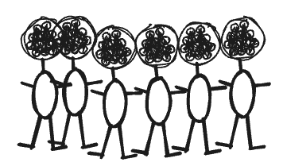
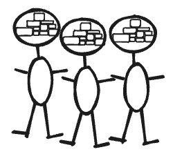
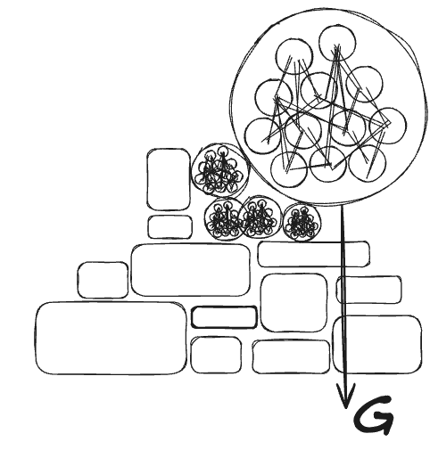

### I remember the first time I saw a diagram of a neuron (*Img.1.*). I was a school kid, and among other hobbies, I was interested in the human brain, it fascinated me. I borrowed a book from the bookstore to find out how it all worked, because these cells are responsible for more than just the functioning of the human species.



*Img.1.: Anatomy of multipolar neuron*{#caption-attachment-117093}

## Simplification of neuron, perceptron

**I** took a university course focused on neural networks and their applications, basically research, in engineering and control systems. It was a lot of fun because the neuron was simplified into an abstraction presented as a perceptron (*Img.2.*).  



*Img.2.: Schematic of a perceptron where weights are applied to the inputs, resulting in a weighted sum. The sum is passed to a step function that provides the output.*{#caption-attachment-117095}

Using multilayer perceptrons with feedforward learning or back-propagation algorithms, we were able to detect specific patterns that signaled the point of interest. With increasing complexity we faced difficulties in interpreting the results in the deterministic way. Nevertheless, the general result was astonishing.

## A breakthrough multi-layer neural network system at massive scale

**N**owadays OpenAI has made a remarkable breakthrough and released the agentic system ChatGPT in fall 2022. It was impressive to observe its capabilities of probabilistic evaluation of the next upcoming word. The technology based on transformer architecture \[3\] , which may use multilayered perceptron networks behind the scene, was acting like a "real assistant". It was and is impressive although it is just mathematical calculations on a large scale. It means the true gold of such a system are the calculated weights.

## From weights to information and back

**W**eights required to be properly trained. But such trained weights may contain a noticeable level of entropy \[4\]. The concept of entropy is used across the disciples and is associated with the level of disorder or randomness of such a system. Such a high level of entropy may be projected to unexpected behaviour. Some research work suggested could be the property of the Large Language Model (LLM) itself.

Why does entropy increase in LLM-based AI systems? LLM models excel at detecting patterns invisible to the naked eye thanks to the concept of layered neural networks and trained weights. The connections, correlations between weights, and how they are updated may be considered non-deterministic. The process can appear to be empirical or stochastic/random. This means that once the weights reach a desired state, it may be challenging to reproduce the exact process.

## Is Boolean algebra still valid?

**T** his reminds me of an operation I learned in my boolean algebra classes at university, material implication (*Img.3.*)

The material implication applies on two following conditional states x and y that when ***x* condition is false** , the result is always true independently on the condition *y* . In other words **all is correct.**  



*Img.3.: Material implication table of 2 conditional states x and y*{#caption-attachment-117096}

Perhaps such a state, where everything is correct because the assumption of determinism is false, could be a high-level explanation for the commonly observed LLM state called hallucinations. And as some scientists have already pointed out, Hallucination as the property of the system is difficult to correct.

## Are LLMs a robust repository of knowledge?

**T**he ability of LLM to highlight hidden patterns in text, speech, images, voice has been already mentioned as astonishing. LLM works very well as a translation of a written or spoken word into bytes with a probabilistic level of accuracy identified by an external human observer. The human observer evaluates the received answer/result from the agentic AI system based on LLM.

**T**he architectural scale of agentic systems may remind someone of, for example, the precisely designed ancient pyramids.

**T**he reason why the pyramid is taken into the consideration is the magnitude of the involvement of LLM based systems across the industry. While the architecture may not be seen from a higher perspective as deterministic as that of the Great Pyramids of Giza, its magnitude is evident. These pyramids are considered some of the masterpieces ever built by mankind. Is the use of LLM or Deep learning techniques heading in the same direction?

**T**he process of how and with what type of tools the pyramids were built seems to be forever lost to history. It looks similar to how the LLM achieved the most accurate results. The answer lies in the history of weights, or rather how the weights were calculated, which is also lost, but in a very short time frame.  



*Img.4.: Simplified information storage in architecture pattern, each stone inside the pyramid have deterministically defined structure and position, although fluctuation of material particles may be considered non-deterministic.This is in contrast to a neural network and its storage/extraction of information on the right side of the image. Read color indicates the element to be corrected.*{#caption-attachment-117097}

## What is the knowledge self repair factor ?

**G** iven the robustness and resiliency of the pyramids, the architecture seems to have been proven by time. Any repair can be made at the deepest layer of the system without compromising its stability (*Img.4.*). Since LLM AI agent systems are based on multilayer neural networks, which may imply a higher level of entropy, randomness, such a correction, or indeed any correction, may present a challenge with a not-entirely-deterministic outcome.

The question of repairability of such a complex and highly scalable system may address new discussions. Over the years, mankind has developed a number of enterprise design patterns for business processes that allow performing work with minimal entropy, leading to the desired result with a defined probability, i.e., an error state is considered. Such a process is deterministic and, moreover, repeatable.

An example is the SAGA pattern (long-running transaction \[6\]), where the system has the ability to recover from specific states or take action, such state is repeatable.

## Is biased information random ?

**T**he intensive development in the field of large language models reveals new insights every day and offers possible directions for improving or mitigating current challenges observed or identified in current implementations. It is possible that as humanity works with increasingly large models, deterministic information sinks deeper into the value of the probability weight. This means that we lose connected points in favor of computed weights. The side effect may occur in disability of effectively promting the question to the system (Img.5.)  

*Img.5.: A possible consequence of the intense experience of promting with an LLM agents may be damage to cognitive connectivity within the brain due to the removal of connections between stored information.*{#caption-attachment-117098}

The trigonometric functions sine and cosine are well known \[7\] (*Img.6.*) LLM transformers make extensive use of them to identify the correct word position. It is worth remembering that the entire LLM model still only predicts the next word.  



*Img.6. Sine and cosine functions plotted from 0 to 2π.*{#caption-attachment-117099}

The use of trigonometric functions has an amazing effect on word order correction. Based on the calculated LLM weights, the correction of dramatically misspelled text is astounding. However, the entire outcome of the agent system may lead to random results because the response is biased by the training data. During current development they may be observed willing to address such questions as biased data may have broader impact.

## Prompting conclusion

**H** istory has shown the power of deterministically stored information in many different areas. Humanity has trained the brains to increase neuronal connectivity and improve cognitive and other functions through evolution (*Img.7.*)  

*Img.7. Random three people who are dedicated to gathering knowledge and understanding through the process of learning, like Mr. Leonardo DaVinci, Tesla and many others*{#caption-attachment-117100}

It is very exciting to watch and contribute to the entire process of evolution in the field of artificial intelligence, whether as an individual or a group. We are constantly discovering many directions from very different perspectives, knowing that our known world must follow a number of fundamental rules, such as gravity, which exist between all entities with mass or energy (*Img. 8*).  

*Img.8.: Combining knowledge influenced by the fundamental concept of the gravity projected into the of the pyramid repair process*{#caption-attachment-117101}

The changes in the field of agentic AI systems are very intense and rapid, but the process itself is very narrow and centered around small groups of authors. The scope of impact is very wide. The ability to understand, design or cope with the current state has already predetermined requirements defined by the level of applied mathematics.

***The future is not yet written and every moment is important.***

The heavy use of agentic AI system for engineering, doctor or other duties may bring a short term satisfaction (*Img.9.*)\[10\]. Despite a numerous positive effects It would be interesting to observe a long term effect of such intensive agentic AI system use. I would be interested in improvements in IT system architectures.  



*Img.9.: Possible knowledge development of regular agentic AI system user may result in information lost through missing relations*{#caption-attachment-117102}

Willingness to contribute to the development, among other things, I helped create the JC-AI newsletter \[8\]\[9\] as part of our Java Champion initiative. Do not hesitate to contact me for future collaboration!

\[1\] <https://en.wikipedia.org/wiki/Neuron>

\[2\] <https://en.wikipedia.org/wiki/Perceptron>

\[3\] <https://en.wikipedia.org/wiki/Transformer_(deep_learning_architecture>)

\[4\] <https://en.wikipedia.org/wiki/Entropy>

\[5\] <https://en.wikipedia.org/wiki/Boolean_algebra>

\[6\] <https://en.wikipedia.org/wiki/Long-running_transaction>

\[7\] <https://en.wikipedia.org/wiki/Sine_and_cosine>

\[8\] <https://foojay.io/today/ai-newsletter-1>

\[9\] <https://foojay.io/today/jc-ai-newsletter-2>

\[10\] Value of AI knowledge: Does evolution call for deterministic or LLM biased results?
