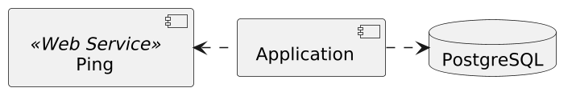
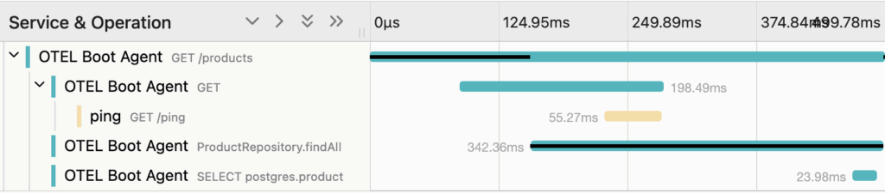
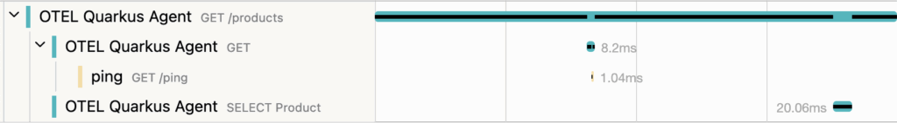
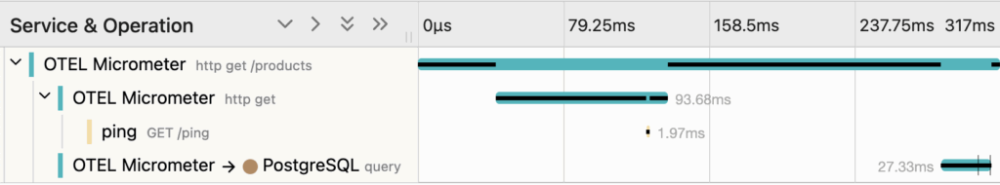
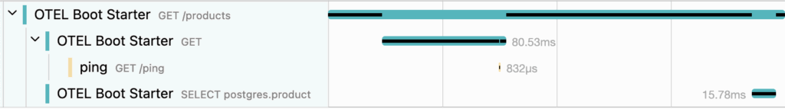
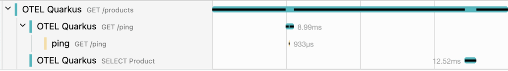

You may know I'm a big fan of OpenTelemetry. I recently finished developing a [master class for the YOW! conference](https://yowcon.com/melbourne-2025/masterclasses/560/gain-practical-in-depth-experience-with-observability-using-opentelemetry) at the end of the year. During development, I noticed massive differences in configuration and results across programming languages. Even worse, differences exist across frameworks inside the same programming language.

In this post, I want to compare the different zero-code OpenTelemetry approaches on the JVM, covering the most widespread:

* Spring Boot with Micrometer Tracing
* Spring Boot with the OpenTelemetry Agent
* OpenTelemetry Spring Boot Starter
* Quarkus
* Quarkus with the OpenTelemetry Agent

## Commonalities

I keep the architecture pretty simple:



I'm using Reactive data access on both the remote service and the database to spice up things a bit, more specifically, Kotlin coroutines. Here's the general structure:

```kotlin
val products = coroutineScope {
    val ping = async {
        // Call the ping service
    }
    val products = async {
        // Query the database
    }
    println("Received ping response: ${ping.await()}")
    products.await()
}
```

Here are the features for each stack:

|                         |             Quarkus             | Spring Boot |
|-------------------------|---------------------------------|-------------|
| Web                     | WebFlux                         | Mutiny      |
| HTTP client             | REST client                     | `WebClient` |
| Database access pattern | Record                          | Repository  |
| Database access         | Hibernate Reactive with Panache | R2DBC       |

## Running the OpenTelemetry Agent

The OpenTelemetry Java Agent is the first approach I used regarding OpenTelemetry.

The only necessary configuration is to set the agent when running the JVM:

```bash
java -javaagent:opentelemetry-javaagent.jar -jar otel-boot-agent.jar
```

The agent supports [lots of frameworks and libraries](https://github.com/open-telemetry/opentelemetry-java-instrumentation/blob/main/docs/supported-libraries.md), including Spring Boot, Quarkus, Ktor, Spark, and many others. When the application flow finds a supported framework/library, it logs a span.

The Agent upholds the standard OpenTelemetry environment variables.

```yaml
services:
  otel-boot-agent:
    build: otel-boot-agent
    environment:
      OTEL_SERVICE_NAME: OTEL Boot Agent                             #1
      OTEL_EXPORTER_OTLP_ENDPOINT: http://jaeger:4318                #2
      OTEL_METRICS_EXPORTER: none                                    #3
      OTEL_LOGS_EXPORTER: none                                       #3
```

1. OpenTelemetry service name
2. OpenTelemetry endpoint; Spring Boot uses HTTP
3. Neither metrics nor logs

Here's the Jaeger trace when calling the endpoint on the Spring Boot application:



And here's the one on Quarkus:



Spring Boot features an additional span that displays the repository call. There's no such thing available on Quarkus, as I'm using the Record pattern to access the data.

The Agent outputs the SQL query in both frameworks, *i.e.* , `SELECT product.* FROM product`. **The Java Agent works out-of-the-box**.

## Micrometer Tracing on Spring Boot

Spring Boot provides dedicated OpenTelemetry support via [Micrometer Tracing](https://docs.micrometer.io/tracing/reference/).
> Micrometer Tracing provides a simple facade for the most popular tracer libraries, letting you instrument your JVM-based application code without vendor lock-in. It is designed to add little to no overhead to your tracing collection activity while maximizing the portability of your tracing effort.

Besides the Micrometer Tracing dependency itself, you need additional ones:

* The Spring Boot Actuator
* A bridge–OpenTelemetry
* An exporter–OpenTelemetry as well

Configuration doesn't follow the OpenTelemetry standard:

```yaml
services:
  otel-boot-micrometer:
    environment:
      SPRING_APPLICATION_NAME: OTEL Micrometer                       #1-2
      MANAGEMENT_OTLP_TRACING_ENDPOINT: http://jaeger:4318/v1/traces #1-3
```

1. Different values from the OpenTelemetry specification
2. The Spring application name serves as the OpenTelemetry service name
3. Full path to the API endpoint

The above setup doesn't register the database call. To fix it, we need an additional dependency: [R2DBC Proxy](https://r2dbc.io/r2dbc-proxy/docs/current-snapshot/docs/html/).

The new trace contains the database span:



You might notice another issue: calls to the service and the database are sequential, where they should be parallel. It stems from Spring Boot not handling context propagation properly to the coroutine scope. It's an underlying work from the Spring team. Subscribe to the [GitHub issue](https://github.com/spring-projects/spring-framework/issues/35185) if you're interested.

## OpenTelemetry Spring Boot Starter

The OpenTelemetry project provides a [Spring Boot starter](https://opentelemetry.io/docs/zero-code/java/spring-boot-starter/). You need only a single dependency, and like other starters, Spring Boot magic takes care of configuration:

```xml
<dependency>
    <groupId>io.opentelemetry.instrumentation</groupId>
    <artifactId>opentelemetry-spring-boot-starter</artifactId>
</dependency>
```



The result is very similar to the previous one, including the not-parallel-but-serial issue.

## Quarkus

We saw the results of using the OpenTelemetry Agent in the first section. It's quite straightforward to use OpenTelemetry without the Agent; you need a single dependency:

```xml
<dependency>
    <groupId>io.quarkus</groupId>
    <artifactId>quarkus-opentelemetry</artifactId>
</dependency>
```

Quarkus prefixes regular OpenTelemetry environment variable names with `QUARKUS_`:

```yaml
services:
  otel-quarkus:
    environment:
      QUARKUS_OTEL_SERVICE_NAME: OTEL Quarkus                        #1
      QUARKUS_OTEL_EXPORTER_OTLP_TRACES_ENDPOINT: http://jaeger:4317 #2
```

1. OpenTelemetry service name
2. OpenTelemetry endpoint; Quarkus uses gRPC

Results are as expected:



## Discussion

OpenTelemetry approaches vary widely in both configuration and results. Unless you're prevented from using Java agents for technical or organizational reasons, I recommend using the OpenTelemetry Agent first. It handles everything you can throw at it out of the box, including the most common libraries. Barring that, you need deep knowledge of the stack you're using, lest results don't represent what happens in reality.

The complete source code for this post can be found on [GitHub](https://github.com/ajavageek/otel-jvm).

**To go further:**

* [OpenTelemetry Java Agent](https://opentelemetry.io/docs/zero-code/java/agent/)
* [Kotlin Coroutines and OpenTelemetry tracing](https://blog.frankel.ch/kotlin-coroutines-otel-tracing/)
* [Add support for Micrometer context propagation in Kotlin coroutines](https://github.com/spring-projects/spring-framework/issues/35185)

*Originally published at [A Java Geek](https://blog.frankel.ch/opentelemetry-tracing-jvm/) on August 3^rd^, 2025*
