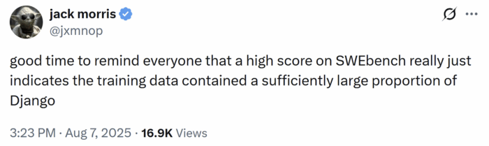
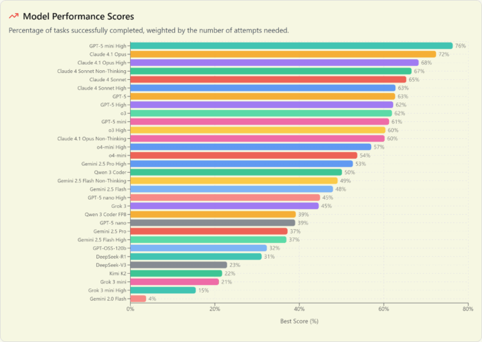
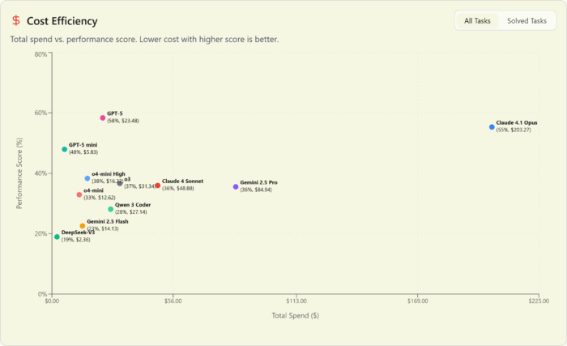
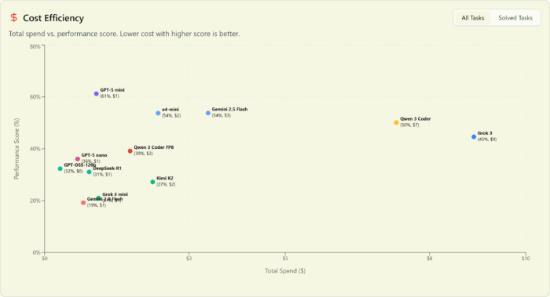
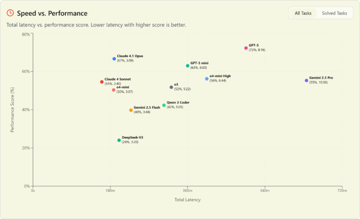
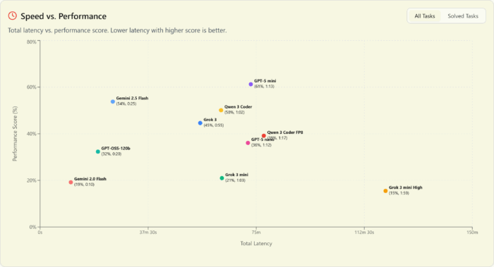
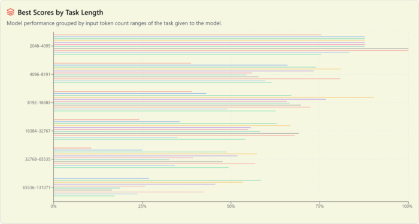

The Brokk Power Ranking is a [new open-source coding benchmark](https://github.com/BrokkAi/powerrank "new open-source coding benchmark"), featuring 93 tasks from large, real-world codebases. You can check out the current Power Ranking [here](https://brokk.ai/power-rankings?ref=blog.brokk.ai "here").

SWE-bench is the closest thing we have to a standard, objective benchmark for LLM coding performance, but it has a bunch of issues, the largest of which are that it's Python-only, and it's old enough that almost certainly some labs are now training to the test. (Epoch AI has a great writeup on [the more subtle problems with SWE-bench](https://epoch.ai/blog/what-skills-does-swe-bench-verified-evaluate?ref=blog.brokk.ai "the more subtle problems with SWE-bench") if you want to go deeper.)

As Jack Morris put it:

But if the big labs have better benchmarks they haven't released them, so it has fallen to small teams like [Aider](https://aider.chat/docs/leaderboards/ "Aider") and now Brokk to step up and move the industry forward with independent evaluations.

### GPT-5 is on top at every performance level and every price point {#h3-0-gpt-5-is-on-top-at-every-performance-level-and-every-price-point}

We've seen commentary elsewhere about GPT-5 underwhelming vs expectations and we couldn't disagree more. OpenAI came out **hard** with the GPT-5 release. Not only does it have chart-topping performance, but **also** killer value. They even quietly improved their prefix cache discount from 4x to 10x.

This is a release worthy of the GPT name that puts OpenAI back on top in every possible category, dominating the pareto frontier at the top:

  

And at the low end:

### ... but it's no speed demon {#h3-1-but-it-s-no-speed-demon}

The one chink in OpenAI's armor is that, at least as of release week, the entire GPT-5 family is slow. The only slower model in the A or B tiers is Gemini 2.5 Pro. By contrast, Sonnet 4 is screaming fast. Even Opus 4.1 is faster than GPT-5 Mini.

  

And if we drop down to the Open Round, GPT-5 nano is both slower and dumber than Flash 2.5 -- which, to be fair, is 5x more expensive. The big surprise is GPT OSS (as served by Fireworks) showing up as significantly faster than nano.

### Performance by task length {#h3-2-performance-by-task-length}

The Power Ranking tasks are up to 108k tokens long. All the models get worse at larger tasks, with the top-performing models at large tasks (GPT-5 and Gemini 2.5 Pro) falling off more slowly than the rest, but still falling off.

  

This also means that context length isn't the primary reason that newer models are passing former value king DeepSeek's offerings. Yes, V3 was only able to solve one task over 32k tokens long, but the other models in its class fall off sharply here, too. So if we look at scores counting only tasks under that threshold, V3 edges closer to Flash 2.5 but the relative rankings are unchanged.

### Other observations {#h3-3-other-observations}

* [Unlike in SWEBench](https://x.com/chatgpt21/status/1954033383094296705 "Unlike in SWEBench"), enabling thinking makes a meaningful difference in Opus 4.1 performance in the Power Ranking. We speculate that this may be due to the larger, more complex tasks involved.
* But almost no models benefited from `high` thinking over default or medium. o4 is the exception that does benefit; o3, Sonnet 4, Opus 4.1, Gemini Pro 2.5, and Gemini Flash 2.5 all saw negligible benefit, or even worse performance from overthinking. (We were unable to get reasoning=high working with GPT-5 through the litellm proxy that Brokk uses in this initial test. We will update the results when we have solved the problem.)
* The Chinese models (DeepSeek-V3, Kimi K2, and Qwen3 Coder) all did much worse than they did on SWEBench and AiderBench. This difference is especially pronounced with K2, which was rewarded by a spot in the D tier. V3 is handicapped by a context window small enough that it can't handle some Power Ranking tasks at all, but the newer models don't have that excuse. Were they trained on the test?
* Grok 3 mini is one of the top low-cost performers in AiderBench, but D-tier in the Power Ranking. Probably this is because Brokk uses only a diff-based format; full-file replacement, which grok 3 mini was configured to use in AiderBench, is too slow to be practical in the real world--or the Power Ranking, where files often contain 1000s of lines of code (vs the dozens in AiderBench tasks).
* We were unable to get a reasonable API quota from xAI to test Grok 4.
* Quantization matters. Qwen3 Coder fp8 scores significantly worse on both average and best scores than the native fp16 version. By default, you could get either one from Openrouter, or even fp4, so be careful to configure this correctly!

### Implications for builders {#h3-4-implications-for-builders}

* Build noise matters. No model did well with JGit in particular until we special-cased its Maven build to be less noisy. Besides the standard -quiet mvn flag, we added -DskipScriptExecution=true to mvn and a special BRK_SUPPRESS_STDERR flag to the test harness to keep the pollution down to a level that they weren't overwhelming the build results with chaff.
* Test quality also matters. If you have a flaky test that sometimes passes and sometimes fails, it will confuse the hell out of your LLM assistant. It's pretty confusing for humans, too. Fix your tests!

We wanted to build a benchmark that wasn't saturated, that would have meaningful gaps between the models, even at the top. We also wanted to be able to tell the difference between models down a rung, at the "intelligence too cheap to measure" level or close to it. We were able to deliver on both counts.

You can think of the Power Ranking as halfway between AiderBench ("toy" problems, usually in a single file) and SWEBench ("here's the repo and the issue description, good luck"). Like SWEBench, the Power Ranking uses real code from real repositories. But like AiderBench, the Power Ranking tells the model which files it will need to edit (but not which external-to-those-files APIs it will need, it is left to the model to determine those using Brokk's [Scan Project](https://brokk.ai/documentation/actions-toolkit?ref=blog.brokk.ai#sub-commands-of-search "Scan Project")).

Brokk's tasks are significantly larger in scope than either AiderBench's or SWEBench's:

To build the Power Rank tasks, we looked at all the commits from the last six months in these five projects that had nontrivial changes AND test coverage, and reverse engineered them to a problem description:

* Brokk
* JGit
* LangChain4j
* Apache Cassandra
* Apache Lucene

We tested all models against the Brokk tasks (the "Open Round") and the top performers against all tasks ("Finalists").

Unlike SWEBench, we did not rely on issue descriptions, which have the problem of being simultaneously too vague ("fix the race condition in the indexing system") and too specific (giving too much of the solution in the description, which [has been a problem in SWEBench](https://arxiv.org/abs/2410.06992 "has been a problem in SWEBench")).

The models tackle each task ([example](https://github.com/BrokkAi/powerrank/blob/master/codetasks/011f6c33c0b5cca7f0627c7ef992b29237ad33fd.txt "example")) in a single run of [Brokk's edit+test loop](https://brokk.ai/documentation/the-edit-loop "Brokk’s edit+test loop"). That is, the model attempts to solve the task, Brokk runs the tests and gives any errors back to the model, and it gets to try again up to 5 times.

5 is the "bend in the knee" past which we saw significantly less success. That is, when we experimented with letting models try until they self-evaluated as not making progress (or until they ran out of context window) we saw very few successes past 5, indicating that either the model did not know how to use an API correctly and was guessing, or simply wedged itself into a corner that it didn't know how to get out of.

Interesting side note: the two models that were most stubborn about continuing to try to solve a hopeless task were, by far, o3 and Qwen3 Coder, adding some evidence to the speculation that Qwen3 was trained on o3 output.

To capture the difference between a model that succeeds on the first try and one that needs multiple iterations, we assign the score for each successful task as
> score = 1.0 / log2(build_failures + 2)

The Brokk Power Ranking is open source at *<https://github.com/BrokkAI/powerrank>* and the [full results are available here](https://brokk.ai/power-ranking).

### A Note on Reasoning {#h3-5-a-note-on-reasoning}

A bare model name indicates that it was run with default reasoning tokens for most thinking models; the exception is the Claude models, where the API defaults to no reasoning at all. These were set to "medium", with the -nothink variants for thinking disabled.

We will update the Power Ranking every six months. If you know an actively maintained, open source Java repo that we should include in our task sources, give us a shout!
