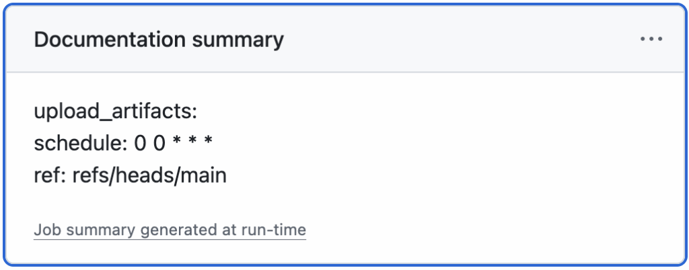

I've quite a lengthy experience with GitHub workflows, but not up to the point where I can claim I'm an expert. However, I recently developed a new workflow, and it prompted me to write this post. Feel free to add your own.

## What are GitHub workflows?

> A **workflow** is a configurable automated process that will run one or more jobs. Workflows are defined by a YAML file checked in to your repository and will run when triggered by an event in your repository, or they can be triggered manually or at a defined schedule.
>
> Workflows are defined in the `.github/workflows` directory in a repository. A repository can have multiple workflows, each of which can perform a different set of tasks, such as:
>
> * Building and testing pull requests
> * Deploying your application every time a release is created
> * Adding a label whenever a new issue is opened
>
> -- [About workflows](https://docs.github.com/en/actions/concepts/workflows-and-actions/workflows)

As such, a workflow is comparable to a Jenkins job, implemented in YAML instead of XML. Yet, the main difference is that the workflow configuration is **stored inside the code repository**, contrary to a legacy Jenkins job configuration. It doesn't look like much, but it allows using source code management approaches, including versioning and rolling back. Years ago, I worked for a customer whose DevOps team implemented a Puppet-based approach to reconstruct Jenkins jobs so the Puppet config could be stored in Git. It was a huge effort!

Note that GitHub was quite late to the party. Before it implemented workflows, I used a third-party service called [Travis CI](https://www.travis-ci.com/) that worked the same way. I switched mainly because Travis became paid and secondarily because workflows are natively part of GitHub.

💡 Tip: **Use the correct semantics** : they are called *GitHub workflows*. GitHub Actions are entirely different.

## GitHub Actions

GitHub workflows are composed of *jobs* , which themselves are composed of *steps* . Steps reference *run* commands, and a couple of optional parameters, including a name.

```yaml
jobs:
  metrics:
    runs-on: my-image                              #1
    steps:
      - name: Install dependencies via Poetry      #2
        run: poetry install                        #3
```

1. OCI image on which the workflow runs
2. Step name
3. Step command

GitHub Actions are reusable components that offer alternatives to repeating the same command over and over.
> An **action** is a pre-defined, reusable set of jobs or code that performs specific tasks within a **workflow**, reducing the amount of repetitive code you write in your workflow files. Actions can perform tasks such as:
>
> * Pulling your Git repository from GitHub
> * Setting up the correct toolchain for your build environment
> * Setting up authentication for your cloud provider
>
> You can write your own actions, or you can find actions to use in your workflows in the [GitHub Marketplace](https://github.com/marketplace?type=actions).  
>
> For example, instead of executing `git checkout`, you can use the [checkout action](https://github.com/marketplace/actions/checkout).
>
> -- [GitHub Action](https://docs.github.com/en/actions/get-started/understand-github-actions#actions)

```
jobs:
  metrics:
    runs-on: my-image
    steps:
      - uses: actions/checkout@v5                  #1
        with:                                      #2
          fetch-depth: 0
          submodules: recursive
```

1. Reference a GitHub Action
2. Action parameters

I'm a big fan of not reinventing the wheel. GitHub Actions play a big role in that.

💡 Tip: **Prefer GitHub Actions over ad-hoc commands** when possible.

## Choosing the right Action

The GitHub Marketplace hosts [plenty of actions](https://github.com/marketplace?type=actions). Actions are listed by categories. You can filter by creator type and sort by popularity.

When choosing an action, you should exert the same care as when bringing in any other dependency. Here are a couple of criteria to help you:

* Vendor: prefer verified creators
* License type: Open Source vs. closed source. With the former, check the exact terms; the Apache v2 license is very different from the GPL one.
* Pricing for commercial actions
* Check the source code repository of actions that display it and check the following information:  
  **Inception date** Activity, including the repartition of commits per committer, the number of open issues, the mean time for fixing issues, etc.  
  \*\* Documentation (reference material, tutorials, how-to guides, and explanations)
* Community, if any
* Support

💡 Tip: **Be as careful in choosing a GitHub Action as in choosing any other dependency.**

## Know your Actions

As the previous tip, this one stems from a more generic one---I speak from experience. I was developing a workflow to package a Java application. I was heavily using the workflow, and the job had to download the dependencies at every run.

```yaml
jobs:
  build:
    runs-on: ubuntu-latest
    steps:
      - uses: actions/checkout@v5
      - uses: actions/setup-java@v4                #1
        with:
          distribution: temurin
          java-version: 21
      - uses: actions/cache@v4                     #2
        with:
          path: ~/.m2/repository                   #3
          key: ${{ platform }}-maven--${{ hashFiles('**/pom.xml') }} #4
          restore-keys: |
            ${{ runner.os }}-maven-                #4
```

1. Install a JDK
2. Set up a cache. The cache is generic and can cache files across runs.
3. Cache the local Maven repository
4. Cache dependencies. The key uses the runner OS, which doesn't change, and the POM's hash. Hence, the step creates a new cache each time the POM changes.

Yet, reading the documentation, I realized I could achieve the same in a much more straightforward way:
> The action has a built-in functionality for caching and restoring dependencies. It uses toolkit/cache under hood for caching dependencies but requires less configuration settings. Supported package managers are gradle, maven and sbt. The format of the used cache key is `setup-java-${{ platform }}-${{ packageManager }}-${{ fileHash }}`, where the hash is based on the following files:
>
> * maven: `**/pom.xml`
>
> -- [Caching packages dependencies](https://github.com/marketplace/actions/setup-java-jdk#caching-packages-dependencies)

Thus, I replaced the above snippet with the following:

```yaml
jobs:
  build:
    runs-on: ubuntu-latest
    steps:
      - uses: actions/checkout@v5
      - uses: actions/setup-java@v4
        with:
          distribution: temurin
          java-version: 21
          cache: maven                             #1
```

1. This is it

💡 Tip: **Thoroughly read the documentation of actions.** Spending one hour on the documentation can help you save man-days of effort.

## Pin your dependency version

This section also takes generic advice and applies it to GitHub workflows' version. You find versions in at least two places: the OCI image and GitHub Actions' version.

You may have noticed the `runs-on: ubuntu-latest` in the previous snippets. At the moment of this writing, it points to `ubuntu-24.04`. As time passes, it will point to the latest version, with different libraries' versions. It could cause a failure during the workflow execution, or worse, change the output in ways you wouldn't notice until it's too late. You'd better set a specific version. Check [all available images](https://github.com/actions/runner-images).

Actions' versioning works differently, as they point to a GitHub repo's reference: either a tag or a commit SHA. While the OCI image is in GitHub's hands, the action is the responsibility of its provider. It means anybody with commit rights could change the content of an underlying tag. If you take security seriously, you **must** pin to a commit.

```yaml
jobs:
  build:
    runs-on: ubuntu-latest
    steps:
      - uses: actions/checkout@08c6903             #1
```

1. Pin to a specific commit

💡 Tip: Take security seriously and **pin actions to a specific commit.**

## Use the job summary

Each of your workflow steps probably outputs lots of logs. In a regular workflow, the overall amount of log lines can be quite huge. Some of them might be useful, some of them might not be, but because there's only a standard output and standard error, everything ends up in the same place. Yet, you may want to focus on specific information, *e.g.*, the number of tests run or the percentage of code coverage, in case you don't send these data somewhere else. GitHub makes it straightforward to add the data you want in the job summary.
> You can set some custom Markdown for each job so that it will be displayed on the summary page of a workflow run. You can use job summaries to display and group unique content, such as test result summaries, so that someone viewing the result of a workflow run doesn't need to go into the logs to see important information related to the run, such as failures.
>
> Job summaries support GitHub flavored Markdown, and you can add your Markdown content for a step to the `GITHUB_STEP_SUMMARY` environment file. `GITHUB_STEP_SUMMARY` is unique for each step in a job.
>
> -- [Adding a job summary](https://docs.github.com/en/actions/reference/workflows-and-actions/workflow-commands#adding-a-job-summary)

Here's a [sample](https://github.com/apache/arrow-adbc/blob/apache-arrow-adbc-19/.github/workflows/packaging.yml#L224-L228) from Apache Arrow:

```yaml
- name: Show inputs
  run: |
    echo "upload_artifacts: ${{ inputs.upload_artifacts }}" >> $GITHUB_STEP_SUMMARY
    echo "schedule: ${{ github.event.schedule }}" >> $GITHUB_STEP_SUMMARY
    echo "ref: ${{ github.ref }}" >> $GITHUB_STEP_SUMMARY
```

The [result](https://github.com/apache/arrow-adbc/actions/runs/17181739408#summary-48745051897) is:



💡 Tip: **Use GitHub job summary** to enhance developer experience.

## Understand workflows' lifecycle

Workflows run steps sequentially. A failing step cancels all remaining steps, and the workflow ends up in a `Failure` state. In the example above, it means we won't get any testing summary at all if any of the subsequent step fails. It's possible to bypass this default behavior by using the counterintuitive `if` condition.
> You can use the following status check functions as expressions in `if` conditionals. A default status check of `success()` is applied unless you include one of these functions.
>
> -- [Status check functions](https://docs.github.com/en/actions/reference/workflows-and-actions/expressions#status-check-functions)

GitHub uses `success()` by default, but options include `always()`, `cancelled()`, and `failure()`.

```yaml
- name: Show inputs
  run: |
    echo "upload_artifacts: ${{ inputs.upload_artifacts }}" >> $GITHUB_STEP_SUMMARY
    echo "schedule: ${{ github.event.schedule }}" >> $GITHUB_STEP_SUMMARY
    echo "ref: ${{ github.ref }}" >> $GITHUB_STEP_SUMMARY
```

1. Always run the step, regardless of whether the previous steps were successful or not

Now imagine the following sequence:

```yaml
- name: Step that may fail
  run: whatever
- name: Execute unit tests
  run: ./mvnw -B test                              #1
- name: Test Summary
  if: ${{ always() }}
  uses: test-summary/action@31493c7                #2
```

1. Running unit tests also generates JUnit reports
2. Use the generated JUnit reports to write a step summary

If the first step fails, the summary executes regardless of whether tests were run. If they didn't, it would fail. To avoid this, we must refine the condition further so that the summary step only runs if the unit test step did.

```yaml
- name: Step that may fail
  run: whatever
- name: Execute unit tests
  id: test                                         #1
  run: ./mvnw -B test
- name: Test Summary
  if: ${{ always() && steps.test.conclusion == 'success'}} #2
  uses: test-summary/action@31493c7
```

1. Set the step's id
2. Run only if the `test` step runs successfully

It's only a simple example, but it offers interesting options.

💡 Tip: **Know workflows' lifecycle** and use it to your advantage.

## Test locally

Lots of organizations enforce strict GitHub rules. The most widespread one is that you can't push to `master`: every commit must go through a pull request. While it makes sense for established projects, it prevents starting projects from iterating fast while retaining the commit history. In the context of developing GitHub workflows, it's definitely crippling.

Comes the act project:
> "Think globally, act locally"
>
> Run your GitHub Actions locally! Why would you want to do this? Two reasons:
>
> * **Fast Feedback** - Rather than having to commit/push every time you want to test out the changes you are making to your `.github/workflows/` files (or for any changes to embedded GitHub actions), you can use act to run the actions locally. The environment variables and filesystem are all configured to match what GitHub provides.
> * **Local Task Runner** - I love make. However, I also hate repeating myself. With `act`, you can use the GitHub Actions defined in your `.github/workflows/` to replace your `Makefile`!
>
> -- [Introduction to `act`](https://nektosact.com/)

`act` has a GitHub CLI integration that triggers the workflow according to the correct event. Let's emulate a push:

```bash
gh act push
```

Here's the output when images and actions have already been downloaded:

```
INFO[0000] Using docker host 'unix:///var/run/docker.sock', and daemon socket 'unix:///var/run/docker.sock'
[workflow.yml/test] ⭐ Run Set up job
[workflow.yml/test] 🚀  Start image=catthehacker/ubuntu:act-22.04
[workflow.yml/test]   🐳  docker pull image=catthehacker/ubuntu:act-22.04 platform= username= forcePull=true
[workflow.yml/test]   🐳  docker create image=catthehacker/ubuntu:act-22.04 platform= entrypoint=["tail" "-f" "/dev/null"] cmd=[] network="host"
[workflow.yml/test]   🐳  docker run image=catthehacker/ubuntu:act-22.04 platform= entrypoint=["tail" "-f" "/dev/null"] cmd=[] network="host"
[workflow.yml/test]   🐳  docker exec cmd=[node --no-warnings -e console.log(process.execPath)] user= workdir=
[workflow.yml/test]   ✅  Success - Set up job
[workflow.yml/test]   ☁  git clone 'https://github.com/actions/setup-java' # ref=v4
[workflow.yml/test] ⭐ Run Main actions/checkout@v4
[workflow.yml/test]   🐳  docker cp src=/Users/nico/projects/act-sample/. dst=/Users/nico/projects/act-sample
[workflow.yml/test]   ✅  Success - Main actions/checkout@v4 [9.211777902s]
[workflow.yml/test] ⭐ Run Main Setup JDK
[workflow.yml/test]   🐳  docker cp src=/home/nico/.cache/act/actions-setup-java@v4/ dst=/var/run/act/actions/actions-setup-java@v4/
[workflow.yml/test]   🐳  docker exec cmd=[/opt/acttoolcache/node/18.20.8/x64/bin/node /var/run/act/actions/actions-setup-java@v4/dist/setup/index.js] user= workdir=
[workflow.yml/test]   ❓  ::group::Installed distributions
| Resolved Java 21.0.8+9.0.LTS from tool-cache
| Setting Java 21.0.8+9.0.LTS as the default
| Creating toolchains.xml for JDK version 21 from temurin
| Writing to /root/.m2/toolchains.xml
|
| Java configuration:
|   Distribution: temurin
|   Version: 21.0.8+9.0.LTS
|   Path: /opt/hostedtoolcache/Java_Temurin-Hotspot_jdk/21.0.8-9.0.LTS/x64
|
[workflow.yml/test]   ❓  ::endgroup::
[workflow.yml/test]   ❓ add-matcher /run/act/actions/actions-setup-java@v4/.github/java.json
| Creating settings.xml with server-id: github
| Writing to /root/.m2/settings.xml
[workflow.yml/test]   ⚙  ***
| Cache Size: ~50 MB (52710428 B)
| [command]/usr/bin/tar -xf /tmp/c8ef4803-85c1-4867-ac2d-442dbce79755/cache.tzst -P -C /Users/nico/projects/act-sample --use-compress-program unzstd
| Cache restored successfully
| Cache restored from key: setup-java-linux-x64-maven-ef0e54e9035c18b60db7ea0af5e2f0c4cc5445dd6a2a2a672b91e14f14e7e4c2
[workflow.yml/test]   ✅  Success - Main Setup JDK [2.514565962s]
[workflow.yml/test]   ⚙  ::set-env:: JAVA_HOME=/opt/hostedtoolcache/Java_Temurin-Hotspot_jdk/21.0.8-9.0.LTS/x64
[workflow.yml/test]   ⚙  ::set-env:: JAVA_HOME_21_X64=/opt/hostedtoolcache/Java_Temurin-Hotspot_jdk/21.0.8-9.0.LTS/x64
[workflow.yml/test]   ⚙  ::set-output:: distribution=Temurin-Hotspot
[workflow.yml/test]   ⚙  ::set-output:: path=/opt/hostedtoolcache/Java_Temurin-Hotspot_jdk/21.0.8-9.0.LTS/x64
[workflow.yml/test]   ⚙  ::set-output:: version=21.0.8+9.0.LTS
[workflow.yml/test]   ⚙  ::set-output:: cache-hit=false
[workflow.yml/test]   ⚙  ::add-path:: /opt/hostedtoolcache/Java_Temurin-Hotspot_jdk/21.0.8-9.0.LTS/x64/bin
[workflow.yml/test] ⭐ Run Main Run "fast" tests
[workflow.yml/test]   🐳  docker exec cmd=[bash -e /var/run/act/workflow/2] user= workdir=
| [INFO] Scanning for projects...
| [INFO]
| [INFO] ----< ch.frankel.blog:act-sample >-----
| [INFO] Building act-sample 1.0-SNAPSHOT
| [INFO]   from pom.xml
| [INFO] ------------------------[ jar ]-------------------------
| [INFO]
| [INFO] --- resources:3.3.1:resources (default-resources) @ act-sample ---
| [INFO] Copying 1 resource from src/main/resources to target/classes
| [INFO]
| [INFO] --- compiler:3.14.0:compile (default-compile) @ act-sample ---
| [INFO] Recompiling the module because of changed source code.
| [INFO] Compiling 5 source files with javac [debug target 21] to target/classes
| [INFO]
| [INFO] --- resources:3.3.1:testResources (default-testResources) @ act-sample ---
| [INFO] Copying 2 resources from src/test/resources to target/test-classes
| [INFO]
| [INFO] --- compiler:3.14.0:testCompile (default-testCompile) @ act-sample ---
| [INFO] Recompiling the module because of changed dependency.
| [INFO] Compiling 1 source file with javac [debug target 21] to target/test-classes
| [INFO]
| [INFO] --- surefire:3.2.5:test (default-test) @ act-sample ---
| [INFO] Using auto detected provider org.apache.maven.surefire.junitplatform.JUnitPlatformProvider
| [INFO]
| [INFO] ------------------------------------------
| [INFO]  T E S T S
| [INFO] ------------------------------------------
| [INFO] Running ch.frankel.blog.ActSampleTest
| [INFO] Tests run: 1, Failures: 0, Errors: 0, Skipped: 0, Time elapsed: 1.120 s -- in ch.frankel.blog.ActSampleTest
| [INFO]
| [INFO] Results:
| [INFO]
| [INFO] Tests run: 1, Failures: 0, Errors: 0, Skipped: 0
| [INFO]
| [INFO] ------------------------------------------------------
| [INFO] BUILD SUCCESS
| [INFO] ------------------------------------------------------
| [INFO] Total time:  3.318 s
| [INFO] Finished at: 2025-08-22T10:26:29Z
| [INFO] ------------------------------------------------------
[workflow.yml/test]   ✅  Success - Main Run "fast" tests [20.920776212s]
[workflow.yml/test] ⭐ Run Post Setup JDK
[workflow.yml/test]   🐳  docker exec cmd=[/opt/acttoolcache/node/18.20.8/x64/bin/node /var/run/act/actions/actions-setup-java@v4/dist/cleanup/index.js] user= workdir=
| [command]/usr/bin/tar --posix -cf cache.tzst --exclude cache.tzst -P -C /Users/nico/projects/act-sample --files-from manifest.txt --use-compress-program zstdmt
| Cache Size: ~50 MB (52701753 B)
| Cache saved successfully
| Cache saved with the key: setup-java-Linux-x64-maven-ef0e54e9035c18b60db7ea0af5e2f0c4cc5445dd6a2a2a672b91e14f14e7e4c2
[workflow.yml/test]   ✅  Success - Post Setup JDK [1.01412383s]
[workflow.yml/test] ⭐ Run Complete job
[workflow.yml/test] Cleaning up container for job test
[workflow.yml/test]   ✅  Success - Complete job
[workflow.yml/test] 🏁  Job succeeded
```

I could write a couple of posts on `act`; I'll leave you to read the documentation.

💡 Tip: **Test your workflows locally** to reduce your feedback cycle time.

## Summary

1. Use the correct semantics, differentiate between workflows and actions.
2. Prefer GitHub Actions over ad-hoc commands.
3. Be as careful in choosing a GitHub Action as in choosing any other dependency.
4. Thoroughly read the documentation of each action you use.
5. Pin actions to a specific commit.
6. Use GitHub job summary to enhance developer experience.
7. Know workflows' lifecycle.
8. Test your workflows locally.

**To go further:**

* [About workflows](https://docs.github.com/en/actions/concepts/workflows-and-actions/workflows)
* [GitHub Action](https://docs.github.com/en/actions/get-started/understand-github-actions#actions)
* [GitHub Action Marketplace](https://github.com/marketplace?type=actions)
* [Runner images](https://github.com/actions/runner-images)
* [Adding a job summary](https://docs.github.com/en/actions/reference/workflows-and-actions/workflow-commands#adding-a-job-summary)
* [Status check functions](https://docs.github.com/en/actions/reference/workflows-and-actions/expressions#status-check-functions)
* [Introduction to act](https://nektosact.com/)

*Originally published at [A Java Geek](https://blog.frankel.ch/github-workflows-tips-tricks/) on August 24^th^, 2025*
