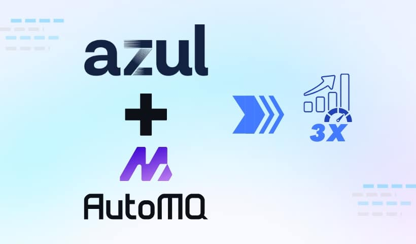
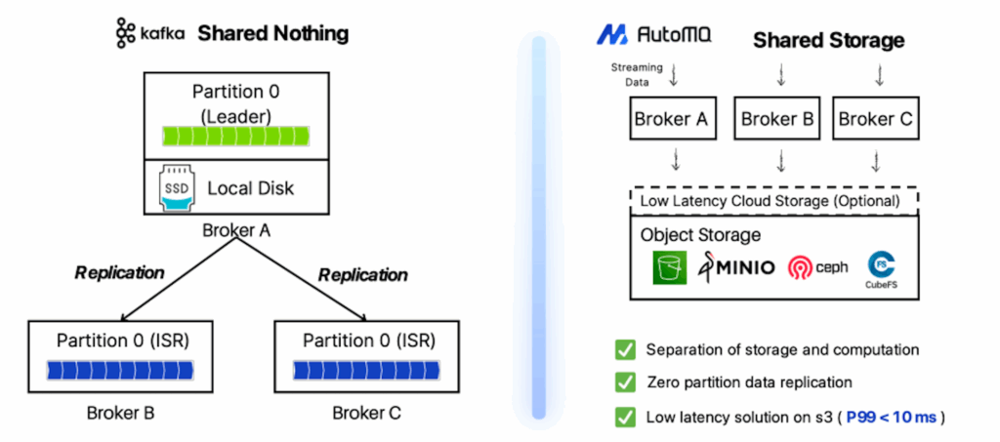
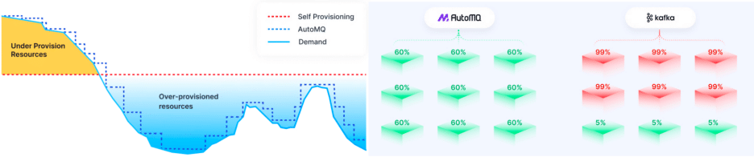
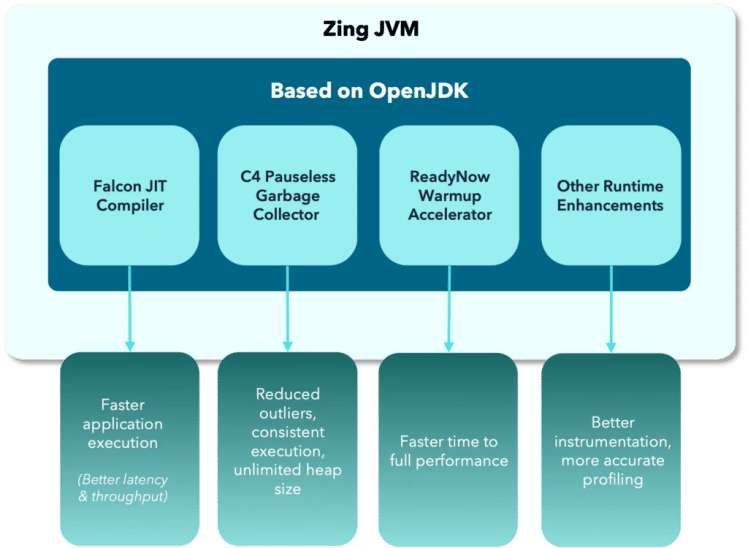
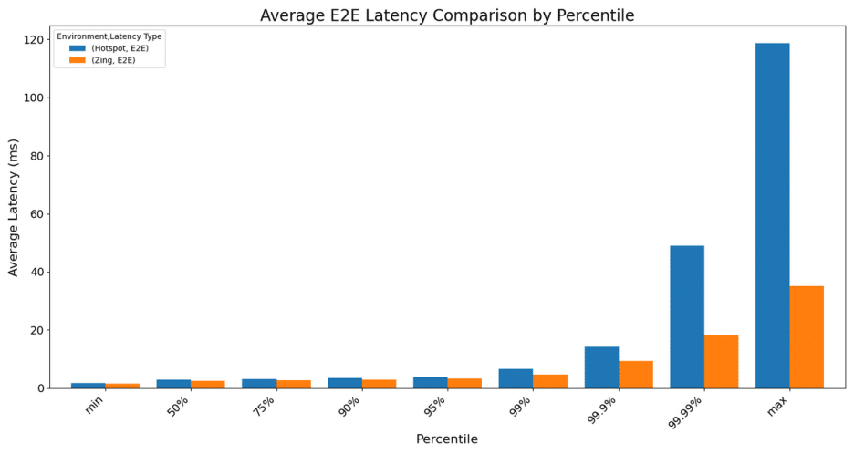
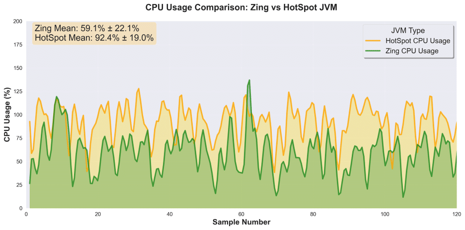

## Why is Latency so Important to Kafka?

The importance of low latency in Kafka stems from the use cases it enables. Many applications that rely on Kafka are time-sensitive.

* **Real-time applications**, such as financial trading platforms, fraud detection systems, and real-time monitoring services, depend on obtaining the most current information available. A delay of even a few seconds could mean the difference between a successful trade and a missed opportunity, or a prevented fraudulent transaction and a financial loss.
* **User experience** is another area where latency plays a significant role. Think about in-app notifications, live-updating dashboards, or multiplayer games. A snappy, responsive system feels good to use. Sluggishness, on the other hand, can be a significant turn-off for users.
* From an **operational perspective**, latency is a key indicator of health for your Kafka cluster. A spike in latency can be an early warning sign of a problem, such as a network bottleneck or a slow consumer, which can lead to message backlogs and system instability if left unaddressed.

Maintaining low latency in the cloud with traditional Kafka is challenging. Its architecture couples compute and storage, making scaling slow and expensive due to data rebalancing. This creates a complex trade-off between high costs from overprovisioning and poor performance during traffic spikes. To solve this, new cloud-native streaming systems have emerged with a different architectural approach.

## Introduction of AutoMQ

AutoMQ is a next-generation, open-source [Kafka solution](https://automq.com?utm_source=seo_inner_link), available on [GitHub](https://github.com/AutoMQ/automq?utm_source=seo_inner_link) under the Apache 2.0 license. It is engineered to run efficiently and cost-effectively in the cloud by fundamentally re-architecting its design. The core innovation of AutoMQ is the complete separation of compute (the brokers) and storage. Unlike traditional Kafka, which ties data to broker disks, AutoMQ uses cloud object storage, such as Amazon S3, as its primary and durable data store. This allows compute and storage resources to scale independently of one another.

This modern architecture provides [several key advantages](https://www.automq.com/automq-vs-kafka?utm_source=seo_inner_link) for cloud deployments:

* **Reduced TCO by up to 90%:** By leveraging affordable object storage like Amazon S3 and eliminating costly cross-AZ data replication traffic, AutoMQ dramatically [lowers the total cost of ownership](https://www.automq.com/solutions/10x-cost-effective?utm_source=seo_inner_link).
* **True Elasticity:** Clusters can be scaled up or down in seconds to match real-time demand. This avoids the slow and disruptive data rebalancing process standard in traditional Kafka, which can take hours or even days.
* **Self-Balancing and Healing:** The stateless nature of the brokers means the cluster can automatically balance workloads and recover from node failures without requiring manual intervention.
* **100% Kafka Compatibility:** AutoMQ is a drop-in replacement for Kafka. You can migrate existing applications and connect your tools using the same familiar protocol and APIs without any code changes.

## Introducing Azul Zing Builds of OpenJDK

Azul Zing, part of Azul Platform Prime, is a high-performance Java Virtual Machine (JVM) specifically engineered to provide consistent, low-latency performance for Java applications. It serves as a drop-in replacement for standard JVMs, such as OpenJDK HotSpot, allowing you to use it without modifying your application code.

Azul Zing improves Java application performance in multiple, orthogonal ways:

* **Elimination of pauses caused by Garbage Collection (GC)**: The C4 collector cleans up memory at the same time as your application is running, avoiding the "stop-the-world" pauses common in other JVMs. This design effectively removes garbage collection as a source of latency. For time-sensitive services like Kafka, this is a critical issue.
* **Producing more efficient generated machine code**: The Falcon JIT compiler optimises your application code as it runs. Zing's Falcon JIT compiler produces code that is, on average, 40% faster than OpenJDK's HotSpot JIT compiler.
* **Improving JVM warmup and eliminating pauses caused by deoptimizations**: Zing's ReadyNow technology dramatically enhances the warm-up behavior of Java applications by persisting profiling information from previous runs so subsequent runs don't have to learn optimization patterns from scratch. This solves Java's warm-up problem and ensures peak application performance is available immediately without long warm-up periods or latency outliers due to invalid optimizations.

For the Kafka ecosystem, where brokers and client applications are built on Java, Azul Zing provides a direct path to superior performance. By ensuring the underlying JVM doesn't introduce random pauses and further improving the overall performance, it allows the entire data pipeline to run smoothly, predictably, and with low latency, as modern services demand.

## Performance Test \& Explanation

To understand the real-world impact of the JVM on our Kafka workload, we conducted a head-to-head comparison between Azul Zing and the standard OpenJDK HotSpot. We focused on two critical metrics for any large-scale messaging system: end-to-end latency and CPU utilization.

### Test Environment Configuration

### Latency: Taming the Tail

For systems like Kafka, average latency only tells part of the story. It's the outliers---the highest latency requests---that can disrupt service stability and impact user experience. This is where **tail latency** (p99 and beyond) becomes a crucial metric.

Our results showed a clear advantage for Azul Zing in this area.

While average latencies were comparable, the difference became pronounced at the higher percentiles. When running on OpenJDK HotSpot, the 99.99th percentile latency averaged **48.9 ms** , with maximum spikes exceeding **118 ms**.

In contrast, Azul Zing delivered a **much more consistent performance** . The 99.99th percentile latency averaged just **18.3 ms** , and the maximum latency was capped at a mere **35.1 ms**. It prevents the extreme latency spikes that can affect the most sensitive operations, ensuring a more predictable and reliable system.

### CPU Utilization: Do More with Less

The second key finding was the difference in CPU consumption under sustained load. Azul Zing's Falcon JIT compiler continuously optimizes the running code. After an initial optimization phase, the results were precise.

The numbers from our consecutive test runs highlight efficiency gains. On a 2-core test server (where maximum utilization is 200%), the average CPU utilization was:

* **OpenJDK HotSpot:** 92.4%
* **Azul Zing:** 59.1%

Once fully optimized, **Azul Zing reduced CPU usage by approximately one-third compared to OpenJDK HotSpot, while handling the**same workload.

This reduction in CPU overhead is significant. It means more processing headroom is available for the application itself, which can translate to handling more traffic on the same hardware or reducing infrastructure costs.

## Future Outlook

The performance comparison showed that running AutoMQ for Kafka on the Azul Zing JVM provides **noticeable improvements** over a standard OpenJDK environment. The Azul platform **eliminates extreme tail latency spikes** , ensuring more predictable performance. Additionally, it **lowers the CPU load** required to handle the same amount of traffic, which can increase throughput or reduce infrastructure costs.

Ultimately, this test highlights a perfect match. **AutoMQ** provides a modern, elastic, and cost-effective architecture for Kafka by leveraging cloud object storage. When paired with **Azul Zing**, which provides a stable, pause-less runtime environment, the result is a highly reliable and resource-efficient streaming solution. This combination is engineered to meet the demands of modern, real-time applications, delivering both architectural innovation and runtime stability.

[Check here for more information about running AutoMQ or Kafka workloads on Azul Zing](https://www.azul.com/technologies/kafka/).  

And if you're ready to dive in, you can [start a free trial of AutoMQ](https://console.automq.cloud/?utm_source=blog_foojay).

Originally [published on the AutoMQ blog](https://www.automq.com/blog/automq-zing-boost-latency-performance) on August 21, 2025.
