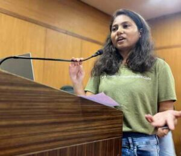
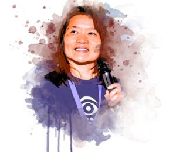

The wait is over---**AI4Devs Amsterdam has just published its official schedule**, and it's packed with talks that every developer working with (or curious about) AI will want to catch.

From live coding sessions to hands-on workshops, from security insights to multi-agent architectures—the program is designed to keep things practical, technical, and deeply relevant.

Whether you're already building AI-powered systems or just starting to explore what's possible, this year's edition has something for you. Let's take a look at the highlights.

## 📅 Event Details

**Date:** 19 September 2025  
**Location:** iO Campus Amsterdam, Spaklerweg 52  
**Time:** 10:00 -- 19:00 (Keynotes → Sessions → Drinks \& Networking)

## 🔎 A Program for Every Developer

This year's schedule brings together sessions across **Python, Java, Data Science, and JavaScript** .  

Whether you're coding in Python notebooks, building enterprise systems in Java, exploring AI-driven APIs with JavaScript, or analyzing data for real-world insights—you'll find something practical and inspiring.

Here are some examples by technology:

* **Python-focused sessions**: Merel Theisen (QuantumBlack, McKinsey) on embedding software engineering best practices into AI projects with Kedro, and Mary Grygleski (AI Collective) on harnessing event-driven and multi-agent architectures.
* **Data Science-focused sessions**: Prachi Jamdade (Gravitee) on building API endpoints for AI agents, and Nimo Beeren (iO) on building effective multi-agent applications.
* **Java/Kotlin-focused sessions**: Josh Long (Spring Developer Advocate, Broadcom) on Bootiful Artificial Intelligence, and Anton Arhipov (JetBrains) on building AI agents in Kotlin

Attendees will also find deep dives into:

* **AI frameworks and libraries**: Spring AI, CrewAI, Kedro, Spark, Apache Iceberg
* **Architectures**: Multi-agent systems, event-driven workflows, scalable AI systems
* **Engineering practices**: Secure LLM integrations, spec-driven development, best practices for AI projects
* **Collaboration \& productivity**: AI-powered developer assistance, teamwork in the age of AI
* **Cutting-edge tools**: MCP protocol, API endpoint generation, Brokk platform

## 🎤 Meet the Speakers \& Sessions

Here's a quick snapshot of who's speaking and what they'll be covering:

|   Time    |                                              Speaker                                               |                                                                              Talk                                                                              |                         Image                          |
|-----------|----------------------------------------------------------------------------------------------------|----------------------------------------------------------------------------------------------------------------------------------------------------------------|--------------------------------------------------------|
| **10:15** | [Josh Long](https://amsterdam.ai4devs.io/speakers/josh-long) (Spring Developer Advocate, Broadcom) | [*Bootiful Artificial Intelligence*](https://amsterdam.ai4devs.io/speakers/josh-long)                                                                          |                     |
| **11:00** | [Pratik Patel](https://amsterdam.ai4devs.io/speakers/pratik-patel) (Azul)                          | [*AI-Powered Data Exploration: Interacting with Apache Iceberg via Spark and LLMs*](https://amsterdam.ai4devs.io/speakers/pratik-patel)                        |              |
| **11:55** | [Anton Arhipov](https://amsterdam.ai4devs.io/speakers/anton-arhipov) (JetBrains)                   | [*Building AI Agents in Kotlin*](https://amsterdam.ai4devs.io/speakers/anton-arhipov)                                                                          |             |
|           | [Johan Hutting](https://amsterdam.ai4devs.io/speakers/johan-hutting) (ING)                         | [*AI developer assistance in practice*](https://amsterdam.ai4devs.io/speakers/johan-hutting)                                                                   |             |
|           | [Maarten Vandeperre](https://amsterdam.ai4devs.io/speakers/maarten-vandeperre) (Red Hat)           | [*The Room of Requirements for Developers: Scaling AI Magic with Internal Portals*](https://amsterdam.ai4devs.io/speakers/maarten-vandeperre)                  |  |
| **13:40** | [Simon Martinelli](https://amsterdam.ai4devs.io/speakers/simon-martinelli) (Martinelli LLC)        | [*Spec-driven Development: How AI Changed Everything (And Nothing)*](https://amsterdam.ai4devs.io/speakers/simon-martinelli)                                   |       |
|           | [Prachi Jamdade](https://amsterdam.ai4devs.io/speakers/prachi-jamdade) (Gravitee)                  | [*Building API Endpoints as MCP Tools for AI Agents using CrewAI*](https://amsterdam.ai4devs.io/speakers/prachi-jamdade)                                       |           |
|           | [Nimo Beeren](https://amsterdam.ai4devs.io/speakers/nimo-beeren) (iO)                              | [*Building Effective Multi-Agent Applications*](https://amsterdam.ai4devs.io/speakers/nimo-beeren)                                                             |                |
| **14:35** | [Brian Vermeer](https://amsterdam.ai4devs.io/speakers/brian-vermeer) (Snyk)                        | [*Breaching LLM-Powered Applications: Overcoming Security and Privacy Challenges*](https://amsterdam.ai4devs.io/speakers/brian-vermeer)                        |                    |
|           | [Sven Peters](https://amsterdam.ai4devs.io/speakers/sven-peters) (Atlassian)                       | [*AI Changed the Rules for Teamwork—Are You Ready?*](https://amsterdam.ai4devs.io/speakers/sven-peters)                                                      |               |
|           | [Mary Grygleski](https://amsterdam.ai4devs.io/speakers/mary-grygleski) (AI Collective)             | [*Harnessing Event-Driven and Multi-Agent Architectures for Complex Workflows in Generative AI Systems*](https://amsterdam.ai4devs.io/speakers/mary-grygleski) |           |
| **15:50** | [Jonathan Ellis](https://amsterdam.ai4devs.io/speakers/jonathan-ellis) (Brokk)                     | [*From Cassandra to Brokk: Building AI-Native Platforms*](https://amsterdam.ai4devs.io/speakers/jonathan-ellis)                                                |           |
|           | [Soham Dasgupta](https://amsterdam.ai4devs.io/speakers/soham-dasgupta) (Microsoft)                 | [*AI Developer Odyssey: Navigating Use Cases, Models, and Technical Patterns*](https://amsterdam.ai4devs.io/speakers/soham-dasgupta)                           |          |
| **16:45** | [Merel Theisen](https://amsterdam.ai4devs.io/speakers/merel-theisen) (QuantumBlack, McKinsey)      | [*Embedding software engineering best practices into AI projects with Kedro*](https://amsterdam.ai4devs.io/speakers/merel-theisen)                             |            |
|           | [Christian Tzolov](https://amsterdam.ai4devs.io/speakers/christian-tzolov) (Broadcom)              | [*Building Scalable AI Systems with Spring AI and MCP*](https://amsterdam.ai4devs.io/speakers/christian-tzolov)                                                |       |

👉 Full program available on the official site: [amsterdam.ai4devs.io/program](https://amsterdam.ai4devs.io/program)

## 🌟 Why This Year is Special

* **Code-first learning**: Every session has at least 50% code.
* **Top-tier speakers**: From Java Champions and CTOs to engineers shaping AI frameworks.
* **Hands-on workshops**: Learn by doing, not just listening.
* **Networking built-in**: Lunch and drinks make it easy to connect with peers.

This is **not** a fluffy AI hype conference—it's a developer-first gathering focused on what you can actually build and ship.

## 🔗 Join Us

Ready to dive in?  

Check out the full schedule and grab your spot here: [AI4Devs Amsterdam 2025](https://amsterdam.ai4devs.io/)
