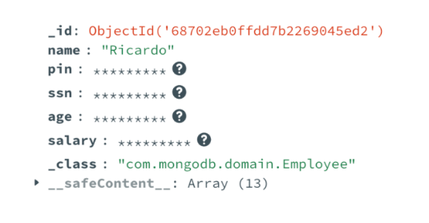
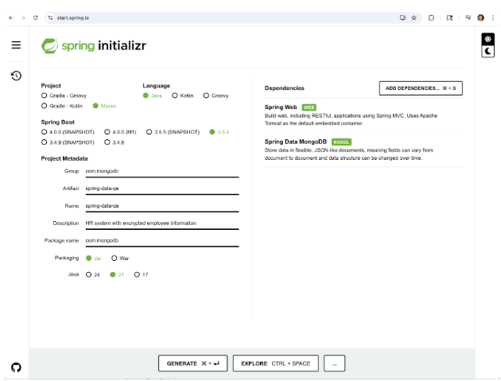
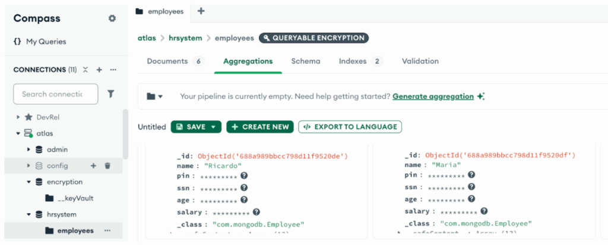

Information is one of the most valuable assets in computing and keeping it protected is even more critical. When we talk about data protection, it's not just about preventing breaches or leaks; it's also about complying with privacy regulations and protecting user data.

MongoDB provides strong encryption capabilities, including in transit, at rest, and in use. The Queryable Encryption feature falls into the *in use* category. It allows data to be encrypted on the client side, so that even with access to the database and its credentials, no one can read the protected fields without the proper encryption key. At the same time, it supports querying over encrypted fields, making it possible to filter, match, or retrieve data without compromising confidentiality.

In this tutorial, we'll implement this feature using Spring Data MongoDB, applying encryption to sensitive fields in a sample human resources (HR) system.

Why Queryable Encryption? {#h2-0-why-queryable-encryption}
----------------------------------------------------------

Imagine a common scenario in HR systems: You receive a regulatory requirement to protect employee data using encryption. At first, encrypting fields seems enough. But then comes a second requirement---you also need to search over that encrypted data.

That's exactly where [Queryable Encryption](https://www.mongodb.com/docs/v7.0/core/queryable-encryption/?utm_campaign=devrel&utm_source=third-party-content&utm_medium=cta&utm_content=query-foojay&utm_term=tony.kim) comes in. MongoDB currently supports several query types over encrypted fields, including Equality, Range, Prefix, and Suffix.

To implement it, we typically follow four steps:

1. Specify which fields should be encrypted.  
2. Define whether each field should be queryable.  
3. Create the encrypted collection with the appropriate encryptedFields configuration.  
4. Perform regular operations: The client handles encryption and decryption transparently.

If you're interested in seeing more advanced details about Queryable Encryption, including how to use it directly with the MongoDB Java Driver and a deeper explanation of how it works, I recommend checking out my other article: [Java Meets Queryable Encryption](https://www.mongodb.com/developer/products/atlas/java-queryable-encryption/?utm_campaign=devrel&utm_source=third-party-content&utm_medium=cta&utm_content=query-foojay&utm_term=tony.kim).

A quick look at Spring Data MongoDB {#h2-1-a-quick-look-at-spring-data-mongodb}
-------------------------------------------------------------------------------

Spring Data MongoDB is a module within the Spring ecosystem that makes it easier to work with MongoDB. It provides a familiar way to interact with MongoDB using the Spring programming model.

Starting with version [4.5.0](https://github.com/spring-projects/spring-data-mongodb/releases/tag/4.5.0), the framework introduced several important changes, including support for Queryable Encryption.

If you're new to using Spring Data with MongoDB or want to explore more advanced use cases, check the [Spring Data Unlocked](https://www.mongodb.com/developer/products/mongodb/springdata-getting-started-with-java-mongodb/?utm_campaign=devrel&utm_source=third-party-content&utm_medium=cta&utm_content=query-foojay&utm_term=tony.kim) series that walks through these concepts in detail.

Use case: HR system with encrypted fields {#h2-2-use-case-hr-system-with-encrypted-fields}
------------------------------------------------------------------------------------------

To better understand how Spring Data MongoDB works with Queryable Encryption, we'll build a simple Java application for an HR system. This application will use a document model like the one below:

<pre class="EnlighterJSRAW" data-enlighter-language="generic" data-enlighter-theme="" data-enlighter-highlight="" data-enlighter-linenumbers="" data-enlighter-lineoffset="" data-enlighter-title="" data-enlighter-group="">{

&nbsp;&nbsp;&nbsp;"name": "Ricardo",

&nbsp;&nbsp;&nbsp;"pin": "001",

&nbsp;&nbsp;&nbsp;"ssn": 223,

&nbsp;&nbsp;&nbsp;"age": 36,

&nbsp;&nbsp;&nbsp;"salary": 1000.50

}</pre>

In this scenario, fields such as pin, ssn, age, and salary will be encrypted using the new annotations introduced in Spring Data MongoDB 4.5, including @Encrypted, @Queryable, and @RangeEncrypted.

We're not only encrypting sensitive information, but also making it searchable, with support for both:

* Equality queries: find an employee by ssn  
* Range queries: filter employees by age or salary  

To keep things simple and practical, our application will expose four basic endpoints:

* Create a new employee  
* Retrieve all employees  
* Find an employee by SSN  
* Filter employees by age or salary range  

At the end, when we open a document in [MongoDB Compass](https://www.mongodb.com/products/tools/compass/?utm_campaign=devrel&utm_source=third-party-content&utm_medium=cta&utm_content=query-foojay&utm_term=tony.kim), we'll see encrypted fields as unreadable binary blobs, only decryptable by the client configured with the proper keys:

<figure class="wp-block-image size-full is-resized">
 
</figure>

Setting up the project {#h2-3-setting-up-the-project}
-----------------------------------------------------

TL;DR

*If you just want to jump straight into the code, you can find the full project on* [*GitHub*](https://github.com/mongodb-developer/spring-data-queryable-encryption)*. It includes all the setup needed to run Queryable Encryption with Spring Data MongoDB.*

Let's start by creating our Spring Boot project using the official[Spring Initializr](https://start.spring.io/). This tool allows us to quickly generate a base project with the dependencies we need.

For this demo, we'll add the following dependencies:

* Spring Web, to expose our REST endpoints  
* Spring Data MongoDB, to interact with our MongoDB database  

Configure the project properties as shown in the image, then generate and unzip the project to get started.

Configuring dependencies and properties {#h2-4-configuring-dependencies-and-properties}
---------------------------------------------------------------------------------------

### Adding mongodb-crypt {#h3-5-adding-mongodb-crypt}

The first thing we need to do is include the mongodb-crypt library in our project. This library is essential when working with Queryable Encryption in Java applications, handling the low-level cryptographic operations required by the MongoDB driver. Open the pom.xml and include the following dependency:

<pre class="EnlighterJSRAW" data-enlighter-language="generic" data-enlighter-theme="" data-enlighter-highlight="" data-enlighter-linenumbers="" data-enlighter-lineoffset="" data-enlighter-title="" data-enlighter-group="">&lt;dependency&gt;

&nbsp;&nbsp;&nbsp;&lt;groupId&gt;org.mongodb&lt;/groupId&gt;

&nbsp;&nbsp;&nbsp;&lt;artifactId&gt;mongodb-crypt&lt;/artifactId&gt;

&nbsp;&nbsp;&nbsp;&lt;version&gt;5.5.1&lt;/version&gt;

&lt;/dependency&gt;</pre>

### Application.yml configuration {#h3-6-application-yml-configuration}

Now, let's open the application.yml file (or create one if it doesn't exist) and define the following values:

<pre class="EnlighterJSRAW" data-enlighter-language="generic" data-enlighter-theme="" data-enlighter-highlight="" data-enlighter-linenumbers="" data-enlighter-lineoffset="" data-enlighter-title="" data-enlighter-group="">app:

&nbsp;mongodb:

&nbsp;&nbsp;&nbsp;uri: ${MONGODB_URI}

&nbsp;&nbsp;&nbsp;cryptSharedLibPath: ${CRYPT_PATH}

&nbsp;&nbsp;&nbsp;keyVaultNamespace: encryption.__keyVault

&nbsp;&nbsp;&nbsp;encryptedDatabaseName: hrsystem

&nbsp;&nbsp;&nbsp;encryptedCollectionName: employees

logging:

&nbsp;level:

&nbsp;&nbsp;&nbsp;org.springframework.data.mongodb: DEBUG</pre>

Alright, we can see some familiar settings here, like the uri, which defines the connection string to MongoDB, and the database/collection names where our encrypted data will live (hrsystem and employees).

But two properties stand out and deserve a quick explanation:

* keyVaultNamespace: This tells MongoDB where to store and retrieve the encryption keys. In our case, they'll be saved in the __keyVault collection inside the encryption database.  
* cryptSharedLibPath: This points to the native cryptographic library that handles encryption and decryption on the client side. Without this, the app can't use Queryable Encryption.

To resolve this library dependency, we need to [download](https://www.mongodb.com/docs/v6.0/core/queryable-encryption/reference/shared-library/#download-the-automatic-encryption-shared-library&utm_source=third-party-content%20&utm_medium=cta%20&utm_content=spring_data_with_queryable_encryption%20&utm_term=ricardo.mello) the automatic encryption shared libraryc and save it somewhere to use later.

### Accessing properties in the code {#h3-7-accessing-properties-in-the-code}

Now that we've defined our configuration values in the application.yaml file, we need a way to access them inside our application. To do this, create a simple class:

<pre class="EnlighterJSRAW" data-enlighter-language="generic" data-enlighter-theme="" data-enlighter-highlight="" data-enlighter-linenumbers="" data-enlighter-lineoffset="" data-enlighter-title="" data-enlighter-group="">@Component

@ConfigurationProperties(prefix = "app.mongodb")

public class AppProperties {

&nbsp;&nbsp;&nbsp;protected String uri;

&nbsp;&nbsp;&nbsp;protected String cryptSharedLibPath;

&nbsp;&nbsp;&nbsp;protected String keyVaultNamespace;

&nbsp;&nbsp;&nbsp;protected String encryptedDatabaseName;

&nbsp;&nbsp;&nbsp;protected String encryptedCollectionName;

&nbsp;&nbsp;&nbsp;// getters and setters

}</pre>

Note: Don't forget to generate getters and setters for all the fields in the AppProperties class.

Building the application layers {#h2-8-building-the-application-layers}
-----------------------------------------------------------------------

### The domain model {#h3-9-the-domain-model}

Now, let's define the data we'll be working with throughout the project. We'll use a simple Employee record to represent an employee in our HR system:

<pre class="EnlighterJSRAW" data-enlighter-language="generic" data-enlighter-theme="" data-enlighter-highlight="" data-enlighter-linenumbers="" data-enlighter-lineoffset="" data-enlighter-title="" data-enlighter-group="">@Document(collection = "employees")

public record Employee(

&nbsp;&nbsp;&nbsp;&nbsp;&nbsp;&nbsp;&nbsp;@Id

&nbsp;&nbsp;&nbsp;&nbsp;&nbsp;&nbsp;&nbsp;String id,

&nbsp;&nbsp;&nbsp;&nbsp;&nbsp;&nbsp;&nbsp;String name,

&nbsp;&nbsp;&nbsp;&nbsp;&nbsp;&nbsp;&nbsp;@Encrypted

&nbsp;&nbsp;&nbsp;&nbsp;&nbsp;&nbsp;&nbsp;String pin,

&nbsp;&nbsp;&nbsp;&nbsp;&nbsp;&nbsp;&nbsp;@Queryable(queryType = "equality")

&nbsp;&nbsp;&nbsp;&nbsp;&nbsp;&nbsp;&nbsp;@Encrypted

&nbsp;&nbsp;&nbsp;&nbsp;&nbsp;&nbsp;&nbsp;int ssn,

&nbsp;&nbsp;&nbsp;&nbsp;&nbsp;&nbsp;&nbsp;@RangeEncrypted(

&nbsp;&nbsp;&nbsp;&nbsp;&nbsp;&nbsp;&nbsp;&nbsp;&nbsp;&nbsp;&nbsp;&nbsp;&nbsp;&nbsp;&nbsp;contentionFactor = 0L,

&nbsp;&nbsp;&nbsp;&nbsp;&nbsp;&nbsp;&nbsp;&nbsp;&nbsp;&nbsp;&nbsp;&nbsp;&nbsp;&nbsp;&nbsp;rangeOptions = "{\"min\": 0, \"max\": 150}"

&nbsp;&nbsp;&nbsp;&nbsp;&nbsp;&nbsp;&nbsp;)

&nbsp;&nbsp;&nbsp;&nbsp;&nbsp;&nbsp;&nbsp;Integer age,

&nbsp;&nbsp;&nbsp;&nbsp;&nbsp;&nbsp;&nbsp;@RangeEncrypted(contentionFactor = 0L,

&nbsp;&nbsp;&nbsp;&nbsp;&nbsp;&nbsp;&nbsp;&nbsp;&nbsp;&nbsp;&nbsp;&nbsp;&nbsp;&nbsp;&nbsp;rangeOptions = "{\"min\": {\"$numberDouble\": \"1500\"}, \"max\": {\"$numberDouble\": \"100000\"}, \"precision\": 2 }")

&nbsp;&nbsp;&nbsp;&nbsp;&nbsp;&nbsp;&nbsp;double salary

) {}</pre>

Here's a quick look at what each encrypted field does:

* pin is encrypted for confidentiality only.  
* ssn is encrypted but also queryable using equality.  
* age and salary use range-based encryption, allowing queries like "find all employees with salary above X" or "age below Y". Among other things, [**rangeOptions**](https://www.mongodb.com/docs/manual/core/queryable-encryption/fundamentals/encrypt-and-query/#configure-encrypted-fields-for-optimal-search-and-storage?utm_campaign=devrel&utm_source=third-party-content&utm_medium=cta&utm_content=spring_data_with_queryable_encryption&utm_term=ricardo.mello) define the minimum and maximum values allowed in range queries. Any value outside this range won't match during query execution.

### The repository {#h3-10-the-repository}

To query our encrypted fields, we'll define a few methods in our repository: findBySsn, findByAgeLessThan, and findBySalaryGreaterThan:

<pre class="EnlighterJSRAW" data-enlighter-language="generic" data-enlighter-theme="" data-enlighter-highlight="" data-enlighter-linenumbers="" data-enlighter-lineoffset="" data-enlighter-title="" data-enlighter-group="">@Repository

public interface EmployeeRepository extends MongoRepository&lt;Employee, String&gt; {

&nbsp;&nbsp;&nbsp;Optional&lt;Employee&gt; findBySsn(int ssn);

&nbsp;&nbsp;&nbsp;List&lt;Employee&gt; findByAgeLessThan(int age);&nbsp;&nbsp;&nbsp;

&nbsp;&nbsp;&nbsp;List&lt;Employee&gt; findBySalaryGreaterThan(double salary);

}</pre>

### The service {#h3-11-the-service}

Now, let's create a service layer to interact with the repository and handle the business logic of our application:

<pre class="EnlighterJSRAW" data-enlighter-language="generic" data-enlighter-theme="" data-enlighter-highlight="" data-enlighter-linenumbers="" data-enlighter-lineoffset="" data-enlighter-title="" data-enlighter-group="">@Service

public class EmployeeService&nbsp; {

&nbsp;&nbsp;&nbsp;private static final Logger logger = LoggerFactory.getLogger(EmployeeService.class);

&nbsp;&nbsp;&nbsp;private final EmployeeRepository employeeRepository;

&nbsp;&nbsp;&nbsp;public EmployeeService(EmployeeRepository employeeRepository) {

&nbsp;&nbsp;&nbsp;&nbsp;&nbsp;&nbsp;&nbsp;&nbsp;this.employeeRepository = employeeRepository;

&nbsp;&nbsp;&nbsp;}

&nbsp;&nbsp;&nbsp;public Employee createEmployee(Employee employee) {

&nbsp;&nbsp;&nbsp;&nbsp;&nbsp;&nbsp;&nbsp;logger.info("Creating employee {}", employee);

&nbsp;&nbsp;&nbsp;&nbsp;&nbsp;&nbsp;&nbsp;&nbsp;return employeeRepository.save(employee);

&nbsp;&nbsp;&nbsp;&nbsp;}

&nbsp;&nbsp;&nbsp;public List&lt;Employee&gt; findAll() {

&nbsp;&nbsp;&nbsp;&nbsp;&nbsp;&nbsp;logger.info("Finding all employees ");

&nbsp;&nbsp;&nbsp;&nbsp;&nbsp;&nbsp;return employeeRepository.findAll();

&nbsp;&nbsp;&nbsp;}

&nbsp;&nbsp;&nbsp;public Optional&lt;Employee&gt; findBySsn(int ssn) {

&nbsp;&nbsp;&nbsp;&nbsp;&nbsp;&nbsp;&nbsp;logger.info("Finding employee with ssn equals {}", ssn);

&nbsp;&nbsp;&nbsp;&nbsp;&nbsp;&nbsp;&nbsp;return employeeRepository.findBySsn(ssn);

&nbsp;&nbsp;&nbsp;}

&nbsp;&nbsp;&nbsp;public List&lt;Employee&gt; findByAgeLessThan(int age) {

&nbsp;&nbsp;&nbsp;&nbsp;&nbsp;&nbsp;&nbsp;Assert.isTrue(age &gt; 0, "Age must be greater than 0");

&nbsp;&nbsp;&nbsp;&nbsp;&nbsp;&nbsp;&nbsp;Assert.isTrue(age &lt; 150, "Age must be less than 150");

&nbsp;&nbsp;&nbsp;&nbsp;&nbsp;&nbsp;&nbsp;logger.info("Finding all employees where age is less than {} ", age);

&nbsp;&nbsp;&nbsp;&nbsp;&nbsp;&nbsp;&nbsp;return employeeRepository.findByAgeLessThan(age);

&nbsp;&nbsp;&nbsp;}

&nbsp;&nbsp;&nbsp;public List&lt;Employee&gt; findBySalaryGreaterThan(double salary) {

&nbsp;&nbsp;&nbsp;&nbsp;&nbsp;&nbsp;&nbsp;Assert.isTrue(salary &gt;= 1500, "Salary must be at least 1500");

&nbsp;&nbsp;&nbsp;&nbsp;&nbsp;&nbsp;&nbsp;Assert.isTrue(salary &lt; 100000, "Salary must be less than 100000");

&nbsp;&nbsp;&nbsp;&nbsp;&nbsp;&nbsp;&nbsp;logger.info("Finding all employees where salary is greater than {}", salary);

&nbsp;&nbsp;&nbsp;&nbsp;&nbsp;&nbsp;&nbsp;return employeeRepository.findBySalaryGreaterThan(salary);

&nbsp;&nbsp;&nbsp;}

}</pre>

### The controller {#h3-12-the-controller}

Finally, let's expose our service layer through a REST controller, allowing the application to receive a HTTP request and interact with the encrypted data:

<pre class="EnlighterJSRAW" data-enlighter-language="generic" data-enlighter-theme="" data-enlighter-highlight="" data-enlighter-linenumbers="" data-enlighter-lineoffset="" data-enlighter-title="" data-enlighter-group="">@RestController

@RequestMapping("/employees")

public class EmployeeController {

&nbsp;&nbsp;&nbsp;private final EmployeeService employeeService;

&nbsp;&nbsp;&nbsp;public EmployeeController(EmployeeService employeeService) {

&nbsp;&nbsp;&nbsp;&nbsp;&nbsp;&nbsp;&nbsp;&nbsp;this.employeeService = employeeService;

&nbsp;&nbsp;&nbsp;}

&nbsp;&nbsp;&nbsp;@PostMapping

&nbsp;&nbsp;&nbsp;public ResponseEntity&lt;Employee&gt; create(@RequestBody Employee employee) {

&nbsp;&nbsp;&nbsp;&nbsp;&nbsp;&nbsp;&nbsp;return ResponseEntity.ok(employeeService.createEmployee(employee));

&nbsp;&nbsp;&nbsp;}

&nbsp;&nbsp;&nbsp;@GetMapping

&nbsp;&nbsp;&nbsp;public ResponseEntity&lt;List&lt;Employee&gt;&gt; findAll() {

&nbsp;&nbsp;&nbsp;&nbsp;&nbsp;&nbsp;&nbsp;return ResponseEntity.ok(employeeService.findAll());

&nbsp;&nbsp;&nbsp;}

&nbsp;&nbsp;&nbsp;@GetMapping("/ssn/{ssn}")

&nbsp;&nbsp;&nbsp;public ResponseEntity&lt;Employee&gt; findBySsn(@PathVariable int ssn) {

&nbsp;&nbsp;&nbsp;&nbsp;&nbsp;&nbsp;&nbsp;return employeeService.findBySsn(ssn)

&nbsp;&nbsp;&nbsp;&nbsp;&nbsp;&nbsp;&nbsp;&nbsp;&nbsp;&nbsp;&nbsp;&nbsp;&nbsp;&nbsp;&nbsp;.map(ResponseEntity::ok)

&nbsp;&nbsp;&nbsp;&nbsp;&nbsp;&nbsp;&nbsp;&nbsp;&nbsp;&nbsp;&nbsp;&nbsp;&nbsp;&nbsp;&nbsp;.orElseGet(() -&gt; ResponseEntity.notFound().build());

&nbsp;&nbsp;&nbsp;}

&nbsp;&nbsp;&nbsp;@GetMapping("/filter/salary-greater-than")

&nbsp;&nbsp;&nbsp;public ResponseEntity&lt;List&lt;Employee&gt;&gt; findByAgeGreaterThan(@RequestParam double salary) {

&nbsp;&nbsp;&nbsp;&nbsp;&nbsp;&nbsp;&nbsp;return ResponseEntity.ok(employeeService.findBySalaryGreaterThan(salary));

&nbsp;&nbsp;&nbsp;}

&nbsp;&nbsp;&nbsp;@GetMapping("/filter/age-less-than")

&nbsp;&nbsp;&nbsp;public ResponseEntity&lt;List&lt;Employee&gt;&gt; findByAgeLessThan(@RequestParam int age) {

&nbsp;&nbsp;&nbsp;&nbsp;&nbsp;&nbsp;&nbsp;return ResponseEntity.ok(employeeService.findByAgeLessThan(age));

&nbsp;&nbsp;&nbsp;}

}</pre>

Setting up encryption {#h2-13-setting-up-encryption}
----------------------------------------------------

Before we can start encrypting data, we need a [Customer Master Key (CMK)](https://www.mongodb.com/docs/manual/core/queryable-encryption/qe-create-cmk/?utm_campaign=devrel&utm_source=third-party-content&utm_medium=cta&utm_content=query-foojay&utm_term=tony.kim), a secret key that serves as the base for encrypting other keys used by the database.

In real-world applications, this key is usually managed by a secure provider like AWS KMS, Azure Key Vault, or Google Cloud KMS, which offer strong protection and lifecycle management.

But to keep things simple in this example, we'll generate and store the CMK locally, in a file inside the project.

Let's create a utility class called LocalCMKService to handle this process. It checks if the key file exists, creates it if needed, and loads the key into memory so it can be used when configuring the MongoDB client:

<pre class="EnlighterJSRAW" data-enlighter-language="generic" data-enlighter-theme="" data-enlighter-highlight="" data-enlighter-linenumbers="" data-enlighter-lineoffset="" data-enlighter-title="" data-enlighter-group="">@Service

public class LocalCMKService {

&nbsp;&nbsp;&nbsp;private static final String CUSTOMER_KEY_PATH = "src/main/resources/my-key.txt";

&nbsp;&nbsp;&nbsp;private static final int KEY_SIZE = 96;

&nbsp;&nbsp;&nbsp;private boolean isCustomerMasterKeyFileExists() {

&nbsp;&nbsp;&nbsp;&nbsp;&nbsp;&nbsp;&nbsp;return new File(CUSTOMER_KEY_PATH).isFile();

&nbsp;&nbsp;&nbsp;}

&nbsp;&nbsp;&nbsp;private void create() throws IOException {

&nbsp;&nbsp;&nbsp;&nbsp;&nbsp;&nbsp;&nbsp;byte[] cmk = new byte[KEY_SIZE];

&nbsp;&nbsp;&nbsp;&nbsp;&nbsp;&nbsp;&nbsp;new SecureRandom().nextBytes(cmk);

&nbsp;&nbsp;&nbsp;&nbsp;&nbsp;&nbsp;&nbsp;try (FileOutputStream stream = new FileOutputStream(CUSTOMER_KEY_PATH)) {

&nbsp;&nbsp;&nbsp;&nbsp;&nbsp;&nbsp;&nbsp;&nbsp;&nbsp;&nbsp;&nbsp;stream.write(cmk);

&nbsp;&nbsp;&nbsp;&nbsp;&nbsp;&nbsp;&nbsp;} catch (IOException e) {

&nbsp;&nbsp;&nbsp;&nbsp;&nbsp;&nbsp;&nbsp;&nbsp;&nbsp;&nbsp;&nbsp;throw new IOException("Unable to write Customer Master Key file: " + e.getMessage(), e);

&nbsp;&nbsp;&nbsp;&nbsp;&nbsp;&nbsp;&nbsp;}

&nbsp;&nbsp;&nbsp;}

&nbsp;&nbsp;private byte[] read() throws IOException {

&nbsp;&nbsp;&nbsp;&nbsp;&nbsp;&nbsp;&nbsp;byte[] cmk = new byte[KEY_SIZE];

&nbsp;&nbsp;&nbsp;&nbsp;&nbsp;&nbsp;&nbsp;try (FileInputStream fis = new FileInputStream(CUSTOMER_KEY_PATH)) {

&nbsp;&nbsp;&nbsp;&nbsp;&nbsp;&nbsp;&nbsp;&nbsp;&nbsp;&nbsp;&nbsp;int bytesRead = fis.read(cmk);

&nbsp;&nbsp;&nbsp;&nbsp;&nbsp;&nbsp;&nbsp;&nbsp;&nbsp;&nbsp;&nbsp;if (bytesRead != KEY_SIZE) {

&nbsp;&nbsp;&nbsp;&nbsp;&nbsp;&nbsp;&nbsp;&nbsp;&nbsp;&nbsp;&nbsp;&nbsp;&nbsp;&nbsp;&nbsp;throw new IOException("Expected the customer master key file to be " + KEY_SIZE + " bytes, but read " + bytesRead + " bytes.");

&nbsp;&nbsp;&nbsp;&nbsp;&nbsp;&nbsp;&nbsp;&nbsp;&nbsp;&nbsp;&nbsp;}

&nbsp;&nbsp;&nbsp;&nbsp;&nbsp;&nbsp;&nbsp;} catch (IOException e) {

&nbsp;&nbsp;&nbsp;&nbsp;&nbsp;&nbsp;&nbsp;&nbsp;&nbsp;&nbsp;&nbsp;throw new IOException("Unable to read the Customer Master Key: " + e.getMessage(), e);

&nbsp;&nbsp;&nbsp;&nbsp;&nbsp;&nbsp;&nbsp;}

&nbsp;&nbsp;&nbsp;&nbsp;&nbsp;&nbsp;&nbsp;return cmk;

&nbsp;&nbsp;&nbsp;}

&nbsp;&nbsp;public Map&lt;String, Map&lt;String, Object&gt;&gt; getKmsProviderCredentials() throws IOException {

&nbsp;&nbsp;&nbsp;&nbsp;&nbsp;&nbsp;&nbsp;try {

&nbsp;&nbsp;&nbsp;&nbsp;&nbsp;&nbsp;&nbsp;&nbsp;&nbsp;&nbsp;&nbsp;if (!isCustomerMasterKeyFileExists()) {

&nbsp;&nbsp;&nbsp;&nbsp;&nbsp;&nbsp;&nbsp;&nbsp;&nbsp;&nbsp;&nbsp;&nbsp;&nbsp;&nbsp;&nbsp;create();

&nbsp;&nbsp;&nbsp;&nbsp;&nbsp;&nbsp;&nbsp;&nbsp;&nbsp;&nbsp;&nbsp;}

&nbsp;&nbsp;&nbsp;&nbsp;&nbsp;&nbsp;&nbsp;&nbsp;&nbsp;&nbsp;&nbsp;byte[] localCustomerMasterKey = read();

&nbsp;&nbsp;&nbsp;&nbsp;&nbsp;&nbsp;&nbsp;&nbsp;&nbsp;&nbsp;&nbsp;Map&lt;String, Object&gt; keyMap = new HashMap&lt;&gt;();

&nbsp;&nbsp;&nbsp;&nbsp;&nbsp;&nbsp;&nbsp;&nbsp;&nbsp;&nbsp;&nbsp;keyMap.put("key", localCustomerMasterKey);

&nbsp;&nbsp;&nbsp;&nbsp;&nbsp;&nbsp;&nbsp;&nbsp;&nbsp;&nbsp;&nbsp;Map&lt;String, Map&lt;String, Object&gt;&gt; kmsProviderCredentials = new HashMap&lt;&gt;();

&nbsp;&nbsp;&nbsp;&nbsp;&nbsp;&nbsp;&nbsp;&nbsp;&nbsp;&nbsp;&nbsp;kmsProviderCredentials.put("local", keyMap);

&nbsp;&nbsp;&nbsp;&nbsp;&nbsp;&nbsp;&nbsp;&nbsp;&nbsp;&nbsp;&nbsp;return kmsProviderCredentials;

&nbsp;&nbsp;&nbsp;&nbsp;&nbsp;&nbsp;&nbsp;}catch (Exception e) {

&nbsp;&nbsp;&nbsp;&nbsp;&nbsp;&nbsp;&nbsp;&nbsp;&nbsp;&nbsp;&nbsp;throw new IOException("Unable to read the Customer Master Key file: " + e.getMessage(), e);

&nbsp;&nbsp;&nbsp;&nbsp;&nbsp;&nbsp;&nbsp;}

&nbsp;&nbsp;&nbsp;}

}</pre>

Configuring the MongoDB encryption layer {#h2-14-configuring-the-mongodb-encryption-layer}
------------------------------------------------------------------------------------------

To bring everything together, let's now create the MongoEncryptionConfiguration class. This is where we configure our MongoDB client to support Queryable Encryption, define how keys are loaded, and ensure our encrypted collection is created at startup:

<pre class="EnlighterJSRAW" data-enlighter-language="generic" data-enlighter-theme="" data-enlighter-highlight="" data-enlighter-linenumbers="" data-enlighter-lineoffset="" data-enlighter-title="" data-enlighter-group="">@Configuration

public class MongoEncryptionConfiguration implements ApplicationRunner {

&nbsp;&nbsp;&nbsp;private final AppProperties appProperties;

&nbsp;&nbsp;&nbsp;private final LocalCMKService localCMKService;

&nbsp;&nbsp;&nbsp;MongoEncryptionConfiguration(LocalCMKService localCMKService, AppProperties appProperties) {

&nbsp;&nbsp;&nbsp;&nbsp;&nbsp;&nbsp;&nbsp;this.localCMKService = localCMKService;

&nbsp;&nbsp;&nbsp;&nbsp;&nbsp;&nbsp;&nbsp;this.appProperties = appProperties;

&nbsp;&nbsp;&nbsp;}

&nbsp;&nbsp;&nbsp;@Override

&nbsp;&nbsp;&nbsp;public void run(ApplicationArguments args) throws Exception {

&nbsp;&nbsp;&nbsp;&nbsp;&nbsp;&nbsp;// TODO&nbsp;

&nbsp;&nbsp;&nbsp;}

}</pre>

### Defining the encryption configuration {#h3-15-defining-the-encryption-configuration}

Great! Now, in the same **MongoEncryptionConfiguration** class, let's start adding a few methods. First, we configure the path to the native mongodb_crypt library we downloaded earlier:

<pre class="EnlighterJSRAW" data-enlighter-language="generic" data-enlighter-theme="" data-enlighter-highlight="" data-enlighter-linenumbers="" data-enlighter-lineoffset="" data-enlighter-title="" data-enlighter-group="">private Map&lt;String, Object&gt; createExtraOptions() {

&nbsp;&nbsp;&nbsp;Map&lt;String, Object&gt; extraOptions = new HashMap&lt;&gt;();

&nbsp;&nbsp;&nbsp;extraOptions.put("cryptSharedLibPath", appProperties.cryptSharedLibPath);

&nbsp;&nbsp;&nbsp;return extraOptions;

}</pre>

Next, we build the AutoEncryptionSettings, which defines the encryption behavior for the client:

<pre class="EnlighterJSRAW" data-enlighter-language="generic" data-enlighter-theme="" data-enlighter-highlight="" data-enlighter-linenumbers="" data-enlighter-lineoffset="" data-enlighter-title="" data-enlighter-group="">private AutoEncryptionSettings getAutoEncryptionSettings() throws IOException {

&nbsp;&nbsp;&nbsp;Map&lt;String, Map&lt;String, Object&gt;&gt; kmsProviderCredentials = localCMKService.getKmsProviderCredentials();

&nbsp;&nbsp;&nbsp;return AutoEncryptionSettings.builder()

&nbsp;&nbsp;&nbsp;&nbsp;&nbsp;&nbsp;&nbsp;&nbsp;&nbsp;&nbsp;&nbsp;.keyVaultNamespace(appProperties.keyVaultNamespace)

&nbsp;&nbsp;&nbsp;&nbsp;&nbsp;&nbsp;&nbsp;&nbsp;&nbsp;&nbsp;&nbsp;.extraOptions(createExtraOptions())

&nbsp;&nbsp;&nbsp;&nbsp;&nbsp;&nbsp;&nbsp;&nbsp;&nbsp;&nbsp;&nbsp;.kmsProviders(kmsProviderCredentials)

&nbsp;&nbsp;&nbsp;&nbsp;&nbsp;&nbsp;&nbsp;&nbsp;&nbsp;&nbsp;&nbsp;.build();

}</pre>

We then use these settings to build the custom MongoClientSettings:

<pre class="EnlighterJSRAW" data-enlighter-language="generic" data-enlighter-theme="" data-enlighter-highlight="" data-enlighter-linenumbers="" data-enlighter-lineoffset="" data-enlighter-title="" data-enlighter-group="">private MongoClientSettings getMongoClientSettings() throws IOException {

&nbsp;&nbsp;&nbsp;return MongoClientSettings.builder()

&nbsp;&nbsp;&nbsp;&nbsp;&nbsp;&nbsp;&nbsp;&nbsp;&nbsp;&nbsp;&nbsp;.applyConnectionString(new ConnectionString(appProperties.uri))

&nbsp;&nbsp;&nbsp;&nbsp;&nbsp;&nbsp;&nbsp;&nbsp;&nbsp;&nbsp;&nbsp;.autoEncryptionSettings(getAutoEncryptionSettings())

&nbsp;&nbsp;&nbsp;&nbsp;&nbsp;&nbsp;&nbsp;&nbsp;&nbsp;&nbsp;&nbsp;.uuidRepresentation(UuidRepresentation.STANDARD)

&nbsp;&nbsp;&nbsp;&nbsp;&nbsp;&nbsp;&nbsp;&nbsp;&nbsp;&nbsp;&nbsp;.build();

}</pre>

### Defining Spring beans {#h3-16-defining-spring-beans}

Now that our encryption configuration is complete, we can register the two Spring beans:

* MongoClient: configured with the encryption support
* MongoTemplate: used to interact with the encrypted database

<pre class="EnlighterJSRAW" data-enlighter-language="generic" data-enlighter-theme="" data-enlighter-highlight="" data-enlighter-linenumbers="" data-enlighter-lineoffset="" data-enlighter-title="" data-enlighter-group="">@Bean

public MongoClient mongoClient() throws IOException {

&nbsp;&nbsp;&nbsp;return MongoClients.create(getMongoClientSettings());

}

@Bean

MongoOperations mongoTemplate(MongoClient mongoClient) {

&nbsp;&nbsp;&nbsp;return new MongoTemplate(mongoClient, appProperties.encryptedDatabaseName);

}</pre>

### The encrypted collection {#h3-17-the-encrypted-collection}

Instead of manually defining which fields are encrypted, we generate the schema based on our Employee class using Spring's built-in MongoJsonSchemaCreator:

<pre class="EnlighterJSRAW" data-enlighter-language="generic" data-enlighter-theme="" data-enlighter-highlight="" data-enlighter-linenumbers="" data-enlighter-lineoffset="" data-enlighter-title="" data-enlighter-group="">private void createCollectionFromSchema(MongoOperations template, ClientEncryption clientEncryption) {

&nbsp;&nbsp;&nbsp;MongoJsonSchema schema = MongoJsonSchemaCreator.create(new MongoMappingContext())

&nbsp;&nbsp;&nbsp;&nbsp;&nbsp;&nbsp;&nbsp;&nbsp;&nbsp;&nbsp;&nbsp;.filter(MongoJsonSchemaCreator.encryptedOnly())

&nbsp;&nbsp;&nbsp;&nbsp;&nbsp;&nbsp;&nbsp;&nbsp;&nbsp;&nbsp;&nbsp;.createSchemaFor(Employee.class);

&nbsp;&nbsp;&nbsp;Document encryptedFields = CollectionOptions.encryptedCollection(schema)

&nbsp;&nbsp;&nbsp;&nbsp;&nbsp;&nbsp;&nbsp;&nbsp;&nbsp;&nbsp;&nbsp;.getEncryptedFieldsOptions()

&nbsp;&nbsp;&nbsp;&nbsp;&nbsp;&nbsp;&nbsp;&nbsp;&nbsp;&nbsp;&nbsp;.map(CollectionOptions.EncryptedFieldsOptions::toDocument)

&nbsp;&nbsp;&nbsp;&nbsp;&nbsp;&nbsp;&nbsp;&nbsp;&nbsp;&nbsp;&nbsp;.orElseThrow();

&nbsp;&nbsp;&nbsp;template.execute(db -&gt; clientEncryption.createEncryptedCollection(

&nbsp;&nbsp;&nbsp;&nbsp;&nbsp;&nbsp;&nbsp;&nbsp;&nbsp;&nbsp;&nbsp;db,

&nbsp;&nbsp;&nbsp;&nbsp;&nbsp;&nbsp;&nbsp;&nbsp;&nbsp;&nbsp;&nbsp;template.getCollectionName(Employee.class),

&nbsp;&nbsp;&nbsp;&nbsp;&nbsp;&nbsp;&nbsp;&nbsp;&nbsp;&nbsp;&nbsp;new CreateCollectionOptions().encryptedFields(encryptedFields),

&nbsp;&nbsp;&nbsp;&nbsp;&nbsp;&nbsp;&nbsp;&nbsp;&nbsp;&nbsp;&nbsp;new CreateEncryptedCollectionParams("local")

&nbsp;&nbsp;&nbsp;));

}</pre>

### Creating the ClientEncryption {#h3-18-creating-the-clientencryption}

To interact with the key vault and create encrypted collections, we need a ClientEncryption instance:

<pre class="EnlighterJSRAW" data-enlighter-language="generic" data-enlighter-theme="" data-enlighter-highlight="" data-enlighter-linenumbers="" data-enlighter-lineoffset="" data-enlighter-title="" data-enlighter-group="">private ClientEncryption createClientEncryption() throws IOException {

&nbsp;&nbsp;&nbsp;var encryptionSettings = ClientEncryptionSettings.builder()

&nbsp;&nbsp;&nbsp;&nbsp;&nbsp;&nbsp;&nbsp;&nbsp;&nbsp;&nbsp;&nbsp;.keyVaultMongoClientSettings(

&nbsp;&nbsp;&nbsp;&nbsp;&nbsp;&nbsp;&nbsp;&nbsp;&nbsp;&nbsp;&nbsp;&nbsp;&nbsp;&nbsp;&nbsp;&nbsp;&nbsp;&nbsp;&nbsp;MongoClientSettings.builder()

&nbsp;&nbsp;&nbsp;&nbsp;&nbsp;&nbsp;&nbsp;&nbsp;&nbsp;&nbsp;&nbsp;&nbsp;&nbsp;&nbsp;&nbsp;&nbsp;&nbsp;&nbsp;&nbsp;&nbsp;&nbsp;&nbsp;&nbsp;&nbsp;&nbsp;&nbsp;&nbsp;.applyConnectionString(new ConnectionString(appProperties.uri))

&nbsp;&nbsp;&nbsp;&nbsp;&nbsp;&nbsp;&nbsp;&nbsp;&nbsp;&nbsp;&nbsp;&nbsp;&nbsp;&nbsp;&nbsp;&nbsp;&nbsp;&nbsp;&nbsp;&nbsp;&nbsp;&nbsp;&nbsp;&nbsp;&nbsp;&nbsp;&nbsp;.build())

&nbsp;&nbsp;&nbsp;&nbsp;&nbsp;&nbsp;&nbsp;&nbsp;&nbsp;&nbsp;&nbsp;.keyVaultNamespace(appProperties.keyVaultNamespace)

&nbsp;&nbsp;&nbsp;&nbsp;&nbsp;&nbsp;&nbsp;&nbsp;&nbsp;&nbsp;&nbsp;.kmsProviders(localCMKService.getKmsProviderCredentials())

&nbsp;&nbsp;&nbsp;&nbsp;&nbsp;&nbsp;&nbsp;&nbsp;&nbsp;&nbsp;&nbsp;.build();

&nbsp;&nbsp;&nbsp;return ClientEncryptions.create(encryptionSettings);

}</pre>

### Initializing the collection on startup {#h3-19-initializing-the-collection-on-startup}

Before the application starts, we want to ensure that the encrypted collection exists. That check happens inside the run() method, which is automatically executed after the Spring Boot application starts. You can now replace the //TODO in the run() method with the following logic:

<pre class="EnlighterJSRAW" data-enlighter-language="generic" data-enlighter-theme="" data-enlighter-highlight="" data-enlighter-linenumbers="" data-enlighter-lineoffset="" data-enlighter-title="" data-enlighter-group="">@Override

public void run(ApplicationArguments args) throws Exception {

&nbsp;&nbsp;&nbsp;var mongoTemplate = mongoTemplate(mongoClient());

&nbsp;&nbsp;&nbsp;if (!mongoTemplate.collectionExists(appProperties.encryptedCollectionName)) {

&nbsp;&nbsp;&nbsp;&nbsp;&nbsp;&nbsp;&nbsp;initializeEncryptedCollection(mongoTemplate);

&nbsp;&nbsp;&nbsp;}

}

This code uses mongoTemplate to check if the collection already exists. If it doesn't, it calls the method below to create it:

private void initializeEncryptedCollection(MongoOperations template) throws IOException {

&nbsp;&nbsp;&nbsp;try (ClientEncryption clientEncryption = createClientEncryption()) {

&nbsp;&nbsp;&nbsp;&nbsp;&nbsp;&nbsp;&nbsp;createCollectionFromSchema(template, clientEncryption);

&nbsp;&nbsp;&nbsp;}

}</pre>

### Inserting sample data for testing {#h3-20-inserting-sample-data-for-testing}

To wrap things up, let's preload some sample employee data to help us test our encrypted queries. We'll use a simple CommandLineRunner to automatically insert records into the collection when the application starts:

<pre class="EnlighterJSRAW" data-enlighter-language="generic" data-enlighter-theme="" data-enlighter-highlight="" data-enlighter-linenumbers="" data-enlighter-lineoffset="" data-enlighter-title="" data-enlighter-group="">@Configuration

public class SampleDataLoader {

&nbsp;&nbsp;&nbsp;private static final Logger logger = LoggerFactory.getLogger(SampleDataLoader.class);

&nbsp;&nbsp;&nbsp;@Bean

&nbsp;&nbsp;&nbsp;public CommandLineRunner loadSampleEmployees(EmployeeRepository employeeRepository) {

&nbsp;&nbsp;&nbsp;&nbsp;&nbsp;&nbsp;&nbsp;return args -&gt; {

&nbsp;&nbsp;&nbsp;&nbsp;&nbsp;&nbsp;&nbsp;&nbsp;&nbsp;&nbsp;&nbsp;if (employeeRepository.count() != 0) {

&nbsp;&nbsp;&nbsp;&nbsp;&nbsp;&nbsp;&nbsp;&nbsp;&nbsp;&nbsp;&nbsp;&nbsp;&nbsp;&nbsp;&nbsp;logger.info("Sample data already exists. Skipping insert");

&nbsp;&nbsp;&nbsp;&nbsp;&nbsp;&nbsp;&nbsp;&nbsp;&nbsp;&nbsp;&nbsp;&nbsp;&nbsp;&nbsp;&nbsp;return;

&nbsp;&nbsp;&nbsp;&nbsp;&nbsp;&nbsp;&nbsp;&nbsp;&nbsp;&nbsp;&nbsp;}

&nbsp;&nbsp;&nbsp;&nbsp;&nbsp;&nbsp;&nbsp;&nbsp;&nbsp;&nbsp;&nbsp;List&lt;Employee&gt; employees = List.of(

&nbsp;&nbsp;&nbsp;&nbsp;&nbsp;&nbsp;&nbsp;&nbsp;&nbsp;&nbsp;&nbsp;&nbsp;&nbsp;&nbsp;&nbsp;&nbsp;&nbsp;&nbsp;&nbsp;new Employee(null, "Ricardo", "001", 1, 36, 1501),

&nbsp;&nbsp;&nbsp;&nbsp;&nbsp;&nbsp;&nbsp;&nbsp;&nbsp;&nbsp;&nbsp;&nbsp;&nbsp;&nbsp;&nbsp;&nbsp;&nbsp;&nbsp;&nbsp;new Employee(null, "Maria", &nbsp; "002", 2, 28, 4200),

&nbsp;&nbsp;&nbsp;&nbsp;&nbsp;&nbsp;&nbsp;&nbsp;&nbsp;&nbsp;&nbsp;&nbsp;&nbsp;&nbsp;&nbsp;&nbsp;&nbsp;&nbsp;&nbsp;new Employee(null, "Karen", &nbsp; "003", 3, 42, 2800),

&nbsp;&nbsp;&nbsp;&nbsp;&nbsp;&nbsp;&nbsp;&nbsp;&nbsp;&nbsp;&nbsp;&nbsp;&nbsp;&nbsp;&nbsp;&nbsp;&nbsp;&nbsp;&nbsp;new Employee(null, "Mark",&nbsp; &nbsp; "004", 4, 22, 2100),

&nbsp;&nbsp;&nbsp;&nbsp;&nbsp;&nbsp;&nbsp;&nbsp;&nbsp;&nbsp;&nbsp;&nbsp;&nbsp;&nbsp;&nbsp;&nbsp;&nbsp;&nbsp;&nbsp;new Employee(null, "Pedro", &nbsp; "005", 5, 50, 4000),

&nbsp;&nbsp;&nbsp;&nbsp;&nbsp;&nbsp;&nbsp;&nbsp;&nbsp;&nbsp;&nbsp;&nbsp;&nbsp;&nbsp;&nbsp;&nbsp;&nbsp;&nbsp;&nbsp;new Employee(null, "Joana", &nbsp; "006", 5, 50, 99000)

&nbsp;&nbsp;&nbsp;&nbsp;&nbsp;&nbsp;&nbsp;&nbsp;&nbsp;&nbsp;&nbsp;);

&nbsp;&nbsp;&nbsp;&nbsp;&nbsp;&nbsp;&nbsp;&nbsp;&nbsp;&nbsp;&nbsp;employeeRepository.saveAll(employees);

&nbsp;&nbsp;&nbsp;&nbsp;&nbsp;&nbsp;&nbsp;&nbsp;&nbsp;&nbsp;&nbsp;logger.info("Saved {} employees", employees.size());

&nbsp;&nbsp;&nbsp;&nbsp;&nbsp;&nbsp;&nbsp;};

&nbsp;&nbsp;&nbsp;}

}</pre>

If the collection already contains data, the loader will skip the insertion to avoid duplicates.

Running the application {#h2-21-running-the-application}
--------------------------------------------------------

Great! With everything in place, it's time to run the app.

Just make sure to pass the MongoDB URI and the path to the cryptographic shared library using environment variables:

<pre class="EnlighterJSRAW" data-enlighter-language="generic" data-enlighter-theme="" data-enlighter-highlight="" data-enlighter-linenumbers="" data-enlighter-lineoffset="" data-enlighter-title="" data-enlighter-group="">MONGODB_URI='&lt;YOUR_CONNECTION_STRING&gt;' 
CRYPT_PATH='/path/to/mongo_crypt_shared/lib/mongo_crypt.dylib' mvn spring-boot:run</pre>

Note: The CRYPT_PATH should point to the full path of the native library you downloaded.

Once the application is running, if everything goes well, you can check the cluster specified in your connection string. Inside the hrsystem database, look for the employees collection---it should already contain six documents with encrypted fields, ready to be queried:

Testing the endpoints {#h2-22-testing-the-endpoints}
----------------------------------------------------

With the app running, we can interact with our encrypted data through simple HTTP requests. Here are some examples:

### Create a new employee {#h3-23-create-a-new-employee}

Send a new employee to the database. Fields like ssn, age, and salary will be encrypted automatically.

<pre class="EnlighterJSRAW" data-enlighter-language="generic" data-enlighter-theme="" data-enlighter-highlight="" data-enlighter-linenumbers="" data-enlighter-lineoffset="" data-enlighter-title="" data-enlighter-group="">POST http://localhost:8080/employees

Content-Type: application/json

{

&nbsp;"name": "Henrique Silva",

&nbsp;"pin": "932",

&nbsp;"ssn": 21,

&nbsp;"age": 44,

&nbsp;"salary": 32100

}</pre>

### Find by ssn {#h3-24-find-by-ssn}

Perform an equality query on an encrypted field.

<pre class="EnlighterJSRAW" data-enlighter-language="generic" data-enlighter-theme="" data-enlighter-highlight="" data-enlighter-linenumbers="" data-enlighter-lineoffset="" data-enlighter-title="" data-enlighter-group="">GET http://localhost:8080/employees/ssn/1</pre>

### Find by age (range) {#h3-25-find-by-age-range}

Return all employees younger than a given age.

<pre class="EnlighterJSRAW" data-enlighter-language="generic" data-enlighter-theme="" data-enlighter-highlight="" data-enlighter-linenumbers="" data-enlighter-lineoffset="" data-enlighter-title="" data-enlighter-group="">GET http://localhost:8080/employees/filter/age-less-than?age=50</pre>

### Find by salary (range) {#h3-26-find-by-salary-range}

Return all employees with a salary above a given value.

<pre class="EnlighterJSRAW" data-enlighter-language="generic" data-enlighter-theme="" data-enlighter-highlight="" data-enlighter-linenumbers="" data-enlighter-lineoffset="" data-enlighter-title="" data-enlighter-group="">GET http://localhost:8080/employees/filter/salary-greater-than?salary=3500</pre>

Conclusion {#h2-27-conclusion}
------------------------------

In this tutorial, we explored how to implement Queryable Encryption using Spring Data MongoDB, step by step, from setting up the project to making encrypted queries work in practice.

We saw how easily Spring and MongoDB fit together: The annotations in the domain model, the auto-generated schema, and the integration with client-side encryption all worked in harmony.

It's not just about encrypting sensitive fields. It's about being able to query them securely and efficiently, without giving up the developer experience we're used to with Spring.

If you have any questions, feel free to reach out to our community:[MongoDB Community Forum](https://www.mongodb.com/community/forums/?utm_campaign=devrel&utm_source=third-party-content&utm_medium=cta&utm_content=query-foojay&utm_term=tony.kim).

For more on Spring Data MongoDB and the official docs: [Spring Data MongoDB Encryption](https://docs.spring.io/spring-data/mongodb/reference/mongodb/mongo-encryption.html).

To access the full source code of this project:[GitHub repository.](https://github.com/mongodb-developer/spring-data-queryable-encryption)
