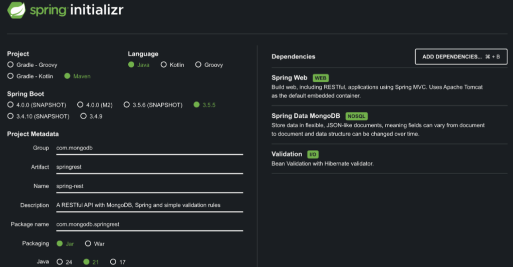

REST has become the default choice for building web services, and for good reason. It's straightforward to implement, easy for clients to consume, and built directly on top of the same principles of the web itself.

HTTP already gives us well-defined methods (GET, POST, PUT, DELETE), built-in caching, redirect support, secure transport via TLS, and widespread tooling support across platforms. REST doesn't reinvent the web---it uses it.

REST is not a protocol or a rigid standard. It's a lightweight architectural approach that encourages scalable, evolvable, and interoperable services. Its creator, Roy Fielding, helped define many of the specs that underpin the web today.

This tutorial is here to guide you through building clean, idiomatic REST APIs using Spring Boot. If you want the code, the full demo is available on [GitHub](https://github.com/mongodb-developer/spring-rest).

## How can Spring help?

Spring Boot makes it easy to build RESTful APIs in Java by:

* Auto-configuring web and data layers.
* Providing annotations like @RestController and @RequestMapping for easy setup.
* Supporting MongoDB integration through Spring Data MongoDB.

In this tutorial, we'll use Spring Boot with MongoDB to build a simple CRUD API for books.

### Prerequisites

Before you begin, make sure you have:

* A [MongoDB Atlas account with a cluster set up](https://www.mongodb.com/docs/guides/?utm_campaign=devrel&utm_source=third-part-content&utm_medium=cta&utm_content=spring+rest+simple&utm_term=tim.kelly).
  * A free M0 cluster is perfect for this.
* Java 17+, set up and ready to go.
* [Maven](https://maven.apache.org/download.cgi), version 3.9+.
* A REST client (Postman, curl, HTTPie).

## Creating our app

We'll use [Spring Initializr](https://start.spring.io/) to generate the basic structure for our project. Just give it a name, pick Java 17 or higher, and add the following dependencies:

* Spring Data MongoDB
* Spring Web
* Validation



This gives us everything we need to expose REST endpoints and talk to MongoDB. Now, we can open it up in the IDE of our choosing.

## Connecting our database

To connect to MongoDB, we need to add our [connection string](https://www.mongodb.com/docs/manual/reference/connection-string/#find-your-mongodb-atlas-connection-string?utm_campaign=devrel&utm_source=third-part-content&utm_medium=cta&utm_content=spring+rest+simple&utm_term=tim.kelly) to our application.properties, and specify the name of the database we want to use:

```
spring.data.mongodb.uri=YOUR_CONNECTION_STRING

spring.data.mongodb.database=library
```

This tells Spring to connect to our MongoDB Atlas cluster and use the library database. If this doesn't exist yet, don't worry. The minute we start trying to add data to it, MongoDB will create it for us.

### Our Book model

Let's define a model that represents the structure of our documents in MongoDB. Inside your project, create a new package called model and add a Book class like this:

```
package com.mongodb.springrest.model;

import org.bson.types.ObjectId;

import org.springframework.data.annotation.Id;

import org.springframework.data.mongodb.core.mapping.Document;

@Document(collection = "books")

public class Book {

    @Id

    private ObjectId id;

    private String title;

    private String author;

    public Book() {}

    public Book(String title, String author) {

        this.title = title;

        this.author = author;

    }

    public ObjectId getId() {

        return id;

    }

    public void setId(ObjectId id) {

        this.id = id;

    }

    public String getTitle() {

        return title;

    }

    public void setTitle(String title) {

        this.title = title;

    }

    public String getAuthor() {

        return author;

    }

    public void setAuthor(String author) {

        this.author = author;

    }

}
```

We use the @Document annotation to tell Spring that this class represents a MongoDB document, and we specify "books" as the name of the collection it should be stored in. If the books collection doesn't already exist, MongoDB will create it for us automatically.

The @Id annotation marks the id field as the primary key, and we use ObjectId from the MongoDB driver to match MongoDB's native ID format.

### Book repository

Next, we'll define a repository interface that lets us interact with the database. Create a new package called repository, and inside it, add a BookRepository interface like this:

```
package com.mongodb.springrest.repository;

import com.mongodb.springrest.model.Book;

import org.bson.types.ObjectId;

import org.springframework.data.mongodb.repository.MongoRepository;

import org.springframework.stereotype.Repository;

@Repository

public interface BookRepository extends MongoRepository<Book, ObjectId> {}
```

By extending [MongoRepository](https://docs.spring.io/spring-data/mongodb/docs/current/api/org/springframework/data/mongodb/repository/MongoRepository.html), we get a full set of CRUD operations. No need to write any implementation code. This includes methods like:

* findAll().
* findById(ObjectId id).
* save(Book book).
* deleteById(ObjectId id).

Spring Data handles everything under the hood, including converting between our Book class and MongoDB documents. [MongoRepository](https://docs.spring.io/spring-data/mongodb/docs/current/api/org/springframework/data/mongodb/repository/MongoRepository.html) can handle a lot more than just CRUD, such as [dynamic query generation](https://www.geeksforgeeks.org/advance-java/dynamic-query-in-java-spring-boot-with-mongodb/) based on method names, pagination, sorting, and more.

### Our REST controller

Now, we'll expose our REST endpoints so we can interact with the Book collection over HTTP. Create a new package called controller, and add a BookController class like this:

```
package com.mongodb.springrest.controller;  

import com.mongodb.springrest.model.Book;  

import com.mongodb.springrest.repository.BookRepository;  

import org.bson.types.ObjectId;  

import org.springframework.http.HttpStatus;  

import org.springframework.http.ResponseEntity;  

import org.springframework.web.bind.annotation.*;  

import jakarta.validation.Valid;  

import java.util.List;  

import java.util.Optional;  

@RestController  

@RequestMapping("/api/books")  

public class BookController {  

    private final BookRepository bookRepository;  

    public BookController(BookRepository bookRepository) {  

        this.bookRepository = bookRepository;  

    }

}
```

@RestController tells Spring that this class will handle HTTP requests and that all return values should be serialized directly to the response body.

@RequestMapping("/api/books") sets the base URL for all endpoints in this controller. Every method we add here will start with /api/books.

We'll build out the individual endpoints (like GET, POST, PUT, and DELETE) in the next steps. Each of those will use our BookRepository to read and write data in MongoDB.

## Create

To handle creating new books, we'll add a @PostMapping method inside our BookController. This endpoint will accept a Book object in the request body, save it to the database using our repository, and return the saved book along with a 201 Created response.

```
@PostMapping  

public ResponseEntity<Book> createBook(@RequestBody Book book) {  

    Book savedBook = bookRepository.save(book);  

    return ResponseEntity.status(HttpStatus.CREATED).body(savedBook);  

}
```

That's all we need. Spring will automatically deserialize the incoming JSON into a Book object, and bookRepository.save() will insert it into MongoDB. Once saved, the response includes the stored document (including the generated _id) so the client knows exactly what was created.

## Read

Now that we can add books, let's make sure we can retrieve them. We'll start with a simple endpoint to return all books in the collection:

```
@GetMapping  

public ResponseEntity<List<Book>> getAllBooks() {  

    List<Book> books = bookRepository.findAll();  

    return ResponseEntity.ok(books);  

}
```

Next, we'll add the ability to fetch a single book by its ID. MongoDB uses ObjectId as the ID type, and Spring will automatically convert the incoming string to an ObjectId when the request hits this endpoint:

```
@GetMapping("/{id}")  

public ResponseEntity<Book> getBookById(@PathVariable ObjectId id) {  

    Optional<Book> book = bookRepository.findById(id);  

    return book.map(ResponseEntity::ok)  

               .orElse(ResponseEntity.notFound().build());  

}
```

If the ID exists, we return the matching book with a 200 OK. If it doesn't, we return a 404 Not Found.

Now, let's go a step further and let users search for books by title. We want the search to be case-insensitive and to match any part of the title string. Instead of writing the query ourselves, we'll let Spring generate it.

Inside our BookRepository, we define the following method:

```
List<Book> findByTitleContainingIgnoreCase(String title);
```

That's it. Spring Data parses this method name and automatically builds a query that matches documents where the title field contains the provided string, ignoring case.

Here's the controller method that uses it:

```
@GetMapping("/title/{title}")  

public ResponseEntity<List<Book>> getBooksByTitle(@PathVariable String title) {  

    List<Book> books = bookRepository.findByTitleContainingIgnoreCase(title);  

    return ResponseEntity.ok(books);  

}
```

Spring Data gives us dynamic query generation. By simply naming a method according to a pattern, like findByFieldName or findByFieldOneAndFieldTwo, Spring can build the corresponding MongoDB query behind the scenes.

It saves a lot of boilerplate and keeps your code clean and declarative. If you ever need something more complex, you can still write custom queries using @Query annotations or full-blown aggregation pipelines, but for a lot of use cases, method naming gets you surprisingly far.

Check out the [full list of supported query keywords in the Spring documentation](https://docs.spring.io/spring-data/mongodb/docs/current/reference/html/#repositories.query-methods.query-creation).

## Update

To update an existing book, we'll use @PutMapping with the book's ID in the path. This method first checks if the book exists. If it does, we update the relevant fields and save the changes. If not, we return a 404 Not Found.

```
@PutMapping("/{id}")  

public ResponseEntity<Book> updateBook(@PathVariable ObjectId id, @RequestBody Book bookDetails) {  

    Optional<Book> optionalBook = bookRepository.findById(id);  

    if (optionalBook.isPresent()) {  

        Book book = optionalBook.get();  

        book.setTitle(bookDetails.getTitle());  

        book.setAuthor(bookDetails.getAuthor());  

        Book updatedBook = bookRepository.save(book);  

        return ResponseEntity.ok(updatedBook);  

    } else {  

        return ResponseEntity.notFound().build();  

    }  

}
```

This pattern is basic. We only update if the book is already present, and we use the same repository method as we did to insert, save(...), to persist the changes. If the ID doesn't exist, the API gracefully handles it with a 404.

## Delete

To remove a book from the collection, we add a @DeleteMapping endpoint that takes the book's ID.

```
@DeleteMapping("/{id}")  

public ResponseEntity<Void> deleteBook(@PathVariable ObjectId id) {  

    if (bookRepository.existsById(id)) {  

        bookRepository.deleteById(id);  

        return ResponseEntity.noContent().build();  

    } else {  

        return ResponseEntity.notFound().build();  

    }  

}
```

Before deleting, we check if the book exists. If it does, we delete it and return a 204 No Content response. If not, we return a 404 Not Found.

## Adding DTOs and validation

Right now, our controller methods take in Book objects directly. That's fine for small demos, but it's not ideal for real-world APIs. We want more control over what data comes in and out, especially when it comes to validating input.

We'll clean this up by introducing two DTOs:

* A BookRequest to handle incoming data from clients, with validation annotations
* A BookResponse to shape what our API returns

This gives us a few nice benefits:

* We can validate input early using jakarta.validation without touching the domain model.
* We avoid exposing internal fields (like ObjectId) directly to clients.
* Our API becomes easier to evolve over time without breaking clients.

### BookRequest

Create a new package called dto, and add a BookRequest record:

```
package com.mongodb.springrest.dto;

import jakarta.validation.constraints.NotBlank;

import jakarta.validation.constraints.Size;

public record BookRequest(

    @NotBlank(message = "Title is required")

    @Size(max = 200, message = "Title must not exceed 200 characters")

    String title,

    @NotBlank(message = "Author is required")

    String author

) {}
```

This is what we'll use for POST and PUT requests. We've added some basic validation: Both fields are required, and the title can't exceed 200 characters.

DTOs are great for validating incoming data because they give us a clean, dedicated structure for just the fields clients are allowed to send. Instead of exposing your full domain model, which might include internal fields or logic, we define exactly what input we expect, and attach validation rules directly to it.

For this example, we could just as easily use the model, but as APIs evolve, data models change and grow in complexity. This separation of concern makes code and applications easier to maintain.

This keeps our validation focused, keeps our models clean, and makes your API much harder to misuse.

### BookResponse

Next, we'll define what the API sends back when clients fetch data:

```
package com.mongodb.springrest.dto;

import com.mongodb.springrest.model.Book;

public record BookResponse(

    String id,

    String title,

    String author

) {

    public static BookResponse from(Book book) {

        return new BookResponse(

            book.getId().toHexString(),

            book.getTitle(),

            book.getAuthor()

        );

    }

}
```

This wraps our domain object in a clean, API-friendly shape. We're converting the MongoDB ObjectId into a string here so it works nicely in JSON responses.

You rarely need to expose every field in your domain model, especially if some of that data is internal, sensitive, or just irrelevant to the client. By shaping our responses with DTOs, we can return only the fields that matter, keeping responses lightweight and easier to evolve over time.

This also opens the door to using MongoDB projection to fetch only the fields you need from the database, reducing payload size and saving network bandwidth, especially important when dealing with large documents or mobile clients.

### Updating the controller

Now, we'll update our BookController to use the DTOs instead of exposing the Book entity directly.

**Create**

```
@PostMapping

public ResponseEntity<BookResponse> createBook(@RequestBody @Valid BookRequest request) {

    Book book = new Book(request.title(), request.author());

    Book saved = bookRepository.save(book);

    return ResponseEntity.status(HttpStatus.CREATED).body(BookResponse.from(saved));

}
```

When we annotate a method argument with @Valid, Spring will automatically validate the request using our BookRequest annotations, and throw a MethodArgumentNotValidException if validation fails with a 400 Bad Request response. But the default error response isn't very nice. It's often verbose and not very readable for clients.

[@RestControllerAdvice](https://spring.io/blog/2013/11/01/exception-handling-in-spring-mvc)is a nice way to customize the validation error response, and is recommended. Adding a package exception and a the class GlobalExceptionHandler, we can add the following code:

```
package com.mongodb.springrest.exception;

import jakarta.validation.ConstraintViolationException;

import org.springframework.http.HttpStatus;

import org.springframework.http.ResponseEntity;

import org.springframework.web.bind.MethodArgumentNotValidException;

import org.springframework.web.bind.annotation.ExceptionHandler;

import org.springframework.web.bind.annotation.RestControllerAdvice;

import java.util.Map;

import java.util.stream.Collectors;

@RestControllerAdvice

public class GlobalExceptionHandler {

    @ExceptionHandler(MethodArgumentNotValidException.class)

    public ResponseEntity<Map<String, String>> handleValidation(MethodArgumentNotValidException ex) {

        Map<String, String> errors = ex.getBindingResult()

            .getFieldErrors()

            .stream()

            .collect(Collectors.toMap(

                field -> field.getField(),

                field -> field.getDefaultMessage(),

                (existing, replacement) -> existing // in case of duplicate field names

            ));

        return ResponseEntity.badRequest().body(errors);

    }

}
```

This will mean instead of a wall of hard-to-parse error information, we get a nice and clean error like:

```
{

  "title": "Title is required",

  "author": "Author is required"

}
```

**Read (all)**

```
@GetMapping

public ResponseEntity<List<BookResponse>> getAllBooks() {

    List<BookResponse> books = bookRepository.findAll()

        .stream()

        .map(BookResponse::from)

        .toList();

    return ResponseEntity.ok(books);

}
```

**Read by ID**

```
@GetMapping("/{id}")

public ResponseEntity<BookResponse> getBookById(@PathVariable ObjectId id) {

    return bookRepository.findById(id)

        .map(BookResponse::from)

        .map(ResponseEntity::ok)

        .orElse(ResponseEntity.notFound().build());

}
```

**Search by title**

```
@GetMapping("/title/{title}")

public ResponseEntity<List<BookResponse>> getBooksByTitle(@PathVariable String title) {

    List<BookResponse> books = bookRepository.findByTitleContainingIgnoreCase(title)

        .stream()

        .map(BookResponse::from)

        .toList();

    return ResponseEntity.ok(books);

}
```

**Update**

```
@PutMapping("/{id}")

public ResponseEntity<BookResponse> updateBook(@PathVariable ObjectId id,

                                               @RequestBody @Valid BookRequest request) {

    return bookRepository.findById(id)

        .map(book -> {

            book.setTitle(request.title());

            book.setAuthor(request.author());

            Book updated = bookRepository.save(book);

            return ResponseEntity.ok(BookResponse.from(updated));

        })

        .orElse(ResponseEntity.notFound().build());

}
```

**Delete stays the same**

We don't need a DTO for deletes, so this one stays just as it is:

```
@DeleteMapping("/{id}")

public ResponseEntity<Void> deleteBook(@PathVariable ObjectId id) {

    if (bookRepository.existsById(id)) {

        bookRepository.deleteById(id);

        return ResponseEntity.noContent().build();

    } else {

        return ResponseEntity.notFound().build();

    }

}
```

With this small update, our API is much more robust:

* We're validating input using Jakarta Bean Validation.
* We're not exposing internal MongoDB-specific types to the outside world.
* We've made room for our API to evolve without tying it too tightly to the database.

Now, we're ready to test it.

## Testing the API

Once everything is wired up, it's time to see our API in action. We can use curl, Postman, or HTTPie. We just need something for sending HTTP requests.

We'll walk through a full cycle: adding a book, reading it back, updating it, and then deleting it.

### Run the API

To start our application, we open a terminal in our project directory and run:

```
mvn spring-boot:run
```

### Create

Let's create a new book using a simple POST request.

```
curl -X POST http://localhost:8080/api/books \

  -H "Content-Type: application/json" \

  -d '{"title": "Dune", "author": "Frank Herbert"}'
```

If everything is working, we should get back a JSON response with the saved book, including its automatically generated _id. It'll look something like:

```
{

  "id": "64fc99b10f4e3a2f04262a8b",

  "title": "Dune",

  "author": "Frank Herbert"

}
```

We'll use the id in some of the next steps.

### Read

We can fetch all books like this:

curl http://localhost:8080/api/books

This should return an array of book objects. Since we've only added one, we'll get something like:

```
[

  {

    "id": "64fc99b10f4e3a2f04262a8b",

    "title": "Dune",

    "author": "Frank Herbert"

  }

]
```

To search by title, we can use the following endpoint. It will return all books whose title contains the word "dune", case-insensitively.

```
curl http://localhost:8080/api/books/title/dune
```

To fetch a specific book by ID, we replace \<id\> with the actual ID returned earlier:

```
curl http://localhost:8080/api/books/64fc99b10f4e3a2f04262a8b
```

If the book exists, we'll get back the full object. If not, we'll see a 404 Not Found.

### Update

Now, let's update the book we just created. We'll use the same ID and provide a new version of the title.

```
curl -X PUT http://localhost:8080/api/books/64fc99b10f4e3a2f04262a8b \

  -H "Content-Type: application/json" \

  -d '{"title": "Dune: Extended Edition", "author": "Frank Herbert"}'
```

This should return the updated book:

```
{

  "id": "64fc99b10f4e3a2f04262a8b",

  "title": "Dune: Extended Edition",

  "author": "Frank Herbert"

}
```

### Delete

To remove the book entirely, send a DELETE request with the same ID:

```
curl -X DELETE http://localhost:8080/api/books/64fc99b10f4e3a2f04262a8b
```

If successful, we'll get back a 204 No Content response, meaning the deletion was successful, but there's nothing left to return.

If we try to fetch the book again after this, we'll get a 404 Not Found, or checking the endpoint http://localhost:8080/api/books will return an empty array.

By this point, we've tested the full lifecycle of a resource, creating it, reading it, updating it, and deleting it. Everything should now be wired up and working cleanly. If you want to keep experimenting, try adding more books or search using partial title matches to see the dynamic query in action.

## Conclusion

You now have a fully working REST API built with Spring Boot and MongoDB. We've covered the full CRUD cycle, from creating and retrieving documents to updating and deleting them.

Along the way, you saw how Spring Data MongoDB handles all the heavy lifting when it comes to mapping documents, generating queries, and simplifying persistence logic. You also used Spring Web to expose a clean, RESTful interface with minimal boilerplate.

This is a solid foundation to build on. From here, you can extend the API by:

* Adding pagination and sorting.
* Handling errors in a centralized way with [@ControllerAdvice](https://spring.io/blog/2013/11/01/exception-handling-in-spring-mvc).
* Securing your endpoints with [Spring Security](https://spring.io/projects/spring-security).
* Documenting your API using [OpenAPI/Swagger](https://swagger.io/tools/swagger-ui/).

If you found this useful, see what else you can do with Spring and MongoDB. Check out my tutorial, [Spring AI and MongoDB: How to Build RAG Applications](https://dev.to/mongodb/how-to-build-rag-applications-with-spring-ai-and-mongodb-5gaj).
