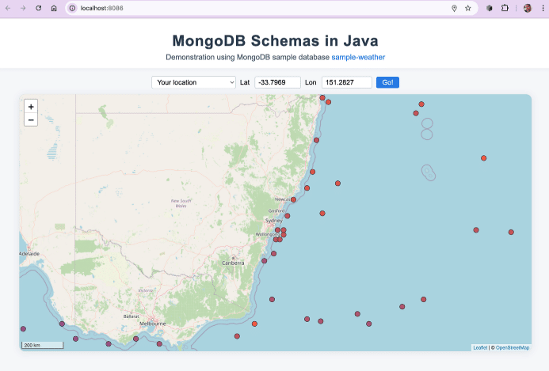
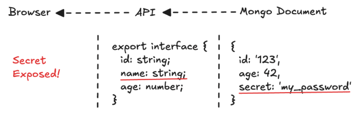
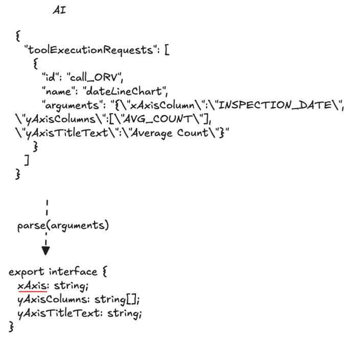
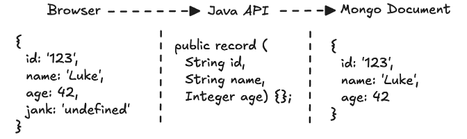

If (like me!) you prefer to read code rather than a long and boring article, jump straight to the example! TLDR; here's the [code](https://github.com/luketn/mongodb-schemas-in-java).

You can clone and run the tests like this:

```
git clone https://github.com/luketn/mongodb-schemas-in-java 
cd mongodb-schemas-in-java 
mvn test
```

And if you want to play with the example API visually (like I do!) and you have a local Mongo or an Atlas Cluster with the [Weather Sample](https://www.mongodb.com/docs/guides/atlas/sample-data/?utm_campaign=devrel&utm_source=third-party-content&utm_medium=cta&utm_content=mongodb-schemas-java&utm_term=megan.grant) data, run:

```
./run-atlas.sh
```

Put your connection string in and you'll see the sea surface temperatures displayed on a nice little browser UI:  

<figure class="aligncenter size-full is-resized">
 
</figure>

(If you're a screen-reader user, there's a way for you to [read the data](https://github.com/luketn/mongodb-schemas-in-java/blob/main/src/main/resources/static/index.html#L187-L190) too.)

## Why MongoDB and Java are such good friends


I remember when I first tried MongoDB out as a potential new database for a project. We had been using Microsoft SQL Server until that point, and dealing with the headaches of:

* Infrastructure downtime---while servers were upgraded and patched.
* Object to relational schema mapping (ORM)---awkwardly trying to manage the Java class hierarchy representation of the data translating to and from normalised data tables in SQL Server.
* Schema changes---DBAs co-ordinating with developers' simultaneous releases of Java services and database for ongoing changes in schema.

I used to dread making a change to the database schema, because of the long timeframes it would take to co-ordinate all the activities needed. Sometimes, you would make do with an imperfect schema and muddle along as you accumulated technical debt. Changes were worked around rather than cleanly dealt with. When you did need to change an SQL database, you knew you had challenges ahead.

MongoDB's approach just instantly clicked for me. Now, we modelled document structures and collections on query patterns, focussing on the application needs.

Infrastructure updates were zero-downtime thanks to the replica-set model.

No more awkward wrangling of relational and document concepts. No more long timeframe co-ordination efforts for schema changes.

Suddenly, developers were in charge of the schema, defined in one place, in the Java code.

## The missing schema of loosely typed systems

Stepping outside of the Java world, as, sadly, we must, I have encountered a bundle of problems with untyped or loosely typed languages.

I've built MongoDB-backed solutions with Python, JavaScript, and TypeScript and seen up close the flaws that can creep in with a schemaless database and a typeless codebase. In such a world, where is the schema? Nowhere! It is just an idea. A dream that someone once had. Echoes of a schema are half-enforced or not enforced at all by a pale and weak codebase.

As a couple of examples, I've seen:

* A TypeScript web service throws an exception because the actual data read from the database doesn't match its interface definition. The web service blithely makes the assumption that there will be a value where there is none, and throws an unhandled exception. Also, extra fields may be retrieved from the database and passed along to the browser client.



* A Python LangChain application retrieves data from an AI, and stores it in MongoDB. The AI has hallucinated an incorrect field for the requested structure, but this will not be picked up until we later try to use the data and the system fails.



JavaScript migration scripts used to update MongoDB which had no validation, intellisense, or checks which easily led to bugs (admittedly, this flexibility can also be convenient for transformations of data too---especially when adding/removing a field from a structure, but should be done with checks and balances).

## Bringing schema back

Java's hierarchical types naturally provide the missing schema for MongoDB documents. Using immutable record types which may be safely cached and passed around in concurrent services allows for highly safe and scalable applications built around MongoDB.  


\> Java's hierarchical types naturally provide the missing schema for MongoDB documents.

The rest of the article, we will work through a code example that shows schema definition in a Java application using a schemaless MongoDB database providing an API for a loosely typed web browser client.

We'll discuss some tips to get the most out of Java with MongoDB and some of the traps to avoid.

## Example: Spring Boot sea temperature service

In this example, we're going to build a [Spring Boot](https://spring.io/projects/spring-boot) web service using [Java 24](https://openjdk.org/projects/jdk/24/) and the [MongoDB synchronous driver (with virtual threads!)](https://www.mongodb.com/developer/products/mongodb/jdk-21-virtual-threads/?utm_campaign=devrel&utm_source=third-party-content&utm_medium=cta&utm_content=mongodb-schemas-java&utm_term=megan.grant).

I'm going to skip over lots of the detail about building the web service, as we'll focus on the schema. If you're interested, feel free to ask about anything in the example in the comments. I'm happy to discuss it.

When working with MongoDB, I like each collection to have a beautifully immutable [Java record](https://www.baeldung.com/java-record-keyword) which defines its schema.

We'll use the Atlas sample weather dataset for our service.

Here's an example document from the sample data collection:

```
{
  "_id": {
    "$oid": "5553a998e4b02cf7151190c9"
  },
  "st": "x+51900+003200",
  "ts": {
    "$date": {
      "$numberLong": "447354000000"
    }
  },
  "position": {
    "type": "Point",
    "coordinates": [
      {
        "$numberDouble": "3.2"
      },
      {
        "$numberDouble": "51.9"
      }
    ]
  },
  "elevation": {
    "$numberInt": "9999"
  },
  "callLetters": "PLAT",
  "qualityControlProcess": "V020",
  "dataSource": "4",
  "type": "FM-13",
  "airTemperature": {
    "value": {
      "$numberDouble": "4.8"
    },
    "quality": "1"
  },
  "dewPoint": {
    "value": {
      "$numberDouble": "4.6"
    },
    "quality": "1"
  },
  "pressure": {
    "value": {
      "$numberDouble": "1032.6"
    },
    "quality": "1"
  },
  "wind": {
    "direction": {
      "angle": {
        "$numberInt": "170"
      },
      "quality": "1"
    },
    "type": "N",
    "speed": {
      "rate": {
        "$numberDouble": "0.5"
      },
      "quality": "1"
    }
  },
  "visibility": {
    "distance": {
      "value": {
        "$numberInt": "999999"
      },
      "quality": "9"
    },
    "variability": {
      "value": "N",
      "quality": "9"
    }
  },
  "skyCondition": {
    "ceilingHeight": {
      "value": {
        "$numberInt": "99999"
      },
      "quality": "9",
      "determination": "9"
    },
    "cavok": "N"
  },
  "sections": [
    "AG1",
    "MD1",
    "OA1",
    "SA1"
  ],
  "precipitationEstimatedObservation": {
    "discrepancy": "2",
    "estimatedWaterDepth": {
      "$numberInt": "999"
    }
  },
  "atmosphericPressureChange": {
    "tendency": {
      "code": "2",
      "quality": "1"
    },
    "quantity3Hours": {
      "value": {
        "$numberDouble": "1.2"
      },
      "quality": "1"
    },
    "quantity24Hours": {
      "value": {
        "$numberDouble": "99.9"
      },
      "quality": "9"
    }
  },
  "seaSurfaceTemperature": {
    "value": {
      "$numberDouble": "5.5"
    },
    "quality": "9"
  }
}
```

A few things about this document:

1. It's very large with lots of details, and you could imagine over time, it would grow.
2. In this sample set, there are 10,000 documents. There would likely be millions of documents over time as data continuously pours in from sensors and is stored in reports (likely capped to some time period back and perhaps archived for older reports).
3. Each report has a position field in GeoJSON Point format.
4. Sometimes, we would want the whole report document, but to build a sea temperature weather map, we'll want just the location and sea-temperature value.

Here's the API I'd like to build:

### Sea temperatures

```
SSE /weather/sea/temperature?south={lower latitude}&west={lower longitude}&north={upper latitude}&east={upper longitude}
```

E.g., /weather/sea/temperature?south=-39\&west=138\&north=-28\&east=164

This streams back a list of points and values to display on a map using server sent events ([SSE](https://developer.mozilla.org/en-US/docs/Web/API/Server-sent_events/Using_server-sent_events)). Filter by location is required (so you can pan and zoom around the map and return only those points shown).

SSE is an interesting protocol, which is very handy for potentially large datasets where you want to get a result on the screen straight away. We can start displaying points on a map immediately after the first batch of them are returned.

```
data: [
  {lat: 3, lon: 51.5, temp: 3.4},
  {lat: 3, lon: 51.6, temp: 4.4}
]
...
data: [{...}]
```

### Weather reports

```
GET /weather?id={id}
```

Returns a single weather report by ID.

(same schema as above)

```
GET /weather/list?[page=x]
```

Returns a paged list of weather reports with a few key fields:

```
{
  reports: [
    {id: "xyz", ts: "2025-02-05T09:00:00Z", seaSurfaceTemperature: 3.4, airTemperature: 15.1}
  ],
  page: 0,
  totalPages: 42
}
```

### Schemas

Let's get into the schema definitions for the weather report document to support our APIs.

Let's start with the main one---the [WeatherReport](https://github.com/luketn/mongodb-schemas-in-java/blob/main/src/main/java/com/luketn/datamodel/mongodb/WeatherReport.java).

```
package com.luketn.datamodel.mongodb;

import org.bson.BsonType;
import org.bson.codecs.pojo.annotations.BsonId;
import org.bson.codecs.pojo.annotations.BsonRepresentation;

import java.time.Instant;
import java.util.List;

/**
 * Represents a weather report with various meteorological data.
 * Ref: https://www.mongodb.com/docs/atlas/sample-data/sample-weather/
 */

public record WeatherReport(
    @BsonId @BsonRepresentation(BsonType.OBJECT_ID) String id,
    String st,
    Instant ts,
    Position position,
    Integer elevation,
    String callLetters,
    String qualityControlProcess,
    String dataSource,
    String type,
    Measurement airTemperature,
    Measurement dewPoint,
    Measurement pressure,
    Wind wind,
    Visibility visibility,
    SkyCondition skyCondition,
    List<String> sections,
    PrecipitationEstimatedObservation precipitationEstimatedObservation,
    AtmosphericPressureChange atmosphericPressureChange,
    Measurement seaSurfaceTemperature
) {
    public record Position(String type, List<Double> coordinates) {}

    public record Measurement(Double value, String quality) {}

    public record Wind(Direction direction, String type, Speed speed) {
        public record Direction(Integer angle, String quality) {}
        public record Speed(Double rate, String quality) {}
    }

    public record Visibility(Distance distance, Variability variability) {
        public record Distance(Integer value, String quality) {}
        public record Variability(String value, String quality) {}
    }

    public record SkyCondition(CeilingHeight ceilingHeight, String cavok) {
        public record CeilingHeight(Integer value, String quality, String determination) {}
    }

    public record PrecipitationEstimatedObservation(String discrepancy, Integer estimatedWaterDepth) {}

    public record AtmosphericPressureChange(Tendency tendency, Quantity quantity3Hours, Quantity quantity24Hours) {
        public record Tendency(String code, String quality) {}
        public record Quantity(Double value, String quality) {}
    }
}
```

This neatly represents the whole document structure in a single .java file, with the document itself and all its subdocuments.

You'll notice when you use these types, that the inner subdocuments are namespaced to the outer one so that you can clearly see the representation you are working with---e.g., WeatherReport.Position. Of course, if you wanted to, you could move some of these into shared representations outside, but I like the neatness of defining all the types for a collection in one place.

As well as the main WeatherReport record, I'm also going to define a summary representation of the same data which we can use to return from the /list API:

```
package com.luketn.datamodel.mongodb;

import org.bson.BsonType;
import org.bson.codecs.pojo.annotations.BsonId;
import org.bson.codecs.pojo.annotations.BsonRepresentation;
import java.time.Instant;

public record WeatherReportSummary(
        @BsonId @BsonRepresentation(BsonType.OBJECT_ID) String id,
        Instant ts,
        Double seaSurfaceTemperature,
        Double airTemperature
) {}
```

#### Tip---BSON IDs and the _id field

Handling IDs: You'll notice that I am not representing the _id field of the document as an [ObjectID](https://www.mongodb.com/docs/manual/reference/method/objectid/?utm_campaign=devrel&utm_source=third-party-content&utm_medium=cta&utm_content=mongodb-schemas-java&utm_term=megan.grant) type. I don't like those. I prefer simple string types for IDs everywhere, and to use the name 'id' for the field. We're keeping the implementation detail so that id is not a string and is named _id in the database from the rest of the code and from the API clients using these nice annotations for the plain old Java object (POJO) converter (codec) built into the MongoDB Java driver:

@BsonId: This indicates, whatever the name of the Java record property, that in MongoDB, this the _id field.

@BsonRepresentation(BsonType.OBJECT_ID): Specifies the BSON type used to store the value when different from the POJO property. In this case, although our id property is a string, we want to represent it as an ObjectID in the document.

You can read more about the POJO codec and its annotations in the [MongoDB documentation](https://www.mongodb.com/docs/drivers/java/sync/current/data-formats/pojo-customization/?utm_campaign=devrel&utm_source=third-party-content&utm_medium=cta&utm_content=mongodb-schemas-java&utm_term=megan.grant#annotations).

Finally, we'll [define a record](https://github.com/luketn/mongodb-schemas-in-java/blob/main/src/main/java/com/luketn/datamodel/mongodb/WeatherReportSummaryList.java) as a wrapper for the summary report which includes the page number and total pages for pagination:

```
package com.luketn.datamodel.mongodb;

import java.util.List;

public record WeatherReportSummaryList(
        List<WeatherReportSummary> reports,
        int page,
        int totalPages
) { }
```

And a representation for the sea temperature map API:

```
package com.luketn.datamodel.mongodb;

/**
 * Represents sea temperature data at a specific latitude and longitude.
 */

public record SeaTemperature(
        double lat,
        double lon,
        double temp
) {}
```

We're using abbreviations for the field names---latitude = lat, longitude = lon, and temp = temperature (celcius) because we're going to stream out a *lot* of these to the map client!

#### Traps---record definitions for POJO codec

A couple more things might catch you out when implementing these record types:

1. Record types must be public scope to be available to the POJO codec (use the public keyword before defining the record).
2. Don't use the primitive type of numeric values field int/double in general \*(unless you are certain all values will be present)---use the object type Integer/Double. Why? Because if a field has a null or is missing in the document, you will get serialization errors.
3. Use List\<\> instead of \[\] arrays to represent a MongoDB array of values or subdocuments. Why? The POJO codec will throw an error because it can't locate the type if you try it :).

### Data access

Let's build our data access class to retrieve the data for our API!

Here's the [WeatherDataAccess.java](https://github.com/luketn/mongodb-schemas-in-java/blob/main/src/main/java/com/luketn/dataaccess/mongodb/WeatherDataAccess.java) implementation:

```
package com.luketn.dataaccess.mongodb;

import com.luketn.datamodel.mongodb.WeatherReport;
import com.luketn.datamodel.mongodb.WeatherReportSummary;
import com.luketn.datamodel.mongodb.WeatherReportSummaryList;
import com.luketn.seatemperature.datamodel.BoundingBox;
import com.mongodb.ExplainVerbosity;
import com.mongodb.client.MongoCollection;
import com.mongodb.client.MongoDatabase;
import com.mongodb.client.model.Facet;
import org.bson.Document;
import org.bson.conversions.Bson;
import org.bson.json.JsonWriterSettings;
import org.bson.types.ObjectId;
import org.slf4j.Logger;
import org.slf4j.LoggerFactory;
import org.springframework.stereotype.Component;

import java.util.List;
import java.util.Objects;
import java.util.function.Consumer;

import static com.mongodb.client.model.Aggregates.*;
import static com.mongodb.client.model.Filters.*;

@Component

public class WeatherDataAccess {
    private static final Logger log = LoggerFactory.getLogger(WeatherDataAccess.class);

    public static final String COLLECTION_NAME = "data";

    private static final int pageSize = 10;

    private final MongoDBProvider mongoDBProvider;

    public WeatherDataAccess(MongoDBProvider mongoDBProvider) {
        this.mongoDBProvider = mongoDBProvider;
    }

    public WeatherReport getReport(String id) {
        MongoDatabase database = mongoDBProvider.getMongoDatabase();
        MongoCollection<WeatherReport> collection = database.getCollection(COLLECTION_NAME, WeatherReport.class);
        return collection.find(new Document("_id", new ObjectId(id))).first();
    }

    public WeatherReportSummaryList listReports(int page) {
        MongoDatabase database = mongoDBProvider.getMongoDatabase();
        MongoCollection<WeatherReportSummaryAggregate> collection = database.getCollection(COLLECTION_NAME, WeatherReportSummaryAggregate.class);
        WeatherReportSummaryAggregate result = collection.aggregate(List.of(
                        facet(
                                new Facet("reports", List.of(
                                        skip(page * pageSize),
                                        limit(pageSize),
                                        project(new Document()
                                                .append("_id", 1)
                                                .append("ts", "$ts")
                                                .append("seaSurfaceTemperature", "$seaSurfaceTemperature.value")
                                                .append("airTemperature", "$airTemperature.value")
                                        )
                                ))
                                ,new Facet("summary", List.of(
                                        count()
                                ))
                        )
                )
        ).first();

        Integer totalReportsMatched = Objects.requireNonNull(result).summary().getFirst().count();
        if (totalReportsMatched == null) {
            totalReportsMatched = 0;
        }

        int totalPages = (int) Math.ceil((double) totalReportsMatched / pageSize);
        return new WeatherReportSummaryList(
                result.reports(),
                page,
                totalPages
        );
    }

    public record WeatherReportSummaryAggregate(
        List<WeatherReportSummary> reports,
        List<Summary> summary
    ) {
        public record Summary(Integer count) {}
    }

    public void streamSeaTemperatures(BoundingBox boundingBox, Consumer<WeatherReport> weatherReportConsumer) {
        MongoDatabase database = mongoDBProvider.getMongoDatabase();
        MongoCollection<WeatherReport> collection = database.getCollection(COLLECTION_NAME, WeatherReport.class);
        
        Bson filter = and(
                gte("position.coordinates.0", boundingBox.west()),
                lte("position.coordinates.0", boundingBox.east()),
                gte("position.coordinates.1", boundingBox.south()),
                lte("position.coordinates.1", boundingBox.north())
        );

        Document projection = new Document()
                .append("_id", 0)
                .append("position.coordinates", 1)
                .append("seaSurfaceTemperature.value", 1);

        if (log.isTraceEnabled()) {
            Document explain = collection
                    .find(filter)
                    .projection(projection)
                    .explain(ExplainVerbosity.EXECUTION_STATS);
            log.trace("MongoDB explain plan for sea surface temperature query:\n{}", explain.toJson(JsonWriterSettings.builder().indent(true).build()));
        }

        collection
                .find(filter)
                .projection(projection)
                .batchSize(pageSize)
                .forEach(weatherReportConsumer);
    }
}
```

Let's walk through each of the methods and explain the techniques we've used in each case. Each method is going to ramp up in complexity and show you how to do simple through advanced queries to support our API and show off some Java schema record capabilities.

First---get a weather report by ID. Couldn't be simpler---find, return, done.

Next, we are going to implement a paged list of weather reports. This is a little more tricky, because we want to return the results as well as a total page count.

You'll notice under this method there is a cheeky little extra schema definition---a record for the structure of the aggregate query result:

```
public record WeatherReportSummaryAggregate(
        List<WeatherReportSummary> reports,
        List<Summary> summary
    ) {
        public record Summary(Integer count) {}
    }
```

When you use the aggregate framework, you'll often return data in a slightly adjacent format to the one you want to return to clients. In our case, we are using the aggregate facet() stage to return a page of summary records alongside the total count of records. To support that, we've created this little record as an intermediary structure which we will convert back into the method's return value record type.

```
WeatherReportSummaryAggregate result = collection.aggregate(List.of(
                        match(filter),
                        facet(
                                new Facet("reports", List.of(
                                        skip(page * pageSize),
                                        limit(pageSize),
                                        project(new Document()
                                                .append("_id", 1)
                                                .append("ts", "$ts")
                                                .append("seaSurfaceTemperature", "$seaSurfaceTemperature.value")
                                                .append("airTemperature", "$airTemperature.value")
                                        )
                                ))
                                ,new Facet("summary", List.of(
                                        count()
                                ))
                        )
                )
        )
```

#### Tip---typed queries with MongoCollection\<\> generics

Each time you perform a query, you can specify the Java type you want the results serialized to.

For example, when running aggregations, we use WeatherReportSummaryAggregate:

```
MongoCollection<WeatherReportSummaryAggregate> collection = 
   database.getCollection(COLLECTION_NAME, WeatherReportSummaryAggregate.class);
```

In our other methods, we are using the full record representation WeatherReport:

```
MongoCollection<WeatherReport> collection = 
   database.getCollection(COLLECTION_NAME, WeatherReport.class);
```

Isn't it expensive to create MongoCollection all the time? No! When you declare a MongoCollection, there is very little cost to doing so. There are a few null checks and a check on the validity of the collection name. So you can create them on the fly when you need them.

#### Trap---pagination and aggregate facets

We're taking an interesting approach to paging here---using the facet() aggregate stage. There are some performance issues and a potential error to watch out for:

1. Using facets in this way may be slower than performing two queries (for results and for count).
2. If the total size of the single document produced is \>16MB, the method will throw an exception.
3. The inimitable and brilliant Asya Kamsky says [you shouldn't](https://www.mongodb.com/community/forums/t/how-to-get-document-count-and-paginated-result-in-1-single-call/233020/?u=luke_thompson&utm_campaign=devrel&utm_source=third-party-content&utm_medium=cta&utm_content=mongodb-schemas-java&utm_term=megan.grant).

In our case, since we allow only 10 results per page, and each document has just four fields, we won't hit the 16MB document size limit for our aggregate result.

There are two other ways we could have done this pagination:

1. Atlas Search ([my favourite!](https://www.mongodb.com/developer/products/atlas/java-faceted-full-text-search-api/?utm_campaign=devrel&utm_source=third-party-content&utm_medium=cta&utm_content=mongodb-schemas-java&utm_term=megan.grant#search))---in this case, we would have something very similar, except we would be relying on Lucene's much faster counting approach.

```
facet(
     new Facet("docs", List.of()),
     new Facet("meta", List.of(
             Aggregates.replaceWith("$$SEARCH_META"),
             Aggregates.limit(1)
     ))
)
```

Atlas Search also supports pagination using [pagination tokens](https://www.mongodb.com/docs/atlas/atlas-search/paginate-results/?utm_campaign=devrel&utm_source=third-party-content&utm_medium=cta&utm_content=mongodb-schemas-java&utm_term=megan.grant#std-label-paginate-results-search-sequence-token), which allows you to continue reading to the next page without doing expensive counts.

2. Page size +1

Another way to support paging is instead of returning the total number of pages like our API does, return a hasMorePages boolean.

If your use case doesn't require a specific page count (maybe you use infinite scrolling or some other view), this kind of pagination is a much more efficient solution.

To support this, all you need to do is +1 on your query limit. If the cursor returns more than you asked for, there are more pages available.

```
public WeatherReportSummaryListNoCount listReportsNoPageCount(int page) {
    MongoDatabase database = mongoDBProvider.getMongoDatabase();
    MongoCollection<WeatherReportSummary> collection = database.getCollection(COLLECTION_NAME, WeatherReportSummary.class);
    
    List<WeatherReportSummary> reports = collection.find()
            .skip(page * pageSize)
            .limit(pageSize+1) // Fetch one extra to determine if there are more pages
            .projection(new Document()
                    .append("_id", 1)
                    .append("ts", 1)
                    .append("seaSurfaceTemperature", "$seaSurfaceTemperature.value")
                    .append("airTemperature", "$airTemperature.value"))
            .into(new java.util.ArrayList<>());

    boolean hasMorePages = reports.size() > pageSize;
    if (hasMorePages) {
        reports.removeLast();
    }

    return new WeatherReportSummaryListNoCount(reports, page, hasMorePages);
}

public record WeatherReportSummaryListNoCount(
      List<WeatherReportSummary> reports,
      int page,
      boolean hasMorePages
) { }
```

The last method in our data access streams data back using a consumer (rather than collecting and returning it).

```
public void streamSeaTemperatures(BoundingBox boundingBox, Consumer<WeatherReport> weatherReportConsumer) {
        MongoDatabase database = mongoDBProvider.getMongoDatabase();
        MongoCollection<WeatherReport> collection = database.getCollection(COLLECTION_NAME, WeatherReport.class);

        Bson filter = and(
                gte("position.coordinates.0", boundingBox.west()),
                lte("position.coordinates.0", boundingBox.east()),
                gte("position.coordinates.1", boundingBox.south()),
                lte("position.coordinates.1", boundingBox.north())
        );

        Document projection = new Document()
                .append("_id", 0)
                .append("position.coordinates", 1)
                .append("seaSurfaceTemperature.value", 1);

        if (log.isTraceEnabled()) {
            Document explain = collection
                    .find(filter)
                    .projection(projection)
                    .explain(ExplainVerbosity.EXECUTION_STATS);
            log.trace("MongoDB explain plan for sea surface temperature query:\n{}", explain.toJson(JsonWriterSettings.builder().indent(true).build()));
        }

        collection
                .find(filter)
                .projection(projection)
                .batchSize(pageSize)
                .forEach(weatherReportConsumer);
    }
}
```

Essentially, our data access class is producing a cut-down WeatherReport record (filtered by projection) for the given bounding coordinates. This keeps memory low whilst returning potentially huge datasets. This method supports the SSE sea temperature API.

I'm introducing a logic class ([SeaTemperatureService.java](https://github.com/luketn/mongodb-schemas-in-java/blob/main/src/main/java/com/luketn/seatemperature/SeaTemperatureService.java)) which will sit in between our data access class and the API class, which will perform a few functions:

* Filter out any duplicates for a specific coordinate (returning the first measurement at each unique location).
* Batch measurements into events of 10.
* Convert from WeatherReport into SeaTemperature format.

```
package com.luketn.seatemperature;

import com.luketn.dataaccess.mongodb.WeatherDataAccess;
import com.luketn.seatemperature.datamodel.BoundingBox;
import com.luketn.seatemperature.datamodel.SeaTemperature;
import org.springframework.stereotype.Service;

import java.util.ArrayList;
import java.util.HashSet;
import java.util.List;
import java.util.Set;
import java.util.function.Consumer;

/**
 * Handles validation and transformation of weather reports into sea temperature data.
 * Batches and returns only unique coordinate sea surface temperature reports within a specified bounding box.
 */

@Service
public class SeaTemperatureService {
    public static final int batch_size = 10;

    private final WeatherDataAccess weatherDataAccess;

    public SeaTemperatureService(WeatherDataAccess weatherDataAccess) {
        this.weatherDataAccess = weatherDataAccess;
    }

    public void streamSeaTemperatures(BoundingBox boundingBox, Consumer<List<SeaTemperature>> seaTemperatureConsumer) {
        List<SeaTemperature> seaTemperaturesBatch = new ArrayList<>();
        
        record Coordinates(Double longitude, Double latitude) {}
        Set<Coordinates> uniqueCoordinates = new HashSet<>();

        weatherDataAccess.streamSeaTemperatures(boundingBox, weatherReport -> {
            if (weatherReport.seaSurfaceTemperature() == null) {
                return; // Skip reports without sea surface temperature
            }
            Double longitude = weatherReport.position().coordinates().get(0);
            Double latitude = weatherReport.position().coordinates().get(1);
            Double seaSurfaceTemperature = weatherReport.seaSurfaceTemperature().value();

            Coordinates coordinates = new Coordinates(longitude, latitude);
            if (uniqueCoordinates.contains(coordinates)) {
                return; // Skip duplicate coordinates
            }
            uniqueCoordinates.add(coordinates);

            SeaTemperature seaTemperature = new SeaTemperature(longitude, latitude, seaSurfaceTemperature);

            seaTemperaturesBatch.add(seaTemperature);
            if (seaTemperaturesBatch.size() >= batch_size) {
                seaTemperatureConsumer.accept(new ArrayList<>(seaTemperaturesBatch));
                seaTemperaturesBatch.clear(); // Clear the batch after sending
            }
        });

        if (!seaTemperaturesBatch.isEmpty()) {
            seaTemperatureConsumer.accept(seaTemperaturesBatch);
        }
    }
}
```

Our database schema is being translated procedurally into a more efficient schema for our API:

WeatherReport (projected)

```
{
  position: {
    coordinates: [123, 456]
  },
  seaSurfaceTemperature: {
    value: 23.1
  }
}
```

-\> [SeaTemperature](https://github.com/luketn/mongodb-schemas-in-java/blob/main/src/main/java/com/luketn/seatemperature/datamodel/SeaTemperature.java)

```
{
  "lon": 123,
  "lat": 456,
  "temp": 23.1
}
```

Notice that inside this method, we declare and use on the fly a little Coordinates record:

```
record Coordinates(Double longitude, Double latitude) {}
Set<Coordinates> uniqueCoordinates = new HashSet<>();
```

Because records have built-in comparison for their values, we can use them as the key in a Set, providing a convenient way to filter out duplicates.

\> Note: Admittedly, this undoes some of the good work I am doing by streaming in batches by building an in-memory set of all the unique coordinates. 🙁 In practice, I would recommend taking care of this kind of thing in the database or query. I'm keeping it in the example though, to demonstrate the use of an inline record within a method.

### Creating our API

Alright! Now, let's define our API. Here's the implementation of our [WeatherAPI](https://github.com/luketn/mongodb-schemas-in-java/blob/main/src/main/java/com/luketn/api/WeatherApi.java) class:

```
package com.luketn.api;

import com.luketn.dataaccess.mongodb.WeatherDataAccess;
import com.luketn.seatemperature.SeaTemperatureService;
import com.luketn.datamodel.mongodb.WeatherReport;
import com.luketn.datamodel.mongodb.WeatherReportSummaryList;
import com.luketn.seatemperature.datamodel.BoundingBox;
import com.luketn.util.SynchronousSse;
import jakarta.servlet.http.HttpServletResponse;
import org.springframework.http.HttpStatus;
import org.springframework.web.bind.annotation.GetMapping;
import org.springframework.web.bind.annotation.RequestMapping;
import org.springframework.web.bind.annotation.RequestParam;
import org.springframework.web.bind.annotation.RestController;

@RestController
@RequestMapping("/weather")
public class WeatherApi {
    private final WeatherDataAccess weatherDataAccess;
    private final SeaTemperatureService seaTemperatureService;

    public WeatherApi(WeatherDataAccess weatherDataAccess, SeaTemperatureService seaTemperatureService) {
        this.weatherDataAccess = weatherDataAccess;
        this.seaTemperatureService = seaTemperatureService;
    }

    @GetMapping("/report")
    public WeatherReport getReport(@RequestParam(value = "id") String id) {
        WeatherReport report = weatherDataAccess.getReport(id);
        return report;
    }

    @GetMapping("/report/list")
    public WeatherReportSummaryList listReports(@RequestParam(value = "page", required = false, defaultValue = "0") int page) {
        WeatherReportSummaryList weatherReportList = weatherDataAccess.listReports(page);
        return weatherReportList;
    }

    @GetMapping("/sea/temperature")
    public void streamSeaSurfaceTemperatures(
            @RequestParam(value = "north", required = false) Double north,
            @RequestParam(value = "south", required = false) Double south,
            @RequestParam(value = "east", required = false) Double east,
            @RequestParam(value = "west", required = false) Double west,
            HttpServletResponse response) {

        var sse = SynchronousSse.forResponse(response);

        if (north == null || south == null || east == null || west == null) {
            sse.error(HttpStatus.BAD_REQUEST, "For BoundingBox query type, north, south, east, and west must all be supplied.");
            return;
        }

        try {
            BoundingBox boundingBox = new BoundingBox(north, south, east, west);
            seaTemperatureService.streamSeaTemperatures(boundingBox, sse::sendEvent);
        } catch (SynchronousSse.SseBrokenPipe _) { // ignore broken pipes in SSE
        } catch (Exception e) {
            sse.error(HttpStatus.INTERNAL_SERVER_ERROR, e, "An unexpected error occurred while streaming sea surface temperatures.");
        }
    }
}
```

The first two methods are very easy---call the injected data access class, and return the result.

The third one is the most fun! This uses a little helper class to send an SSE event for each batch of temperatures as MongoDB returns them to us.

I won't go into all the details of the SSE helper class for now. Suffice to say we are implementing SSE ourselves rather than relying on Spring, because we are using virtual threads and want to keep the code simple and implemented with a synchronous blocking style without introducing unnecessary threads. This is a big (and interesting!) topic we could explore another time.

What is really interesting from a MongoDB performance point of view is the scalability and efficiency of this solution.  


We are streaming batches of 10 documents from MongoDB into the Java driver's cursor, having the POJO codec convert the BSON into Java WeatherReport records, using our logic to batch and convert those into SeaTemperature records and then streaming them to our API client. All the while using very little memory and supporting very high scale for requests in parallel.

#### Tip---indexing

We support latitude/longitude filters in our sea temperature query based on the geoJSON Point type data in the position field of the data collection.

To make these efficient, avoid scanning the collection, and improve the performance of the query, we could use [MongoDB geospatial indexes](https://www.mongodb.com/docs/manual/core/indexes/index-types/index-geospatial/?utm_campaign=devrel&utm_source=third-party-content&utm_medium=cta&utm_content=mongodb-schemas-java&utm_term=megan.grant). I'm leaving this out of the scope of the article as it's a big subject (and one I don't fully understand!).

Full disclosure---I did try out a few of these index types (as you'll see in the Git commit history if you dig!), but I wasn't happy with the performance and couldn't achieve a fully covered query like I wanted. I suspect the data structure would need to change (putting fields on the root) to achieve this, and in the interests of time, I'm moving on. If you know how we could refactor the Java code, the database schema, or indexes (or, I suspect, all three) to achieve a highly selective, fully covered query for sea temperatures, let me know!

#### Trap---check your explain plans!

Another thing that can catch you out is, having optimised your query and checked your indexes are all tippy-top, your actual code may not be using your index! So how can you check? Throw this little bit of code into your data access, and (not in production!) explain your query:

```
if (log.isTraceEnabled()) {
    Document explain = collection
            .find(filter)
            .projection(projection)
            .explain(ExplainVerbosity.EXECUTION_STATS);
    log.trace("MongoDB explain for sea surface temperature query:\n{}", explain.toJson(JsonWriterSettings.builder().indent(true).build()));
}
```

What don't we want to see? [COLLSCAN](https://www.mongodb.com/docs/manual/reference/explain-results/?utm_campaign=devrel&utm_source=third-party-content&utm_medium=cta&utm_content=mongodb-schemas-java&utm_term=megan.grant)!

```
"winningPlan": {
...
  "inputStage": {
    "stage": "COLLSCAN",
```

What do we want? Index usage!

```
"winningPlan": {
...
   "inputStage": {
      "stage": "IXSCAN",
```

This is also a super deep topic, but I highly recommend spending time getting to know your [query explain plans](https://www.mongodb.com/docs/manual/tutorial/analyze-query-plan/?utm_campaign=devrel&utm_source=third-party-content&utm_medium=cta&utm_content=mongodb-schemas-java&utm_term=megan.grant).

### Why not Spring Data?

You might be wondering why we didn't use Spring Data in this example. I'm a big fan of Spring Boot as a web service framework, but also a little cautious of getting too tangled up in its many conventions and abstractions. It's my view that I want my services to be fairly portable between frameworks. If I decide I want to switch to Micronaut tomorrow, I want to be able to do it without too much deep surgery. I also think the MongoDB Java driver is plenty easy enough to use and configure with a simple connection string rather than relying on magical annotations to create connections and wire up your data. I'd be curious to learn if you have a strong opposing opinion on that---let me know!

## Java benefits

Let's wrap up and talk about some of the benefits you get by defining schemas in Java in this way.

Throughout this example, we have shown Java record types being used to express the schema of our database and our API endpoints.

Here are a few of the benefits I've found using Java APIs with a schemaless MongoDB document database and a typeless JavaScript browser client.

### Schema in one place

When using MongoDB with Java, you define your schema in a single place---the Java code.

This compares favourably in my experience with relational databases, in which you define the schema both in the relational database and the Java code.

The reason it is so beneficial is that you reduce the coordination efforts required to manage changes in schema, often supporting much smoother upgrades.

\* It's worth noting that this does put an additional responsibility on the Java developers, and requires discipline and additional knowledge to keep the data's integrity and good performance in the database.

### Database pollution

An instance of a Java record structure will always conform to its type, no matter what you throw at it. So if there were extra fields in the database, they would never flow through to API clients. This is a real issue I've encountered when building TypeScript APIs, where fields were showing up in the browser that the API was not even aware of. There is a potential security risk being avoided here too, if one of these fields polluting the schema were to have sensitive information in it, for instance.

### API input pollution

If your API accepts data and stores it in the database, Java's type strictness will save you from storing something you didn't intend.

This works for incorrect data types being passed into a field (say, an integer into a floating point, or worse, a string into a boolean).

It also works for additional data---if you were to pass an extra field to an API endpoint (either as a query string parameter or a post body), this will get safely ignored and have no side effects.

### Compile-time and runtime checks for transformation

An API will often have to do some transformation from one data structure to another. Using strict typing in this kind of code saves countless bugs where types need to be converted safely and efficiently.

### Approaches to schema evolution

Having the schema of a collection defined in the way we have demonstrated gives a clear, source-controlled history to the schema.

This can be important when managing the evolution of it over time and managing how changes are rolled out into production safely.

Most of the time, I try to keep schema changes backward compatible---especially for API clients, but also in the database. This means that addition of fields is fine, but changing the meaning of a field or dropping a field requires thought and planning.

#### Zero-downtime breaking changes

A nice way to achieve zero-downtime breaking changes is by using deprecation and duplication.

Let's say you have a field 'position', which you need to migrate from geoJSON to two new root level fields:

```
"position": {
  "type": "Point",
  "coordinates": [
    -47.9,
    47.6
  ]
}
```

-\>

```
"longitude": -47.9,
"latitude": 47.6
```

Using the Java record representation, we can clearly indicate this change:

```
public record WeatherReport(
    @BsonId @BsonRepresentation(BsonType.OBJECT_ID) String id,
    String st,
    Instant ts,
    //Position is deprecated: Use 'latitude' and 'longitude' instead
    @Deprecated(forRemoval = true, since = "1.0.0")
    Position position,
    Double longitude,
    Double latitude,
```

There will be a clear marker in the git commit history indicating when this change to the schema was made. For now, we have both the old and the new fields duplicated.

The structure will ensure we read and write both representations of the position for the period we have to support clients of our API which haven't updated to use longitude and latitude.

I like to include a version header in all my client requests to my APIs, which updates as customers install the new version (e.g., for mobile apps). That way, I can know when I haven't had any requests from mobile apps which used the old schema for a period of time my risk tolerance allows for, and I can drop the old fields from the schema.

#### Breaking changes with brief downtime

Sometimes, your API can wear a few seconds of downtime (or degraded service), and you don't have to manage the coordination of client deployments. This could be because you serve your web app client directly along with your Java service, and can make both the client and service changes in one go. You can use this approach to perform a schema upgrade during deployment:

* Deploy the new version of your API.
* As it deploys, it runs a one-off schema update script:

```
db.data.updateMany({position: {$exists: true}}, [
  {$addFields: {
    'longitude': {$arrayElemAt: ['$position.coordinates',0]},
    'latitude': {$arrayElemAt: ['$position.coordinates',1]},
    'position': '$$REMOVE'
  }}
])
```

This has the (significant!) benefit that you don't have to maintain two copies of the data and code to manage clients who haven't upgraded yet.

Of course, it has the risk that you may get incorrect behaviour if requests come in during the deployment (especially writes).

One possible mitigation of that risk would be to change your API database credentials to have read-only permissions during the deployment. You could also run the update script multiple times as it will not affect already updated records.

In either case, having a clear place which documents the schema of the collection in a strictly typed version controlled way will help you manage schema evolution over time.

##### Tip---single responsibility principle for schemas

One thing that will help you immeasurably in maintaining schemas is to have a single API (or microservice) take responsibility for the schema and be the sole means of reading data from and writing data to the collection or database.

This single-owner principle (only one Java service should ever define the schema for a collection) means that you won't end up in difficult scenarios where you need to make a change to a schema, but this requires coordinating multiple deployments together.

This is a kind of approach recommended in microservices designs, which I think makes a lot of sense. Personally, I am a big fan of the Monolith! But even with the best will in the world, you will have temptations to access the database of one service directly rather than going through its API. It's a huge mistake, in my view.

### Test approaches and regression prevention

Another strength of Java in maintaining a schema is its excellent testing libraries. In this example, we did end to end tests driving the API with regular HTTP calls, and used TestContainers MongoDB Docker instances for some tests and Mockito mocks in others to provide the database in different conditions.

These testing approaches can (and should!) be used in other languages too, but I have found that the communities using those languages are less keen on testing than our Java community is and therefore, the tooling is not as good.

Take a look through the tests here and let me know what you think about the approaches. I'm less and less a fan of unit testing a specific class or method (unless I find a particular bug/edge case). I prefer calling the code in the same fashion clients will, and letting the real drivers access real database instances. The realism of this kind of testing finds more and better quality issues. It also allows for large refactors without breaking tests unnecessarily.

I use a code coverage tool (JetBrains IntelliJ built in one) to show me what edge cases I'm missing in my tests.

## Other languages

A lot of what I have said would also apply to other strongly typed languages too---but for most of the problems I am solving at the moment, Java feels like the best tool for the job. In addition to its excellent strengths as a language, ease of maintenance, and the benefits I have mentioned, it also has an excellent community of experienced developers you can easily find and hire (which you can't say for many other languages).

I would also say that I am a regular developer of Python, TypeScript, and JavaScript solutions. I love some of the flexibility and simplicity they have. When I build things with those languages, I like to spend even more effort on testing than I will with Java, to try to safeguard against the inadequacies of the type systems they use.

MongoDB also supports JSON Schema validation rules that enforce schemas at the database layer. This may be a useful guardrail to add if the language you are using is not enforcing the schema through the type system.

## Wrap

I hope you've enjoyed (as I have!) this little exploration of managing schemas for your application with Java.

I aimed to give you some food for thought about the benefits to be found using Java's excellent type system, and the nice fluent syntax it supports for querying your data with MongoDB.

Happy scheming!
