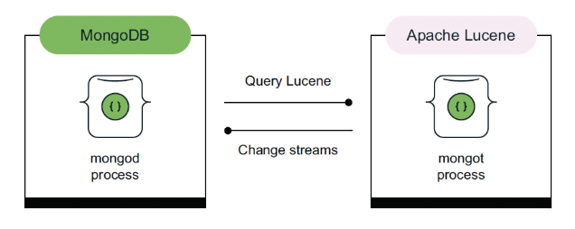

Most major database vendors, like [MongoDB](https://www.mongodb.com/lp/cloud/atlas/try4-reg/?utm_campaign=devrel&utm_source=third-party-content&utm_medium=cta&utm_content=foojay-vector-search&utm_term=tony.kim) , are adding vector search capabilities to their products. It's becoming a standard feature as demand for AI-powered applications grows.

**🕒 Reading time: 3-4 min**

**🧠 What is vector search needed for?**

MongoDB Vector Search enables semantic queries. For example, finding support tickets with similar meanings even if they use different words. It also powers hybrid search by combining exact keyword matches like "error 500" with semantically similar phrases like "server failure". Another use case is personalization, such as recommending articles similar to those a user has read.

Vector Search is also key to retrieval-augmented generation (RAG), where a language model (like ChatGPT) retrieves relevant context from a vector database before answering. For instance, pulling the correct API details from documentation instead of making them up.

**🔢 What is a vector?**

So what is a vector? It's just a list of numbers, for example \[0.12, -0.98, 4.45, 1, .44, ...\], that represents the meaning of a document, sentence, or image in a way that makes similar content end up close together in high-dimensional space. Searching with vectors means comparing these numerical representations to find the most semantically relevant matches.

MongoDB doesn't generate vectors itself but makes it easy to store, index, and search them using Atlas Vector Search. You can use external models like OpenAI or Hugging Face to create the vectors, then store and query them efficiently in MongoDB.

★ MongoDB recently acquired Voyage AI to bring high-quality embedding models and advanced features like reranking and hybrid relevance scoring directly into the MongoDB Atlas platform in the future.

**🍃 How MongoDB Implements Vector Search**

MongoDB introduced vector search through a dedicated process called mongot, which handles indexing and the execution of both full-text and vector search queries. This process is built on Apache Lucene, leveraging its native KNNVectorField support and the Hierarchical Navigable Small World (HNSW) algorithm for approximate nearest neighbor (ANN) search.

mongot handles search indexes independently from mongod, which is the main MongoDB process for storage and query execution. It doesn't store BSON documents but manages Lucene-based indexes.

Data is sent from mongod to mongot via an internal synchronization mechanism based on MongoDB Change Streams.  

When documents are inserted or updated in a MongoDB collection, the fields defined in the index configuration are extracted and streamed to mongot, where they are transformed and written to Lucene segment files for indexing.

**👉 The $vectorSearch Aggregation Pipeline Step**

You can run semantic similarity queries using vector representations through a unified MongoDB Query API and standard aggregation pipeline stages. At query time, when a pipeline includes a $vectorSearch stage, mongod parses the query and delegates the relevant portion to mongot. mongot then executes the Lucene query, whether it's based on vector similarity, relevance scoring, or a combination, and returns matching document IDs along with their scores.

These results are merged back in mongod with the original BSON documents and processed through any remaining filters or aggregation stages.

In MongoDB Atlas, mongot runs as a separate process, either alongside mongod or on dedicated Search Nodes, and is fully managed by MongoDB. While vector functionality was previously Atlas-only, it will soon be available in Community and Enterprise editions, allowing self-managed deployments with the same architecture.

**📙 What's Next?**

Want to learn how Vector Search works in a local environment? The next issue will show you exactly how to use Vector Search with a local MongoDB Atlas cluster.

**📘 More Tips Like This**

Want more hands-on examples, best practices, and deep dives into MongoDB 8.0 and the Atlas platform? Check out 👉 [MongoDB in Action: Building on the Atlas Data Platform](https://www.manning.com/books/mongodb-in-action-third-edition?utm_source=borucki&utm_medium=affiliate&utm_campaign=book_borucki&a_aid=borucki&a_bid=523e1217&chan=mm_flyinghighwithflutter). Published by [Manning Publications Co](https://www.linkedin.com/company/manning-publications-co/?lipi=urn%3Ali%3Apage%3Ad_flagship3_pulse_read%3BXUuFTKx0Rq%2BQCyHVecpjkg%3D%3D).
