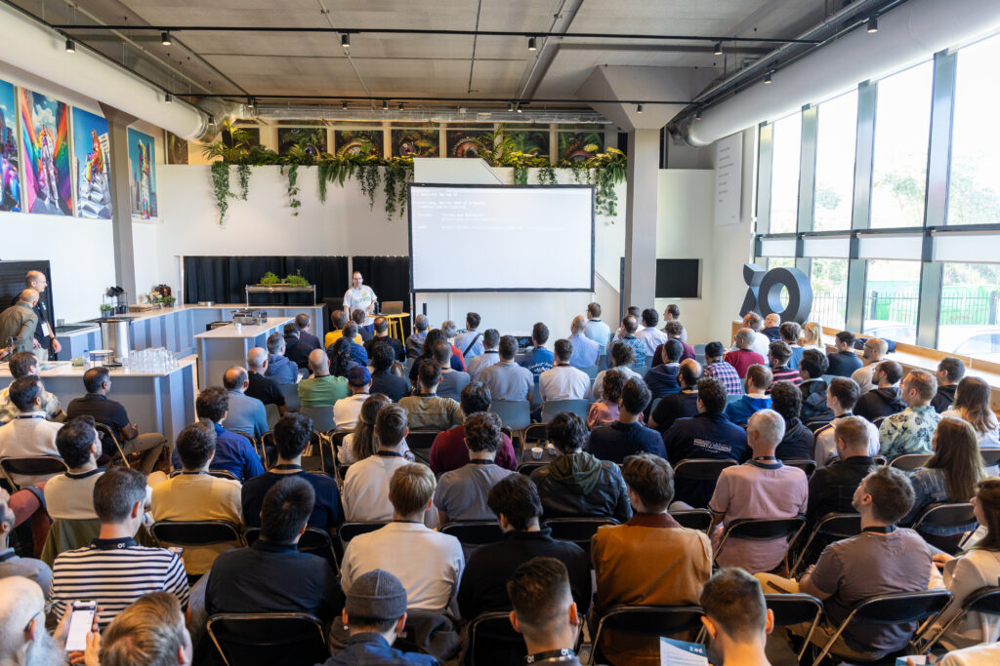
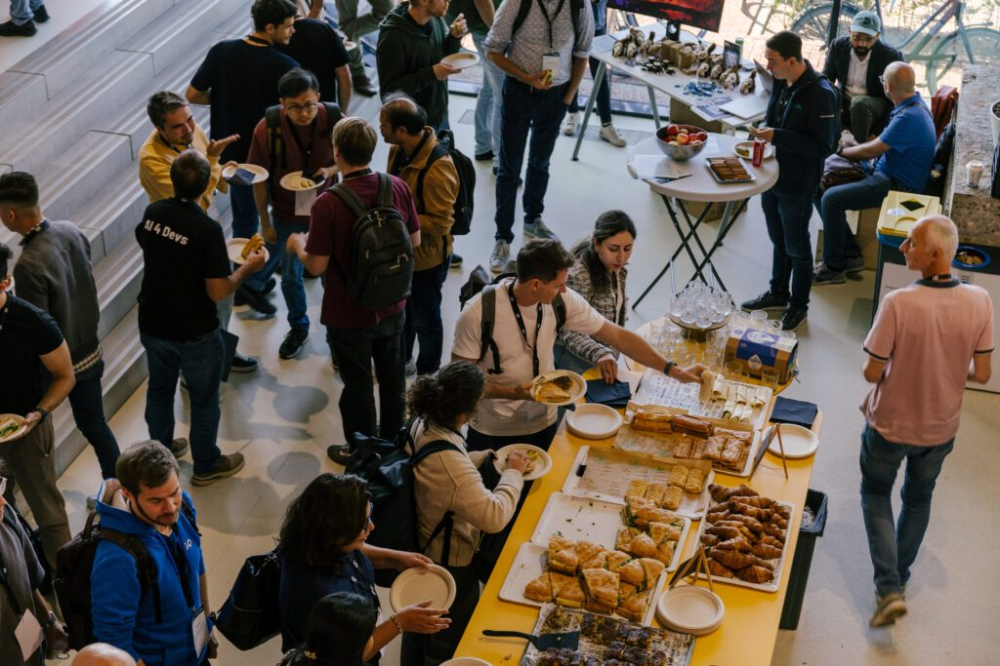
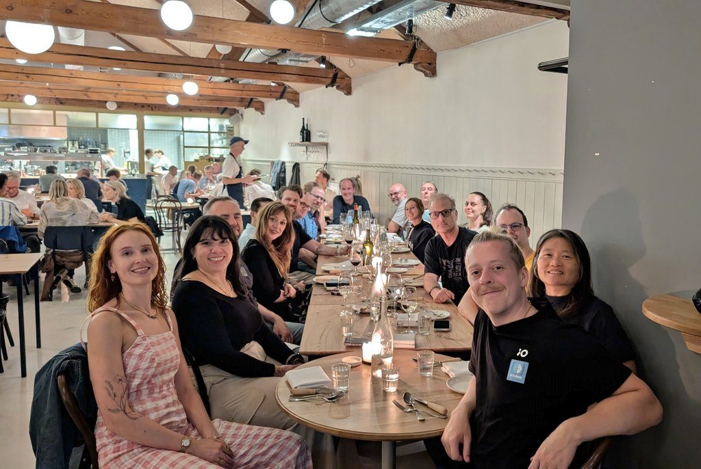

**The [inaugural AI4Devs conference in Amsterdam](https://amsterdam.ai4devs.io/), held recently Friday 19 September, a collaboration between Java Champion Jonathan Vila, [local developer agency IO Digital](https://www.iodigital.com/en) (in particular Joost Kaan, Arno Koehler, and Michel Blankenstein), and the Friends of OpenJDK (Foojay.io), proved to be a resounding success, bringing together approximately 200 developers at Amsterdam's iO Digital Campus.**

**ING, Azul, Qodo, and ContentStack**

Co-sponsored and co-organized with ING and Azul, together with Qodo and ContentStack, the event featured standout keynote sessions from Josh Long, of SpringBoot fame, and Pratik Patel, from Azul, who delivered insights on AI in the context of Spring and on increasing the speed of Java-based applications, especially in the context of AI-oriented applications.

However, AiDevs had as much love for frontend as for backend developers, with multiple parallel tracks, dedicated in particular to Java, JavaScript, and Python, together with a dedicated workshop track that ran throughout the day.

## 50% Live Coding

The conference fulfilled its mission to "share practical, usable knowledge with real use cases and code," targeting developers working with AI technologies at every level. True to its promise of being code-first, the event delivered talks with 50% live coding demonstrations across the full range of technologies.

The full-day event featured in-depth technical sessions, real-world AI implementation examples, hands-on workshops, and extensive networking opportunities. Attendees enjoyed comprehensive catering including lunch, refreshments, and a closing networking reception.

**Strong Developer-Centric Foundation**

With its laser-focused, developer-centric approach and intimate setting, AI4Devs Amsterdam successfully established itself as a premier destination for practical AI knowledge.



The inaugural event sets a strong foundation for future editions, demonstrating clear demand for technical, code-heavy AI conferences in the European market and beyond.

And the speaker dinner was one to be remembered!

