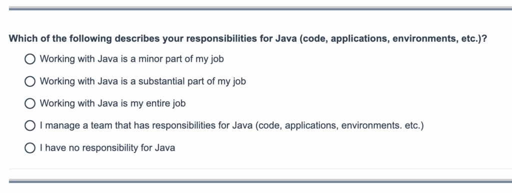

Do you want to know which Java JDK distribution is used where for what and when? The time has come again to take the State of Java Survey and share insights while gaining Java ecosystem knowledge.

All those participating will get the complete research, which can be of great benefit in your technology choices in the Java ecosystem.

Click the image below to get started:

Or simply click this link:

<https://survey.alchemer.com/s3/8466906/Azul-State-of-Java-Survey>
