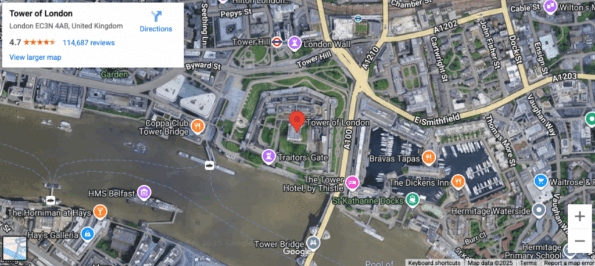
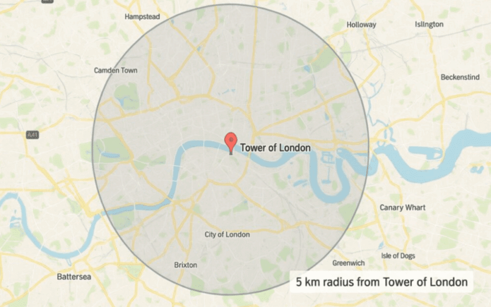
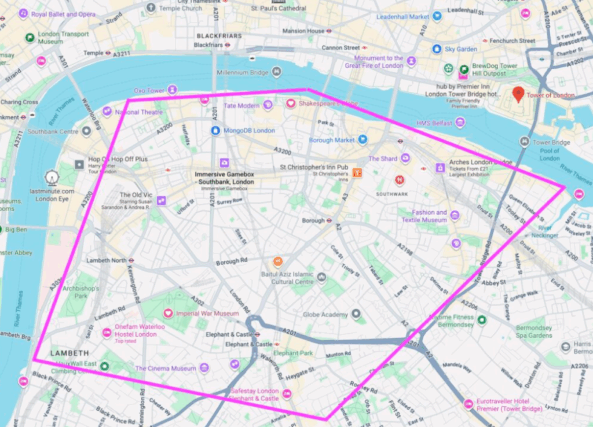
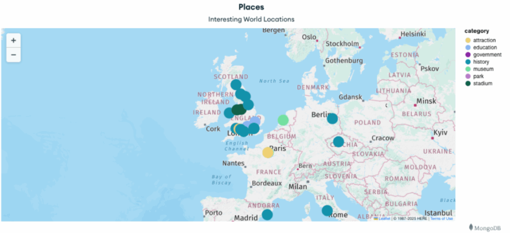
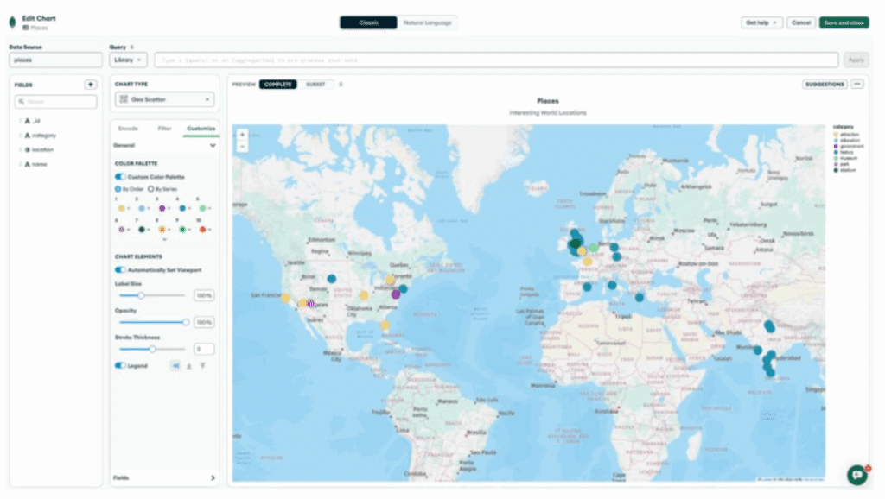
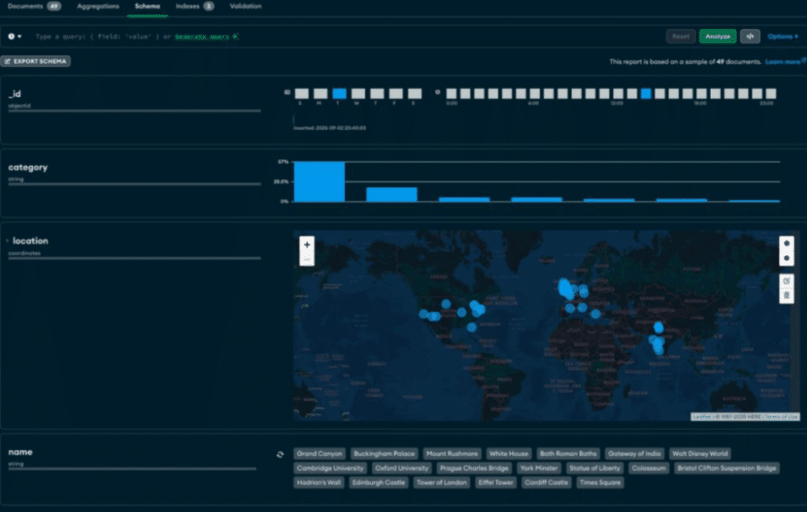

[MongoDB](https://www.mongodb.com/?utm_campaign=devrel&utm_source=third-party-content&utm_medium=cta&utm_content=geo-mongodb-foojay&utm_term=tony.kim) makes it really easy to work with location data (sometimes called Geo Data) by simplifying how to store this type of data and streamlining how you query for it so you can easily create "find nearby" queries, or plot your location data with ease!

Let's start with the basics: modeling your data, indexing it properly, running geo queries, and then displaying results on a map.

**Model Your Data with GeoJSON**

The best way to store and interact with location data in MongoDB is to use what is called [GeoJSON](https://www.mongodb.com/docs/manual/reference/geojson/?utm_campaign=devrel&utm_source=third-party-content&utm_medium=cta&utm_content=geo-mongodb-foojay&utm_term=tony.kim).

GeoJSON is a geospatial data interchange format based on JavaScript Object Notation (JSON). It defines several types of JSON objects and the manner in which they are combined to represent data about geographic features, their properties, and their spatial extents.

This format can store a wide variety of location like data, for our purposes we'll focus on the Point type. To store a Point you'll need a type and coordinates:

```
{
  "name": "York Minster",
  "category": "history",
  "location": {
    "type": "Point",
    "coordinates": [
      -1.081,
      53.962
    ]
  }
}
```

Note: the order matters, its \[longitude, latitude\] ... this may differ from how some map applications handle coordinate order.

In this example we named our point location and it has a type and an array of coordinates (the name and category are only used for our application, not the geo data).

Creating Geospatial Indexes

To enable queries on our locations we'll need to create a special type of index called a geospatial index:

```
db.places.createIndex({ location: "2dsphere" });
```

This will create an index on our location field, however we likely will want to create compound index that also includes the category of our location so let's create that index too:

```
db.places.createIndex(
  { category: 1, location: "2dsphere" }
);
```

Now we can target our queries to the category of location first, before checking the distance if we wish.

A 2dsphere type of index will "support queries that interpret geometry on a sphere" vs on a flat service (2d).

Using a 2d index for queries on spherical data can return incorrect results or an error. For example, 2d indexes don't support spherical queries that wrap around the poles.

**Performing Geo Queries**

There are a bunch of geo related queries you can do with MongoDB, we'll mostly focus on [$near](https://www.mongodb.com/docs/atlas/atlas-search/near/?utm_campaign=devrel&utm_source=third-party-content&utm_medium=cta&utm_content=geo-mongodb-foojay&utm_term=tony.kim) and [$geoWithin](https://www.mongodb.com/docs/manual/reference/operator/query/geowithin/?utm_campaign=devrel&utm_source=third-party-content&utm_medium=cta&utm_content=geo-mongodb-foojay&utm_term=tony.kim).

The simplest sort of geo related query operator is $near, which will return documents with a location nearest to the provided location (also a Point) which is this case The Tower of London:

```
db.places.find({
  location: {
    $near: {
      $geometry: { 
        type: "Point",
        coordinates: [-0.0761, 51.508] // Tower of London
      }, 
      $maxDistance: 2000 // meters
    }
  }
});
```

This will bring us back two of locations around London within 2,000 meters of The Tower of London:

```
{
  _id: ObjectId('68b75623ad2321ea365d00e8'),
  name: 'Tower of London',
  category: 'history',
  location: {
    type: 'Point',
    coordinates: [-0.0761, 51.5081]
  }
},
{
  _id: ObjectId('68b75623ad2321ea365d00ec'),
  name: "St. Paul's Cathedral",
  category: 'history',
  location: {
    type: 'Point',
    coordinates: [-0.0983, 51.5138]
  }
}
```

Obviously within that close of a range it might not always match a lot of major landmarks, but if you were looking for a restaurant within a 1 mile walk that might be perfect!


**Searching within an area**

We can get even more specific however, and find locations within a 5km radius. This will require a little more math but it still quite a simple query using $geoWithin:

```
db.places.find({
  location: {
    $geoWithin: {
      $centerSphere: [[-0.0761, 51.508], 5 / 6378.1]
    }
  }
});
```

Let's break this down a little:

* $centerSphere: the shape is a circle on a sphere (a "spherical cap")
* The first value \[-0.0761, 51.508\] is the center in \[lng, lat\] (The Tower of London)
* The second value is the radius in radians. 5 / 6378.1 converts 5 km to radians by dividing by Earth's mean radius in kilometers (6378.1 km).



**Search Within a Custom Area**

Lastly we can do something more ad hoc than a circle. Imagine we are taking a walk across the Millennium Bridge from North London into South London, and want to search a very specific area like so:


We can do that by setting our type as a polygon and providing each point (roughly below):

```
db.places.find({
  location: {
    $geoWithin: {
      $geometry: {
        type: "Polygon",
        coordinates: [[
           [-0.1145, 51.5073],  // South Bank by Waterloo Bridge
           [-0.1048, 51.5074],  // Bankside/Tate Modern (west of Millennium Bridge)
           [-0.0931, 51.5070],  // Shakespeare's Globe / Bankside
           [-0.0849, 51.5062],  // London Bridge area
           [-0.0738, 51.5050],  // Tower Bridge (south side / More London)
           [-0.0698, 51.4935],  // Bermondsey / Tower Bridge Road south
           [-0.0869, 51.4900],  // Elephant & Castle / Walworth
           [-0.1135, 51.4948],  // Lambeth
           [-0.1160, 51.5015],  // Lambeth North / Westminster Bridge Rd
           [-0.1145, 51.5073]   // "Close" the shape, back to start (South Bank)
        ]]
      }
    }
  }
});
```

Now we might get back locations such as Shakespeare's Globe, the Tate Modern, the Imperial War Museum or even the MongoDB London HQ!

**Using Geo Queries in Pipelines**

You can also take advantage of geo queries in Aggregation pipelines using $geoNear:

```
db.places.aggregate([
  {
    $geoNear: {
      near: { type: "Point", coordinates: [-0.1278, 51.5074] },
      distanceField: "distanceMeters",
      maxDistance: 2000,
      spherical: true,
      query: { category: "history" }
    }
  },
  { $limit: 20 },
  { $project: { name: 1, category: 1, location: 1, distanceMeters: 1 } }
]);
```

While rather simple, this will get the location and then limit the output, and return just the fields specified but you could have any number of steps in between.

Note: $geoNear must be the first stage in aggregations.

**Mapping Geo Data**

There are a number of ways you can map this data, including some ways build directly into MongoDB products, such as Compass or Charts:

**MongoDB Charts**

If you haven't used MongoDB Charts it is a pretty cool charting platform built directly into MongoDB Atlas (MongoDB's Cloud Service) that you can use to make all sorts of charts and even maps!

Below is an interactive map generated with all the location points from our collection (go ahead, zoom in)!


This example is showing all the locations, but you can use a query when you build your map to get just a subset as well as add the map along with other charts to create a Dashboard. As a bit of a preview this is what Charts look like in edit mode.


**MongoDB Compass**

You can also view a map like this within MongoDB Compass if you click on the Schema tab and Analyze your documents:


Of course you can also use the Google Maps API or maybe Mapbox. What sort of ideas can you think of to use your new geo location knowledge? Have fun!
