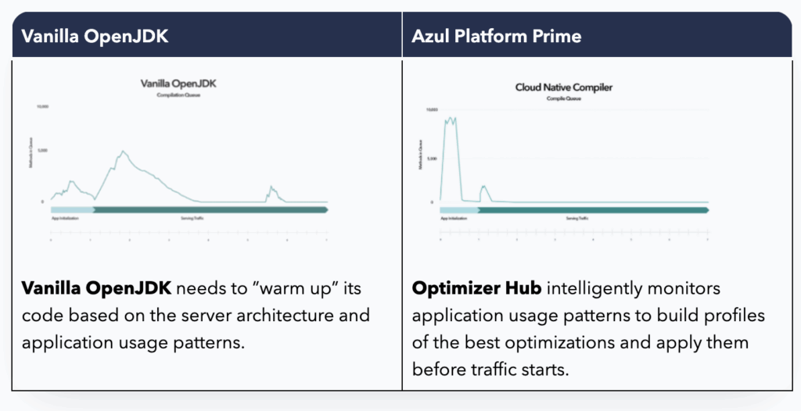
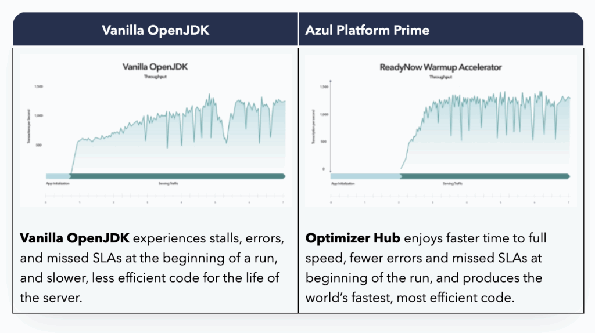
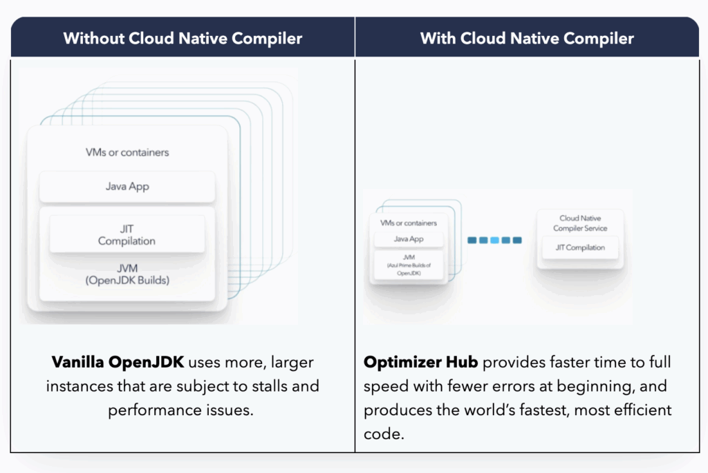
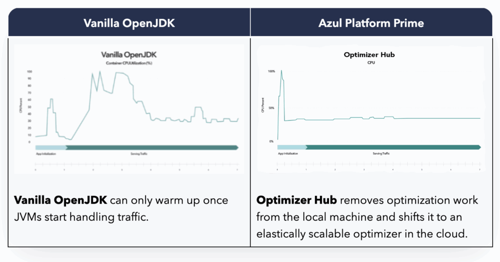

***A large global enterprise achieved a performance and efficiency milestone, running 10,000 Java Virtual Machines (JVMs) that collaborate and share optimizations with one another, using Azul Platform Prime's Optimizer Hub. The enterprise improved application responsiveness and stability at scale while reducing infrastructure costs, which has resulted in better user experiences and greater business efficiency.***

*In this post you will learn: how*...

* *A global enterprise sustained rising cloud costs to support the company's ongoing success*
* *Azul Platform Prime with Optimizer Hub is delivering cloud cost savings of more than 20%*
* *Optimizer Hub is improving cloud-centric Java application startup, warmup and runtime performance by offloading optimization tasks from JVMs to a centralized set of services*

Earlier this year, an [Azul Platform Prime](https://www.azul.com/products/prime/) enterprise customer achieved something no other organization has ever accomplished: seamless collaboration between more than 10,000 JVMs across hundreds of applications using a single instance of Platform Prime's Optimizer Hub. In case you're wondering, here's why that's big news.

The company was already achieving consistent success, but they needed to sustain it while maintaining economies of scale, lowering operating costs, and delivering smooth customer experiences. With cloud and infrastructure costs rising, the business' leaders made optimizing cloud costs a top priority.

By enabling so many JVMs to collaborate and share performance optimizations across hundreds of applications, the enterprise improved application responsiveness and stability at scale while reducing infrastructure costs. This means better customer experiences and greater business efficiency. The critical infrastructure element is Azul Platform Prime enhanced by its Optimizer Hub.

One of the most significant advantages of Java applications over those developed in other languages is the promise of "Write once, run anywhere." Java is compiled into bytecodes, instructions for a *virtual machine*, and is converted at runtime to the instructions and system calls specific to the platform on which the application is running.

This also enables JVM-based applications to frequently outperform natively compiled ones, as the Just-in-Time (JIT) compiler has information about how the application is *actually* being used, and is not making generalized assumptions about how it *might* be used.

## Limitations of OpenJDK

The drawback to runtime profiling and JIT compilation in traditional JVMs, like vanilla distributions of OpenJDK, is that it leads to a delay in when the application can deliver its peak performance. Frequently used code must be identified, how that code is being used must be profiled, and it must be compiled while the application is running. The time this takes is what is referred to as the *warm-up time* for a Java application.

To compound the issue further, when the same application is restarted, the process of identifying frequently used code, profiling it, and compiling it must be repeated every time.

To address these limitations, Azul has developed Optimizer Hub, part of the Azul Platform Prime high-performance [Java platform](https://www.azul.com/). Azul Platform Prime has two main components: Azul Zing, an enhanced build of OpenJDK, and an additional component, Optimizer Hub.

Optimizer Hub is scalable across regions and availability zones, and ideal for modern applications running in containerized, elastic cloud environments with contemporary DevOps practices. It comprises two services that run in a customer's environment: Optimizer Hub comprises two services, Cloud Native Compiler and ReadyNow Orchestrator.

* [Cloud Native Compiler](https://www.azul.com/products/intelligence-cloud/cloud-native-compiler/) provides centralized JIT compilation and caching to deliver cost savings and efficiency. Cloud Native Compiler shifts the heavy work of compilation from individual JVMs to a centralized, scalable service, slashing CPU workload on each JVM and caching compilation for reuse.
* ReadyNow is a feature in Platform Prime that addresses Java's warmup problem by logging and reusing [JIT compiler](https://www.azul.com/products/components/falcon-jit-compiler/) profiling and optimization data between JVM runs. [ReadyNow Orchestrator](https://azul.com/products/components/readynow/) delivers intelligent curation of ReadyNow warmup optimization profiles to remove performance bottlenecks when launching JVM-based applications, improving user experience and SLA attainment.

The basic concept of ReadyNow is to eliminate the repeated work of profiling code while the application is running as already described. ReadyNow does this by essentially giving the JVM a "long-term memory" associated with a given application.

To achieve this, the application is run in a production environment, allowing for an accurate record of how it is used. When the application is fully warmed up, a ReadyNow profile is recorded. This can be collected at any time and, if desired, multiple profiles can be collected for the same application.

The profile contains all the critical information related to JIT compilation, specifically a list of loaded classes, a list of initialized classes, all the profiling data collected by the [JIT compiler](https://www.azul.com/products/components/falcon-jit-compiler/), any deoptimizations that occurred and a copy of the compiled code.

## How Azul Platform Prime removes the limits of traditional JVMs

When the application is restarted, rather than starting from scratch, the JVM can immediately load and initialize classes in the profile lists. It then compiles the necessary code (if required) or reuses the code from the profile.

Doing this work before the application starts doing any work results in almost a hundred per cent of the performance that was delivered when the profile was recorded. This significantly reduces warmup time.

This is a good start, but Optimizer Hub can improve things further.

ReadyNow can store profiles in a central cloud repository like Optimizer Hub's ReadyNow Orchestrator service. When a container-based service starts up, rather than using a locally stored profile, the JVM can be configured to request the profile from the Optimizer Hub. When changes to the profile are required, a new profile can be uploaded to the Optimizer Hub and will be used by subsequent JVM runs.

As each new JVM starts in its container and the JIT compiles the code based on the ReadyNow profile, the JVM sends back a new version of the profile to ReadyNow Orchestrator in Optimizer Hub. There are two benefits: 1) ReadyNow Orchestrator 'curates' the best profile over time to ensure each successive JVM that starts has the best possible profile, and 2) the container does not need to be rebuilt or redeployed because the profile is no longer directly included in the container image, saving both time and expense.

Another issue associated with JIT compilation is that the compiler must share the resources of the container with the application. When using small containers, such as a two-vCore instance, application throughput will be halved while compilation is taking place.

The second service of Optimizer Hub is the Cloud Native Compiler. This decouples the [JIT compiler](https://www.azul.com/products/components/falcon-jit-compiler/) from an individual JVM and offloads it to an elastically scalable, centralized service.

When code needs to be compiled by the JVM, it sends the code along with the collected profiling data to the Cloud Native Compiler.

It compiles the code and returns it to the JVM. By eliminating the contention for resources, individual service containers can be configured with less compute power, thus saving money.

In addition, the Cloud Native Compiler is a long-running process, allowing it to maintain a cache of compiled code. When multiple instances of the same application need to be started to address a sudden increase in load, it does not need to compile the same code for each instance.

After the first compilation, the code will be stored in Cloud Native Compiler so that it can immediately be returned for subsequent service invocations.

By leveraging Optimizer Hub's centralized services, Azul Platform Prime:

* Delivers the fastest possible code for execution,
* Enables new JVMs to start more smoothly and come to full speed quicker for greater elasticity, fewer errors, and higher SLA attainment
* Slashes CPU workload on each individual JVM, so applications can use fewer compute instances for the same workload and lower cloud compute costs by 20%+.

By making one change, using Azul Platform Prime enhanced by Optimizer Hub, a global enterprise improved application responsiveness and stability at scale while reducing infrastructure costs.

Today this enterprise provides better customer experiences and operates with greater efficiency.

The critical infrastructure element is Azul Platform Prime enhanced by its Optimizer Hub. Why not give it a try?
