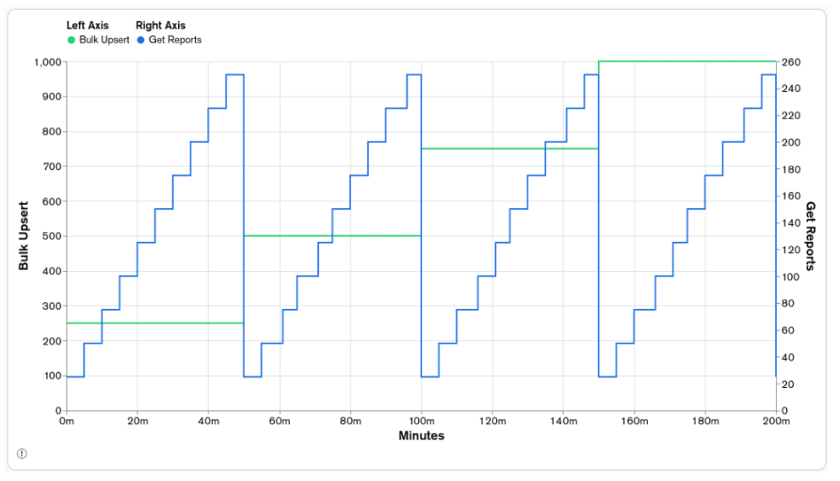
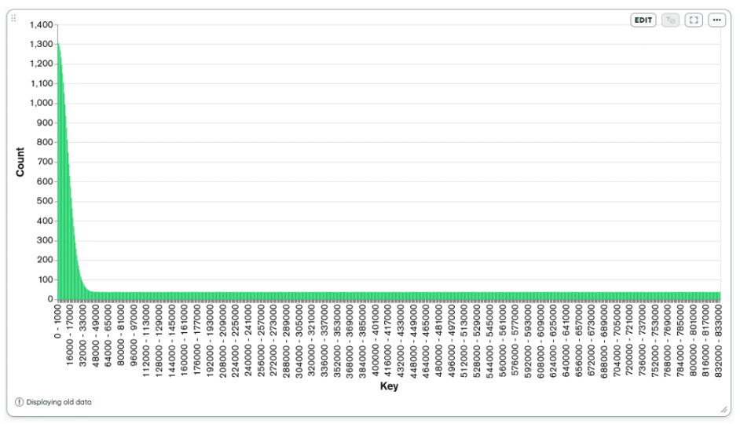
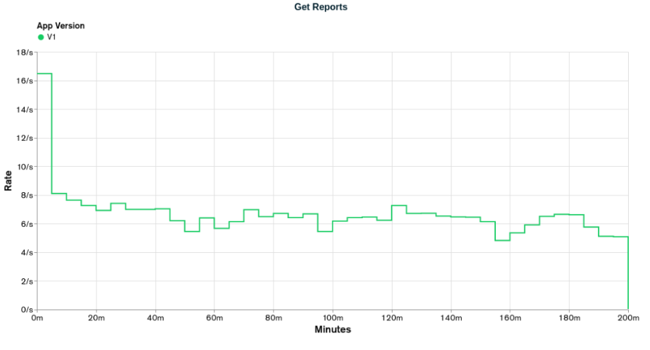
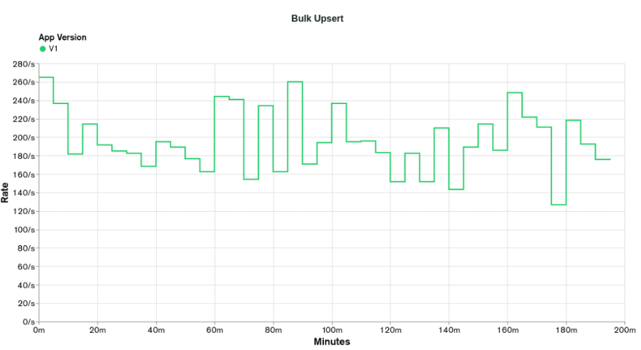
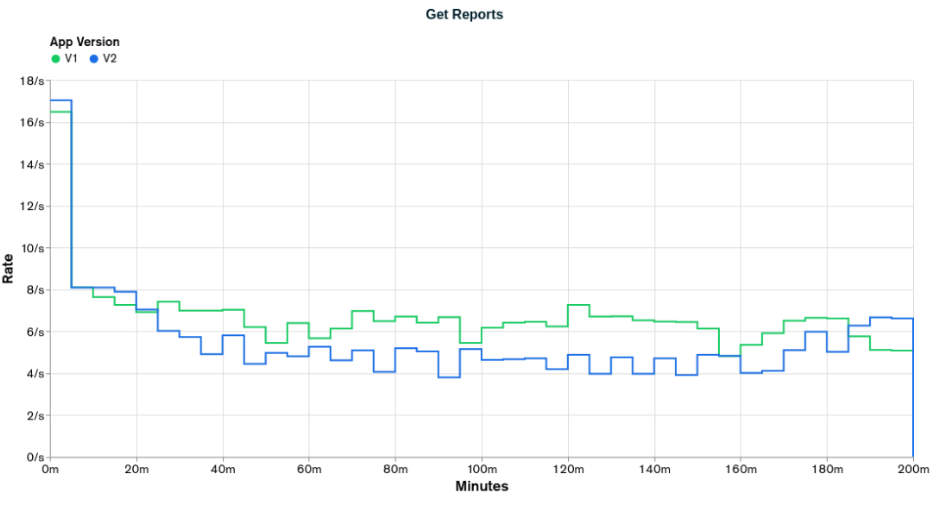
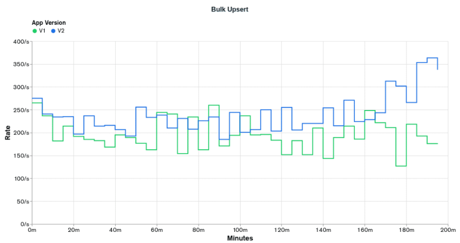
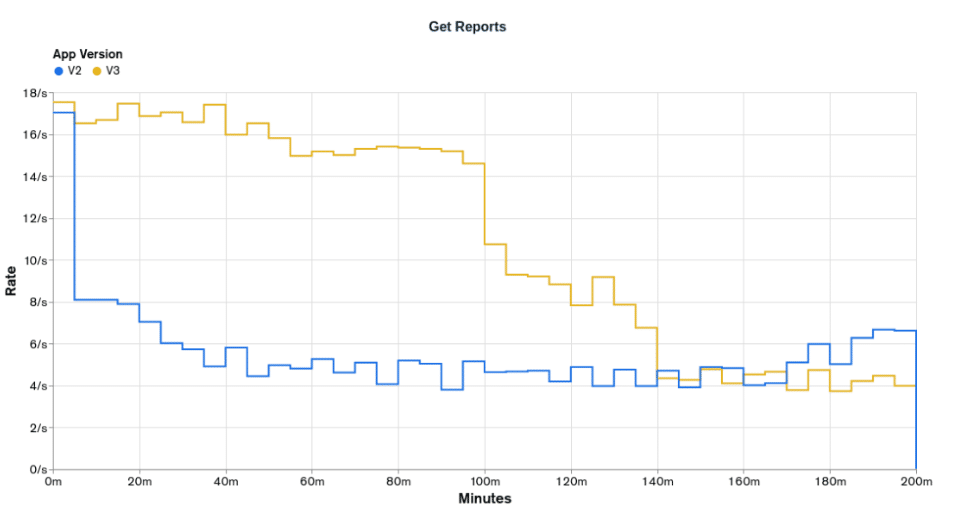
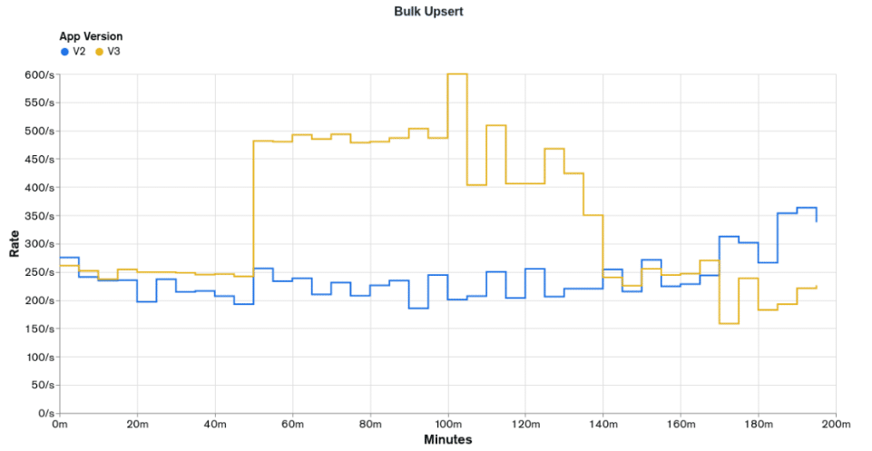
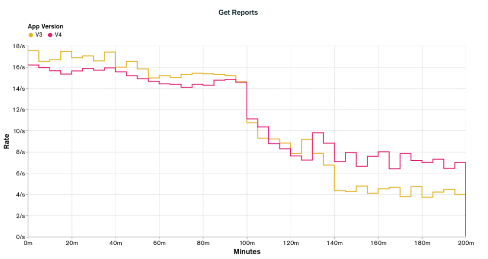
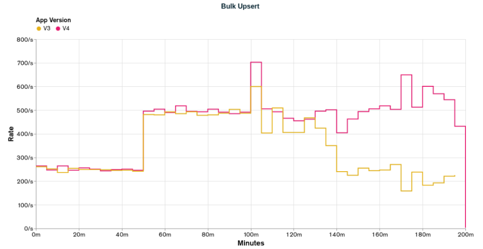

The primary focus of this series is to show how much performance you can gain, and as a consequence, the cost you can save when using [MongoDB](https://www.mongodb.com/lp/cloud/atlas/try4-reg/?utm_campaign=devrel&utm_source=third-party-content&utm_medium=cta&utm_content=cost-part1-foojay&utm_term=tony.kim) properly, following the best practices, studying your application needs, and using it to model your data.

To show these possible gains, a dummy application will be presented, and many possible implementations of it using MongoDB will be developed and load-tested. There will be implementations for all levels of MongoDB knowledge: beginner, intermediate, senior, and mind-blowing (🤯) .

All the code and some extra information used through this article can be found in the [GitHub](https://github.com/ArturGC/the-cost-of-not-knowing-mongodb) repository.

## The application: finding fraudulent behavior in transactions

The application goal is to identify fraudulent behavior in a financial transaction system by analyzing the transactions' statuses over a time period for a determined user. The possible transaction statuses are \`approved\`, \`noFunds\`, \`pending\`, and \`rejected\`. Each user is uniquely identifiable by a 64-character hexadecimal \`key\` value.

The application will receive the transaction status through an \`event\` document. An \`event\` will always provide information for one transaction for one user on a specific day, and because of that, it will always have only one of the possible status fields, and this status field will have the numeric value 1. As an example, the following \`event\` document represents a transaction with the status of \`pending\` for the user with identification \`key\` of \`...0001\` that happened on the \`date\`/day \`2022-02-01\`:

|---------------------------------------------------------------------------------------------------------------------------------------|
| const event = { key: '0000000000000000000000000000000000000000000000000000000000000001', date: new Date('2022-02-01'), pending: 1, }; |

The statuses of the transactions will be analyzed by comparing the totals of statuses in the last \`oneYear\`, \`threeYears\`,\`fiveYears\`, \`sevenYears\`, and \`tenYears\` for any user. These totals will be provided in a \`reports\` document, which can be requested by providing the user \`key\` and the end \`date\` of the report.

The following document is an example of a \`reports\` document for the user of \`key\` \`...0001\` and an end date of \`2022-06-15\`:

|-----------------------------------------------------------------------------------------------------------------------------------------------------------------------------------------------------------------------------------------------------------------------------------------------------------------------------------------------------------------------------------------------------------------------------------------------------------------------------------------------------------------------------------------------------------------------------------------------------------------------------------------------------------------------------------------------------------------------------------------------------------------------------------------------------------------------------------------------------------------------------------------------------------------------------|
| export const reports = \[ { id: 'oneYear', end: new Date('2022-06-15T00:00:00.000Z'), start: new Date('2021-06-15T00:00:00.000Z'), totals: { approved: 4, noFunds: 1, pending: 1, rejected: 1 }, }, { id: 'threeYears', end: new Date('2022-06-15T00:00:00.000Z'), start: new Date('2019-06-15T00:00:00.000Z'), totals: { approved: 8, noFunds: 2, pending: 2, rejected: 2 }, }, { id: 'fiveYears', end: new Date('2022-06-15T00:00:00.000Z'), start: new Date('2017-06-15T00:00:00.000Z'), totals: { approved: 12, noFunds: 3, pending: 3, rejected: 3 }, }, { id: 'sevenYears', end: new Date('2022-06-15T00:00:00.000Z'), start: new Date('2015-06-15T00:00:00.000Z'), totals: { approved: 16, noFunds: 4, pending: 4, rejected: 4 }, }, { id: 'tenYears', end: new Date('2022-06-15T00:00:00.000Z'), start: new Date('2012-06-15T00:00:00.000Z'), totals: { approved: 20, noFunds: 5, pending: 5, rejected: 5 }, }, \]; |

## The load test

Two functions for each application version were created to be executed simultaneously and load-test each application version's performance. One function is called \`Bulk Upsert\`, which inserts the event documents. The other is called \`Get Reports\`, which generates the \`reports\` for a specific user \`key\` and \`date\`. The parallelization of the execution of each function was made using worker threads, with 20 workers allocated to each function. The test's duration for each application version is 200 minutes, with different execution parameters being used through the load test.

The \`Bulk Upsert\` function will receive batches of 250 event documents to be registered. As the name implies, these registrations will be made using MongoDB's \`[upsert](https://www.mongodb.com/docs/manual/reference/method/db.collection.update/?utm_campaign=devrel&utm_source=third-party-content&utm_medium=cta&utm_content=cost-part1-foojay&utm_term=tony.kim#insert-a-new-document-if-no-match-exists--upsert-)\` functionality. It will try to update a document and, if it doesn't exist, create a new one with the data available in the update operation. Each \`Bulk Upsert\` iteration will be timed and registered in a secondary database. The rate of batch processing will be divided into four phases, each with 50 minutes, totaling 200 minutes. The rate will start with one batch insert per second and will be increased by one every 50 minutes, ending with four batch inserts per second, or 1000 event documents per second.

The \`Get Reports\` function will generate one \`reports\` document per execution. Each \`reports\` execution will be timed and registered in the secondary database. The rate of generating \`reports\` will be divided into 40 phases, 10 phases for each \`Bulk Upsert\` phase. In each phase of \`Bulk Upsert\`, the rate will start with 25 report requests per second and increase by 25 report requests per second every five minutes, ending with 250 complete reports per second in the same \`Bulk Upsert\` phase.

The following graph depicts the rates of \`Bulk Upsert\` and \`Get Reports\` for the test scenario presented above:

## Initial scenario and data generator

To make a fair comparison between the application versions, the initial scenario/working set used in the tests had to be greater than the memory of the machine running the MongoDB server, forcing cache activity and avoiding the situation where all the working set would fit in the cache. To accomplish that, the following parameters were chosen:

* 10 years of data, from \`2010-01-01\` to \`2020-01-01\`
* 50 million events per year, totaling 500 million for the working set
* 60 events per user/\`key\` per year

Considering the number of events per year and the number of events per user per year, the total number of users is 50.000.000/60=833.333. The user \`key\` generator was tuned to produce keys approaching a normal/gaussian distribution to simulate a real-world scenario where some users will have more events than others. The following graph shows the distribution of 50 million keys generated by the \`key\` generator.

To also approach a real-world scenario, the distribution of the event statuses is:

* 80% \`approved\`.
* 10% \`noFunds\`.
* 7.5% \`pending\`.
* 2.5% \`rejected\`.

## The instances configuration

The EC2 instance running the MongoDB server is a \`c7a.large\` on the AWS cloud. It has 2vCPU and 4GB of memory. Two disks were attached to it: one for the operating system with \`15GB\` of size and \`GP3\` type, and the other for the MongoDB server, which stores its data with \`300GB\` of size, \`IO2\` type, and \`10.000IOPS\`. The operating system installed on the instance is Ubuntu 22.04, with all the updates and upgrades available at the time. All the recommended production notes were applied to the machine to allow MongoDB to extract the maximum performance of the available hardware.

The EC2 instance running the application server is a \`c6a.xlarge\` on the AWS cloud. It has 4vCPU and 8GB of memory. Two disks were attached to it: one for the operating system with \`10GB\` of size and \`GP3\` type, and the other for the secondary MongoDB server, which stores its data with \`10GB\` of size and \`GP3\` type. The operating system installed on the instance is Ubuntu 22.04, with all the updates and upgrades available at the time. All the recommended production notes were applied to the machine to allow MongoDB to extract the maximum performance of the available hardware.

## Application Version 1 (appV1)

The first application version and the base case for our comparison would have been developed by someone with a junior knowledge level of MongoDB who just took a quick look at the documentation and learned that every document in a collection must have an \`_id\` field and this field is always unique indexed.

To take advantage of the \`_id\` obligatory field and index, the developer decides to store the values of \`key\` and \`date\` in an embedded document in the \`_id\` field. With that, each document will register the status totals for one user, specified by the field \`_id.key\`, in one day, specified by the field \`_id.date\`.

### Schema

The application implementation presented above would have the following TypeScript document schema denominated \`ScemaV1\`:

|-----------------------------------------------------------------------------------------------------------------------------------|
| type SchemaV1 = { _id: { key: string; date: Date; }; approved?: number; noFunds?: number; pending?: number; rejected?: number; }; |

### Bulk upsert

Based on the specification presented, we have the following bulk \`updateOne\` operation for each \`event\` generated by the application:

|------------------------------------------------------------------------------------------------------------------------------------------------------------------------------------------------------------------------------------------|
| const operation = { updateOne: { filter: { _id: { date: event.date, key: event.key }, }, update: { $inc: { approved: event.approved, noFunds: event.noFunds, pending: event.pending, rejected: event.rejected, }, }, upsert: true, }, }; |

### Get reports

Five aggregation pipelines, one for each date interval, will be needed to fulfill the \`Get Reports\` operation. Each date interval will have the following pipeline, with just the \`_id.date\` range in the \`$match\` filter being different:

|---------------------------------------------------------------------------------------------------------------------------------------------------------------------------------------------------------------------------------------------------------------------------------------------|
| const pipeline = \[ { $match: { '_id.key': request.key, '_id.date': { $gte: Date.now() - oneYear, $lt: Date.now() }, }, }, { $group: { _id: null, approved: { $sum: '$approved' }, noFunds: { $sum: '$noFunds' }, pending: { $sum: '$pending' }, rejected: { $sum: '$rejected' }, }, }, \]; |

### Indexes

As presented in the introduction of this application implementation, the main goal of embedding the fields \`key\` and \`date\` in the \`_id\` field was to take advantage of its obligatory existence and index. But, after some preliminary testing and research, it was discovered that the index on the \`_id\` field wouldn't support the filtering/match criteria in the \`Get Reports\` function. With that, the following extra index was created:

|----------------------------------------------------------------------------------------------------------------------|
| const keys = { '_id.key': 1, '_id.date': 1 }; const options = { unique: true }; db.appV1.createIndex(keys, options); |

For those wondering why we need an extra index in the fields of the embedded document in the \`_id\` field, which is already indexed by default, a detailed explanation can be found in [Index on embedded documents](https://docs.google.com/document/d/106lg-shDFdP5nB96MjNkou_Lrb9FBCym3YuhOD0GKDk/edit#heading=h.e5y0d7i29gv0).

### Initial scenario stats

Inserting the 500 million event documents for the initial scenario in the collection \`appV1\` with the schema and \`Bulk Upsert\` function presented above, we have the following \`collection stats\`:

|------------|-------------|-----------|---------------|--------------|---------|------------|
| Collection | Documents   | Data Size | Document Size | Storage Size | Indexes | Index Size |
| appV1      | 359.639.622 | 39,58GB   | 119B          | 8.78GB       | 2       | 20.06GB    |

Another interesting metric that we can keep an eye on through the application versions is the storage size needed, data, and index, to store one of the 500 million events—let's call it \`event stats\`. We can obtain this value by dividing the Data Size and Index Size of the initial scenario stats by the amount of events documents. For the \`appV1\`, we have the following \`event stats\`:

|------------|------------------|-------------------|-------------------|
| Collection | Data Size/events | Index Size/events | Total Size/events |
| appV1      | 85B              | 43.1B             | 128.1B            |

### Load test results

Executing the load test for \`appV1\`, we have the following results for \`Get Reports\` and \`Bulk Upsert\`:
 

The graphs above show that in almost no moment, the \`appV1\` was able to reach the desired rates. The first stage of Bulk Upsert lasts for 50 minutes with a desired rate of 250 events per second. The event rate is only achieved in the first 10 minutes of the load test. The first stage of Get Reports lasts 10 minutes with a desired rate of 20 reports per second. The report rate is never achieved, with the highest value being 16.5 reports per second. As this is our first implementation and test, there is not much else to reason about.

### Issues and improvements

The first issue that can be pointed out and improved in this implementation is the document schema in combination with the two indexes. Because the fields \`key\` and \`date\` are in an embedded document in the field \`_id\`, their values are indexed twice: by the default/obligatory index in the \`_id\` field and by the index we created to support the \`Bulk Upserts\` and \`Get Reports\` operations.

As the \`key\` field is a 64-character string and the \`date\` field is of type date, these two values use at least 68 bytes of storage. As we have two indexes, each document will contribute to 136 index bytes in a non-compressed scenario.

The improvement here is to extract the fields \`key\` and \`date\` from the \`_id\` field and let the \`_id\` field keep its default value of type ObjectId. The ObjectId data type takes only 12 bytes of storage.

This first implementation can be seen as a forced worst-case scenario to make the more optimized solutions look better. Unfortunately, that is not the case. It's not hard to find implementations like this on the internet and I've worked on a big project with a schema like this one, from where I got the idea for this first case.

## Application Version 2 (appV2)

As discussed in the issues and improvements of \`appV1\`, embedding the fields \`key\` and \`date\` as a document in the \`_id\` field trying to take advantage of its obligatory index is not a good solution for our application because we would still need to create an extra index and the index on the \`_id\` field would take more storage than needed.

To solve the issue of the index on the \`_id\` field being bigger than needed, the solution is to move out the fields \`key\` and \`date\` from the embedded document in the \`_id\` field, and let the \`_id\` field have its default value of type ObjectId. Each document would still register the status totals for one user, specified by the field \`key\`, in one day, specified by the field \`date\`, the same way it's done in \`appV1\`.

The second application version and the improvements to get to it would still have been developed by someone with a junior knowledge level of MongoDB but who has gone more depth in the documentation related to indexes in MongoDB, especially when indexing fields of type documents.

### Schema

The application implementation presented above would have the following TypeScript document schema denominated \`SchemaV2\`:

|----------------------------------------------------------------------------------------------------------------------------------------|
| type SchemaV2 = { _id: ObjectId; key: string; date: Date; approved?: number; noFunds?: number; pending?: number; rejected?: number; }; |

### Bulk upsert

Based on the specification presented, we have the following bulk \`updateOne\` operation for each \`event\` generated by the application:

|--------------------------------------------------------------------------------------------------------------------------------------------------------------------------------------------------------------------------------|
| const operation = { updateOne: { filter: { key: event.key, date: event.date }, update: { $inc: { approved: event.approved, noFunds: event.noFunds, pending: event.pending, rejected: event.rejected, }, }, upsert: true, }, }; |

### Get reports

Five aggregation pipelines, one for each date interval, will be needed to fulfill the \`Get Reports\` operation. Each date interval will have the following pipeline, with just the \`date\` range in the \`$match\` filter being different:

|---------------------------------------------------------------------------------------------------------------------------------------------------------------------------------------------------------------------------------------------------------------------------------|
| const pipeline = \[ { $match: { key: request.key, date: { $gte: Date.now() - oneYear, $lt: Date.now() }, }, }, { $group: { _id: null, approved: { $sum: '$approved' }, noFunds: { $sum: '$noFunds' }, pending: { $sum: '$pending' }, rejected: { $sum: '$rejected' }, }, }, \]; |

### Indexes

To support the filter/match criteria of \`Bulk Upsert\` and \`Get Reports\`, the following index was created in the \`appV2\` collection:

|----------------------------------------------------------------------------------------------------------|
| const keys = { key: 1, date: 1 }; const options = { unique: true }; db.appV2.createIndex(keys, options); |

### Initial scenario stats

Inserting the 500 million event documents for the initial scenario in the collection \`appV2\` with the schema and \`Bulk Upsert\` function presented above, and also presenting the values from the previous versions, we have the following \`collection stats\`:

|------------|-------------|-----------|---------------|--------------|---------|------------|
| Collection | Documents   | Data Size | Document Size | Storage Size | Indexes | Index Size |
| appV1      | 359.639.622 | 39,58GB   | 119B          | 8.78GB       | 2       | 20.06GB    |
| appV2      | 359.614.536 | 41.92GB   | 126B          | 10.46GB      | 2       | 16.66GB    |

Calculating the \`event stats\` for \`appV2\` and also presenting the values from the previous versions, we have the following:

|------------|------------------|-------------------|-------------------|
| Collection | Data Size/events | Index Size/events | Total Size/events |
| appV1      | 85B              | 43.1B             | 128.1B            |
| appV2      | 90B              | 35.8B             | 125.8B            |

Analyzing the tables above, we can see that from \`appV1\` to \`appV2\`, we increased the data size by 6% and decreased the index size by 17%. We can say that our goal of making the index on the \`_id\` field smaller was accomplished.

Looking at the \`event stats\`, the total size per event value decreased only by 1.8%, from 128.1B to 125.8B. With this difference being so small, there is a good chance that we won't see big improvements from a performance point of view.

### Load tests results

Executing the load test for \`appV2\` and plotting it alongside the results for \`appV1\`, we have the following results for \`Get Reports\` and \`Bulk Upsert\`:
 

The graphs above show that in almost no moment, \`appV2\` reached the desired rates, having a result very similar to the \`appV1\`, as predicted in the \`Initial Scenario Stats\` when we got only a 1.7% improvement in the \`event stats\`. \`appV2\` only reached the \`Bulk Upsert\` desired rate of 250 events per second in the first 10 minutes of the test and got only 17 reports per second in \`Get Reports\`, lower than the 20 reports per second desired.

Comparing the two versions, we can see that \`appV2\` performed better than \`appV1\` for the \`Bulk Upsert\` operations and worse for the \`Get Reports\` operations. The improvement in the \`Bulk Upsert\` operations can be attributed to the indexes being smaller and the degradation in the \`Get Reports\` can be attributed to the document being bigger.

### Issues and improvements

The following document is a sample from the collection \`appV2\`:

|-----------------------------------------------------------------------------------------------------------------------------------------------------------------------------------------------------------------------------------------|
| const document = { _id: ObjectId('6685c0dfc2445d3c5913008f'), key: '0000000000000000000000000000000000000000000000000000000000000001', date: new Date('2022-06-25T00:00:00.000Z'), approved:10, noFunds: 3, pending: 1, rejected: 1, }; |

Analyzing it aiming to reduce its size, two points of improvement can be found. One is the field \`key\` which is of type string and will always have 64 characters of hexadecimal data, and the other is the name of the statuses fields, which combined can have up to 30 characters.

The field \`key\`, as presented in the scenario section, is composed of hexadecimal data, in which each character requires four bits to be presented. In our implementation so far, we have stored this data as strings using UTF-8 encoding, in which each character requires eight bits to be represented. So, we are using double the storage we need. One way around this issue is to store the hexadecimal data in its raw format using the [binary data](https://www.mongodb.com/docs/manual/reference/bson-types/?utm_campaign=devrel&utm_source=third-party-content&utm_medium=cta&utm_content=cost-part1-foojay&utm_term=tony.kim#binary-data).

For the status field names, we can see that the names of the fields use more storage than the value itself. The field names are strings with at least 7 UTF-8 characters, which takes at least 7 bytes. The value of the status fields is a 32-bit integer, which takes 4 bytes. We can shorthand the status names by their first character, where \`approved\` becomes \`a\`, \`noFunds\` becomes \`n\`, \`pending\` becomes \`p\`, and \`rejected\` becomes \`r\`.

## Application Version 3 (appV3)

As discussed in the issues and improvements of \`appV2\`, to reduce the document size, two improvements were proposed. One is to convert the data type of the field \`key\` from string to binary, requiring four bits to represent each hexadecimal character instead of the eight bits of a UTF-8 character. The other is to shorthand the name of the status fields by its first letter, requiring one byte for each field name instead of seven bytes. Each document would still register the status totals for one user, specified by the field \`key\`, in one day, specified by the field \`date\`, the same way it was done in the previous implementations.

To convert the \`key\` value from string to binary/buffer, the following TypeScript function was created:

|---------------------------------------------------------------------------------|
| const buildKey = (key: string): Buffer =\> { return Buffer.from(key, 'hex'); }; |

The third application version has two improvements compared to the second version. The improvement of storing the field \`key\` as binary data to reduce its storage need would have been thought of by an intermediate to senior MongoDB developer who has read the MongoDB documentation many times and worked on different projects. The improvement of shorthanding the name of the status fields would have been thought of by an intermediate MongoDB developer who has gone through some of the MongoDB documentation.

### Schema

The application implementation presented above would have the following TypeScript document schema denominated \`SchemaV3\`:

|--------------------------------------------------------------------------------------------------------------|
| type SchemaV3 = { _id: ObjectId; key: Buffer; date: Date; a?: number; n?: number; p?: number; r?: number; }; |

### Bulk upsert

Based on the specification presented, we have the following bulk \`updateOne\` operation for each \`event\` generated by the application:

|----------------------------------------------------------------------------------------------------------------------------------------------------------------------------------------------------------------|
| const operation = { updateOne: { filter: { key: buildKey(event.key), date: event.date }, update: { $inc: { a: event.approved, n: event.noFunds, p: event.pending, r: event.rejected, }, }, upsert: true, }, }; |

### Get reports

Five aggregation pipelines, one for each date interval, will be needed to fulfill the \`Get Reports\` operation. Each date interval will have the following pipeline, with just the \`date\` range in the \`$match\` filter being different:

|---------------------------------------------------------------------------------------------------------------------------------------------------------------------------------------------------------------------------------------------------------------|
| const pipeline = \[ { $match: { key: buildKey(event.key), date: { $gte: Date.now() - oneYear, $lt: Date.now() }, }, }, { $group: { _id: null, approved: { $sum: '$a' }, noFunds: { $sum: '$n' }, pending: { $sum: '$p' }, rejected: { $sum: '$r' }, }, }, \]; |

### Indexes

To support the filter/match criteria of \`Bulk Upsert\` and \`Get Reports\`, the following index was created in the \`appV3\` collection:

|----------------------------------------------------------------------------------------------------------|
| const keys = { key: 1, date: 1 }; const options = { unique: true }; db.appV3.createIndex(keys, options); |

### Initial scenario stats

Inserting the 500 million event documents for the initial scenario in the collection \`appV3\` with the schema and \`Bulk Upsert\` function presented above, and also presenting the values from the previous versions, we have the following \`collection stats\`:

|------------|-------------|-----------|---------------|--------------|---------|------------|
| Collection | Documents   | Data Size | Document Size | Storage Size | Indexes | Index Size |
| appV1      | 359.639.622 | 39,58GB   | 119B          | 8.78GB       | 2       | 20.06GB    |
| appV2      | 359.614.536 | 41.92GB   | 126B          | 10.46GB      | 2       | 16.66GB    |
| appV3      | 359.633.376 | 28.7GB    | 86B           | 8.96GB       | 2       | 16.37GB    |

Calculating the \`event stats\` for \`appV3\` and also presenting the values from the previous versions, we have the following:

|------------|------------------|-------------------|-------------------|
| Collection | Data Size/events | Index Size/events | Total Size/events |
| appV1      | 85B              | 43.1B             | 128.1B            |
| appV2      | 90B              | 35.8B             | 125.8B            |
| appV3      | 61.6B            | 35.2B             | 96.8B             |

Analyzing the tables above, we can see that from \`appV2\` to \`appV3\`, there was practically no change in the index size and a decrease of 32% in the data size. Our goal of reducing the document size was accomplished.

Looking at the \`event stats\`, the total size per event value decreased by 23%, from 125.8B to 96.8B. With this reduction, we'll probably see considerable improvements.

### Load tests results

Executing the load test for \`appV3\` and plotting it alongside the results for \`appV2\`, we have the following results for \`Get Reports\` and \`Bulk Upsert\`:
 

The graphs above clearly show that \`appV3\` is more performatic than \`appV2\` and we are starting to get closer to some desired rates. \`appV3\` was able to provide the desired rates for the first 100 minutes of \`Bulk Upsert\` operations, 250 events per second from 0 to 50 minutes, and 500 events per second from 50 minutes to 100 minutes. On the other hand, \`Get Report\` operations are still not able to reach the lower desired rate of 20 reports per second but clearly had better performance than \`appV2\`, being able to keep the rate of 16 reports per second for half the test.

The whole performance improvement can be attributed to the reduction of the document size, as it was the only change between \`appV2\` and \`appV3\`.

### Issues and improvements

Looking at the \`collection stats\` of \`appV3\` and thinking about how MongoDB is executing our queries and what indexes are being used, we can see that the \`_id\` field and its index aren't being used in our application. The field by itself is not a big deal from a performance standing point, but its obligatory unique index is, that every time a new document is inserted in the collection, the index structure on the \`_id\` field has to be updated.

Going back to the idea from \`appV1\` of trying to take advantage of the obligatory \`_id\` field and its index, is there a way that we can use it in our application?

Let's take a look at our filtering criteria in the \`Get Report\` and \`Bulk Upsert\` functions:

|---------------------------------------------------------------------------------------------------------------------------------------------------------------------------------------|
| const bulkUpsertFilter = { key: event.key, date: event.date, }; const getReportsFilter = { key: request.key, date: { $gte: new Date('2021-06-15'), $lt: new Date('2022-06-15'), }, }; |

In both filtering criteria, the \`key\` field is compared using equality. The \`date\` field is compared using equality in the \`Bulk Upsert\` and range in the \`Get Reports\`. What if we combine these two field values in just one, concatenating them, and store it in \`_id\`?

To guide us on how we should order the fields in the resulting concatenated value and get the best performance of the index on it, let's follow the Equality, Sort, and Range rule ([ESR](https://www.mongodb.com/docs/manual/tutorial/equality-sort-range-rule/?utm_campaign=devrel&utm_source=third-party-content&utm_medium=cta&utm_content=cost-part1-foojay&utm_term=tony.kim)).

As seen above, the \`key\` field is compared by equality in both cases, and the \`date\` field is compared by equality just in one case, so, let's choose the \`key\` field for the first part of our concatenated value and the \`date\` field for the second part. As we don't have a Sort operation in our queries, we can skip it. Next, we have Range comparison, which is used in the \`date\` field, so now it makes sense to keep it as the second part of our concatenated value. With that, the most optimal way of concatenating the two values and getting the best performance of its index is \`key\`+\`date\`.

One point of attention is how we are going to format the \`date\` field in this concatenation in a way that the range filter works and we don't store more data than we really need. One possible implementation will be presented and tested in the next application version, \`appV4\`.

## Application Version 4 (appV4)

As presented in the issues and improvements of \`appV3\`, one way to take advantage of the obligatory field and index on \`_id\` is storing on it the concatenated value of \`key\` + \`date\`. One thing that we need to cover now is what data type the \`_id\` field will have and how we are going to format the \`date\` field.

As seen in previous implementations, storing the \`key\` field as binary/hexadecimal data improved the performance. So, let's see if we can also store the resulting concatenated field, \`key\` + \`date\`, as binary/hexadecimal.

To store the \`date\` field in a binary/hexadecimal type, we have some options. One could be converting it to a 4-byte timestamp that measures the seconds since the Unix epoch, and the other could be converting it to the format \`YYYYMMDD\` which stores year, month, and day. Both cases would require the same 32 bits/8 hexadecimal characters.

For our case, let's use the second option and store the \`date\` value as \`YYYYMMDD\` because it'll help in future implementation/improvements. Considering a \`key\` field with the value \`0001\` and a \`date\` field with the value \`2022-01-01\`, we would have the following \`_id\` field:

|-------------------------------------------------|
| const _id = Buffer.from('000120220101', 'hex'); |

To concatenate and convert the \`key\` and \`date\` fields to their desired format and type, the following TypeScript function was created:

|---------------------------------------------------------------------------------------------------------------------------------------------------------------------------------------|
| const buildId = (key: string, date: Date): Buffer =\> { const day = date.toISOString().split('T')\[0\].replace(/-/g, ''); // YYYYMMDD return Buffer.from(\`${key}${day}\`, 'hex'); }; |

Each document would still register the status totals for one user in one day, specified by \`_id\` field, the same way it's done in the previous implementations.

### Schema

The application implementation presented above would have the following TypeScript document schema denominated\`SchemaV4\`:

|-----------------------------------------------------------------------------------|
| type SchemaV4 = { _id: Buffer; a?: number; n?: number; p?: number; r?: number; }; |

### Bulk upsert

Based on the specification presented, we have the following bulk \`updateOne\` operation for each \`event\` generated by the application:

|---------------------------------------------------------------------------------------------------------------------------------------------------------------------------------------------------------|
| const operation = { updateOne: { filter: { _id: buildId(event.key, event.date) }, update: { $inc: { a: event.approved, n: event.noFunds, p: event.pending, r: event.rejected, }, }, upsert: true, }, }; |

### Get reports

Five aggregation pipelines, one for each date interval, will be needed to fulfill the \`Get Reports\` operation. Each date interval will have the following pipeline, with just the date used in the function \`buildId\` being different:

|---------------------------------------------------------------------------------------------------------------------------------------------------------------------------------------------------------------------------------------------------------------------------------|
| const pipeline = \[ { $match: { _id: { $gte: buildId(request.key, Date.now() - oneYear), $lt: buildId(request.key, Date.now()), }, }, }, { $group: { _id: null, approved: { $sum: '$a' }, noFunds: { $sum: '$n' }, pending: { $sum: '$p' }, rejected: { $sum: '$r' }, }, }, \]; |

### Indexes

As this implementation will use the \`_id\` field for its operations, it won't need an extra index to support the \`Bulk Upsert\` and \`Get Reports\` operations.

### Scenario

Inserting the 500 million event documents for the initial scenario in the collection \`appV4\` with the schema and \`Bulk Upsert\` function presented above, and also presenting the values from the previous versions, we have the following \`collection stats\`:

|------------|-------------|-----------|---------------|--------------|---------|------------|
| Collection | Documents   | Data Size | Document Size | Storage Size | Indexes | Index Size |
| appV1      | 359.639.622 | 39,58GB   | 119B          | 8.78GB       | 2       | 20.06GB    |
| appV2      | 359.614.536 | 41.92GB   | 126B          | 10.46GB      | 2       | 16.66GB    |
| appV3      | 359.633.376 | 28.7GB    | 86B           | 8.96GB       | 2       | 16.37GB    |
| appV4      | 359.615.279 | 19.66GB   | 59B           | 6.69GB       | 1       | 9.5GB      |

Calculating the \`event stats\` for \`appV4\` and also presenting the values from the previous versions, we have the following:

|------------|------------------|-------------------|-------------------|
| Collection | Data Size/events | Index Size/events | Total Size/events |
| appV1      | 85B              | 43.1B             | 128.1B            |
| appV2      | 90B              | 35.8B             | 125.8B            |
| appV3      | 61.6B            | 35.2B             | 96.8B             |
| appV4      | 42.2B            | 20.4              | 62.6B             |

Analyzing the tables above, we can see that from \`appV3\` to \`appV4\`, we reduced data size by 32% and index size by 42%—big numbers—and we also have one less index to maintain now.

Looking at the \`event stats\`, the total size per event value decreased by 35%, from 96.8B to 62.6B. We'll probably see some improvements in this implementation.

### Load tests results

Executing the load test for \`appV4\` and plotting it alongside the results for \`appV3\`, we have the following results for \`Get Reports\` and \`Bulk Upsert\`:
 

The graphs above show that \`appV4\` is just a little better than \`appV3\`. For the \`Bulk Upsert\` operations, both can provide the desired rates in the first 100 minutes, and also, both can't provide the desired rates in the last 100 minutes, but \`appV4\` has better rates than \`appV3\`. For the \`Get Reports\` operations, we're still not achieving the lowest desired rate, but \`appV4\` has on average better rates than \`appV3\`.

I confess that I was expecting more from \`appV4\` based on the values from the initial scenario stats.

### Issues and improvements

Enough of looking at our documents to get a better performance. Let's focus on the application behavior.

When generating the \`oneYear\` totals, the \`Get Reports\` function will need to retrieve something close to 60 documents on average, and in the worst-case scenario, 365 documents. To access each one of these documents, one index entry will have to be visited and one disk read operation will have to be performed. How can we increase the data density of the documents in our application and with that, reduce the index entries and read operations needed to perform the desired operation?

One way of doing that is using [the Bucket Pattern](https://www.mongodb.com/blog/post/building-with-patterns-the-bucket-pattern/?utm_campaign=devrel&utm_source=third-party-content&utm_medium=cta&utm_content=cost-part1-foojay&utm_term=tony.kim). According to the [MongoDB documentation](https://www.mongodb.com/docs/manual/data-modeling/design-patterns/group-data/bucket-pattern/?utm_campaign=devrel&utm_source=third-party-content&utm_medium=cta&utm_content=cost-part1-foojay&utm_term=tony.kim), "The bucket pattern separates long series of data into distinct objects. Separating large data series into smaller groups can improve query access patterns and simplify application logic*.*"

Looking at our application from the perspective of the bucket pattern, so far, we have bucketed our data by daily user, each document containing the status totals for one user in one day. We can increase the bucketing range or our schema and in one document, store events or status totals from a week, month, or even quarter.

## Conclusion

That is the end of the first part of the series. We covered how indexes work on fields of type documents and saw some small changes that we can make to our application to reduce its storage and index needs, and as a consequence, improve its performance.

Here is a quick review of the improvements made between the application version:

* \`appV1\` to \`appV2\`: Moved out the fields \`key\` and \`date\` from an embedded document in the \`_id\` field and let it have its default value, ObjectId
* \`appV2\` to \`appV3\`: Reduced the document size by short-handing the name of status fields and changed the data type of the \`key\` field from string to binary/hexadecimal
* \`appV3\` to \`appV4\`: Removed the need for an extra index by concatenating the values of \`key\` and \`date\` and storing them on the \`_id\` field

So far, none of our applications have gotten even close to the desired rates, but let's not give up. As presented in the issues and improvements of \`appV4\`, we still can improve our application by using the Bucket Pattern. The Bucket Pattern with the [Computed Pattern](https://www.mongodb.com/blog/post/building-with-patterns-the-computed-pattern/?utm_campaign=devrel&utm_source=third-party-content&utm_medium=cta&utm_content=cost-part1-foojay&utm_term=tony.kim) will be the main points of improvement for the next application version, \`appV5\`, and its revisions.

For any further questions, you can go to the[MongoDB Community Forum](https://www.mongodb.com/community/forums/?utm_campaign=devrel&utm_source=third-party-content&utm_medium=cta&utm_content=cost-part1-foojay&utm_term=tony.kim), or if you want to build your application using MongoDB, the MongoDB Developer Center has lots of examples in many different programming languages.

## Index on Embedded Documents

Let's take a look at how MongoDB indexes a field with a value of type document and see why we need an extra index for the \`appV1\` implementation.

First, let's check if the index on the \`_id\` field won't be used for our queries by executing a \`find\` operation with the same filtering criterias used in the \`Bulk Upsert\` and \`Get Reports\` functions and applying the \`[explain](https://www.mongodb.com/docs/manual/reference/command/explain/?utm_campaign=devrel&utm_source=third-party-content&utm_medium=cta&utm_content=cost-part1-foojay&utm_term=tony.kim)\` functionality to it:

|---------------------------------------------------------------------------------------------------------------------------------------------------------------------------------------------------------------------------------------------------------------------------------------------------------------------------------------------------------------------------------------------------------------------------------------------------------------------------------------------------------------------------------------------------------------------------------------------------------------------------------------------------------------------------------------------------------------------------------------------------------------------------------------------------------------------------------------------------------------------------------------------------------------------------------------------------------------------------------------------------------------------------------------------------|
| // A sample document const doc = { _id: { key: '0001', date: new Date('2020-01-01') }, approved: 2, rejected: 1, }; // Making sure we have an empty collection db.appV1.drop(); // Inserting the document in the \`appV1\` collection db.appV1.insertOne(doc); // Finding a document using \`Bulk Upsert\` filtering criteria const bulkUpsertFilter = { _id: { key: '0001', date: new Date('2020-01-01') }, }; db.appV1.find(bulkUpsertFilter).explain('executionStats'); /\*{ ... executionStats: { nReturned: 1, totalKeysExamined: 1, totalDocsExamined: 1, ... executionStages: { stage: 'EXPRESS_IXSCAN', ... } ... }, ... }\*/ // Finding a document using \`Get Reports\` filtering criteria const getReportsFilter = { '_id.key': '0001', '_id.date': { $gte: new Date('2019-01-01'), $lte: new Date('2021-01-01') }, }; db.appV1.find(getReportsFilter).explain('executionStats'); /\*{ ... executionStats: { nReturned: 1, totalKeysExamined: 0, totalDocsExamined: 1, ... executionStages: { stage: 'COLLSCAN', ... } ... }, ... }\*/ |

As shown by the output of the explainable queries, we have a collection scan (\`COLLSCAN\`) for the \`Get Reports\` filtering criteria, which indicates that an index wasn't used to execute the query.

Most data types supported in MongoDB will be directly indexed without any special treatment or conversion. The special cases are fields of type array or documents. The array case is not our current focus, but it can be seen in [Create an Index on an Array Field](https://www.mongodb.com/docs/manual/core/indexes/index-types/index-multikey/create-multikey-index-basic/?utm_campaign=devrel&utm_source=third-party-content&utm_medium=cta&utm_content=cost-part1-foojay&utm_term=tony.kim). The document or embedded document case can be seen in [Create an Index on an Embedded Document](https://www.mongodb.com/docs/manual/core/indexes/index-types/index-single/create-embedded-object-index/?utm_campaign=devrel&utm_source=third-party-content&utm_medium=cta&utm_content=cost-part1-foojay&utm_term=tony.kim). Using the knowledge of the document case in our implementation, we could say that the value of the field \`_id\` in the index structure would be a stringified version of the embedded document.

|---------------------------------------------------------------------------------------------------------------------------------------|
| const documentValue = { key: '0001', date: 2010-01-01T00:00:00.000Z }; const indexValue = "{key:0001,date:2010-01-01T00:00:00.000Z}"; |

With the index value being a blob of data, MongoDB is not capable of accessing inner/embedded values, because they don't exist in this representation, and, as a consequence, MongoDB cannot use the index value to filter by \`_id.key\` or \`_id.date\`.
