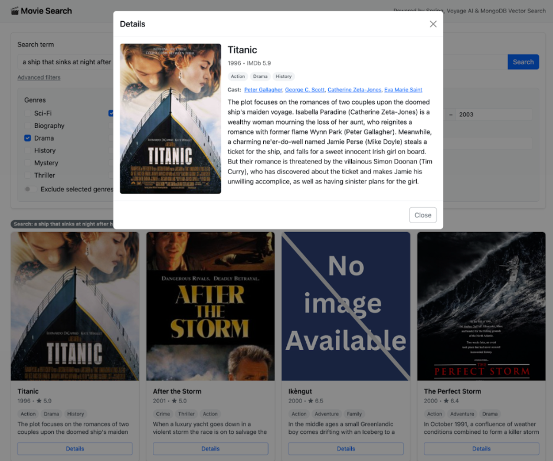

Enhancing precision with pre-filters and reducing costs with embedding caching

Welcome back! If you landed here without reading [*Part 1: Beyond Keywords: Implementing Semantic Search in Java With Spring Data*](https://foojay.io/today/beyond-keywords-implementing-semantic-search-in-java-with-spring-data-part-1/), I recommend going back and checking it first so the steps in this article make more sense in sequence.

This is the second part of a **three-part series** where we're building a movie search application. So far, our app supports **semantic search** using vector queries with Spring Data and Voyage AI. In this article, we'll take things further:

* Add filters to refine our vector search results.
* Explore strategies with Spring (such as caching) to reduce the cost of generating embeddings.
* Implement a **basic frontend** using only HTML, CSS, and JavaScript---just enough to test our API in a browser (UI is not the focus here).

The full source code for this part is available on [GitHub](https://github.com/mongodb-developer/spring-data-mongodb-hybrid-search).

Adding filters: From story to code {#h2-0-adding-filters-from-story-to-code}
----------------------------------------------------------------------------

Imagine this: You've just finished building your shiny new semantic movie search. You type "a science fiction movie about rebels fighting an empire in space" and---boom---*Star Wars* pops up. Success!

But then your friend says:

*"Cool, but I only want movies with an IMDb rating of* ***9 or higher*** *. Can your app do that?"*

At this point, our application can only take a **query string**:

```
public record MovieSearchRequest(String query) {}
```


So we need to evolve. First, let's extend the request with a minIMDbRating field to capture this new requirement:

```
public record MovieSearchRequest(

      String query,

      Double minIMDbRating

) {}
```


### First try: Add a post-filter in MovieService {#h3-1-first-try-add-a-post-filter-in-movieservice}

Open the MovieService class, find the searchMovies method, and append a [$match](https://www.mongodb.com/docs/manual/reference/operator/aggregation/match/?utm_campaign=devrel&utm_source=third-party-content&utm_medium=cta&utm_content=optimizing-vector-search-foojay&utm_term=tony.kim) stage that enforces the minIMDbRating threshold after the vector search:

```
public List<Movie> searchMovies(MovieSearchRequest req) {
   VectorSearchOperation vectorSearchOperation = VectorSearchOperation.search(config.vectorIndexName())
         .path(config.vectorField())
         .vector(embeddingService.embedQuery(req.query()))
         .limit(config.topK())
         .numCandidates(config.numCandidates());

   // Post-filter: apply the IMDb constraint after nearest neighbors are found
   MatchOperation matchOperation = new MatchOperation(
         Criteria.where("imdb.rating").gte(req.minIMDbRating())
   );

   return mongoTemplate.aggregate(
         Aggregation.newAggregation(vectorSearchOperation, matchOperation),
         config.vectorCollectionName(),
         Movie.class
   ).getMappedResults();
}
```


Now try it:

```
### POST
POST http://localhost:8080/movies/search
Content-Type: application/json
{
 "query": "a science fiction movie about rebels fighting an empire in space",
 "minIMDbRating": 9
}
```


When you run this query against our dataset, you'll notice***it returns nothing***. Why?

Because MongoDB Atlas:  

1. **First** performs the semantic vector search and finds a few close matches.
2. **Then** the $match filter is applied afterwards.

Since none of those candidates have an IMDb rating ≥ 9.0, all results are discarded, meaning you still paid for the vector search, but ended up with no data. It "works," but it's wasteful when constraints are strict.

So how can we save this extra work?

By using the [filter](https://www.mongodb.com/docs/atlas/atlas-vector-search/vector-search-stage/?utm_campaign=devrel&utm_source=third-party-content&utm_medium=cta&utm_content=optimizing-vector-search-foojay&utm_term=tony.kim#atlas-vector-search-pre-filter) option on [$vectorSearch](https://www.mongodb.com/docs/manual/reference/operator/aggregation/vectorsearch/?utm_campaign=devrel&utm_source=third-party-content&utm_medium=cta&utm_content=optimizing-vector-search-foojay&utm_term=tony.kim), a pre-filter that lets MongoDB Atlas narrow results (e.g., by numeric fields like imdb.rating) before running the vector comparison. Let's check it.

### Second try: Use a pre-filter {#h3-2-second-try-use-a-pre-filter}

To implement the pre-filter, the first step is to update our **MongoDB** **Atlas Vector Search index** and include the field we want to filter by, in this case, imdb.rating:

```
{
 "fields": [
   {
     "type": "vector",
     "path": "plot_embedding_voyage_3_large",
     "numDimensions": 2048,
     "similarity": "dotProduct"
   },
   {
     "type": "filter",         // include this
     "path": "imdb.rating"     // include this
   }
 ]
}
```


Once the index finishes updating, we can adjust our code. In the searchMovies method, remove the MatchOperation and apply the filter directly in the VectorSearchOperation:

```
public List<Movie> searchMovies(MovieSearchRequest req) {
  VectorSearchOperation vectorSearchOperation = VectorSearchOperation.search(config.vectorIndexName())
          .path(config.vectorField())
          .vector(embeddingService.embedQuery(req.query()))
          .limit(config.topK())
          .filter(Criteria.where("imdb.rating").gte(req.minIMDbRating()))//Pre-filter: apply the IMDb rating filter here
          .numCandidates(config.numCandidates());

  return mongoTemplate.aggregate(
          Aggregation.newAggregation(vectorSearchOperation),
          config.vectorCollectionName(),
          Movie.class
  ).getMappedResults();
}
```


Now, when you run the same request, the filter is applied first, and only then similarity is computed, returning results that already satisfy the IMDb rating constraint.

```
{
 "title": "The Dark Knight",
 "year": "2008",
 "imdb": {
     "rating": 9.0
   },
 ...
}
```


To learn more about pre-filters, check out the[official documentation](https://www.mongodb.com/docs/atlas/atlas-vector-search/vector-search-stage/?utm_campaign=devrel&utm_source=third-party-content&utm_medium=cta&utm_content=optimizing-vector-search-foojay&utm_term=tony.kim#atlas-vector-search-pre-filter).

### Refining the search with extra filters {#h3-3-refining-the-search-with-extra-filters}

As users refine their searches, they often want more than just a keyword, like finding movies within a time period or skipping certain genres.

We'll extend MovieSearchRequest to support year ranges and genre inclusion/exclusion:

```
import java.util.List;

public record MovieSearchRequest(
      String query,
      Integer yearFrom,
      Integer yearTo,
      List<String> genres,
      Double minIMDbRating,
      boolean excludeGenres
) {}
```


To make the filters actually work, we need a way to translate the request fields into a MongoDB query. For this, our MovieSearchRequest record implements a toCriteria() method. Here is the complete MovieSearchRequest code:

```
import org.springframework.data.mongodb.core.query.Criteria;
import java.util.ArrayList;
import java.util.List;
import java.util.Objects;
import java.util.Optional;

public record MovieSearchRequest(
      String query,
      Integer yearFrom,
      Integer yearTo,
      List<String> genres,
      Double minIMDbRating,
      boolean excludeGenres
) {

   public Criteria toCriteria() {
      final List<Criteria> parts = new ArrayList<>(3);
      List<String> g = cleanedGenres();

      if (!g.isEmpty()) {
         parts.add(excludeGenres
               ? Criteria.where("genres").nin(g)
               : Criteria.where("genres").in(g));
      }

      YearBounds yb = normalizedYearBounds();

      if (yb.from != null || yb.to != null) {
         Criteria y = Criteria.where("year");
         if (yb.from != null) y = y.gte(yb.from);
         if (yb.to   != null) y = y.lte(yb.to);
         parts.add(y);
      }

      if (minIMDbRating != null) {
         parts.add(Criteria.where("imdb.rating").gte(minIMDbRating));
      }

      if (parts.isEmpty()) return new Criteria();
      if (parts.size() == 1) return parts.getFirst();
      return new Criteria().andOperator(parts.toArray(Criteria[]::new));
   }

   public List<String> cleanedGenres() {
      return Optional.ofNullable(genres).orElseGet(List::of).stream()
            .filter(Objects::nonNull)
            .map(String::trim)
            .filter(s -> !s.isEmpty())
            .distinct()
            .toList();
   }

   private YearBounds normalizedYearBounds() {
      Integer f = yearFrom, t = yearTo;
      if (f != null && t != null && f > t) {
         int tmp = f; f = t; t = tmp;
      }

      assert f != null;
      assert t != null;
      return new YearBounds(f, t);
   }

   private record YearBounds(
         Integer from,
         Integer to
   ){}
}
```


**In short:** The request validates which filters are present---if any are set, it builds a criteria combining them; if not, it returns an empty criteria, meaning no filters are applied.

### Applying toCriteria() in the search {#h3-4-applying-tocriteria-in-the-search}

Now, instead of hardcoding just the IMDb rating filter, we can reuse our toCriteria() method. This way, any combination of filters (genres, year range, IMDb rating) is automatically applied. In MovieService, replace the searchMovies:

```
public List<Movie> searchMovies(MovieSearchRequest req) {
   VectorSearchOperation vectorSearchOperation = VectorSearchOperation.search(config.vectorIndexName())
         .path(config.vectorField())
         .vector(embeddingService.embedQuery(req.query()))
         .limit(config.topK())
         .filter(req.toCriteria()) // here is the modification
         .numCandidates(config.numCandidates());

   return mongoTemplate.aggregate(
         Aggregation.newAggregation(vectorSearchOperation),
         config.vectorCollectionName(),
         Movie.class
   ).getMappedResults();
}
```


After these modifications, the last step is to include the additional filter fields (such as year and genres) in your MongoDB Atlas Vector Search index definition:

```
{
 "fields": [
   {
     "type": "vector",
     "path": "plot_embedding_voyage_3_large",
     "numDimensions": 2048,
     "similarity": "dotProduct"
   },
   {
     "type": "filter",
     "path": "imdb.rating"
   },
   {
     "type": "filter",
     "path": "year"
   },
   {
     "type": "filter",
     "path": "genres"
   }
 ]
}
```


Once the index finishes building, these filters will be ready to use in your queries. For example:

```
### POST

POST http://localhost:8080/movies/search
Content-Type: application/json

{
 "query": "a science fiction movie about rebels fighting an empire in space",
 "minIMDbRating": 9,
 "yearFrom": 2010,
 "yearTo": 2015,
 "genres": [
   "Drama", "Action"
 ],
 "excludeGenres": false
}
```


You should see a similar result:

```
{
 "title": "The Real Miyagi",
 "year": "2015",
 "imdb": {
     "rating": 9.3
   },
 "genres": [
   "Documentary",
   "Action",
   "History"
 ],
 ...
}
```


Reducing embedding costs with caching {#h2-5-reducing-embedding-costs-with-caching}
-----------------------------------------------------------------------------------

When testing the search endpoint, you might notice that embeddings are generated every single time, even if the query text doesn't change. For example, if you keep searching for...

```
{
 "query": "a science fiction movie about rebels fighting an empire in space",
 "minIMDbRating": 9,
 "yearFrom": 2010,
 "yearTo": 2015,
 "genres": [
   "Drama", "Action"
 ],
 "excludeGenres": false
}
```


...and then repeat the same query but change only the filters (genres, year, minIMDbRating), the log still shows embeddings being generated:

```
2025-09-04T11:48:47.298-03:00  INFO 27180 --- [nio-8080-exec-1] com.mongodb.EmbeddingService             : Generating embeddings ..
2025-09-04T11:48:48.513-03:00  INFO 27180 --- [nio-8080-exec-1] com.mongodb.EmbeddingService             : Embeddings generated successfully!
2025-09-04T11:48:52.438-03:00  INFO 27180 --- [nio-8080-exec-2] com.mongodb.EmbeddingService             : Generating embeddings ..
2025-09-04T11:48:52.737-03:00  INFO 27180 --- [nio-8080-exec-2] com.mongodb.EmbeddingService             : Embeddings generated successfully!
```


But here's the thing: **If the query text doesn't change, there's no need to regenerate the embeddings**. The conversion is deterministic, the same text always produces the same vector.

### Strategy with @Cacheable {#h3-6-strategy-with-cacheable}

To avoid unnecessary API calls, we can cache embeddings for repeated queries. In Spring, this is as simple as annotating the embedQuery method in EmbeddingService:

```
@Cacheable("embeddings")

public List<Double> embedQuery(
      String text) {
   logger.info("Generating embeddings .. ");
   var res = client.embed(new EmbeddingsRequest(
         List.of(text), config.model(), "query", config.outputDimension()));
   logger.info("Embeddings generated successfully!");
   return res.data().getFirst().embedding();
}
```


And finally, don't forget to enable it in your Spring Boot application class.

```
import org.springframework.boot.SpringApplication;
import org.springframework.boot.autoconfigure.SpringBootApplication;
import org.springframework.cache.annotation.EnableCaching;

@SpringBootApplication
@EnableCaching

public class SpringDataMongodbHybridSearchApplication
 {
   public static void main(String[] args) {
      SpringApplication.run(SpringDataMongodbHybridSearchApplication
.class, args);
   }
}
```


After enabling caching, run a few searches in a row with the same query text but different filters (genres, year, minIMDbRating). You'll notice that the log message appears only the first time.

```
2025-09-04T11:50:04.283-03:00  INFO 27322 --- [nio-8080-exec-1] com.mongodb.EmbeddingService             : Generating embeddings ..
2025-09-04T11:50:05.086-03:00  INFO 27322 --- [nio-8080-exec-1] com.mongodb.EmbeddingService             : Embeddings generated successfully!
```


**In short:** Caching embeddings prevents redundant API calls, saves cost, and improves response time without changing your search logic. For production, there are more advanced ways to manage caching (e.g., distributed caches, eviction policies). Here, we're just showing a simple idea to illustrate the concept.

A minimal frontend {#h2-7-a-minimal-frontend}
---------------------------------------------

Before wrapping up, let's add a very simple frontend. The goal here is **not** to focus on UI or design, but just to provide a way to test our API in the browser. I'll leave a small example in HTML, JavaScript, and CSS. Feel free to adapt it and build a nicer page if you'd like.

### Step 1: HTML {#h3-8-step-1-html}

Download the index.html file from [this repository](https://github.com/mongodb-developer/spring-data-mongodb-hybrid-search/blob/main/src/main/resources/static/index.html) and save it inside src/main/resources/static.

### Step 2: JavaScript {#h3-9-step-2-javascript}

Download the script.js file from [this repository](https://github.com/mongodb-developer/spring-data-mongodb-hybrid-search/blob/main/src/main/resources/static/script.js) and place it in the same folder.

### Step 3: CSS {#h3-10-step-3-css}

Finally, download the styles.css file from [this repository](https://github.com/mongodb-developer/spring-data-mongodb-hybrid-search/blob/main/src/main/resources/static/styles.css)and place it in the same folder.

Running the frontend {#h2-11-running-the-frontend}
--------------------------------------------------

### Step 1: Start the application {#h3-12-step-1-start-the-application}

```
mvn spring-boot:run
```


### Step 2: Open the application {#h3-13-step-2-open-the-application}

With the backend already running, simply open http://localhost:8080 in your browser and search for:

* **Search term** = *a ship that sinks at night after hitting an iceberg*
* **Released year** = 1980--2003
* **Minimum IMDb rating** = 5
* **Genres** = (Drama, Action)

Then, click to view movie details.


Wrapping up {#h2-14-wrapping-up}
--------------------------------

In this second part, we explored how to use pre-filters in MongoDB Atlas Vector Search to make queries more efficient, and we looked at strategies to save resources by avoiding unnecessary embedding generation with caching.

In the third and final *Part 3 - Beyond Keywords: Hybrid Search with Atlas And Vector Search*, we'll adapt our code to implement hybrid search, combining MongoDB Atlas Search with vector queries for even more powerful results.

You can check out the full source code for this part on [GitHub](https://github.com/mongodb-developer/spring-data-mongodb-vector-search).
