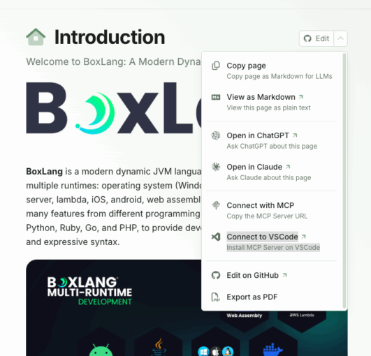



We're thrilled to announce BoxLang 1.6.0, a release that delivers massive performance improvements, intelligent developer tooling, and enhanced async capabilities. This release focuses on making BoxLang faster, smarter, and more observable than ever before.

## 🚀 What's New in 1.6.0?

### 🤖 BoxLang Documentation Meets AI: MCP Server Integration

  

BoxLang documentation is now accessible via the Model Context Protocol (MCP)! Connect AI assistants like Claude, GitHub Copilot, and other MCP-compatible tools directly to comprehensive BoxLang documentation for instant access to language references, framework features, and best practices.

### Connect to the MCP Server:

* **Direct MCP URL:** [https://boxlang.ortusbooks.com/\~gitbook/mcp](https://boxlang.ortusbooks.com/~gitbook/mcp "https://boxlang.ortusbooks.com/~gitbook/mcp")
* **One-Click VSCode Installation:** [Install BoxLang MCP Server](vscode:mcp/install?%7B%22name%22%3A%22BoxLang%20%3A%20A%20Modern%20Dynamic%20JVM%20Language%22%2C%22url%22%3A%22https%3A%2F%2Fboxlang.ortusbooks.com%2F~gitbook%2Fmcp%22%7D "Install BoxLang MCP Server")

This integration enables developers to:

* 🔍 Search BoxLang documentation semantically from within AI assistants
* 💡 Get instant answers about BIFs, components, and framework features
* 📖 Access code examples and best practices without leaving your workflow
* 🤖 Enhance AI-assisted BoxLang development with authoritative documentation

Imagine asking Claude "How do I create a custom async executor in BoxLang?" and getting instant, accurate answers pulled directly from the official documentation. This is the future of developer assistance, and BoxLang is leading the way!

## ⚡ Extreme Performance Optimizations: Up to 65% Faster

BoxLang 1.6.0 delivers **game-changing performance improvements** across the board in comparison to our previous releases. Our second major optimization pass focuses on reducing thread contention, memory usage, and dramatically improving throughput.

### Key Performance Enhancements:

* **50x throughput increase** via deferred interception data creation based on hasState() checks
* **Eliminated synchronized bottlenecks** on singleton getInstance() methods for better concurrency
* **Non-concurrent maps** for context config and internal data structures (massive thread contention reduction)
* **Weak reference disk class caching** for 80% memory reduction in some scenarios
* **Cached Application descriptor lookups** when trusted cache is enabled
* **Optimized internal** `expandPath()` **method** to avoid unnecessary `context.getConfig()` calls
* **ASM compiler improvements** to avoid method-level synchronization in `getInstance()` patterns

### Real-World Performance Stats:

* **Plain text requests:** Jumped from 23,000 to **53,000+ req/s** (130% increase!)
* **SQL query tests:** Increased from 15,000 to **18,000+ req/s** (20% improvement)
* **5,000 concurrent WebSocket connections** on a dev laptop with only 256MB JVM heap
  * 55,000 requests processed in \~1 minute with 24ms average processing time
  * CPU usage: Only 4-5% once connected with 500 heartbeat req/s
  * Total heap used: Never exceeded 190MB during testing

We've seen performance and throughput improvements ranging from 45-65% in various benchmarks and vanilla ColdBox applications when comparing 1.6.0 to previous 1.5.x releases. Using BoxLang with our SocketBox WebSocket library and server, we've achieved capabilities of over 5,000 concurrent WebSocket connections running smoothly on modest development hardware.

## 📊 Advanced Async Monitoring with BoxExecutor Health Checks

The `ExecutorRecord` has evolved into a full-fledged `BoxExecutor` **class** with comprehensive health monitoring, activity tracking, and advanced statistics. This provides deep insights into your async operations like never before.

### New Health Status Indicators:

* `healthy` - Executor is operating normally within defined thresholds
* `degraded` - Experiencing some issues but still functional
* `critical` - Critical state requiring immediate attention
* `idle` - No active tasks
* `shutdown` - Shutting down, not accepting new tasks
* `terminated` - No longer operational
* `draining` - Finishing existing tasks, not accepting new ones

### Comprehensive Health Reporting:

```java
// Get executor and check its comprehensive stats including health
executor = asyncService.getExecutor( "myExecutor" )
stats = executor.getStats()

// Returns detailed metrics including:
// - Basic info: name, type, created, uptime, lastActivity
// - Task metrics: taskSubmissionCount, completedTaskCount, activeCount
// - Pool metrics: poolSize, corePoolSize, maximumPoolSize
// - Queue metrics: queueSize, queueCapacity, queueUtilization
// - Utilization: poolUtilization, threadsUtilization, taskCompletionRate
// - Health status: "healthy", "degraded", "critical", etc.
// - Health report: detailed analysis with issues, recommendations, alerts

// Simple health check
isHealthy = executor.isHealthy()  // returns true/false

// Detailed health analysis
healthReport = stats.healthReport
// Includes: status, summary, issues, recommendations, alerts, insights
```

The new Executor Health Report provides:

* **Detected issues** affecting executor health
* **Recommendations** for improvement
* **Critical alerts** requiring immediate attention
* **Performance insights** and trends

This opens the door for future tooling around executor management and monitoring, giving you unprecedented visibility into your async operations. Especially on our new super secret coming module `bx-orion`

## 🖥️ MiniConsole Framework \& Enhanced REPL Experience

A new `MiniConsole` **framework** brings sophisticated terminal interaction capabilities and a dramatically improved REPL experience:

### New REPL Features:

* **Syntax highlighting** for BoxLang code with customizable color themes (dark/light palettes)
* **Tab completion** for BIFs and components with intelligent providers
* **Cross-platform key handling** (Windows, macOS, Linux)
* **Multi-line editing** with continuation prompts
* **Command history** with shortcuts (`!!`, `!n`)
* **Color printing utilities** for rich terminal output

```java
// REPL now includes smart syntax highlighting
📦 BoxLang> arrayMap( [ 1, 2, 3 ], ( x ) => x * 2 )
// BIFs in bright green, functions in purple

// Tab completion for components and BIFs
📦 BoxLang> array<TAB>
// Shows: arrayMap, arrayFilter, arrayEach, arrayReduce...
```

The REPL is now a joy to use, making interactive BoxLang development feel modern and productive.

## 📦 Module Public Mapping Support

Modules now support a `publicMapping` convention for exposing module assets publicly, in addition to the existing internal `mapping` property.

```java
// In ModuleConfig.bx
component {
    // Simple string - creates /bxModules/{moduleName}/public mapping
    this.publicMapping = "public"

    // Or use a struct for advanced config
    this.publicMapping = {
        name : "assets",
        path : "resources/public",
        usePrefix : true,
        external : true
    }

    // Enhanced this.mapping also supports structs
    this.mapping = {
        name : "myModule",
        path : "models",
        usePrefix : false
    }
}
```

This makes it easier to organize and serve module assets like CSS, JavaScript, and images while keeping internal paths separate.

## 🔧 Core Runtime Improvements

### DateTime Enhancements

* **Immutability flag** to prevent timezone mutation during formatting
* **Performance optimizations** for DateTime operations
* **Improved date parsing** with better mask support (`yyyy/M/d`)
* **Two-digit year handling** always assumes current millennium
* **Consistent default formats** between parsed date results
* **DateFormat BIF compatibility** - all `m` letters treated as `M`

### JDBC \& Database

* **Disabled connection leak detection by default** for better performance (enable via config if needed)
* **Fixed NPE in bx-mariadb** when checking DDL statement results
* **Improved query param encoding** in HTTP requests

### BIF \& Component Documentation

Built-in functions and components now include **runtime descriptions** via the `description` attribute in `@BoxBIF` and `@BoxComponent` annotations:

```java
@BoxBIF(
    description = "Returns the length of a string, array, struct, or query"
)
public class Len extends BIF {
    // ...
}

@BoxComponent(
    name = "Http",
    description = "Makes HTTP/HTTPS requests to remote servers"
)
public class Http extends Component {
    // ...
}
```

This improves introspection and makes auto-generated documentation more informative.

## 🌐 Runtime Updates

### MiniServer Runtime

* **Enhanced error handling** when invalid arguments are provided
* **STOMP heartbeat responses** now properly returned from miniserver
* **Version flag support** - `boxlang-miniserver --version` displays version information

### Servlet Runtime (Jakarta EE)

* **Updated web.xml to Jakarta specs** with proper namespace declarations
* **Integration tests added** to verify WAR deployment can expand, deploy, and run BoxLang code
* **Fixed file upload handling** for small files in servlet environment

### AWS Lambda Runtime

* **Upgraded AWS Lambda Java Core** from 1.3.0 to 1.4.0

## 🛠️ Developer Tools

### CFTranspile Improvements

* **Verbose mode added** to `cftranspile` command for detailed conversion insights
* Better visibility into transpilation issues and potential data concerns

### Feature Audit Tool

* **Updated feature audit** with improved output
* **Lists missing modules** to help identify required BoxLang modules for migrations

## 🐛 Notable Bug Fixes

### Component \& Function Fixes

* `structKeyExists()` now works on closures
* `imageRead()` properly expands paths and handles URIs
* `bx:cookie` expires attribute now processes dates before strings
* HTTP component now returns results when both `file` and `path` are specified
* File/Path compatibility improved between BoxLang, Lucee, and Adobe CF

### XML Handling

* `XMLElemNew()` usage - XMLAttribute on produced nodes no longer throws errors
* Empty `xmlNew()` results now produce valid XML objects with nodes
* Multiple BOMs - parsing no longer fails on files with multiple byte order marks

### Parsing Improvements

* Extra spaces in tag close now parse correctly
* `return` keyword can now be used as a variable name
* `component` keyword can be used as annotation name
* FQN starting with underscore now supported
* Property shortcuts with FQN types now work properly

### Compatibility Fixes

* `ListDeleteAt()` retains leading delimiters in compatibility mode
* CF compat nulls now equal empty strings
* `IsValid()` supports `number` type in compatibility mode
* Lucee JSON compatibility - unquoted keys handled consistently with Lucee
* Duplication util now uses correct class loader when serializing classes

## 🔧 Configuration Updates

### Datasource Environment Variables

Datasource keys are now searched for environment variable replacements in configuration.

### Mapping Configuration

* Enhanced mapping registration detects between simple and complex mappings
* Better handling of module mappings with `usePrefix` and external flags

## 🚀 Migration \& Compatibility

### Breaking Changes

**None!** This release maintains full backward compatibility.

### Compatibility Improvements

Numerous compatibility fixes for Adobe ColdFusion and Lucee migrations:

* DateFormat mask handling (`m` vs `M`)
* ListDeleteAt delimiter behavior
* Null handling in CF compat mode
* IsValid type validation
* JSON unquoted key handling

### Performance Considerations

* **JDBC connection leak detection** is now disabled by default. Enable via configuration if needed for debugging.
* **Trusted cache behavior** - Application descriptor lookups are now cached when trusted cache is enabled.
* Consider using the new **BoxExecutor health monitoring** to track async operation performance.

## 🎯 What's Next?

BoxLang 1.6.0 sets a new performance baseline and enhances developer experience significantly. With AI-powered documentation access, comprehensive async monitoring, and massive performance gains, BoxLang continues to evolve as the most modern and powerful JVM language for dynamic application development.

We're committed to making BoxLang the fastest, most productive, and most enjoyable JVM language available. Stay tuned for more updates as we continue to push the boundaries of what's possible!

This release also sets the groundwork for two new runtimes coming in fall:

* BoxLang Desktop Applications
* BoxLang Azure Functions

## 📚 Resources

* Documentation: [https://boxlang.ortusbooks.com/](https://boxlang.ortusbooks.com/ "https://boxlang.ortusbooks.com/")
* MCP Server: [https://boxlang.ortusbooks.com/\~gitbook/mcp](https://boxlang.ortusbooks.com/~gitbook/mcp "https://boxlang.ortusbooks.com/~gitbook/mcp")
* Source Code: [https://github.com/ortus-boxlang/boxlang](https://github.com/ortus-boxlang/boxlang "https://github.com/ortus-boxlang/boxlang")
* Community: [https://community.ortussolutions.com/](https://community.ortussolutions.com/ "https://community.ortussolutions.com/")

## Download

Please visit our [download](https://www.boxlang.io/download "download") page or our quick [installation guides](https://boxlang.ortusbooks.com/getting-started/installation "installation guides") to upgrade your installation.

## Professional Open Source

BoxLang is a professional open-source product, with three different licences:

* Open-Source Apache2
* BoxLang +
* BoxLang ++

**BoxLang is free** , open-source software under the Apache 2.0 license. We encourage and support community contributions. **BoxLang+ and BoxLang ++** are commercial versions offering support and enterprise features. Our licensing model is based on fairness and the golden rule: Do to others as you want them to do to you. No hidden pricing or pricing on cores, RAM, SaaS, multi-domain or ridiculous ways to get your money. Transparent and fair.

[BoxLang Subscription Plans](https://boxlang.io/plans)
> **BoxLang is more than just a language; it's a movement.**

Join us and redefine development on the JVM **Ready to learn more?** Explore BoxLang's Features, Documentation, and Community.  
[Learn More](https://boxlang.io/plans)

[Try BoxLang](https://boxlang.io/plans)

## Join the BoxLang Community ⚡️

Be part of the movement shaping the future of web development. Stay connected and receive the latest updates on **Into the Box 2025, product launches, tool updates, and more.**

**Subscribe to our newsletter** for exclusive content.

**Follow Us on Social media and don't miss any news and updates:**

* [https://x.com/ortussolutions](https://x.com/ortussolutions "https://x.com/ortussolutions")
* [https://www.facebook.com/OrtusSolutions](https://www.facebook.com/OrtusSolutions "https://www.facebook.com/OrtusSolutions")
* [https://www.linkedin.com/company/ortus-solutions-corp](https://www.linkedin.com/company/ortus-solutions-corp "https://www.linkedin.com/company/ortus-solutions-corp")
* [https://www.youtube.com/OrtusSolutions](https://www.youtube.com/OrtusSolutions "https://www.youtube.com/OrtusSolutions")
* [https://github.com/Ortus-Solutions](https://github.com/Ortus-Solutions "https://github.com/Ortus-Solutions")

Join the **BoxLang and CFML legends** at Into the Box 2025. Let's learn, share, and code together for a **modern, cutting-edge web development future.**
