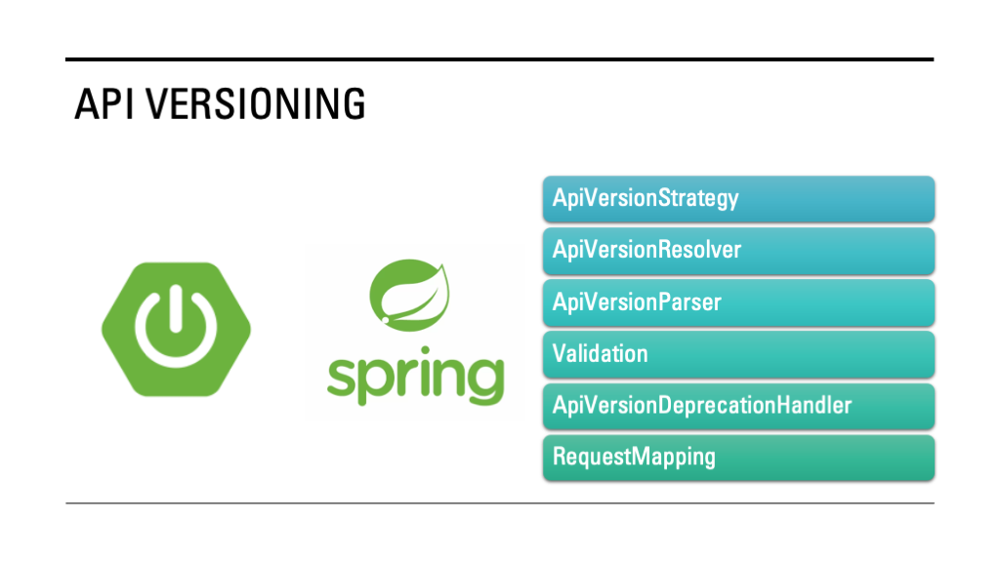

In my previous [article](https://foojay.io/today/preparing-for-spring-framework-7-and-spring-boot-4/), I outlined a comprehensive list of features introduced in Spring Framework 7 and Spring Boot 4.

In this series of articles, we will explore these features in detail using a pragmatic approach. To begin, I will deep dive into the ***API*** ***versioning*** feature introduced in Spring Framework 7.


Any architectural or feature change stems from evolving business requirements, and API versioning is no exception. In today's app-driven ecosystem, APIs are central to product integration and user experience.   

We must ensure backward compatibility with every new feature release so that existing consumers remain unaffected and new users can benefit from the enhancements.

For example, prior to COVID-19, most financial transactions were processed using **NEFT (National Electronic Funds Transfer)** for smaller payments and **RTGS (Real-Time Gross Settlement)** or **Net Banking** for larger amounts. Post-pandemic, the need for contactless payments led to the introduction of **UPI (Unified Payments Interface)**, which enables seamless digital transactions using QR codes, Virtual Payments Address (VPA), or mobile numbers.

When introducing such new capabilities, maintaining **backward compatibility** is imperative so legacy clients continue functioning without disruption. ***API versioning***provides a structured way to evolve APIs while preserving existing functionality, allowing developers to deliver new features without breaking old integrations.

## What is API versioning?

**API versioning** is a feature that helps clients and customers access new functionalities introduced through new API endpoints in an existing application. It ensures **backward compatibility**, allowing both old and new clients to use the service without disruption.

**Spring Framework 7** introduces API versioning through a new attribute called ***"version"*** for the **@RequestMapping** annotation and its specialized variants like **@GetMapping, @PostMapping, @PutMapping**, and others.

The **core strategies of API versioning** in Spring are as follows:

1. **ApiVersionStrategy** ---This is the main strategy that manages all versioning configurations. It resolves versions from requests using the ApiVersionParser, parses raw version values through the `ApiVersionParser`, validates request versions, and triggers deprecation notifications in responses.
2. **ApiVersionResolver**---This component extracts the API version from incoming requests. The Spring MVC configuration provides built-in options to resolve versions from headers, query parameters, media type parameters, or URL paths.
3. **ApiVersionParser** ---This component parses version values. The built-in `SemanticApiVersionParser` interpreter versions in the `major.minor.patch` format.
4. **Validation**---This process checks whether the requested version is supported by the application. If not, the system throws an InvalidApiVersionException.
5. **ApiVersionDeprecationHandler**---This component manages deprecation notifications using the standard ApiVersionDeprecationHandler, informing clients when they are using deprecated API versions.
6. **Request Mapping**---The ApiVersionStrategy integrates with Spring's request mapping mechanism to correctly map incoming requests to the corresponding versioned controller methods.

## API Versioning In Action

This guide explains how to set up, build, and run the API versioning and project generated using [Spring Initializr](https://start.spring.io/)

To ensure compatibility between old and new changes, we can use the following approaches:

* **Lightweight Change** ---Versioning by **header** or **query parameter**.
* **Structural Change** ---Versioning by **URL** (new host or new path), as suggested by **Roy Fielding**.

In this guide, we will explore how to implement *API versioning using headers*

You can use the following direct [link](https://start.spring.io/#!type=maven-project&language=java&platformVersion=4.0.0-M3&packaging=jar&jvmVersion=25&groupId=com.bsmlabs&artifactId=spring-boot-4-features&name=application&description=Explore%20Spring%20Boot%204%20Features%20&packageName=com.bsmlabs.features&dependencies=web,actuator,lombok,data-jpa,h2) to generate the project, and download the project

### Import the Project into your IntelliJ IDEA

1. In the main menu, go to ***File \| New \| Project From Existing Sources***
2. Navigate to pom.xml and then import the project

We will create the following folder structure under `com.bsmlabs.features` package

* **Folder** : `apiversioning`
* Subfolders under `apiversioning`:
  * `config`---to hold configuration classes
  * `controller`---to define API controllers
  * `model`---to store entity or data classes
  * `repository`-to manage data access

We can enable API versioning using the following options:

1. **Annotation-based approach**: Create a WebMVC configuration class that implements WebMvcConfigurer
2. **Property-based approach** : Add API version-related entries directly in the `application.properties` (for Spring Boot application), and it is the simplest one.

You can enable API versioning using one of the following strategies

* Request Header Versioning
* Path Segment Versioning
* Query Parameter Versioning
* Media Type Parameter Versioning

### Annotation-Based Approach

* **Request Header Versioning Strategy**

```java
package com.bsmlabs.features.apiversioning.config;

import org.springframework.context.annotation.Configuration;
import org.springframework.web.servlet.config.annotation.ApiVersionConfigurer;
import org.springframework.web.servlet.config.annotation.WebMvcConfigurer;

@Configuration
public class WebConfig implements WebMvcConfigurer {

    @Override
    public void configureApiVersioning(ApiVersionConfigurer configurer) {
        configurer.useRequestHeader("API-version")
                .addSupportedVersions("1");
    }
}
```

* **Path Segment Versioning**

```java
import org.springframework.context.annotation.Configuration;
import org.springframework.web.servlet.config.annotation.ApiVersionConfigurer;
import org.springframework.web.servlet.config.annotation.PathMatchConfigurer;
import org.springframework.web.servlet.config.annotation.WebMvcConfigurer;

@Configuration
public class WebConfig implements WebMvcConfigurer {

    @Override
    public void configureApiVersioning(ApiVersionConfigurer configurer) {
        configurer.usePathSegment(0)
                .addSupportedVersions("1");
    }

    @Override
    public void configurePathMatch(PathMatchConfigurer configurer) {
        configurer.addPathPrefix("/{v}", aClass -> true);
    }
}
```
