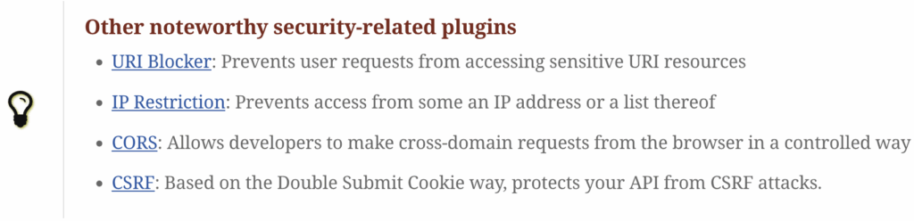

I taught myself HTML a long time ago, on a software called HotDog (Pro?). There wasn't such a thing as capabilities at the time. However, HotDog had an amazing feature: the toolbar had all HTML tags (there weren't that many at the time) as buttons, and you could learn them by clicking on them and watching the results. The only downside was that you had to click on another button to close the tag.

Then came Dreamweaver. It was the first WYSIWYG editor, and it immediately became very popular. People who had no clue about HTML started to use it: the number of websites skyrocketed. I used it once and looked at the generated HTML. Having learned to write HTML "by hand", I found it generated by Dreamweaver overtly verbose. I continued to write my HTML by hand or with the help of IDEs.

Fast forward fifteen years. HTML went beyond websites to be an ubiquitous format that Sir Berners-Lee wouldn't have dreamed it would become. Coupled with web browsers, it went on to become the medium for web applications. Yet, it didn't stop there. Even at the time, I was amazed that JavaDocs generated HTML. [Python docstring](https://peps.python.org/pep-0257/)? Generates HTML. [Ruby rdoc](https://ruby-doc.org/stdlib-1.9.1/libdoc/rdoc/rdoc/index.html)? Generates HTML. [Rust rustdoc](https://doc.rust-lang.org/rustdoc/what-is-rustdoc.html)? Generates HTML.

While you can write HTML snippets, *e.g.* , in JavaDocs, writing HTML by the line becomes a bore quite fast. It's easy to miss a slash in the closing tag, or to get a `<table>` right on the first attempt, especially if it involves spans. Yet, most documentation doesn't need the full power of HTML, especially the kind brought by its more modern versions.

To address this issue, John Gruber and Aaron Swartz invented Markdown in 2004.
> Markdown is a lightweight markup language for creating formatted text using a plain-text editor. John Gruber created Markdown in 2004 as an easy-to-read markup language.
>
> -- [Markdown](https://en.wikipedia.org/wiki/Markdown)

Markdown took the world by storm. I think that it's even more popular than HTML, at least in the tech world. It's been available on GitHub for ages. Java integrated it into its JavaDocs in version 25. And nowadays, LLMs use Markdown for input and output!

## Markdown limitations

Markdown is amazing, but it has strong limitations. I wrote my latest book with Markdown, in the Doc-as-Code tradition. The experience was so painful that I vowed never to do it again.

Here's a simple excerpt from my book-writing experience. I wanted to feature code snippets to illustrate my points. However, I wanted them to be valid: compiled and tested. I wrote a project, complete with a build configuration.

Yet, Markdown doesn't allow the inclusion of external files. I had to copy and paste the required snippets. Worse, because writing a book takes some time, I kept the version of the dependencies up-to-date. Each time I did, I had to copy-paste the updated code at every occurrence. Interestingly enough, documentation aimed at developers has the same use case.

Another widespread limitation is wanting to draw attention to an item. Here's a styling option:

Markdown doesn't offer anything similar. For this reason, [Python Markdown](https://python-markdown.github.io/extensions/admonition/) does. What about other languages? I don't know; I wish it were part of Markdown.

Though there are many more, my final point will be about tables. Markdown handles tables, up to a point, which is column headers. In my blog posts, I regularly need `rowspan` and `colspan`, which aren't supported. Fortunately, HTML is valid Markdown. However, the formatting inside the table, code, etc., must be transformed into HTML along with it.

## Asciidoc

Asciidoc is the solution to the above limitations.
> AsciiDoc is a plain text markup language for writing technical content. It's packed with semantic elements and equipped with features to modularize and reuse content. AsciiDoc content can be composed using a text editor, managed in a version control system, and published to multiple output formats.
>
> -- [Asciidoc](https://asciidoc.org/)

Let's see how Asciidoc addresses limitations one by one:

* [Include](https://docs.asciidoctor.org/asciidoc/latest/directives/include/):\>An include directive imports content from a separate file or URL into the content of the current document. When the current document is processed, the include directive syntax is replaced by the contents of the include file. Think of the include directive like a file expander.
* [Admonitions](https://docs.asciidoctor.org/asciidoc/latest/blocks/admonitions/):\>There are certain statements you may want to draw attention to by taking them out of the content's flow and labeling them with a priority. These are called admonitions. This page introduces you to admonition types AsciiDoc provides, how to add admonitions to your document, and how to enhance them using icons or emoji.
* [Cell span](https://docs.asciidoctor.org/asciidoc/latest/tables/span-cells/)Asciidoc has a [specification](https://gitlab.eclipse.org/eclipse/asciidoc-lang/asciidoc-lang) as well as a [TCK](https://gitlab.eclipse.org/eclipse/asciidoc-lang/asciidoc-tck), both managed by the Eclipse foundation. Note, though, that [Asciidoctor](https://docs.asciidoctor.org/) is the sole implementation of Asciidoc. The Asciidoctor site is actually hosting the [Asciidoc documentation](https://docs.asciidoctor.org/asciidoc/latest/). For most intents and purposes, you can treat them as one, as I do.

I listed above how Asciidoc solves three limitations I regularly encounter in Markdown, but it provides many more benefits. Tons of features are available. Here are a couple of them, which I use regularly:

* [Video embedding](https://docs.asciidoctor.org/asciidoc/latest/macros/audio-and-video/#video-macro-syntax):A sample is more descriptive than a complete description:

      [source]
      ----
      video::RX9zwgHuNmA[youtube,width=840,height=473]
      ----

* [Blockquotes](https://docs.asciidoctor.org/asciidoc/latest/blocks/blockquotes/) **with attribution** , as seen above:

      [quote,'https://asciidoc.org/[Asciidoc^]']
      ____
      AsciiDoc is a plain text markup language for writing technical content.
      ____

* [Collapsible blocks](https://docs.asciidoctor.org/asciidoc/latest/blocks/collapsible/). This one is of utmost importance when I write self-driven workshops:

      [%collapsible]
      ====
      This content is only revealed when the user clicks the block title.
      ====

* Materializing [menus and buttons](https://docs.asciidoctor.org/asciidoc/latest/macros/ui-macros/) is another useful feature for workshops and technical documentation in general:
  * Click on the OK button.
  * Go to the *Text \> Text Filters \> JSON* item.
* [Automatic table of contents](https://docs.asciidoctor.org/asciidoc/latest/toc/)

With the right toolchain, you can generate HTML from Asciidoc and publish the result on GitHub/GitLab Pages. Here's a non-trivial example that showcases several features:

[Apache APISIX Hands-on Lab](https://nfrankel.github.io/apisix-workshop/)

## Asciidoc ecosystem

A tool is only as useful as its surrounding ecosystem. Here are a couple of such tools and benefits:

* GitHub renders Asciidoc as well as Markdown. Try using a `README.adoc` and watch the [magic happens](https://github.com/nfrankel/opentelemetry-tracing/blob/master/README.adoc). Here's a non-exhaustive list of [Asciidoc integration items with GitHub](https://gist.github.com/dcode/0cfbf2699a1fe9b46ff04c41721dda74).
* Jekyll, the blog engine, has a seamless [Asciidoc integration](https://github.com/asciidoctor/jekyll-asciidoc). This blog runs on Jekyll with Asciidoc.
* [Asciidoctor Diagram](https://docs.asciidoctor.org/diagram-extension/latest/):\>Asciidoctor Diagram is a set of Asciidoctor extensions that enable rendering of plain text diagrams that are embedded in your AsciiDoc document as part of the Asciidoctor conversion process.

  I use it **a lot** with PlantUML. You might have noticed it on this blog already.
* [Reveal.js integration](https://docs.asciidoctor.org/reveal.js-converter/latest/):Asciidoc allows you to generate regular HTML documents, but Reveal.js enables the creation of slide-based presentations. When I taught at university, I used both; regular HTML for seminar works and slides for courses. My old [Java EE course](https://formations.github.io/javaee/) is available as a GitHub Pages site (in French).

  Icing on the cake, you can leverage the [diagram integration](https://formations.github.io/javaee/cours/management.html#/_enregistrement_dun_mbean).

## Conclusion

Markdown is everywhere, and I'm more than happy if it meets your needs. I had several experiences where it didn't meet my expectations: technical documentation, workshops, courses, and book writing. Asciidoc is the perfect tool to fill Markdown's gaps.

I hope this post gave you enough arguments to try it.

**To go further:**

* [Asciidoctor Documentation](https://docs.asciidoctor.org/)
* [Asciidoctor reveal.js](https://docs.asciidoctor.org/reveal.js-converter/latest/)
* [Asciidoctor Diagram](https://docs.asciidoctor.org/diagram-extension/latest/)
* [Jekyll AsciiDoc Plugin](https://github.com/asciidoctor/jekyll-asciidoc)

*Originally published at [A Java Geek](https://blog.frankel.ch/asciidoc-over-markdown/) on October 26th, 2025*

*[WYSIWYG]: What You See Is What You Get
