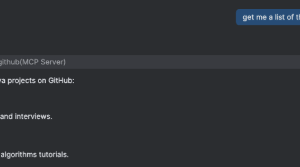

**Hey Java Devs, Let's Talk About AI MCP! 🤖** {#h2-0-hey-java-devs-let-s-talk-about-ai-mcp}
--------------------------------------------------------------------------------------------

Ever feel like your AI models are stuck in a bubble, cut off from the real-time data and tools they need to be truly useful? Well, you're not alone! This has been a major headache for developers. But what if I told you there's a new sheriff in town that's changing the game? Enter the **Model Context Protocol (MCP)**.

### **So, What's the Big Deal with MCP?** {#h3-1-so-what-s-the-big-deal-with-mcp}

Think of MCP as a universal translator for your AI. It's an open standard that lets AI assistants, like large language models (LLMs), seamlessly connect with external data sources, tools, and just about any environment you can think of. No more building custom, one-off integrations for every single tool and data source. With MCP, you create a standardized way for your AI to talk to the outside world. Pretty neat, huh? 😉

This open source protocol was cooked up by [Anthropic](https://www.anthropic.com/news/model-context-protocol) and has been rapidly gaining traction as an industry standard. It's all about making AI more "agentic" -- that is, able to autonomously pursue goals and take action.

*** ** * ** ***

### **The Problem MCP Is Solving** {#h3-2-the-problem-mcp-is-solving}

Before MCP, integrating an AI model with various tools and databases was a chaotic mess. For every new tool or data source you wanted your AI to use, you had to write custom code. This is what's known as the "M×N integration problem" -- connecting *M* AI models to *N* tools resulted in a tangled web of integrations that was a nightmare to maintain.

MCP swoops in to solve this by providing a standardized communication layer. Instead of a messy web, you get a clean, hub-and-spoke model. Your AI (the client) connects to an MCP server, and that server can then talk to all your different tools and data sources. This dramatically simplifies the architecture and makes it much easier to scale your AI applications.

*** ** * ** ***

### **The Evolution of AI Integration** {#h3-3-the-evolution-of-ai-integration}

The journey to MCP has been a series of stepping stones:

* **Manual API Wiring:** The dark ages, where everything was custom-coded. Brittle, time-consuming, and not scalable.
* **Plugin Interfaces:** A step in the right direction, but often limited to a specific platform or ecosystem. Think of the early days of browser extensions.
* **Agent Frameworks:** These provided more structure but were still often fragmented, with different frameworks having their own way of doing things.

Then came **MCP**, which brought a universal standard to the table. It's like the world finally agreeing on a single type of power outlet! This standardization is fostering a whole new ecosystem of interoperable AI tools and services.

*** ** * ** ***

### **The Good, the Bad, and the How-To** {#h3-4-the-good-the-bad-and-the-how-to}

#### **The Benefits 🥳**

* **Standardized Integration:** Say goodbye to the M×N problem!
* **Enhanced Context Awareness:** Your AI can access real-time data, making its responses more accurate and relevant.
* **Dynamic Tool Discovery:** AI agents can discover and use new tools on the fly.
* **A Growing Ecosystem:** More and more tools and platforms are becoming MCP-compliant.

#### **The Pitfalls to Watch Out For 🤔**

* **Security Risks:** With great power comes great responsibility. Be mindful of potential prompt injections and ensuring that tools have the right access control and permissions.
* **Complexity:** While MCP simplifies the integration landscape, setting up and managing MCP servers can still have a learning curve.
* **Tool Naming Conflicts:** As the ecosystem grows, ensuring unique and clear tool names will be crucial to avoid confusion.
* **Security:** [MCP provides a framework](https://modelcontextprotocol.io/specification/2025-06-18#security-and-trust-%26-safety) for secure access control and data handling, and [recommends authorization flows](https://modelcontextprotocol.io/specification/2025-06-18/basic/security_best_practices) in order to mitigate related security risks associated with 3rd party tools to be used.
* **Context overfill :** MCP tools consume a lot of context tokens. If you augment your agent with a bunch of MCPs, you end up consuming a good portion of your context just with the MCPs tool definitions .... just enable ONLY the MCP tools you really need.

*** ** * ** ***

### **Let's Get Our Hands Dirty: Creating an MCP with Java and Quarkus 🚀** {#h3-5-let-s-get-our-hands-dirty-creating-an-mcp-with-java-and-quarkus}

Ready to build your own MCP server? [Quarkus](https://quarkus.io/), the supersonic, subatomic Java framework, makes it surprisingly easy! The folks at Quarkus have created a project to get you started.

Here's the lowdown:

1. **Get Started with Quarkus:** If you haven't already, head over to [code.quarkus.io](https://code.quarkus.io/) to generate a new project. You'll want to include the quarkus-mcp-server-stdio extension.
2. **Define Your Tools:** In your Quarkus project, you can create a simple Java class to define the tools your MCP server will expose. Use the @Tool annotation to mark methods that your AI can call.

```java
import io.quarkiverse.mcp.server.Tool;

public class MyTools {
    @Tool(description = "A simple tool that greets the user")
    public String sayHello(String name) {
        return "Hello, " + name + "!";
    }
}
```

3. **Run Your Server:** You can run your MCP server directly from your IDE or by building a runnable JAR.
4. **Connect Your AI:** Now, from your AI application or a compatible client, you can connect to your newly created MCP server and start calling the tools you've defined.

You can check and play with the project code repository here : <https://github.com/jonathanvila/demo-mcp-server> .

For a more in-depth guide and to explore more advanced features, check out the [Quarkus MCP Server documentation](https://docs.quarkiverse.io/quarkus-mcp-server/dev/index.html) and the [announcement blog post](https://quarkus.io/blog/introducing-mcp-servers/).

*** ** * ** ***

### **Using Your MCP from IDEs 👨‍💻** {#h3-6-using-your-mcp-from-ides}

Visual Studio Code, through the GitHub Copilot plugin, has embraced MCP, [making it incredibly easy for developers](https://code.visualstudio.com/docs/copilot/customization/mcp-servers) to interact with these powerful new tools right from their editor.

1. **Enable MCP Support:** First, you'll need to enable the chat.mcp.enabled setting in your VS Code settings.
2. **Add Your MCP Server:** You can add an MCP server by creating a .vscode/mcp.json file in your workspace. This file will contain the configuration for your server, including the command to start it.
3. **Start Chatting with Your Tools:** Once your server is configured, you can open the chat view in VS Code and start interacting with your AI. You'll see your custom tools available, and you can even get suggestions for how to use them.

Also IntelliJ, through the Github Copilot plugin with a very similar installation using the \\\~/.config/github-copilot/intellij/mcp.json file, can connect Copilot Chat to external tools like the GitHub one :

```json
{
    "servers": {
        "greetings": {
           "command": "/Users/you/.sdkman/candidates/java/current/bin/java",
        "args": ["-jar",
         "/Users/you/workspace/demo-mcp-server/target/demo-mcp-server-1.0.0-SNAPSHOT-runner.jar"],
      }
      "github": {
        "type": "http",
        "url": "https://api.githubcopilot.com/mcp/",
        "headers": {
          "X-MCP-Readonly": "true"
        }
      }
    }
  }
```

And the way to use it couldn't be easier, just ask your question in natural language and the assistant will decide which tool to use and answer to your request :



*** ** * ** ***

### **A Cool MCP on the Block: The SonarQube MCP Server** {#h3-7-a-cool-mcp-on-the-block-the-sonarqube-mcp-server}

Speaking of awesome MCPs, the team at Sonar has [released](https://www.sonarsource.com/blog/announcing-sonarqube-mcp-server/) their own **SonarQube MCP Server**. If you're a fan of keeping your code reliable, maintainable, and secure with SonarQube Server or SonarQube Cloud, you're going to love this.

This MCP server allows your AI assistant to connect directly to your SonarQube environment. Imagine being able to ask your AI things like:

* "Show me the new code smells in the 'payment-service' project."
* "What's the current test coverage for the 'user-api'?"
* "Are there any critical vulnerabilities in my open pull requests?"

You can find the [**SonarQube MCP Server on GitHub**](https://github.com/SonarSource/sonarqube-mcp-server). It's a fantastic example of how MCP can bridge the gap between AI and the developer tools you use every day. You can find articles about how to use SonarQube MCP Server with [Cursor](https://www.sonarsource.com/resources/library/integrating-sonarqube-mcp-server-with-cursor/) and [Windsurf](https://www.sonarsource.com/resources/library/how-to-integrate-sonarqube-with-windsurf-ide/) to get you started.

So there you have it! MCP is here to stay, and it's making AI a whole lot more powerful and practical for us developers. It's time to start experimenting and see what amazing things you can build. Happy coding! 😊
