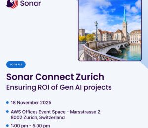

**Sonar Connect Zurich: Maximize the ROI of your generative AI projects**

**Where?** AWS Offices Event Space - Marsstrasse 2, 8002 Zurich, Switzerland

**When?** November 18, 13:00 - 17:00

Generative AI projects---especially code assistants---introduce new complexities. Maintaining code quality and security is paramount to control the exponential growth of technical debt and ensure you achieve the desired return on investment (ROI). Join us at the AWS offices to:

Gain insights on the key success factors for Gen AI coding projects, based on data from thousands of customers.  

Discuss the critical challenges and best practices for realizing the expected ROI from your AI investments.  

Get an exclusive look at the 2025 state of code in human and large language models report.  

See the latest SonarQube features in an exclusive demonstration and directly influence our product roadmap with your feedback.  

Connect and network with the Sonar team and your industry peers.

[Register Here](https://events.sonarsource.com/sonar-connect-zurich?utm_source=foojay)

Secure your organization's future against AI-driven risk. Meet us at Sonar Connect Zurich to address these crucial challenges head-on.

**Agenda**   

13:00 Meet and greet

13:30 Maximize the ROI of your generative AI projects

14:00 The 2025 state of code in human \& large language model

14:45 Networking break

15:15 Customer session with Roche

15:45 Security \& quality by design: Controlling risks, and achieving Gen AI coding productivity goals

16:15 Deep dive Sonar roadmap 2025/2026

16:45 Networking with your peers \& the Sonar team
