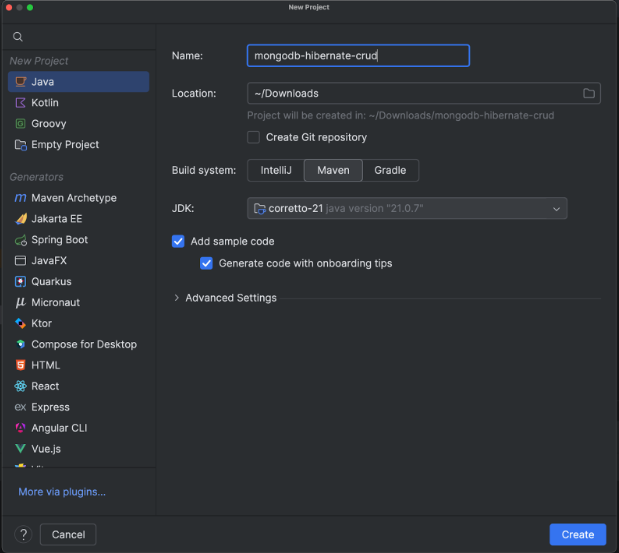

For years, [Hibernate](https://hibernate.org/) ORM has been one of the most popular frameworks in the Java ecosystem. It was built to simplify data persistence by letting developers work with Java objects instead of SQL statements, a technique known as *object-relational mapping (ORM)*.

Traditionally, Hibernate ORM has been tightly associated with relational databases like PostgreSQL, MySQL, and Oracle. It manages connections, transactions, and entity state behind the scenes, and even provides **Hibernate Query Language (HQL)** so you can query your data using Java entity names rather than table names.

Now, that same simplicity is available in the document-oriented world. With the **MongoDB Extension for Hibernate ORM**, developers can use familiar annotations such as @Entity and @Id, and the same Session.persist() and HQL queries they already know, but backed by MongoDB's flexible schema architecture.

This [integration](https://www.mongodb.com/company/blog/product-release-announcements/introducing-mongodb-extension-for-hibernate-orm-public-preview/?utm_campaign=devrel&utm_source=third-party-content&utm_medium=cta&utm_content=mongodb-hibernate-crud&utm_term=ricardo.mello) introduces a new **MongoDB extension** that allows Hibernate to translate entity operations and HQL queries into MongoDB commands, combining the ease of JPA with the scalability of MongoDB.

In this article, we'll walk through the setup and first steps to get Hibernate ORM running with MongoDB, from configuration to a simple CRUD example.

## How MongoDB fits in

While Hibernate ORM was originally designed for relational databases, its abstraction layer makes it a great candidate for integrating with other storage systems. MongoDB fits naturally into this model because it stores data as flexible, JSON-like documents instead of rigid tables.

Using the new MongoDB extension, Hibernate can now map your entities to MongoDB collections and translate familiar operations, such as persist, find, and even HQL queries, into MongoDB commands behind the scenes. For example, consider a simple HQL query like:

```
from Contact where country = ?1 and age > ?2
```

When executed, Hibernate replaces the parameters (?1 and ?2) with the actual values provided in your code---for example,*CANADA* and *18* . The MongoDB Dialect then translates the query into an equivalent **MongoDB aggregation pipeline**such as:

```
{
 "aggregate": "contact",
 "pipeline": [
   { "$match": { "$and": [
     { "country": { "$eq": "CANADA" } },
     { "age": { "$gt": 18 } }
   ]}},
   { "$project": { "_id": true, "age": true, "country": true, "name": true }}
 ]
}
```

This translation happens transparently; developers continue using Hibernate's familiar API while the framework builds the corresponding [**MongoDB Query Language (MQL)**](https://www.mongodb.com/docs/manual/reference/mql/?utm_campaign=devrel&%20utm_source=third-part-content&utm_medium=cta&utm_content=mongodb-hibernate-crud&utm_term=ricardo.mello) commands under the hood.

As a result, you can keep your Hibernate workflow and entity mappings exactly as before, while benefiting from MongoDB's scalability, flexibility, and document-oriented design.

## Prerequisites

Before we start building the project, make sure your environment has a few essentials ready.

* Java 17+ installed and an IDE of your choice
* Apache Maven---used in this project to manage dependencies and run the application (you can also use Gradle, if you prefer)
* MongoDB 7 or newer (*Replica set required* )
  * The easiest way to get started is by creating a free cluster in your [MongoDB Atlas account](https://www.mongodb.com/cloud/atlas/register/?utm_campaign=devrel&%20utm_source=third-part-content&utm_medium=cta&utm_content=mongodb-hibernate-crud&utm_term=ricardo.mello)

With these prerequisites in place, we can move on to setting up the project and adding the required dependencies.

## Tag your Atlas cluster

If you're deploying this application on MongoDB Atlas, you can use [Resource Tags](https://www.mongodb.com/docs/atlas/tags/?utm_campaign=devrel&%20utm_source=third-part-content&utm_medium=cta&utm_content=mongodb-hibernate-crud&utm_term=ricardo.mello) to label your clusters or projects for tracking and cost visibility. For instance, I recommend tagging your cluster with values that describe this tutorial:

```
Key: application
Value: hibernate-crud
```

Adding tags is a simple but powerful way to organize your MongoDB Atlas resources, especially if you manage multiple clusters, environments, or demos. Tags make it easier to:

* Track which clusters belong to a specific application.  
* Filter and group resources in the Atlas UI.  
* Gain better visibility in billing and monitoring reports.

To add a tag:

1. Open your [MongoDB Atlas](https://www.mongodb.com/cloud/atlas/register/?utm_campaign=devrel&%20utm_source=third-part-content&utm_medium=cta&utm_content=mongodb-hibernate-crud&utm_term=ricardo.mello)dashboard.  
2. Go to **Database → Cluster → Add Tag** .  
3. Click **Add Tag** and use the key/value above.  
4. Save your changes.  

This step won't affect your code, but it's a best practice to keep your Atlas environment organized. If you're running MongoDB locally, you can safely skip this step.

## Project overview

In this article, we'll build a simple project that uses Hibernate ORM with MongoDB to manage a single entity---Book.  

The goal is to understand how the MongoDB Dialect works behind the scenes and explore the basic persistence operations that every application needs:

* **Create** a new document (insert a new book)  
* **Find** all documents in the collection  
* **Update** existing data  
* **Delete** a document  
* A slightly more advanced find query using a greater than (\>) filter  

This first part focuses entirely on the Book entity to keep things simple and hands-on. Later, we'll extend the same project to include a second entity called **Review** , introducing a **one-to-many relationship** between books and reviews, but that's for another article.

If you'd like to follow along or check the complete code, it's all available on [GitHub](https://github.com/mongodb-developer/mongodb-hibernate-crud):

The project uses **tags** to separate each stage of development:

* [**Tag v1.0**](https://github.com/mongodb-developer/mongodb-hibernate-crud/tree/v1.0): includes only the content covered in this article (the Book CRUD operations)  
* [**Tag v2.0**](https://github.com/mongodb-developer/mongodb-hibernate-crud/tree/v2.0): adds the Review entity and relationship examples discussed later  
* [**Tag v3.0**](https://github.com/mongodb-developer/mongodb-hibernate-crud/tree/v3.0): extracts the Review model into its own collection to prevent unbounded array growth inside the Book document; introduces a new approach, where each review stores the bookId it belongs to  
* [**Tag v4.0**](https://github.com/mongodb-developer/mongodb-hibernate-crud/tree/v4.0): implements the subset pattern, keeping all reviews in a separate reviews collection while storing only the three most recent reviews inside each Book document under a recentReview field  

With that overview out of the way, let's set up the environment and add the necessary dependencies.

## Setting up the project

For this example, I'm using **IntelliJ IDEA** as my IDE. To create the project, go to *File* **→** *New* **→** *Project* , select *Java* , choose **Maven** as the build system, and click **Create**, as shown in the image below:  


This will generate a simple Maven-based Java project with the standard structure (src/main/java and src/main/resources).

If you prefer, you can create it manually using the command line---the structure and configuration will be exactly the same. We'll use Maven for dependency management in this example, but the same setup applies if you prefer Gradle.

Now, open your pom.xml and add the following dependencies:

```
<?xml version="1.0" encoding="UTF-8"?>
<project xmlns="http://maven.apache.org/POM/4.0.0"
        xmlns:xsi="http://www.w3.org/2001/XMLSchema-instance"
        xsi:schemaLocation="http://maven.apache.org/POM/4.0.0 http://maven.apache.org/xsd/maven-4.0.0.xsd">
   <modelVersion>4.0.0</modelVersion>
   <groupId>com.mongodb</groupId>
   <artifactId>mongodb-hibernate-crud</artifactId>
   <version>1.0-SNAPSHOT</version>
   <properties>
       <maven.compiler.source>21</maven.compiler.source>
       <maven.compiler.target>21</maven.compiler.target>
       <project.build.sourceEncoding>UTF-8</project.build.sourceEncoding>
   </properties>
   <dependencies>
       <dependency>
           <groupId>org.mongodb</groupId>
           <artifactId>mongodb-hibernate</artifactId>
           <version>1.0.0.alpha.1</version>
       </dependency>
   </dependencies>
</project>
```

The **mongodb-hibernate** dependency provides the MongoDB Dialect, the piece that allows Hibernate to translate HQL queries and persistence operations into MongoDB commands.

### Configure Hibernate

Next, create a hibernate.cfg.xml file under src/main/resources to define the connection and mapping settings:

```
<?xml version="1.0" encoding="UTF-8"?>
<!DOCTYPE hibernate-configuration PUBLIC
       "-//Hibernate/Hibernate Configuration DTD 3.0//EN"
       "http://www.hibernate.org/dtd/hibernate-configuration-3.0.dtd">
<hibernate-configuration>
   <session-factory>
       <property name="hibernate.dialect">com.mongodb.hibernate.dialect.MongoDialect</property>
       <property name="hibernate.connection.provider_class">
           com.mongodb.hibernate.jdbc.MongoConnectionProvider
       </property>
       <property name="jakarta.persistence.jdbc.url">
           <REPLACE_WITH_YOUR_CONNECTION_STRING>/mydb?appName=devrel-mongodb-hibernate
       </property>       
       <property name="hibernate.show_sql">true</property>
   </session-factory>
</hibernate-configuration>
```

**Important:**

Make sure to replace \<REPLACE_WITH_YOUR_CONNECTION_STRING\> with your own MongoDB connection string, the one you get from your[MongoDB Atlas](https://www.mongodb.com/cloud/atlas/register/?utm_campaign=devrel&%20utm_source=third-part-content&utm_medium=cta&utm_content=mongodb-hibernate-crud&utm_term=ricardo.mello) cluster. It should look something like this:

```
mongodb+srv://<username>:<password>@cluster0.mongodb.net
```

The configuration also defines the property com.mongodb.hibernate.dialect.MongoDialect,  

which tells Hibernate to use the MongoDB Dialect, the component responsible for translating your entity operations and HQL queries into MongoDB commands (MQL) behind the scenes.

With this configuration in place, Hibernate now knows how to connect to MongoDB and how to interpret your ORM operations using the MongoDB extension.

### The Book entity

This class will represent the document we'll store in MongoDB. Create a new package domain and add a class named Book.java.

```
package com.mongodb.domain;

import com.mongodb.hibernate.annotations.ObjectIdGenerator;
import jakarta.persistence.Entity;
import jakarta.persistence.GeneratedValue;
import jakarta.persistence.Id;
import jakarta.persistence.Table;
import org.bson.types.ObjectId;

@Entity
@Table(name = "books")

public class Book {
   @Id
   @ObjectIdGenerator
   @GeneratedValue
   ObjectId id;
   String title;
   Integer pages;
   public Book() {}

   public Book(String title, Integer pages) {
   this.title = title;
   this.pages = pages;
 }

 public Book(ObjectId id, String title, Integer pages) {
    this.id = id;
    this.title = title;
    this.pages = pages;
 }
   // getters and setters
}
```

Let's break down what's happening here:

1. The class is annotated with @Entity, telling Hibernate to treat it as a persistent object.  
2. The @Table(name = "books") annotation defines the collection name in MongoDB, in this case, books. So, we're simply telling Hibernate (and therefore MongoDB) that all Book documents should be stored in a collection called **books** .  
3. The annotation @ObjectIdGenerator is part of the MongoDB Hibernate extension and works together with Hibernate's identifier generation mechanism. It tells Hibernate to generate a new **ObjectId** automatically before inserting the document into MongoDB.

### Creating the SessionFactory

To interact with the database, Hibernate needs a way to open sessions based on our configuration. For that, we define a small helper class that creates a SessionFactory from the hibernate.cfg.xml file and registers our entity. Create a new package called config and include the new class HibernateUtil.java:

```
package com.mongodb.config;

import com.mongodb.domain.Book;
import org.hibernate.SessionFactory;
import org.hibernate.cfg.Configuration;

public final class HibernateUtil {

  private static final SessionFactory SESSION_FACTORY =
        new Configuration().configure("hibernate.cfg.xml")
              .addAnnotatedClass(Book.class)
              .buildSessionFactory();

  private HibernateUtil() {}
  public static SessionFactory getSessionFactory() { return SESSION_FACTORY; }
}
```

### Implementing the Book service

With the entity and configuration in place, let's create a service class that will handle all basic database operations for the Book entity.

This class will contain methods for the standard CRUD operations and one additional query using a comparison filter (\>).

Inside the src/main/java/com/mongodb folder, create a new package called **service** and add a class named **BookService.java**:

```
package com.mongodb;

import com.mongodb.config.HibernateUtil;
import com.mongodb.domain.Book;
import org.bson.types.ObjectId;
import org.hibernate.Session;
import org.hibernate.Transaction;
import java.util.List;

public class BookService {
   public Book create(String title, Integer pages) {
      try (Session session = HibernateUtil.getSessionFactory().openSession()) {
         Transaction tx = session.beginTransaction();
         Book book = new Book(title, pages);
         session.persist(book);
         tx.commit();
         return book;
      }
   }

   public List<Book> findAll() {
      try (Session session = HibernateUtil.getSessionFactory().openSession()) {
         return session.createQuery("from Book", Book.class).list();
      }
   }

   public boolean update(Book updatedBook) {
      try (Session session = HibernateUtil.getSessionFactory().openSession()) {
         Transaction tx = session.beginTransaction();
         Book existing = session.find(Book.class, updatedBook.getId());
         if (existing == null) return false;
         existing.setTitle(updatedBook.getTitle());
         existing.setPages(updatedBook.getPages());
         session.merge(existing);
         tx.commit();
         return true;
      }
   }

   public boolean deleteById(ObjectId id) {
      try (Session session = HibernateUtil.getSessionFactory().openSession()) {
         Transaction tx = session.beginTransaction();
         Book book = session.find(Book.class, id);
         if (book == null) {
            return false;
         }

         session.remove(book);
         tx.commit();
         return true;
      }
   }

   public List<Book> findBooksWithPagesGreaterThanOrEqual(int minPages) {
      try (Session session = HibernateUtil.getSessionFactory().openSession()) {
         return session.createQuery(
                     "from Book b where b.pages >= :minPages", Book.class)
               .setParameter("minPages", minPages)
               .list();
      }
   }
}
```

#### Managing the SessionFactory

In this example, each method opens its own session using:

```
 try (Session session = HibernateUtil.getSessionFactory().openSession()) { }
```

This is the **simplest approach** for demonstration purposes. It ensures that every operation runs independently and that sessions are properly closed after use. However, in a real-world application, you'd likely manage the SessionFactory more elegantly.

#### Understanding each method

##### create

```
session.persist(book);
```

This inserts a new document into the **books** collection. The MongoDB Dialect automatically generates the _id field and translates this into an insertOne command under the hood.

##### findAll

```
session.createQuery("from Book", Book.class).list();
```

This HQL query retrieves all documents from the books collection---equivalent to db.books.find() in MongoDB.

##### update

```
session.merge(existing);
```

Hibernate detects changes to the entity and issues an update operation in MongoDB using the document's _id as a filter.

##### deleteById

```
session.remove(book);
```

This method locates a document in the **books** collection by its _id and deletes it.

Hibernate translates the operation into a MongoDB deleteOne command, using the document's _id as the filter.

##### findBooksWithPagesGreaterThanOrEqual

```
from Book b where b.pages >= :minPages
```

This demonstrates how **HQL comparison operators** map directly to **MongoDB operators**.

In this case, \>= becomes $gte, generating a pipeline similar to:

```
{ "$match": { "pages": { "$gte": 300 } } }
```

#### Building the main application

To test everything we've built so far, let's create a simple Java class to interact with our BookService and perform the CRUD operations directly from the console.

For simplicity, we'll use Java's Scanner class to read user input. Of course, in a real application, you might expose these operations through a REST API or a web interface, but for testing purposes, a simple console-based menu works perfectly.

Create a new class called **MyApplication.java** in the com.mongodb package:

```
package com.mongodb;

import com.mongodb.config.HibernateUtil;
import com.mongodb.domain.Book;
import org.bson.types.ObjectId;
import org.hibernate.SessionFactory;
import java.util.List;
import java.util.Scanner;

public class MyApplication {
   public static void main(String[] args) {
      SessionFactory factory = HibernateUtil.getSessionFactory();
      Scanner sc = new Scanner(System.in);
      BookService bookService = new BookService();
      int option;

      do {
         System.out.println("\n=== BOOK MENU ===");
         System.out.println("1 - Add Book");
         System.out.println("2 - List Books");
         System.out.println("3 - Update Book");
         System.out.println("4 - Delete Book");
         System.out.println("5 - Find Books by Minimum Pages");
         System.out.println("0 - Exit");
         System.out.print("Choose: ");
         option = sc.nextInt();
         sc.nextLine();

         switch (option) {
            case 1 -> {
               System.out.print("Title: ");
               String title = sc.nextLine();
               System.out.print("Number of pages: ");
               int pages = sc.nextInt();
               sc.nextLine();
               var book = bookService.create(title, pages);
               System.out.println("Created: " + book);
            }
            case 2 -> {
               List<Book> books = bookService.findAll();
               books.forEach(System.out::println);
            }
            case 3 -> {
               System.out.print("Book ID: ");
               String id = sc.nextLine();
               System.out.print("New Title: ");
               String newTitle = sc.nextLine();
               System.out.print("New Page Count: ");
               int newPages = sc.nextInt();
               sc.nextLine();
               Book updated = new Book(new ObjectId(id), newTitle, newPages);
               boolean ok = bookService.update(updated);
               System.out.println(ok ? "Book updated successfully!" : "Book not found.");
            }
            case 4 -> {
               System.out.print("Book ID to delete: ");
               String id = sc.nextLine();
               boolean deleted = bookService.deleteById(new ObjectId(id));
               System.out.println(deleted ? "Book deleted successfully!" : "Book not found.");
            }
            case 5 -> {
               System.out.print("Enter the minimum number of pages: ");
               String pages = sc.nextLine();
               List<Book> books = bookService.findBooksWithPagesGreaterThanOrEqual(Integer.parseInt(pages));
               books.forEach(System.out::println);
            }
            case 0 -> System.out.println("Bye!");
            default -> System.out.println("Invalid option, try again.");
         }
      } while (option != 0);
      sc.close();
      factory.close();
   }
}
```

## Running the application

Once everything is configured, you can run the project directly from the command line using Maven. In the root of your project (where the pom.xml file is located), execute:

```
mvn clean package
```

And then:

```
mvn compile exec:java -Dexec.mainClass="com.mongodb.MyApplication"
```

Maven will compile the code, download any missing dependencies, and execute the main() method in your MyApplication class.

Make sure your hibernate.cfg.xml file is inside src/main/resources and that your MongoDB connection string is correct before running the command.

That's it: Your application should start and display the interactive menu in the terminal.

```
=== BOOK MENU ===

1 - Add Book

2 - List Books

3 - Update Book

4 - Delete Book

5 - Find Books by Minimum Pages

0 - Exit

Choose:
```

You can now test each option in the console menu to create, list, update, and delete books---and see Hibernate and MongoDB working together in action.

## Current limitations (Public Preview)

The MongoDB Hibernate ORM extension is currently in **Public Preview**, meaning it's stable for experimentation but still expanding toward full feature coverage compared to relational databases.

At this stage, some MongoDB-specific capabilities, such as compound indexes and geospatial queries, are not yet supported directly through Hibernate. You can still create these structures manually using the MongoDB Java Driver.

For the most up-to-date list of supported features and upcoming improvements, check the [official documentation.](https://www.mongodb.com/docs/languages/java/mongodb-hibernate/?utm_campaign=devrel&%20utm_source=third-part-content&utm_medium=cta&utm_content=mongodb-hibernate-crud&utm_term=ricardo.mello)

## Wrapping up

Hibernate ORM has long been a powerful choice for Java developers who prefer working with objects instead of raw database queries.

And now, with the new MongoDB extension for Hibernate ORM, that same convenience extends to the document world, allowing developers to work with MongoDB's flexible document model using the same familiar APIs and annotations.

This integration bridges two worlds: the stability and maturity of Hibernate with the scalability and agility of MongoDB.

It's a great way for teams already invested in Hibernate to start exploring the benefits of document databases without changing how they write persistence code. The complete project is available on[GitHub](https://github.com/mongodb-developer/mongodb-hibernate-crud).
