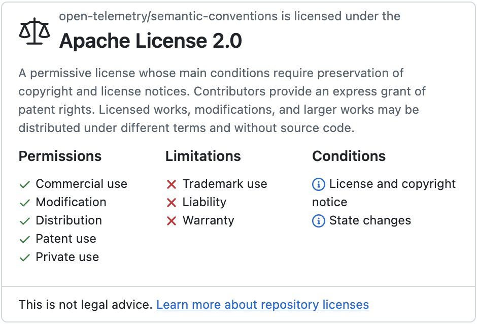
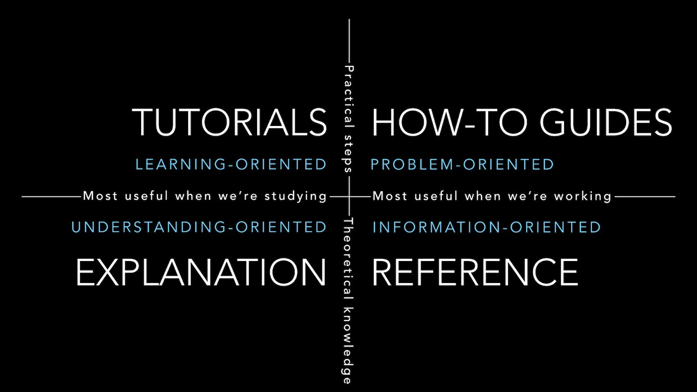

Fun fact, I thought I had already written this post, but when I wanted to reference it, I found out that I didn't. In this post, I'd like to describe my approach when choosing a dependency. I'll first define what I mean by dependency in the context of this post. Then, I'll list a grid of several criteria to analyze possible dependencies with.

## What is a dependency?

A dependency is literally something your software depends on: infrastructure such as a filesystem or a database, network, etc. In the context of this post, however, I'd like to narrow the scope to a software dependency that you need to compile/run, *i.e.*, a library. Different software stacks have different names for this library:

* Ruby calls it a *gem*
* Rust calls it a *crate*
* Python and Node.js call it a *package*
* Go calls it a *module*
* Maven/Gradle call it a dependency, hence the name I use in the title
* etc.

Note that the industry has been moving to a service-based architecture for purely revenue reasons. One can access services via a REST API or something else. In any case, the same evaluation criteria apply.

## Build vs. buy

When you need new software, the usual quandary is to build it vs. to buy it-Component Off The Shelf. The same reasoning could apply with a new dependency, with one major additional option: Open Source. The reasons for choosing one over another have been discussed in many details over the years.

Here's my modest contribution, from personal experience. In my projects, I'm very conservative regarding visibility. I try to keep external access to the bare minimum. In Java, I use `private` as much as possible, including in constructors. However, you can't use private constructors in tests. Hence, I widened the visibility to package-protected, but I wanted a way to document it.

In the past, I used regular comments, until a colleague pointed out Guava's [@VisibleForTesting](https://guava.dev/releases/19.0/api/docs/com/google/common/annotations/VisibleForTesting.html) to me. I became a big fan instantly. And yet, I wouldn't bring in the dependency for `@VisibleForTesting` only. If that's the only annotation I have for Guava, then I'd rather create my own.

If I need other classes from Guava, however, I'd reassess my decision. For example, [Multimap](https://guava.dev/releases/19.0/api/docs/com/google/common/collect/Multimap.html), a map with possibly multiple values stored under a key, requires a lot more time to develop. Thus, if I need `Multimap`, I'd probably add the dependency.

As you can see, the decision is pretty context-dependent.

In the rest of this post, we will assume that choosing to build wasn't the best solution, and we need to select a dependency from what exists.

## Risk management

Choosing a dependency is a risk, and as for every risk, you need to apply proper [risk management techniques](https://en.wikipedia.org/wiki/Risk_management):

1. Identify risks: in the next section, I'll list several items you can consider.
2. Analyze each risk. Consider likelihood and its impact(s). Organizations are different. One considers a specific risk's impact as LOW in their context, but another one sees it as HIGH. I can't help you there.
3. Plan responses. For each risk, document mitigating actions and their associated costs
4. Monitor! Risk management is not a static activity done once. Even in the context of dependencies, new risks can appear, *e.g.* , a new critical . Moreover, a risk can increase its likelihood, *e.g.*, a core committer leaves the project, and reduce the bus factor to a critical level. Perhaps it's time to dedicate a full-time employee to the project maintenance?

## Choice criteria

The [blurb](https://blog.frankel.ch/choose-cache/1/#standard-projects-health-indicators) I wrote is the foundation upon which I'll build. I'll develop upon it.

### License and legal aspects

I believe this is the most important aspect by far. You need to look at the license. GitHub makes it easy to verify it: first, it encourages projects to have a `LICENSE` file; then, it displays it prominently on the top if it's one of the recognized Open Source licenses.

You need to make sure you understand the license. For regular [OSI-approved licenses](https://opensource.org/licenses), it's quite easy: others have already done the work for you. For other types, it can be harder. Some dependencies are released under a dual license: one Open Source and one commercial. Most of the time, you can assume the Open Source license is quite restrictive and will need the commercial one.

### Pricing

Pricing has three models (that I know of):

* Fixed price
* Variable price based on some factor(s), *e.g.*, number of CPUs, number of users, etc.
* A combination of the above

The license can be either for a limited time or forever.

My best advice would be to write down your requirements, your scope, and your budget. Then, you should probably delegate the purchase to your purchasing department: they are pros and are the best ones to negotiate with. You'll need to involve them at some point anyway.

### Governance

Commercial projects are governed by a company. The main benefit of a company-governed project is financial backing. It may become a moot point if the project doesn't return the expected revenue. Other benefits will likely include professional skills to leverage as well as support (see link:#below).

Open Source ones provide several alternatives regarding governance: a foundation, a community of developers, or a single one. Foundations are the most stable form of governance, similar to companies. Some may even support projects financially. Note that not all foundations are equal: the [Apache Foundation](https://apache.org/), the [Eclipse Foundation](https://www.eclipse.org/), and the [Linux Foundation](https://www.linuxfoundation.org/) operate under very different models. The Apache Foundation builds upon the individual merits of people who work on projects. They provide the infrastructure (SCM, email, build infrastructure, etc.), but you're on your own beyond that. On the contrary, the [CNCF](https://www.cncf.io/), part of the Linux Foundation, builds upon companies. A company becomes part of the CNCF by paying a contribution.

The larger the group governing the project, the more time-consuming it will be to influence. Influence may be as grand as driving the roadmap to the direction you want, and as small as getting a bug fixed, or even getting your own fix merged. Interacting with developers will be easier for technically-minded people. In any case, expect to play politics to advance your goal, albeit with different politics depending on the governing body.

### Maturity

Adding a dependency is a trade-off: you save on time, but you lose control. If you build your software upon a project that goes unmaintained, you'll need either to migrate your code to cut the dependency or to maintain it yourself. For this reason, you must do a proper risk assessment before committing to a dependency.

Here are a couple of data points to evaluate a project's maturity:

* When was the project created? Older projects beget more confidence.
* What is its release history? The more regular the release frequency, the better it is.
* Does the project announce its roadmap? If yes, how detailed is it? A blurry roadmap, or none at all, betrays a lack of vision; one too detailed, especially in the far future, might be a sign of a lack of agility or realism.
* For commercial projects, is there something like ?

### Activity

For Open Source projects, you must check their activity. A project could have been very active in the past, but lost its drive along the way. In this section, we should check the following items:

* How many issues are open? What's the median time to resolve an issue? What's the most common resolution status? What's the longest open issue? Answering these should give you a hint about the project's overall health.
* How many accounts commit to the project? How many accounts regularly do so, *i.e.* , how many core committers are they? In other words, what is the [Bus factor](https://en.wikipedia.org/wiki/Bus_factor)? The higher the bus factor, the more chances that the project will continue if one committer stops.
* Related to the above, what's the main committers' commit history? Are committers spread among several unrelated projects, or do they focus on the one you depend on?

### Support

Support encompasses both commercial support and community support.

For most mature organizations, commercial support is a requirement. Commercial dependencies provide such support by nature. For Open Source projects, support ranges from none to companies providing support on projects as part of their core business. Most of the time, these companies employ developers working on the project. For example, [Tomitribe](https://tomitribe.com/) and [HeroDevs](https://www.herodevs.com/) offer support for the [Tomcat servlet engine](https://tomcat.apache.org/) hosted by the Apache Foundation.

Support from the community is free, but also a best effort. There's no guarantee somebody will answer your pleas, and if they do, when. Start by listing the available support channels, *e.g.*, GitHub, Slack, Google Groups, etc., and check:

* the number of different people answering
* the delay between an answer and the question
* the quality of answers

### Developer Experience

Developer Experience, also known as DX, is one of the key differentiators between a good project and a great one. Documentation plays a huge role in DX. Proper documentation should follow the [Divio system](https://docs.divio.com/documentation-system/) and group content into the following groups: tutorials, how-to guides, reference guides, and explanations.

Most projects provide exhaustive reference documentation. Some do offer a quick start. My first DevRel initiative on a new project is generally to create (or make others create) one when it's missing. The absence of a quick start is a blocker when onboarding new users.

Another component of DX comes from using the dependency itself. I'd recommend a prototype within a small time-boxed project, using the provided dependency. It will give you a good feeling for the Developer Experience. If you invest a lot, it makes sense to prototype a couple of competing dependencies in parallel.

### Market adoption and ecosystem

I mentioned above that choosing a dependency is risk management. Because we are social animals, we can trust people who have chosen the dependency before us to have made a correct decision. Ergo, the more organizations use the dependency, the higher the chances it's the right choice. However, be careful with the herd mentality syndrome: I see many organizations doing just that and choosing something that others have vetted in a completely different context. Cough, microservice, cough. Still, a large market adoption increases the chance of activity and future support.

I'd also recommend checking the ecosystem around, if it applies. A CSV parsing dependency obviously doesn't qualify, but an LDAP reading/writing one does. Which LDAP providers does it support? Is it Azure Directory compatible, etc.?

Finally, check whether one or more team members are already familiar with the dependency.

### Miscellany

I never used any of the following criteria; I won't develop. Yet, they might be relevant in your context.

* Vulnerability management and response time
* Dependency health and update frequency
* Public security policy
* Public benchmarks and performance metrics
* Real-world scalability examples
* Company stability and financial transparency

## Summary

In this post, I listed several criteria that you may use to evaluate dependencies. I hope it will prove useful.

*Originally published at [A Java Geek](https://blog.frankel.ch/choosing-dependency/) on November 2^nd^, 2025*

*[CVE]: Common Vulnerabilities and Exposures
*[LTS]: Long Term Support
