Welcome to the third and final part of the series "The Cost of Not Knowing MongoDB." Building upon the foundational optimizations explored in [Part 1](https://foojay.io/today/the-cost-of-not-knowing-mongodb-part-1-appv0-to-appv4/) and [Part 2](https://foojay.io/today/the-cost-of-not-knowing-mongodb-part-2-appv5r0-to-appv5r4/), this article delves into advanced MongoDB design patterns that can dramatically transform application performance.

In [Part 1](https://foojay.io/today/the-cost-of-not-knowing-mongodb-part-1-appv0-to-appv4/), we improved application performance by concatenating fields, changing data types, and shortening field names. In [Part 2](https://foojay.io/today/the-cost-of-not-knowing-mongodb-part-2-appv5r0-to-appv5r4/), we implemented the Bucket Pattern and Computed Pattern and optimized the aggregation pipeline to achieve even better performance.

In this final article, we address the Issues and Improvements identified in AppV5R4. Specifically, we focus on reducing the document size in our application to alleviate the disk throughput bottleneck on the MongoDB server. This reduction will be accomplished by adopting a Dynamic Schema and modifying the storage compression algorithm.

All the application versions and revisions from this article were developed by a senior MongoDB developer, as they are built on all the previous versions and utilize the Dynamic Schema pattern, which isn't very common to see.

Application version 6 revision 0 (appV6R0): A dynamic monthly bucket document {#h2-0-application-version-6-revision-0-appv6r0-a-dynamic-monthly-bucket-document}
----------------------------------------------------------------------------------------------------------------------------------------------------------------

As mentioned in the Issues and Improvements of appV5R4 from the [previous article](https://foojay.io/today/the-cost-of-not-knowing-mongodb-part-2-appv5r0-to-appv5r4/), the primary limitation of our MongoDB server is its disk throughput. To address this, we need to reduce the size of the documents being stored.

Consider the following document from appV5R3, which has provided the best performance so far:

|---------------------------------------------------------------------------------------------------------------------------------------------------------------------------------------------------------------------------------------------------------|
| const document = { _id: Buffer.from("...01202202"), items: \[ { date: new Date("2022-06-05"), a: 10, n: 3 }, { date: new Date("2022-06-16"), p: 1, r: 1 }, { date: new Date("2022-06-27"), a: 5, r: 1 }, { date: new Date("2022-06-29"), p: 1 }, \], }; |

The items array in this document contains only four elements, but on average, it will have around 10 elements, and in the worst-case scenario, it could have up to 90 elements. These elements are the primary contributors to the document size, so they should be the focus of our optimization efforts.

One commonality among the elements is the presence of the date field, with its value including the year and month, for the previous document. By rethinking how this field and its value could be stored, we can reduce storage requirements.

An unconventional solution we could use is:

* Changing the items field type from an array to a document.
* Using the date value as the field name in the items document.
* Storing the status totals as the value for each date field.

Here is the previous document represented using the new schema idea:

|-----------------------------------------------------------------------------------------------------------------------------------------------------------------------|
| const document = { _id: Buffer.from("...01202202"), items: { 20220605: { a: 10, n: 3 }, 20220616: { p: 1, r: 1 }, 20220627: { a: 5, r: 1 }, 20220629: { p: 1 }, }, }; |

While this schema may not significantly reduce the document size compared to appV5R3, we can further optimize it by leveraging the fact that the year is already embedded in the _id field. This eliminates the need to repeat the year in the field names of the items document.

With this approach, the items document adopts a Dynamic Schema, where field names encode information and are not predefined.

To demonstrate various implementation possibilities, we will revisit all the bucketing criteria used in the appV5RX implementations, starting with appV5R0.

For appV6R0, which builds upon appV5R0 but uses a dynamic schema, data is bucketed by year and month. The field names in the items document represent only the day of the date, as the year and month are already stored in the _id field.

A detailed explanation of the bucketing logic and functions used to implement the current application can be found in the [appV5R0 introduction](https://www.mongodb.com/developer/products/mongodb/cost-of-not-knowing-mongodb-part-2/#application-version-5-revision-0-and-revision-1--appv5r0-and-appv5r1---a-simple-way-to-use-the-bucket-pattern).

The following document stores data for January 2022 (2022-01-XX), applying the newly presented idea:

|-------------------------------------------------------------------------------------------------------------------------------------------------|
| const document = { _id: Buffer.from("...01202201"), items: { "05": { a: 10, n: 3 }, 16: { p: 1, r: 1 }, 27: { a: 5, r: 1 }, 29: { p: 1 }, }, }; |

### Schema {#h3-1-schema}

The application implementation presented above would have the following TypeScript document schema denominated SchemaV6R0:

|----------------------------------------------------------------------------------------------------------------------------|
| export type SchemaV6R0 = { _id: Buffer; items: Record\< string, { a?: number; n?: number; p?: number; r?: number; } \>; }; |

### Bulk upsert {#h3-2-bulk-upsert}

Based on the specification presented, we have the following updateOne operation for each event generated by this application version:

|--------------------------------------------------------------------------------------------------------------------------------------------------------------------------------------------------------------------------------------------------------------------------------------------------------------------------------------------------------------------------------------------|
| const DD = getDD(event.date); // Extract the \`day\` from the \`event.date\` const operation = { updateOne: { filter: { _id: buildId(event.key, event.date) }, // key + year + month update: { $inc: { \[\`items.${DD}.a\`\]: event.approved, \[\`items.${DD}.n\`\]: event.noFunds, \[\`items.${DD}.p\`\]: event.pending, \[\`items.${DD}.r\`\]: event.rejected, }, }, upsert: true, }, }; |

**filter**:

* Target the document where the _id field matches the concatenated value of key, year, and month.
* The buildId function converts the key+year+month into a binary format.

**update**:

* Uses the [$inc](https://www.mongodb.com/docs/manual/reference/operator/update/inc/?utm_campaign=devrel&utm_source=third-party-content&utm_medium=cta&utm_content=cost-of-not-knowing-foojay-part3&utm_term=tony.kim) operator to increment the fields corresponding to the same DD as the event by the status values provided.
* If a field does not exist in the items document and the event provides a value for it, $inc treats the non-existent field as having a value of 0 and performs the operation.
* If a field exists in the items document but the event does not provide a value for it (i.e., undefined), $inc treats it as 0 and performs the operation.

**upsert**:

* Ensures a new document is created if no matching document exists.

### Get reports {#h3-3-get-reports}

To fulfill the Get Reports operation, five aggregation pipelines are required, one for each date interval. Each pipeline follows the same structure, differing only in the filtering criteria in the $match stage:

|-----------------------------------------------------------------------------------------------------------------------------------------------------|
| const pipeline = \[ { $match: docsFromKeyBetweenDate }, { $addFields: buildTotalsField }, { $group: groupSumTotals }, { $project: { _id: 0 } }, \]; |

The complete code for this aggregation pipeline is quite complicated. Because of that, we will have just a pseudocode for it here.

1. **{ $match: docsFromKeyBetweenDate }**
   * Range-filters documents by _id to retrieve only buckets within the report date range. It has the same logic as appV5R0.
2. **{ $addFields: buildTotalsField }**
   * The logic is similar to the one used in the Get Reports of appV5R3.
   * The [$objectToArray](https://www.mongodb.com/docs/manual/reference/operator/aggregation/objectToArray/?utm_campaign=devrel&utm_source=third-party-content&utm_medium=cta&utm_content=cost-of-not-knowing-foojay-part3&utm_term=tony.kim) operator is used to convert the items document into an array, enabling a $reduce operation.
   * Filtering the items fields within the report's range involves extracting the year and month from the _id field and the day from the field names in the items document.
   * The following JavaScript code is logic equivalent to the real aggregation pipeline code.

|--------------------------------------------------------------------------------------------------------------------------------------------------------------------------------------------------------------------------------------------------------------------------------------------------------------------------------------------------------------------------------------------------------------------------------------------------------------------------------------------------------------------------------------------------------------------------------------------------------------------------------------------------------------------|
| // Equivalent JavaScript logic: const \[MM\] = _id.slice(-2).toString(); // Get month from _id const \[YYYY\] = _id.slice(-6, -2).toString(); // Get year from _id const items_array = Object.entries(items); // Convert the object to an array of \[key, value\] const totals = items_array.reduce( (accumulator, \[DD, status\]) =\> { let statusDate = new Date(\`${YYYY}-${MM}-${DD}\`); if (statusDate \>= reportStartDate \&\& statusDate \< reportEndDate) { accumulator.a += status.a \|\| 0; accumulator.n += status.n \|\| 0; accumulator.p += status.p \|\| 0; accumulator.r += status.r \|\| 0; } return accumulator; }, { a: 0, n: 0, p: 0, r: 0 } ); |

3. **{ $group: groupCountTotals }**
   * Group the totals of each document in the pipeline into final status totals using $sum operations.
4. **{ $project: { _id: 0 } }**
   * Format the resulting document to have the reports format.

### Indexes {#h3-4-indexes}

No additional indexes are required, maintaining the single _id index approach established in the appV4 implementation.

### Initial scenario statistics {#h3-5-initial-scenario-statistics}

#### Collection statistics

To evaluate the performance of appV6R0, we inserted 500 million event documents into the collection using the schema and Bulk Upsert function described earlier. For comparison, the tables below also include statistics from previous comparable application versions:

| **Collection** | **Documents** | **Data Size** | **Document Size** | **Storage Size** | **Indexes** | **Index Size** |
|----------------|---------------|---------------|-------------------|------------------|-------------|----------------|
| appV5R0        | 95,350,431    | 19.19GB       | 217B              | 5.06GB           | 1           | 2.95GB         |
| appV5R3        | 33,429,492    | 11.96GB       | 385B              | 3.24GB           | 1           | 1.11GB         |
| appV6R0        | 95,350,319    | 11.1GB        | 125B              | 3.33GB           | 1           | 3.13GB         |

#### Event statistics

To evaluate the storage efficiency per event, the Event Statistics are calculated by dividing the total data size and index size by the 500 million events.

| **Collection** | **Data Size/Events** | **Index Size/Events** | **Total Size/Events** |
|----------------|----------------------|-----------------------|-----------------------|
| appV5R0        | 41.2B                | 6.3B                  | 47.5B                 |
| appV5R3        | 25.7B                | 2.4B                  | 28.1B                 |
| appV6R0        | 23.8B                | 6.7B                  | 30.5B                 |

It is challenging to make a direct comparison between appV6R0 and appV5R0 from a storage perspective. The appV5R0 implementation is the simplest bucketing possible, where event documents were merely appended to the items array without bucketing by day, as is done in appV6R0.

However, we can attempt a comparison between appV6R0 and appV5R3, the best solution so far. In appV6R0, data is bucketed by month, whereas in appV5R3, it is bucketed by quarter. Assuming document size scales linearly with the bucketing criteria (though this is not entirely accurate), the appV6R0 document would be approximately 3 \* 125 = 375 bytes, which is 9.4% smaller than appV5R3.

Another indicator of improvement is the Data Size/Events metric in the Event Statistics table. For appV6R0, each event uses an average of 23.8 bytes, compared to 27.7 bytes for appV5R3, representing a 14.1% reduction in size.

### Load test results {#h3-6-load-test-results}

Executing the load test for appV6R0 and plotting it alongside the results for appV5R0 and Desired rates, we have the following results for Get Reports and Bulk Upsert.

#### **Get Reports rates**

The two versions exhibit very similar rate performance, with appV6R0 showing slight superiority in the second and third quarters, while appV5R0 is superior in the first and fourth quarters.
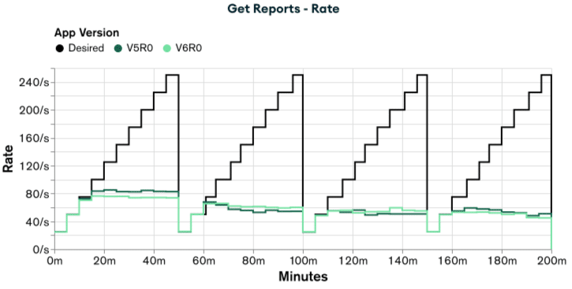

#### **Get Reports latency**

The two versions exhibit very similar latency performance, with appV6R0 showing slight advantages in the second and third quarters, while appV5R0 is superior in the first and fourth quarters.
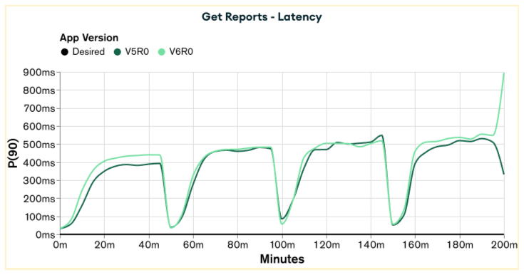

#### **Bulk Upsert rates**

Both versions have similar rate values, but it can be seen that appV6R0 has a small edge compared to appV5R0.
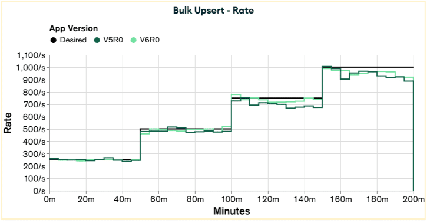

#### **Bulk Upsert latency**

Although both versions have similar latency values for the first quarter of the test, for the final three-quarters, appV6R0 has a clear advantage over appV5R0.
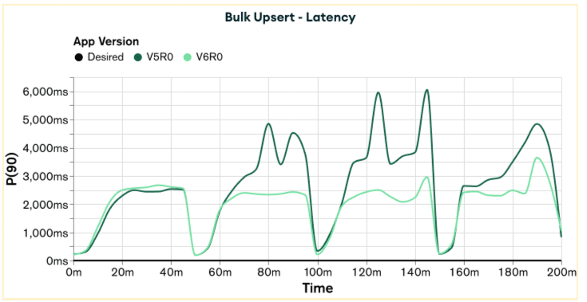

#### **Performance summary**

Despite the significant reduction in document and storage size achieved by appV6R0, the performance improvement was not as substantial as expected. This suggests that the bottleneck in the application when bucketing data by month may not be related to disk throughput.

Examining the collection stats table reveals that the index size for both versions is close to 3GB. This is near the 4GB of available memory on the machine running the database and exceeds the [1.5GB allocated by WiredTiger for cache](https://www.mongodb.com/docs/manual/core/wiredtiger/?utm_campaign=devrel&utm_source=third-party-content&utm_medium=cta&utm_content=cost-of-not-knowing-foojay-part3&utm_term=tony.kim#memory-use). Therefore, it is likely that the limiting factor in this case is memory/cache rather than document size, which explains the lack of a significant performance improvement.

### Issues and improvements {#h3-7-issues-and-improvements}

To address the limitations observed in appV6R0, we propose adopting the same line of improvements applied from appV5R0 to appV5R1. Specifically, we will bucket the events by quarter in appV6R1. This approach not only follows the established pattern of enhancements but also aligns with the need to optimize performance further.

As highlighted in the Load Test Results, the current bottleneck lies in the size of the index relative to the available cache/memory. By increasing the bucketing interval from month to quarter, we can reduce the number of documents by approximately a factor of three. This reduction will, in turn, decrease the number of index entries by the same factor, leading to a smaller index size.

Application version 6 revision 1 (appV6R1): A dynamic quarter bucket document {#h2-8-application-version-6-revision-1-appv6r1-a-dynamic-quarter-bucket-document}
----------------------------------------------------------------------------------------------------------------------------------------------------------------

As discussed in the previous Issues and Improvements section, the primary bottleneck in appV6R0 was the index size nearing the memory capacity of the machine running MongoDB. To mitigate this issue, we propose increasing the bucketing interval from a month to a quarter for appV6R1, following the approach used in appV5R1.

This adjustment aims to reduce the number of documents and index entries by approximately a factor of three, thereby decreasing the overall index size. By adopting a quarter-based bucketing strategy, we align with the established pattern of enhancements applied in appV5R1 versions while addressing the specific memory/cache constraints identified in appV6R0.

The implementation of appV6R1 retains most of the code from appV6R0, with the following key differences:

* The _id field will now be composed of key+year+quarter.
* The field names in the items document will encode both month and day, as this information is necessary for filtering date ranges in the Get Reports operation.

The following example demonstrates how data for June 2022 (2022-06-XX), within the second quarter (Q2), is stored using the new schema:

|---------------------------------------------------------------------------------------------------------------------------------------------------------------|
| const document = { _id: Buffer.from("...01202202"), items: { "0605": { a: 10, n: 3 }, "0616": { p: 1, r: 1 }, "0627": { a: 5, r: 1 }, "0629": { p: 1 }, }, }; |

### Schema {#h3-9-schema}

The application implementation presented above would have the following TypeScript document schema denominated SchemaV6R0:

|----------------------------------------------------------------------------------------------------------------------------|
| export type SchemaV6R0 = { _id: Buffer; items: Record\< string, { a?: number; n?: number; p?: number; r?: number; } \>; }; |

### Bulk upsert {#h3-10-bulk-upsert}

Based on the specification presented, we have the following updateOne operation for each event generated by this application version:

|-------------------------------------------------------------------------------------------------------------------------------------------------------------------------------------------------------------------------------------------------------------------------------------------------------------------------------------------------------------------------------------------------------------------------|
| const MMDD = getMMDD(event.date); // Extract the month (MM) and day(DD) from the \`event.date\` const operation = { updateOne: { filter: { _id: buildId(event.key, event.date) }, // key + year + quarter update: { $inc: { \[\`items.${MMDD}.a\`\]: event.approved, \[\`items.${MMDD}.n\`\]: event.noFunds, \[\`items.${MMDD}.p\`\]: event.pending, \[\`items.${MMDD}.r\`\]: event.rejected, }, }, upsert: true, }, }; |

This updateOne operation has a similar logic to the one in appV6R0, with the only differences being the filter and update criteria.

**filter**:

* Target the document where the _id field matches the concatenated value of key, year, and quarter.
* The buildId function converts the key+year+quarter into a binary format.

**update**:

* Uses the $inc operator to increment the fields corresponding to the same MMDD as the event by the status values provided.

### Get reports {#h3-11-get-reports}

To fulfill the Get Reports operation, five aggregation pipelines are required, one for each date interval. Each pipeline follows the same structure, differing only in the filtering criteria in the $match stage:

|-----------------------------------------------------------------------------------------------------------------------------------------------------|
| const pipeline = \[ { $match: docsFromKeyBetweenDate }, { $addFields: buildTotalsField }, { $group: groupSumTotals }, { $project: { _id: 0 } }, \]; |

This aggregation operation has a similar logic to the one in appV6R0, with the only differences being the implementation in the $addFields stage.

**{ $addFields: itemsReduceAccumulator }** **:**

* A similar implementation to the one in appV6R0
* The difference relies on extracting the value of year (YYYY) from the _id field and the month and day (MMDD) from the field name.
* The following JavaScript code is logic equivalent to the real aggregation pipeline code.

|--------------------------------------------------------------------------------------------------------------------------------------------------------------------------------------------------------------------------------------------------------------------------------------------------------------------------------------------------------------------------------------------------------------------------------------------------------------------------------------------------------------------------------------------------------------------------------------------------------------------------------|
| const \[YYYY\] = _id.slice(-6, -2).toString(); // Get year from _id const items_array = Object.entries(items); // Convert the object to an array of \[key, value\] const totals = items_array.reduce( (accumulator, \[MMDD, status\]) =\> { let \[MM, DD\] = \[MMDD.slice(0, 2), MMDD.slice(2, 4)\]; let statusDate = new Date(\`${YYYY}-${MM}-${DD}\`); if (statusDate \>= reportStartDate \&\& statusDate \< reportEndDate) { accumulator.a += status.a \|\| 0; accumulator.n += status.n \|\| 0; accumulator.p += status.p \|\| 0; accumulator.r += status.r \|\| 0; } return accumulator; }, { a: 0, n: 0, p: 0, r: 0 } ); |

### Indexes {#h3-12-indexes}

No additional indexes are required, maintaining the single _id index approach established in the appV4 implementation.

### Initial scenario statistics {#h3-13-initial-scenario-statistics}

#### Collection statistics

To evaluate the performance of appV6R1, we inserted 500 million event documents into the collection using the schema and Bulk Upsert function described earlier. For comparison, the tables below also include statistics from previous comparable application versions:

| **Collection** | **Documents** | **Data Size** | **Document Size** | **Storage Size** | **Indexes** | **Index Size** |
|----------------|---------------|---------------|-------------------|------------------|-------------|----------------|
| appV5R3        | 33,429,492    | 11.96GB       | 385B              | 3.24GB           | 1           | 1.11GB         |
| appV6R0        | 95,350,319    | 11.1GB        | 125B              | 3.33GB           | 1           | 3.13GB         |
| appV6R1        | 33,429,366    | 8.19GB        | 264B              | 2.34GB           | 1           | 1.22GB         |

#### Event statistics

To evaluate the storage efficiency per event, the Event Statistics are calculated by dividing the total data size and index size by the 500 million events.

| **Collection** | **Data Size/Events** | **Index Size/Events** | **Total Size/Events** |
|----------------|----------------------|-----------------------|-----------------------|
| appV5R3        | 25.7B                | 2.4B                  | 28.1B                 |
| appV6R0        | 23.8B                | 6.7B                  | 30.5B                 |
| appV6R1        | 17.6B                | 2.6B                  | 20.2B                 |

In the previous Initial Scenario Statistics analysis, we assumed that document size would scale linearly with the bucketing range. However, this assumption proved inaccurate. The average document size in appV6R1 is approximately twice as large as in appV6R0, even though it stores three times more data. Already a win for this new implementation.

Since appV6R1 buckets data by quarter at the document level and by day within the items sub-document, a fair comparison would be with appV5R3, the best-performing version so far. From the tables above, we observe a significant improvement in Document Size and consequently Data Size when transitioning from appV5R3 to appV6R1. Specifically, there was a 31.4% reduction in Document Size. From an index size perspective, there was no change, as both versions bucket events by quarter.

### Load test results {#h3-14-load-test-results}

Executing the load test for appV6R0 and plotting it alongside the results for appV5R0 and Desired rates, we have the following results for Get Reports and Bulk Upsert.

#### **Get Reports rates**

For the first three-quarters of the test, both versions have similar rate values, but, for the final quarter, appV6R1 has a notable edge over appV5R3.
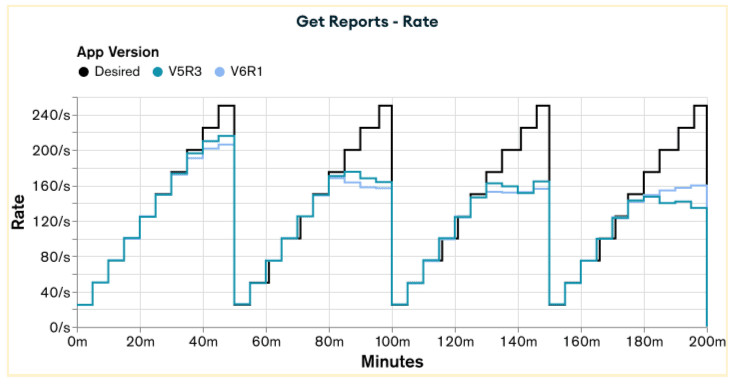

#### **Get Reports latency**

As shown in the rates graph, both versions exhibit similar values for the first three-quarters, with appV6R1 outperforming appV5R3 in the final quarter.
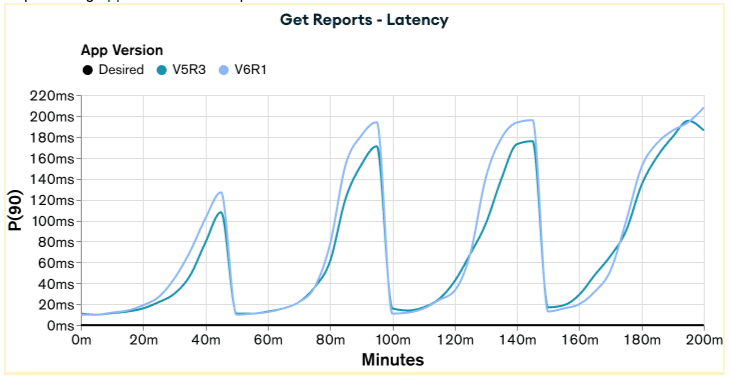

#### **Bulk Upsert rates**

Both versions exhibit very similar rate values throughout the test. However, appV6R1 achieves better values than appV5R3 in the final 20 minutes, although it still fails to reach the desired rate.
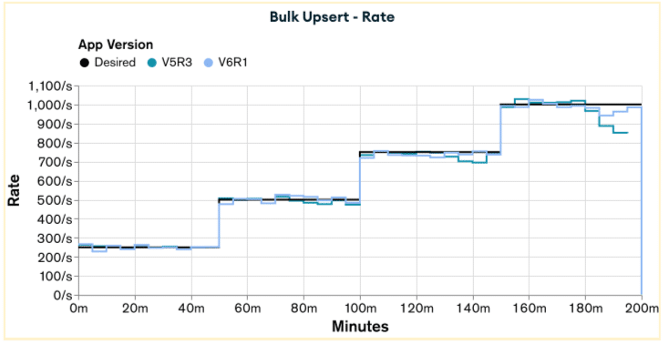

#### **Bulk Upsert latency**

Even though both versions have similar rate values, we can see that appV6R1 has considerably better latency values than appV5R3, being almost two times faster for the last three quarters of the test.
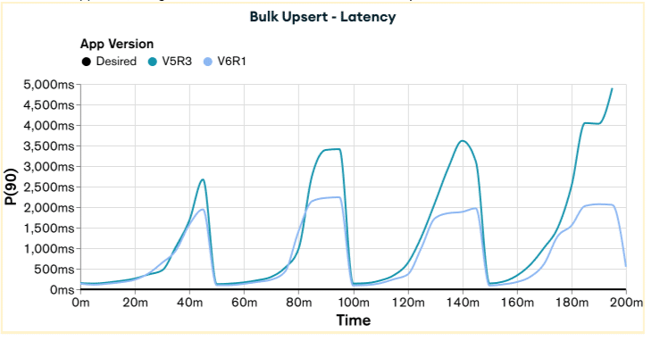

### Issues and improvements {#h3-15-issues-and-improvements}

Reviewing the Get Reports graphs from the last Load Test Results, we still cannot achieve the desired rates for this functionality. One way to improve these operations is by using our well-known and old friend, the Computed Pattern.

Applying the Computed Pattern in the current version would be the same improvement tried from appV5R3 to appV5R4, which, instead of improving the performance, made it worse. Why would this solution work this time? The only way to know if it will work or not is to try. Still, before cracking our fingers and starting to work on the implementation, it's always a good idea to make a quick check and see if there is at least one good reason to believe that this time things will be different (cof-cof).

When we applied the Computed Pattern from appV5R3 to appV5R4, we observed an 8.2% increase in document size and a slight degradation in performance for the Bulk Upsert functionality, with no performance gains in Get Reports. From appV5R3 to appV6R2, we achieved a 31.4% reduction in document size. It might be worthwhile to trade some of this reduction for the benefit of storing pre-computed values. Another point is that the Bulk Upsert functionality in appV6R2 has its best performance so far. Therefore, the extra cost of pre-computing the documents' totals for this version may not be as significant as it was for appV5R4.

With these two "maybes" and a scientific spirit of always trying to test things to see where they'll break, let's give the Computed Pattern another chance.

Application version 6 revision 2 (appV6R2): A dynamic bucket and computed document {#h2-16-application-version-6-revision-2-appv6r2-a-dynamic-bucket-and-computed-document}
---------------------------------------------------------------------------------------------------------------------------------------------------------------------------

As discussed in the previous Issues and Improvements section, in this revision, we'll give another try to the Computed Pattern and pre-compute the status totals for each document. This implementation is equal to the one tried in appV5R4, with the only difference being that we are using a Dynamic Schema for the items field instead of an array.

### Schema {#h3-17-schema}

The application implementation presented above would have the following TypeScript document schema denominated SchemaV6R1:

|---------------------------------------------------------------------------------------------------------------------------------------------------------------------------------------------------------------------------------------------------------------------------------------------------------------------------------------------------------------------------------------------|
| export type SchemaV6R1 = { _id: Buffer; totals: { a?: number; // Quarter total approved n?: number; // Quarter total noFunds p?: number; // Quarter total pending r?: number; // Quarter total rejected }; items: Record\< string, { a?: number; // Daily total approved n?: number; // Daily total noFunds p?: number; // Daily total pending r?: number; // Daily total rejected } \>; }; |

### Indexes {#h3-18-indexes}

No additional indexes are required, maintaining the single _id index approach established in the appV4 implementation.

### Bulk upsert {#h3-19-bulk-upsert}

Based on the specifications, the following bulk updateOne operation is used for each event generated by the application:

|---------------------------------------------------------------------------------------------------------------------------------------------------------------------------------------------------------------------------------------------------------------------------------------------------------------------------------------------------------------------------------------------------------------------------------------------------------------------------------------------------------------------------------------|
| const MMDD = getMMDD(event.date); // Extract the month (MM) and day(DD) from the \`event.date\` const operation = { updateOne: { filter: { _id: buildId(event.key, event.date) }, // key + year + quarter update: { $inc: { "totals.a": event.approved, "totals.n": event.noFunds, "totals.p": event.pending, "totals.r": event.rejected, \[\`items.${MMDD}.a\`\]: event.approved, \[\`items.${MMDD}.n\`\]: event.noFunds, \[\`items.${MMDD}.p\`\]: event.pending, \[\`items.${MMDD}.r\`\]: event.rejected, }, }, upsert: true, }, }; |

This updateOne has almost the same logic as the one for appV6R1, with the difference being that we also increment the totals to pre-compute the quarter totals for the document. From a logical perspective, this operation is equivalent to the Bulk Upsert of appV5R4. However, from an implementation perspective, it's significantly easier to write and understand. Additionally, from an execution perspective, it's less costly/intensive due to its fewer stages and operations. This simplicity may also contribute to a better performance of the Computed Pattern when compared to appV5R4.

### Get reports {#h3-20-get-reports}

To fulfill the Get Reports operation, five aggregation pipelines are required, one for each date interval. Each pipeline follows the same structure, differing only in the filtering criteria in the $match stage:

|-----------------------------------------------------------------------------------------------------------------------------------------------------|
| const pipeline = \[ { $match: docsFromKeyBetweenDate }, { $addFields: buildTotalsField }, { $group: groupSumTotals }, { $project: { _id: 0 } }, \]; |

This aggregation operation shares a similar logic with the one in appV5R4, due to the pre-computed totals field, and with the one in appV6R1, due to the items field being of type document. The difference when compared to appV6R1 relies only on the $addFields stage. The complete code for this aggregation pipeline is quite complicated. Because of that, we will have just a pseudocode for it here.

**{ $addFields: buildTotalsField }** **:**

* A similar implementation to the one in appV6R0
* The main difference is that if the quarter's date range is within the limits of the report's date range, we can use the pre-computed totals instead of calculating the value through a $reduce operation.
* The following JavaScript code is logic equivalent to the real aggregation pipeline code.

|---------------------------------------------------------------------------------------------------------------------------------------------------------------------------------------------------------------------------------------------------------------------------------------------------------------------------------------------------------------------------------------------------------------------------------------------------------------------------------------------------------------------------------------------------------------------------------------------------------------------------------------------------------------------------------------------------------------------------------------------------------------------------------------------------------|
| let totals; if (documentQuarterWithinReportDateRange) { // Use pre-computed quarterly totals totals = document.totals; } else { // Fall back to item-level aggregation const \[YYYY\] = _id.slice(-6, -2).toString(); // Get year from _id const items_array = Object.entries(items); // Convert the object to an array of \[key, value\] const totals = items_array.reduce( (accumulator, \[MMDD, status\]) =\> { let \[MM, DD\] = \[MMDD.slice(0, 2), MMDD.slice(2, 4)\]; let statusDate = new Date(\`${YYYY}-${MM}-${DD}\`); if (statusDate \>= reportStartDate \&\& statusDate \< reportEndDate) { accumulator.a += status.a \|\| 0; accumulator.n += status.n \|\| 0; accumulator.p += status.p \|\| 0; accumulator.r += status.r \|\| 0; } return accumulator; }, { a: 0, n: 0, p: 0, r: 0 } ); } |

### Indexes {#h3-21-indexes}

No additional indexes are required, maintaining the single _id index approach established in the appV4 implementation.

### Initial scenario statistics {#h3-22-initial-scenario-statistics}

#### Collection statistics

To evaluate the performance of appV6R2, we inserted 500 million event documents into the collection using the schema and Bulk Upsert function described earlier. For comparison, the tables below also include statistics from previous comparable application versions:

| **Collection** | **Documents** | **Data Size** | **Document Size** | **Storage Size** | **Indexes** | **Index Size** |
|----------------|---------------|---------------|-------------------|------------------|-------------|----------------|
| appV5R3        | 33,429,492    | 11.96GB       | 385B              | 3.24GB           | 1           | 1.11GB         |
| appV6R1        | 33,429,366    | 8.19GB        | 264B              | 2.34GB           | 1           | 1.22GB         |
| appV6R2        | 33,429,207    | 9.11GB        | 293B              | 2.8GB            | 1           | 1.26GB         |

#### Event statistics

To evaluate the storage efficiency per event, the Event Statistics are calculated by dividing the total data size and index size by the 500 million events.

| **Collection** | **Data Size/Events** | **Index Size/Events** | **Total Size/Events** |
|----------------|----------------------|-----------------------|-----------------------|
| appV5R3        | 25.7B                | 2.4B                  | 28.1B                 |
| appV6R1        | 17.6B                | 2.6B                  | 20.2B                 |
| appV6R2        | 19.6B                | 2.7B                  | 22.3B                 |

As expected, we had an 11.2% increase in the Document Size by adding a totals field in each document of appV6R2. When comparing to appV5R3, we still have a reduction of 23.9% in the Document Size. Let's review the Load Test Results to see if the trade-off between storage and computation cost is worthwhile.

### Load test results {#h3-23-load-test-results}

Executing the load test for appV6R2 and plotting it alongside the results for appV6R1 and Desired rates, we have the following results for Get Reports and Bulk Upsert.

#### **Get Reports rates**

We can see that appV6R2 has better rates than appV6R1 throughout the test, but it's still not reaching the top rate of 250 reports per second.
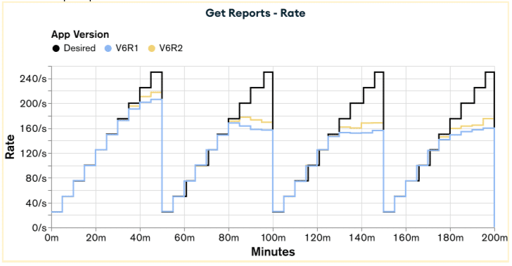

#### **Get Reports latency**

As shown in the rates graph, appV6R2 consistently provides lower latency than appV6R1 throughout the test.
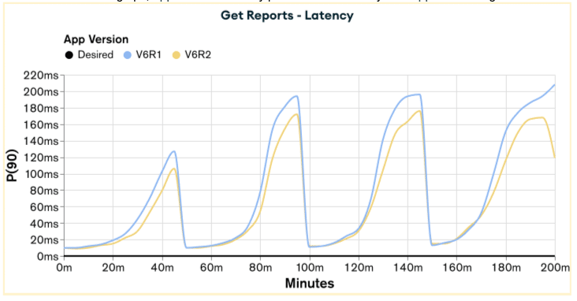

#### **Bulk Upsert rates**

Both versions exhibit very similar rate values throughout the test, with appV6R2 performing slightly better than appV6R1 in the final 20 minutes, yet still failing to reach the desired rate.
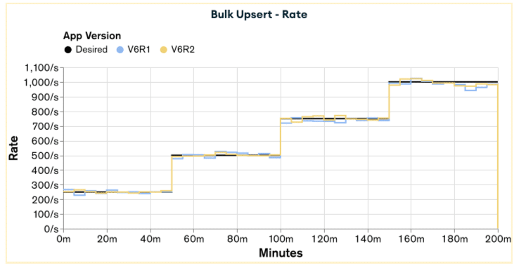

#### **Bulk Upsert latency**

Although appV6R2 had better rate values than appV6R1, their latency performance is not conclusive, with appV6R2 being superior in the first and final quarters and appV6R1 in the second and third quarters.
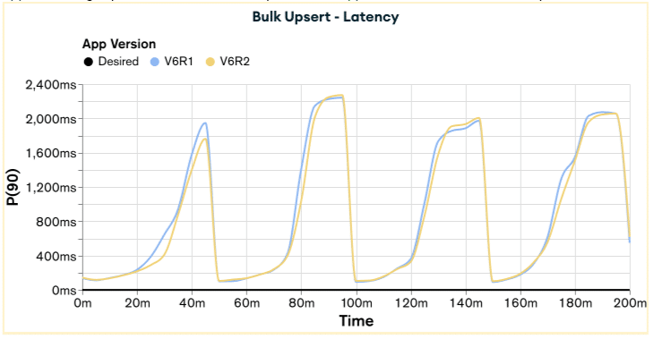

#### **Performance summary**

The two "maybes" from the previous Issues and Improvements made up for their promises, and we got the best performance for appV6R2 when comparing to appV6R1. This is the redemption of the Computed Pattern applied on a document level. This revision is one of my favorites because it shows that the same optimization on very similar applications can lead to different results. In our case, the difference was caused by the application being very bottlenecked by the disk throughput.

### Issues and improvements {#h3-24-issues-and-improvements}

Let's tackle the last improvement on an application level. Those paying close attention to the application versions may have already questioned it. In every Get Reports section, we have "To fulfill the Get Reports operation, five aggregation pipelines are required, one for each date interval." Do we really need to run five aggregation pipelines to generate the reports document? Isn't there a way to calculate everything in just one operation? The answer is yes, there is.

The reports documents are composed of fields oneYear, threeYears, fiveYears, sevenYears, and tenYears, where each one was generated by its respective aggregation pipeline until now. Generating the reports this way is a waste of processing power because we are doing some part of the calculation multiple times. For example, to calculate the status totals for tenYears, we will also have to calculate the status totals for the other fields, as from a date range perspective, they are all contained in the tenYears date range.

So, for our next application revision, we'll condense the Get Reports five aggregation pipelines into one, avoiding wasting processing power on repeated calculation.

Application version 6 revision 3 (appV6R3): Getting everything at once {#h2-25-application-version-6-revision-3-appv6r3-getting-everything-at-once}
---------------------------------------------------------------------------------------------------------------------------------------------------

As discussed in the previous Issues and Improvements section, in this revision, we'll improve the performance of our application by changing the Get Reports functionality to generate the reports document using only one aggregation pipeline instead of five.

The rationale behind this improvement is that when we generate the tenYears totals, we have also calculated the other totals, oneYear, threeYears, fiveYears, and sevenYears. As an example, when we request to Get Reports with the key ...0001 with the date 2022-01-01, the totals will be calculated with the following date range:

* oneYear: from 2021-01-01 to 2022-01-01
* threeYears: from 2020-01-01 to 2022-01-01
* fiveYears: from 2018-01-01 to 2022-01-01
* sevenYears: from 2016-01-01 to 2022-01-01
* tenYear: from 2013-01-01 to 2022-01-01

As we can see from the list above, the date range for tenYears encompasses all the other date ranges.

Although we successfully implemented the Computed Pattern in the previous revision, appV6R2, achieving better results than appV6R1, we will not use it as a base for this revision. There were two reasons for that:

1. Based on the results of our previous implementation of the Computed Pattern on a document level, from appV5R3 to appV5R4, I didn't expect it to get better results.
2. Implementing Get Reports to retrieve the reports document through a single aggregation pipeline, utilizing pre-computed field totals generated by the Computed Pattern would require significant effort. By the time of the latest versions of this series, I just wanted to finish it.

So, this revision will be built based on the appV6R1.

### Schema {#h3-26-schema}

The application implementation presented above would have the following TypeScript document schema denominated SchemaV6R0:

|----------------------------------------------------------------------------------------------------------------------------|
| export type SchemaV6R0 = { _id: Buffer; items: Record\< string, { a?: number; n?: number; p?: number; r?: number; } \>; }; |

### Bulk upsert {#h3-27-bulk-upsert}

Based on the specifications, the following bulk updateOne operation is used for each event generated by the application:

|-------------------------------------------------------------------------------------------------------------------------------------------------------------------------------------------------------------------------------------------------------------------------------------------------------------------------------------------------------------------------------------------------------------------------------------------------------------|
| const YYYYMMDD = getYYYYMMDD(event.date); // Extract the year(YYYY), month(MM), and day(DD) from the \`event.date\` const operation = { updateOne: { filter: { _id: buildId(event.key, event.date) }, // key + year + quarter update: { $inc: { \[\`items.${YYYYMMDD}.a\`\]: event.approved, \[\`items.${YYYYMMDD}.n\`\]: event.noFunds, \[\`items.${YYYYMMDD}.p\`\]: event.pending, \[\`items.${YYYYMMDD}.r\`\]: event.rejected, }, }, upsert: true, }, }; |

This updateOne has almost exactly the same logic as the one for appV6R1. The difference is that the name of the fields in the items document will be created based on year, month, and day (YYYYMMDD) instead of just month and day (MMDD). This change was made to reduce the complexity of the aggregation pipeline of the Get Reports.

### Get reports {#h3-28-get-reports}

To fulfill the Get Reports operation, one aggregation pipeline is required:

|---------------------------------------------------------------------------------------------------------------------------------------------------|
| const pipeline = \[ { $match: docsFromKeyBetweenDate }, { $addFields: buildTotalsField }, { $group: groupCountTotals }, { $project: format }, \]; |

This aggregation operation has a similar logic to the one in [appV6R1](https://docs.google.com/document/d/1yD5UYmo6EzELk-Ax-p-EshpqvN23dp5-Jsh_f-RLUV0/edit?tab=t.0#heading=h.f60l6m8nohnk), with the only differences being the implementation in the $addFields stage.

**{ $addFields: buildTotalsField }**

* It follows a similar logic to the previous revision, where we first convert the items document into an array using $objectToArray, and then use the reduce function to iterate over the array, accumulating the status.
* The difference lies in the initial value and the logic of the reduce function.
* The initial value in this case is an object/document with one field for each of the report date ranges. These fields for each report date range are also an object/document, with their fields being the possible status set to zero, as this is the initial value.
* The logic in this case checks the date range of the item and increments the totals accordingly. If the item isInOneYearDateRange(...), it is also in all the other date ranges: three, five, seven, and 10 years. If the item isInThreeYearsDateRange(...), it is also in all the other wide date ranges, five, seven, and 10 years.
* The following JavaScript code is logic equivalent to the real aggregation pipeline code. Senior developers could make the argument that this implementation could be less verbose or more optimized. However, due to how MongoDB aggregation pipeline operators are specified, this is how it was implemented.

|-------------------------------------------------------------------------------------------------------------------------------------------------------------------------------------------------------------------------------------------------------------------------------------------------------------------------------------------------------------------------------------------------------------------------------------------------------------------------------------------------------------------------------------------------------------------------------------------------------------------------------------------------------------------------------------------------------------------------------------------------------------------------------------------------------------------------------------------------------------------------------------------------------------------------------------------------------------------------------------------------------------------------------------------------------------------------------------------------------------------------------------------------------------------------------------------------------------------------------------------------------------------------------------------------------------------------------------------------------------------------------------------------------------------------------------------------------------------------------------------------------------------------------------------------------------------------------------------------------------------------------------------------------------------------------------------------------------------------------------------------------------------------------------------------------------------------------------------------|
| const itemsArray = Object.entries(items); // Convert the object to an array of \[key, value\] const totals = itemsArray.reduce( (totals, \[YYYYMMDD, status\]) =\> { const \[YYYY\] = YYYYMMDD.slice(0, 4).toString(); // Get year const \[MM\] = YYYYMMDD.slice(4, 6).toString(); // Get month const \[DD\] = YYYYMMDD.slice(6, 8).toString(); // Get day let statusDate = new Date(\`${YYYY}-${MM}-${DD}\`); if isInOneYearDateRange(statusDate) { totals.oneYear = incrementTotals(totals.oneYear, status); totals.threeYears = incrementTotals(totals.threeYears, status); totals.fiveYears = incrementTotals(totals.fiveYears, status); totals.sevenYears = incrementTotals(totals.sevenYears, status); totals.tenYears = incrementTotals(totals.tenYears, status); } else if isInThreeYearsDateRange(statusDate) { totals.threeYears = incrementTotals(totals.threeYears, status); totals.fiveYears = incrementTotals(totals.fiveYears, status); totals.sevenYears = incrementTotals(totals.sevenYears, status); totals.tenYears = incrementTotals(totals.tenYears, status); } else if isInFiveYearsDateRange(statusDate) { totals.fiveYears = incrementTotals(totals.fiveYears, status); totals.sevenYears = incrementTotals(totals.sevenYears, status); totals.tenYears = incrementTotals(totals.tenYears, status); } else if isInSevenYearsDateRange(statusDate) { totals.sevenYears = incrementTotals(totals.sevenYears, status); totals.tenYears = incrementTotals(totals.tenYears, status); } else if isInTenYearsDateRange(statusDate) { totals.tenYears = incrementTotals(totals.tenYears, status); } return totals; }, { oneYear: { a: 0, n: 0, p: 0, r: 0 }, threeYears: { a: 0, n: 0, p: 0, r: 0 }, fiveYears: { a: 0, n: 0, p: 0, r: 0 }, sevenYears: { a: 0, n: 0, p: 0, r: 0 }, tenYears: { a: 0, n: 0, p: 0, r: 0 }, }, ); |

### Indexes {#h3-29-indexes}

No additional indexes are required, maintaining the single _id index approach established in the appV4 implementation.

### Initial scenario statistics {#h3-30-initial-scenario-statistics}

#### Collection statistics

To evaluate the performance of appV6R3, we inserted 500 million event documents into the collection using the schema and Bulk Upsert function described earlier. For comparison, the tables below also include statistics from previous comparable application versions:

| **Collection** | **Documents** | **Data Size** | **Document Size** | **Storage Size** | **Indexes** | **Index Size** |
|----------------|---------------|---------------|-------------------|------------------|-------------|----------------|
| appV6R1        | 33,429,366    | 8.19GB        | 264B              | 2.34GB           | 1           | 1.22GB         |
| appV6R2        | 33,429,207    | 9.11GB        | 293B              | 2.8GB            | 1           | 1.26GB         |
| appV6R3        | 33,429,694    | 9.53GB        | 307B              | 2.56GB           | 1           | 1.19GB         |

#### Event statistics

To evaluate the storage efficiency per event, the Event Statistics are calculated by dividing the total data size and index size by the 500 million events.

| **Collection** | **Data Size/Events** | **Index Size/Events** | **Total Size/Events** |
|----------------|----------------------|-----------------------|-----------------------|
| appV6R1        | 17.6B                | 2.6B                  | 20.2B                 |
| appV6R2        | 19.6B                | 2.7B                  | 22.3B                 |
| appV6R3        | 20.5B                | 2.6B                  | 23.1B                 |

Because we are adding the year (YYYY) information in the name of each items document field, we got a 16.3% increase in storage size when compared to appV6R1 and a 4.8% increase in storage size when compared to appV6R2. This increase in storage size may be compensated by the gains in the Get Reports function, as we saw when going from appV6R1 to appV6R2

### Load test results {#h3-31-load-test-results}

Executing the load test for appV6R3 and plotting it alongside the results for appV6R2, we have the following results for Get Reports and Bulk Upsert.

#### **Get Reports rate**

We achieved a significant improvement by transitioning from appV6R2 to appV6R3. For the first time, the application successfully reached all the desired rates in a single phase.
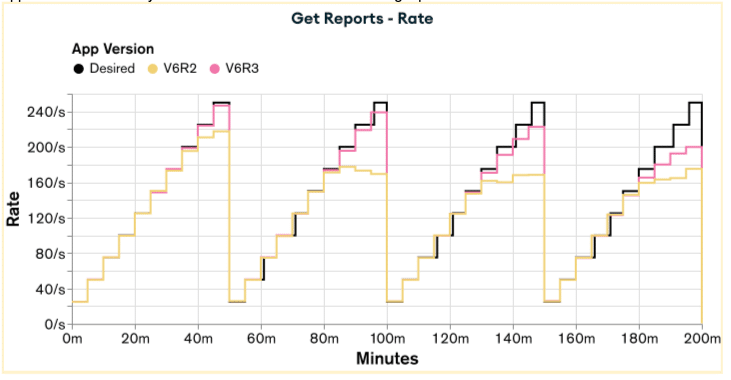

#### **Get Reports latency**

The latency saw significant improvements, with the peak value reduced by 71% in the first phase, 67% in the second phase, 47% in the third phase, and 30% in the fourth phase.
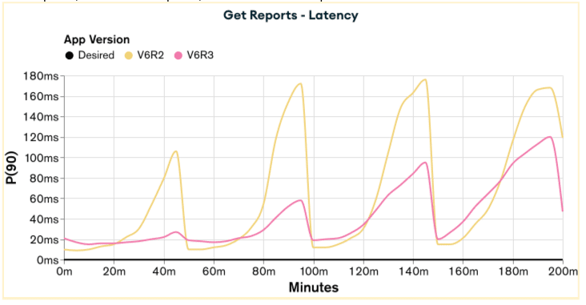

#### **Bulk Upsert rate**

As had happened in the previous version, the application was able to reach all the desired rates.
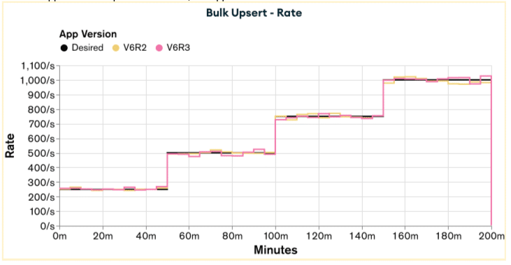

#### **Bulk Upsert latency**

Here, we have one of the most significant gains in this series: The latency has decreased from seconds to milliseconds. We went from a peak of 1.8 seconds to 250ms in the first phase, from 2.3 seconds to 400ms in the second phase, from 2 seconds to 600ms in the third phase, and from 2.2 seconds to 800ms in the fourth phase.
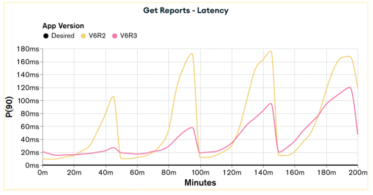

### Issues and improvements {#h3-32-issues-and-improvements}

The main bottleneck in our MongoDB server is still the disk throughput. As mentioned in the previous Issues and Improvements, this was the application-level improvement. How can we further optimize on our current hardware?

If we take a closer look at the [MongoDB documentation](https://www.mongodb.com/docs/manual/core/wiredtiger/?utm_campaign=devrel&utm_source=third-party-content&utm_medium=cta&utm_content=cost-of-not-knowing-foojay-part3&utm_term=tony.kim#compression), we'll find out that by default, it uses block compression with the snappy compression library for all collections. Before the data is written to disk, it'll be compressed using the snappy library to reduce its size and speed up the writing process.

Would it be possible to use a different and more effective compression library to reduce the size of the data even further and, as a consequence, reduce the load on the server's disk? Yes, and in the following application revision, we will use the zstd compression library instead of the default snappy compression library.

Application version 6 revision 4 (appV6R4) {#h2-33-application-version-6-revision-4-appv6r4}
--------------------------------------------------------------------------------------------

As discussed in the previous Issues and Improvements section, the performance gains of this version will be provided by changing the algorithm of the [collection block compressor](https://www.mongodb.com/docs/manual/reference/configuration-options/#mongodb-setting-storage.wiredTiger.collectionConfig.blockCompressor). By default, MongoDB uses the [snappy](https://www.mongodb.com/docs/manual/reference/glossary/?utm_campaign=devrel&utm_source=third-party-content&utm_medium=cta&utm_content=cost-of-not-knowing-foojay-part3&utm_term=tony.kim#std-term-snappy), which we will change to [zstd](https://www.mongodb.com/docs/manual/reference/glossary/?utm_campaign=devrel&utm_source=third-party-content&utm_medium=cta&utm_content=cost-of-not-knowing-foojay-part3&utm_term=tony.kim#std-term-zstd) to achieve a better compression performance at the expense of more CPU usage.

All the schemas, functions, and code from this version are exactly the same as the appV6R3.

To create a collection that uses the zstd compression algorithm, the following command can be used.

|----------------------------------------------------------------------------------------------------------------------------|
| db.createCollection("\<collection-name\>", { storageEngine: { wiredTiger: { configString: "block_compressor=zstd" } }, }); |

### Schema {#h3-34-schema}

The application implementation presented above would have the following TypeScript document schema denominated SchemaV6R0:

|----------------------------------------------------------------------------------------------------------------------------|
| export type SchemaV6R0 = { _id: Buffer; items: Record\< string, { a?: number; n?: number; p?: number; r?: number; } \>; }; |

### Bulk upsert {#h3-35-bulk-upsert}

Based on the specifications, the following bulk updateOne operation is used for each event generated by the application:

|-------------------------------------------------------------------------------------------------------------------------------------------------------------------------------------------------------------------------------------------------------------------------------------------------------------------------------------------------------------------------------------------------------------------------------------------------------------|
| const YYYYMMDD = getYYYYMMDD(event.date); // Extract the year(YYYY), month(MM), and day(DD) from the \`event.date\` const operation = { updateOne: { filter: { _id: buildId(event.key, event.date) }, // key + year + quarter update: { $inc: { \[\`items.${YYYYMMDD}.a\`\]: event.approved, \[\`items.${YYYYMMDD}.n\`\]: event.noFunds, \[\`items.${YYYYMMDD}.p\`\]: event.pending, \[\`items.${YYYYMMDD}.r\`\]: event.rejected, }, }, upsert: true, }, }; |

This updateOne is exactly the same logic as the one for appV6R3.

### Get reports {#h3-36-get-reports}

Based on the information​​ presented in the Introduction, we have the following aggregation pipeline to generate the reports document.

|---------------------------------------------------------------------------------------------------------------------------------------------------|
| const pipeline = \[ { $match: docsFromKeyBetweenDate }, { $addFields: buildTotalsField }, { $group: groupCountTotals }, { $project: format }, \]; |

This pipeline is exactly the same logic as the one for appV6R3.

### Indexes {#h3-37-indexes}

No additional indexes are required, maintaining the single _id index approach established in the appV4 implementation.

### Initial scenario statistics {#h3-38-initial-scenario-statistics}

#### Collection statistics

To evaluate the performance of appV6R4, we inserted 500 million event documents into the collection using the schema and Bulk Upsert function described earlier. For comparison, the tables below also include statistics from previous comparable application versions:

| **Collection** | **Documents** | **Data Size** | **Document Size** | **Storage Size** | **Indexes** | **Index Size** |
|----------------|---------------|---------------|-------------------|------------------|-------------|----------------|
| appV6R3        | 33,429,694    | 9.53GB        | 307B              | 2.56GB           | 1           | 1.19GB         |
| appV6R4        | 33,429,372    | 9.53GB        | 307B              | 1.47GB           | 1           | 1.34GB         |

#### Event statistics

To evaluate the storage efficiency per event, the Event Statistics are calculated by dividing the total data size and index size by the 500 million events.

| **Collection** | **Storage Size/Events** | **Index Size/Events** | **Total Storage Size/Events** |
|----------------|-------------------------|-----------------------|-------------------------------|
| appV6R3        | 5.5B                    | 2.6B                  | 8.1B                          |
| appV6R4        | 3.2B                    | 2.8B                  | 6.0B                          |

Since the application implementation of appV6R4 is the same as appV5R3, the values for Data Size, Document Size, and Index Size remain the same. The difference lies in Storage Size, which represents the Data Size after compression. Going from snappy to zstd decreased the Storage Size a jaw-dropping 43%. Looking at the Event Statistics, there was a reduction of 26% of the storage required to register each event, going from 8.1 bytes to 6 bytes. These considerable reductions in size will probably translate to better performance on this version, as our main bottleneck is disk throughput.

### Load test results {#h3-39-load-test-results}

Executing the load test for appV6R4 and plotting it alongside the results for appV6R3, we have the following results for Get Reports and Bulk Upsert.

#### **Get Reports rate**

Although we didn't achieve all the desired rates, we saw a significant improvement from appV6R3 to appV6R4. This revision allowed us to reach the desired rates in the first, second, and third quarters.
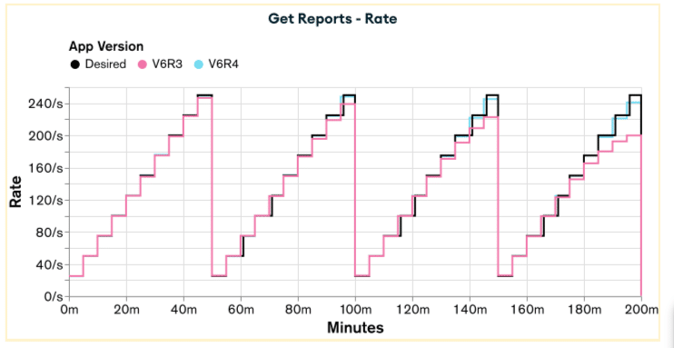

#### **Get Reports latency**

The latency also saw significant improvements, with the peak value reduced by 30% in the first phase, 57% in the second phase, 61% in the third phase, and 57% in the fourth phase.
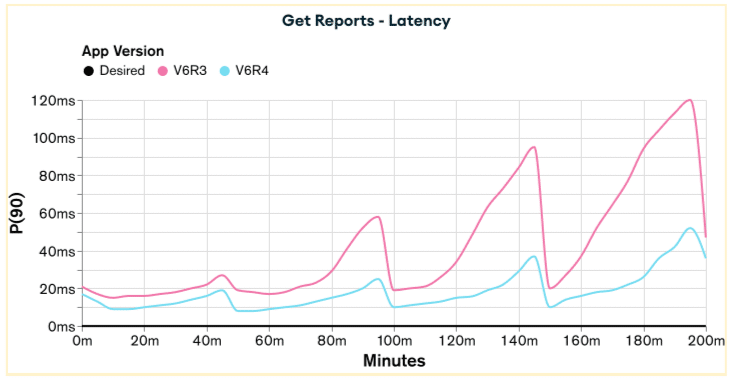

#### **Bulk Upsert rate**

As had happened in the previous version, the application was able to reach all the desired rates.
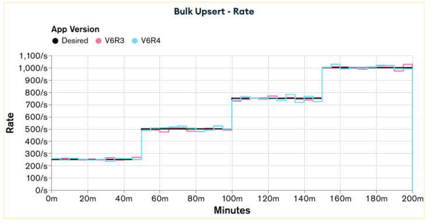

#### **Bulk Upsert latency**

Here, we also achieved considerable improvements, with the peak value being reduced by 48% in the first phase, 39% in the second phase, 43% in the third phase, and 47% in the fourth phase.
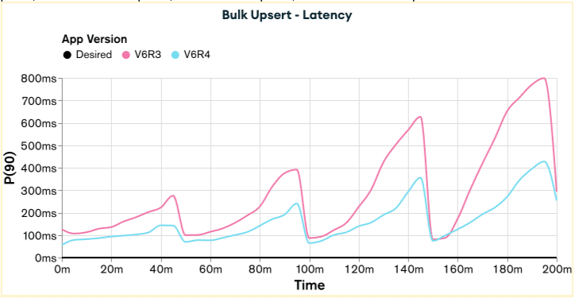

### Issues and improvements {#h3-40-issues-and-improvements}

Although this is the final version of the series, there is still room for improvement. For those willing to try them by themselves, here are the ones that I was able to think of:

* Use the Computed Pattern in the appV6R4.
* Optimize the aggregation pipeline logic for Get Reports in the appV6R4.
* Change the [zstd compression level](https://www.mongodb.com/docs/manual/reference/configuration-options/#mongodb-setting-storage.wiredTiger.engineConfig.zstdCompressionLevel) from its default value of 6 to a higher value.

Conclusion {#h2-41-conclusion}
------------------------------

This final part of "The Cost of Not Knowing MongoDB" series has explored the ultimate evolution of MongoDB application optimization, demonstrating how revolutionary design patterns and infrastructure-level improvements can transcend traditional performance boundaries. The journey through appV6R0 to appV6R4 represents the culmination of sophisticated MongoDB development practices, achieving performance levels that seemed impossible with the baseline appV1 implementation.

### Series transformation summary {#h3-42-series-transformation-summary}

**From foundation to revolution:**

The complete series showcases a remarkable transformation across three distinct optimization phases:

* **Part 1 (** **appV1** **-** **appV4** **)**: Document-level optimizations achieving 51% storage reduction through schema refinement, data type optimization, and strategic indexing
* **Part 2 (** **appV5R0** **-** **appV5R4** **)**: Advanced pattern implementation with the Bucket and Computed Patterns, delivering 89% index size reduction and first-time achievement of target rates
* **Part 3 (** **appV6R0** **-** **appV6R4** **)**: Revolutionary Dynamic Schema Pattern with infrastructure optimization, culminating in sub-second latencies and comprehensive target rate achievement

**Performance evolution:**

The progression reveals exponential improvements across all metrics:

* **Get Reports latency**: From 6.5 seconds (appV1) to 200-800ms (appV6R4)---a 92% improvement
* **Bulk Upsert latency**: From 62 seconds (appV1) to 250-800ms (appV6R4)---a 99% improvement
* **Storage efficiency**: From 128.1B per event (appV1) to 6.0B per event (appV6R4)---a 95% reduction
* **Target rate achievement**: From consistent failures to sustained success across all operational phases

### Architectural paradigm shifts {#h3-43-architectural-paradigm-shifts}

**The Dynamic Schema Pattern revolution:**

appV6R0 through appV6R4 introduced the most sophisticated MongoDB design pattern explored in this series. The Dynamic Schema Pattern fundamentally redefined data organization by:

* **Eliminating array overhead**: Replacing MongoDB arrays with computed object structures to minimize storage and processing costs.
* **Single-pipeline optimization**: Consolidating five separate aggregation pipelines into one optimized operation, reducing computational overhead by 80%.
* **Infrastructure-level optimization**: Implementing zstd compression, achieving 43% additional storage reduction over default snappy compression.

**Query optimization breakthroughs:**

The implementation of intelligent date range calculation within aggregation pipelines eliminated redundant operations while maintaining data accuracy. This approach demonstrates senior-level MongoDB development by leveraging advanced aggregation framework capabilities to achieve both performance and maintainability.

### Critical technical insights {#h3-44-critical-technical-insights}

**Performance bottleneck evolution:**

Throughout the series, we observed how optimization focus shifted as bottlenecks were resolved:

1. **Initial phase**: Index size and query inefficiency dominated performance.
2. **Intermediate phase**: Document retrieval count became the limiting factor.
3. **Advanced phase**: Aggregation pipeline complexity constrained throughput.
4. **Final phase**: Disk I/O emerged as the ultimate hardware limitation.

**Pattern application maturity:**

The series demonstrates the progression from junior to senior MongoDB development practices:

* **Junior level**: Schema design without understanding indexing implications (appV1)
* **Intermediate level**: Applying individual optimization techniques (appV2-appV4)
* **Advanced level**: Implementing established MongoDB patterns (appV5RX)
* **Senior level**: Creating custom patterns and infrastructure optimization (appV6RX)

### Production implementation guidelines {#h3-45-production-implementation-guidelines}

**When to apply each pattern:**

Based on the comprehensive analysis, the following guidelines emerge for production implementations:

* **Document-level optimizations**: Essential for all MongoDB applications, providing 40-60% improvement with minimal complexity
* **Bucket Pattern**: Optimal for time-series data with 10:1 or greater read-to-write ratios
* **Computed Pattern**: Most effective in read-heavy scenarios with predictable aggregation requirements
* **Dynamic Schema Pattern**: Reserved for high-performance applications where development complexity trade-offs are justified

**Infrastructure considerations:**

The zstd compression implementation in appV6R4 demonstrates that infrastructure-level optimizations can provide substantial benefits (40%+ storage reduction) with minimal application changes. However, these optimizations require careful CPU utilization monitoring and may not be suitable for CPU-constrained environments.

### The true cost of not knowing MongoDB {#h3-46-the-true-cost-of-not-knowing-mongodb}

This series reveals that the "cost" extends far beyond mere performance degradation:

**Quantifiable impacts:**

* **Resource utilization**: Up to 20x more storage requirements for equivalent functionality
* **Infrastructure costs**: Potentially 10x higher hardware requirements due to inefficient patterns
* **Developer productivity**: Months of optimization work that could be avoided with proper initial design
* **Scalability limitations**: Fundamental architectural constraints that become exponentially expensive to resolve

**Hidden complexities:**

More critically, the series demonstrates that MongoDB's apparent simplicity can mask sophisticated optimization requirements. The transition from appV1 to appV6R4 required a deep understanding of:

* Aggregation framework internals and optimization strategies.
* Index behavior with different data types and query patterns.
* Storage engine compression algorithms and trade-offs.
* Memory management and cache utilization patterns.

### Final recommendations {#h3-47-final-recommendations}

**For development teams:**

1. **Invest in MongoDB education**: The performance differences documented in this series justify substantial training investments.
2. **Establish pattern libraries**: Codify successful patterns like those demonstrated to prevent anti-pattern adoption.
3. **Implement performance testing**: Regular load testing reveals optimization opportunities before they become production issues.
4. **Plan for iteration**: Schema evolution is inevitable; design systems that accommodate architectural improvements.

**For architectural decisions:**

1. **Start with fundamentals**: Proper indexing and schema design provide the foundation for all subsequent optimizations.
2. **Measure before optimizing**: Each optimization phase in this series was guided by comprehensive performance measurement.
3. **Consider total cost of ownership**: The development complexity of advanced patterns must be weighed against performance requirements.
4. **Plan infrastructure scaling**: Understanding that hardware limitations will eventually constrain software optimizations.

### Closing reflection {#h3-48-closing-reflection}

The journey from appV1 to appV6R4 demonstrates that MongoDB mastery requires understanding not just the database itself, but the intricate relationships between schema design, query patterns, indexing strategies, aggregation frameworks, and infrastructure capabilities. The 99% performance improvements documented in this series are achievable, but they demand dedication to continuous learning and sophisticated engineering practices.

For organizations serious about MongoDB performance, this series provides both a roadmap for optimization and a compelling case for investing in advanced MongoDB expertise. The cost of not knowing MongoDB extends far beyond individual applications---it impacts entire technology strategies and competitive positioning in data-driven markets.

The patterns, techniques, and insights presented throughout this three-part series offer a comprehensive foundation for building high-performance MongoDB applications that can scale efficiently while maintaining operational excellence. Most importantly, they demonstrate that with proper knowledge and application, MongoDB can deliver extraordinary performance that justifies its position as a leading database technology for modern applications.
